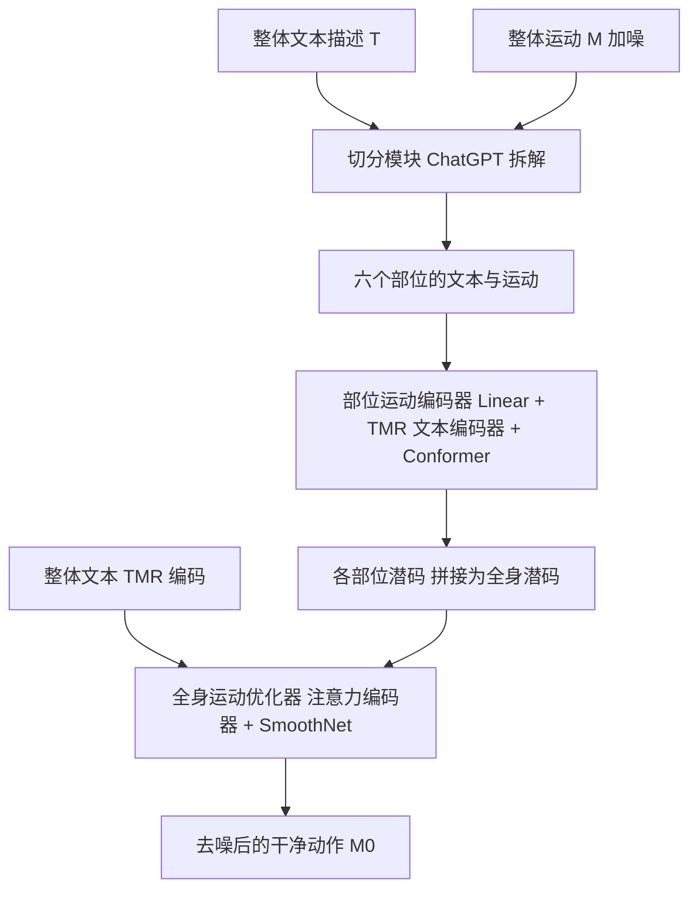

## 一句话总结

LGTM 提出一个「局部到全局」的文本驱动人体运动扩散框架，先用大语言模型把整体动作描述拆解到各身体部位、由独立的部位运动编码器分别注入局部语义，再用基于注意力的全身优化器融合协调，从而同时获得局部语义准确与全身动作连贯的生成结果。

## 研究背景

文本驱动的人体运动生成横跨自然语言处理、机器学习与计算机图形学，是一项长期挑战。扩散模型的引入显著提升了该领域的生成质量，但从文本生成既局部语义准确、又全局连贯的动作依然困难。作者观察到已有方法存在两类典型问题：局部语义泄漏（semantic leakage）与要素缺失。例如输入「一个人用左腿踢东西」，模型可能错误生成「右腿踢」；涉及多部位协调的复杂动作又常常遗漏某些部位。

究其原因有二。其一，多数方法用单一的全局文本描述去驱动所有局部部位的运动，网络需从统一的全局文本里学习「局部动作语义与对应身体部位」的关联，当不同部位的文字描述相近时尤其难以区分。其二，这些方法使用的文本编码器对运动类文本的编码能力有限，不同动作文本的特征高度相似，进一步加剧了网络辨别细微局部语义差异的困难。为此，作者提出把身体部位切分、局部语义独立注入与全局语义联合优化结合起来的新框架。

## 方法

整体框架：LGTM 是一个局部到全局的两阶段生成框架。先由切分模块（Partition Module）把整体文本与运动拆分到六个身体部位子空间，各部位由独立的部位运动编码器分别学习「部位动作—部位文本」映射以避免语义泄漏；随后全身运动优化器（Full-Body Motion Optimizer）用注意力机制在各部位之间交换时空信息，融合并协调为最终连贯的全身动作。

关键设计：

- 运动表示与扩散骨架：采用 HumanML3D 表示，一段全身运动含 $$F$$ 帧、$$J=22$$ 个关节，写作 $$\mathbf{M}=[\dot r_{root}, v_{root}, h, \mathbf{p}, \mathbf{r}, \mathbf{v}, \mathbf{c}]$$，分别为根关节绕 y 轴角速度、x-z 平面线速度、高度，以及各关节的局部位置、6D 旋转、局部速度与足部接触信号。方法建立在文本条件扩散模型之上，训练时按马尔可夫过程加噪并用 L2 损失预测噪声，采样时用 DDIM 加速去噪。

- 切分模块：把输入对 $$(\mathbf{M}, T)$$ 拆到头、左臂、右臂、躯干、左腿、右腿六个部位。运动按关节归属切分，例如躯干包含根关节的运动特征、左右腿包含各自的接触信号；文本则借助大语言模型（gpt-3.5-turbo）用精心设计的提示词拆解为六段部位描述，提示词包含任务定义、输出要求（JSON 等结构化格式）与少样本示例。例如「挥右手后微微向右弯腰并向前走几步」会被拆成右臂「挥手」、躯干「微微弯腰」、双腿「向前走几步」、头与左臂「不做动作」。

- 部位运动编码器：每个编码器 $$E_{part}$$ 独立处理对应部位的输入对，仅能获取本部位信息、无法访问其他部位，从而有效缓解语义泄漏：
$$z^n_{part}=E_{part}(\mathbf{M}^n_{part}, T_{part}, n)$$
它由线性层、文本编码器与 Conformer 组成。文本编码器采用六个冻结的、按部位预训练的 TMR 编码器；由于 TMR 只在运动描述与运动数据上训练，其运动相关文本嵌入比 CLIP 更易被网络区分。Conformer 在 Transformer 中引入卷积块，更擅长捕捉时序局部特征。

- 全身运动优化器：先把各部位潜码拼接为形状 $$(F, 6\times 128)$$ 的全身潜码 $$z^n$$，与冻结的全身级 TMR 文本嵌入融合，再用注意力编码器计算对各部位潜码的调整量，实现时空信息交换（多头注意力作用于时间维 $$F$$，前馈层作用于空间维 $$S$$），最后经 SmoothNet 抑制抖动并投影回原始特征维得到干净动作：
$$\hat{\mathbf{M}}_0=G(z^n_{head},\cdots,z^n_{left\_leg}, T)=\mathrm{Linear}(\mathrm{SmoothNet}(z^n+\mathrm{AttentionEncoder}(z_{text}+z^n)))$$

## 实验结果

在 HumanML3D 数据集上，用 T2M 潜空间中的 FID、DIV、R Precision、MM Dist 评估全身质量，并用部位级 TMR 编码器计算 PMM Sim 评估局部语义匹配。全身指标上 LGTM 在 FID、多样性、检索精度与多模态距离上均优于 MotionDiffuse、MDM、MLD，且更接近真实数据。

| 方法 | FID↓ | DIV↑ | R Precision Top1↑ | MM Dist↓ |
| --- | --- | --- | --- | --- |
| Real | 0.000 | 9.831 | 0.513 | 2.939 |
| MotionDiffuse | 0.687 | 8.894 | 0.318 | 3.118 |
| MDM | 0.747 | 9.462 | 0.390 | 3.635 |
| MLD | 1.753 | 8.970 | 0.383 | 3.682 |
| Ours (LGTM) | 0.218 | 9.638 | 0.490 | 3.013 |

部位级 PMM Sim 上，LGTM 在头、左右臂、躯干、双腿六个部位均取得最佳且非常接近真实数据的语义匹配。消融显示：换用 TMR 文本编码器（相比 CLIP）对本方法与 MDM 都能一致提升局部与全局质量；用 Conformer 替换 Transformer 能带来更好的质量与语义匹配；移除全身优化器中的注意力编码器后，全身质量急剧退化（FID 从 0.218 恶化到 7.384），局部质量也下降，双脚无法协调交替迈步，验证了信息交换的必要性。

## 亮点与局限

亮点：用大语言模型把整体动作描述拆解到部位级，配合独立的部位编码器实现局部语义的精准注入，从根本上缓解了语义泄漏与部位错配；再以注意力全身优化器建立部位间的时空关联，兼顾局部精确与全局连贯；采用运动专用的 TMR 文本编码器替代 CLIP，使运动文本更可区分；引入 Conformer 与 SmoothNet 进一步提升时序局部质量并抑制抖动。

局部：局部语义拆解依赖 ChatGPT 的推理能力，遇到需要高层全身协调的动作（如高尔夫挥杆）时，模型只能识别「右手挥杆」却无法把它分解为各部位的低层动作，导致生成不合理的动作；数据集中「先做 A 再做 B」这类含糊文本可能让网络混淆动作的先后或并行关系；受限于数据样本长度，当前框架也难以稳定生成高质量的长时序动作。

## 延伸思考

这项工作最具启发性的地方，是把「大语言模型的语义分解能力」与「运动生成的结构先验（身体部位划分）」显式对齐：与其让单一网络从全局文本里隐式学习每个部位该做什么，不如先用语言模型把复杂指令拆成部位级子任务，再让各子模块专注局部、最后统一协调。这种「先分解、后融合」的思路，本质上把一个高维耦合的生成问题转化为若干弱耦合子问题加一个协调器，既降低了学习难度，也提供了更细粒度的可控接口。其瓶颈也很清晰——分解质量受制于语言模型对动作的物理与协调常识，未来若能把部位级片段进一步 token 化、与 VQ-VAE 或 MotionGPT 类离散表示结合，或引入更强的时序与物理约束，或许能在长时序、强协调动作上取得突破。
