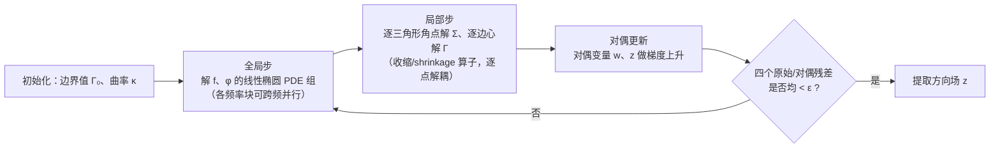

## 一句话总结

本文把方向场的优化问题从"函数"提升到"函数图像（graph）"，将方向场的图像视为圆丛（circle bundle）中的一个曲面，从而把带奇点的方向场求解转化为电流空间上的极小截面（minimal section）凸松弛问题，让奇点成为优化中的一等公民，并配以混合谱离散化与 ADMM 求解器，实现了对平面与曲面上方向场及其奇点位置的精确控制。

## 研究背景

方向场（单位向量场、线场、十字场及其高阶推广）是几何处理流水线的核心工具，广泛用于测地距离计算、纹理合成，以及基于场的四边形/六面体网格生成。方向场的拓扑由其奇点（singularity）刻画：在闭曲面上，Poincaré-Hopf 指标定理保证奇点必然存在；在凝聚态物理中它们被称为拓扑缺陷，其动力学与塑性形变、相变等现象密切相关。

奇点在网格生成等下游应用中至关重要，但它给离散变分方法带来了根本困难：传统方法把场当作在整个定义域上处处光滑的函数，而奇点恰恰是场没有良定义朝向的点。现有方法要么要求预先指定奇点位置（connection 方法），要么放松场的取值空间、让奇点变成松弛场的零点（如放松单位模长约束或 Ginzburg-Landau 惩罚项），要么干脆忽略奇点、任其"从离散网格的缝隙中溜走"。单位方向场在奇点处的 Dirichlet 能量是无穷大，这正是各种松弛不得不引入的原因。

本文的核心观察是：虽然场在奇点处无定义，但带奇点方向场的"图像"却是圆丛中一个良定义的曲面。围绕奇点的任意小闭环都会被提升为一个绕纤维方向缠绕的回路，其图像在奇点附近形如螺旋面（helicoid）。因此，把优化从场提升到其图像，就能把场与奇点的关系表述为一个显式的边界条件，并得到一个即使存在奇点也良定义的目标泛函。

## 方法

### 整体框架

给定基曲面 $B$，纤维丛 $\pi: E \to B$ 由纤维 $F \cong \pi^{-1}(x)$ 组成，局部同构于乘积空间。当纤维 $F = S^1$ 时称为圆丛。$B$ 的单位切丛 $S T B$ 就是一个圆丛，单位向量场是它的整体截面，线场、十字场则是其张量幂所构成圆丛的截面。

对于无奇点的光滑截面 $\sigma$，其图像 $\Sigma = \mathrm{graph}\,\sigma$ 是 $E$ 中一个光滑曲面。本文证明该图像的面积可写成基曲面上的积分：

$$\mathrm{Area}(\Sigma) = \int_B \sqrt{1 + r^2 \lvert D\sigma \rvert^2}\, \mathrm{d}A_B$$

其中 $D$ 为协变微分，$r$ 是纤维半径。这个面积泛函把两种经典场能量统一了起来：当 $r \to 0$ 时它退化为（协变）Dirichlet 能量，当 $r \to \infty$ 时它表现为（协变）全变差。关键在于，Dirichlet 能量在奇点处发散，而面积泛函始终良定义且有限，因此可作为 Dirichlet 能量的正则化，并自然延拓为电流空间上的凸范数（质量范数 mass norm）。

### 关键设计

广义极小截面问题。作者提出如下凸优化问题（记为 gms）：

$$\min_{\Sigma, \Gamma}\ \mathrm{M}(\Sigma) + \lambda\, \mathrm{M}(\Gamma) \quad \text{s.t.}\ \ \partial\Sigma + \Gamma_0 + S^1 \times \Gamma = 0,\quad \pi_\# \Sigma = B$$

其中 2-电流 $\Sigma$ 表示截面的图像，$\Gamma$ 是编码奇点分布的测度，$\Gamma_0$ 是固定的边界曲线（编码 Dirichlet 边界数据）。$\mathrm{M}(\Sigma)$ 充当场能量，$\mathrm{M}(\Gamma)$ 作为控制奇点代价的正则项。边界约束表明：除固定 Dirichlet 数据外，截面只能有位于测度 $\Gamma$ 之上的竖直边界分量——这正是截面在拓扑缺陷附近的行为。投影约束保证 $\Sigma$ 表现得像一个图像，其"影子"覆盖整个基流形。相比理论工作，本文在一般电流（而非整数电流）上优化，得到的是一个凸松弛。

微分形式表示与 Hodge 分解。作者用微分形式重写原问题，利用 Hodge-Morrey-Friedrichs 分解将约束参数化为 $\Sigma = \bar\tau + \mathrm{d}f + \pi^*{\star}\mathrm{d}\phi$，并引入一个满足泊松方程 $\Delta\phi = \Gamma - \bar\kappa$ 的标量场 $\phi$（$\bar\kappa$ 为基曲面的高斯曲率相关项），同时加入正性约束 $\Sigma_V \ge 0$ 以防止截面"自我折叠"。

混合谱离散化。圆丛的曲率使得直接用有限元离散整个丛几乎不可行（曲率非零时无法在局部构造出正交的水平截面网格）。作者转而利用圆丛的齐次结构，把丛上的形式与电流按竖直方向做 Fourier 分解。关键结论是：在 Fourier 基下，丛上的外微分、余微分、Hodge-Laplace 等算子都变成分块对角的，每一块对应基曲面上一个频率 $k$ 的协变算子。例如标量函数的 Laplace 块简化为一个连接 Laplace 加竖直 Laplace：

$$\Delta^0_k = \Delta^0_{D_k} + r^{-2} k^2$$

这样就只需在基曲面上用线性有限元离散协变算子，配合精确的平行输运，完全避免了对丛的网格化。

ADMM 求解器。作者在连续设定下推导出基于 ADMM 的算法，分为三步：

- 全局步：求解一组线性椭圆 PDE，$f$ 与 $\phi$ 仅通过边界条件耦合。$\phi$ 满足四阶双调和方程、只涉及基曲面量，适合普通有限元；$f$ 的泊松方程定义在整个丛上，用前述混合谱离散化处理。$\phi$ 采用非协调的 Crouzeix-Raviart 元离散，以保证离散 Hodge 分解的自由度正确、并满足离散 Stokes 定理，使奇点指标之和精确等于边界总曲率。
- 局部步：目标函数逐点解耦，$\Sigma$ 在三角形角点、$\Gamma$ 在边心分别求解，本质是无平方 $L^2$ 范数的邻近算子（收缩算子），有显式解。把自由度放在角点是为了减少 ADMM 步间的数值平均，促使电流收敛到锐利曲面。
- 边界处理上，作者用 Fejér 核逼近纤维上的 Dirac delta 边界数据，保证非负，从而能施加凸约束 $\Sigma_V \ge 0$。

场提取。收敛后，从 $f$ 的 Fourier 系数（取 $k = -1$ 分量）提取每个顶点的场角度 $\sigma_v$：$z_v = e^{i\sigma_v} = -i\, f_{-1,v} / \lvert f_{-1,v} \rvert$。构造 $d$ 阶方向场（线场、十字场等）只需把平行输运算子取 $d$ 次幂、曲率乘以 $d$、边界角乘以 $d$。

## 实验结果

作者在平面域、曲面片以及 Myles 等人的数据集上评估方法，并与已有方向场方法对比。

| 评估内容 | 对照 | 主要结论 |
| --- | --- | --- |
| ADMM 正确性 | 二阶内点求解器 mosek（经 cvx） | 两者解在视觉上完全一致 |
| 收敛性 | 单一简单域 | 残差呈现优于线性的收敛，电流很快收敛到编码正确拓扑的近最优解 |
| 与 Knöppel 等（2013）对比 | geometry central 实现及本文协变算子版 | 奇点更少、结果更一致，不受背景网格细节影响 |
| 与 MBO（Viertel & Osting 2019）对比 | 非凸 Ginzburg-Landau | 本文为凸方法，结果与初始化无关；奇点更少更一致 |
| 精确恢复统计 | Myles 数据集（111 个模型） | 约 60%（111 中 70 个）模型的电流"有效集中"（65% 质量落在提取截面 $\pi/2$ 内） |
| 运行时间 | 随基网格顶点数 $V$ | 接近线性，约 $\propto V^{1.26}$ |

关于精确恢复，作者用竖直方向的累积质量分数与逐纤维的最优传输距离 $W_2(\lvert\Sigma\rvert_{\pi^{-1}(v)}, \delta_{\sigma_v})$ 两个指标衡量电流向提取截面的集中程度，发现结果在曲率较平缓的网格上更接近精确恢复；部分网格因近退化三角形导致逐点曲率极高（高达 $1 \times 10^8$），暗示先对输入曲面重网格化可显著改善恢复质量。提取出的方向场可直接用于下游四边形网格生成（采用 Bommes 等人的无缝积分方法）。参数方面，$\lambda$ 越大越惩罚奇点、场曲率更大；纤维半径 $r$ 越长，能量越像全变差、奇点越集中；作者发现纤维分段数 $N = 64$（频率至 $K = \pm 31$）适用于多数算例。实验在 8 核 Intel Ice Lake CPU 加 Nvidia A100 MIG GPU 上完成。

## 亮点与局限

亮点在于概念上的统一与提升：把"对场求优化"改写为"对场的图像（圆丛中的曲面）求优化"，使场与奇点的关系变成一个显式线性边界条件，奇点由此成为可显式表示、可施加约束（如限制在子域内、软/硬掩码）的优化变量。目标泛函在松弛前后都有意义，这与以往依赖病态泛函的松弛方法形成对比。方法得到的是全局最优的凸优化问题，与初始化无关；配套的混合 Fourier 谱离散化巧妙绕开了曲率导致的丛网格化难题；在极限情形下，该问题还能退化为此前用于共形映射锥点计算的稀疏逆泊松问题，并首次以凸方式处理了锥角量化这一开放问题。

局限方面：这是一个凸松弛，作者不提供精确恢复的形式化保证，需要把可能弥散的电流"取整"（rounding）为锐利的场，且未给出取整误差的界；实验中约四成模型的电流未能有效集中，高曲率网格上尤为明显；离散化不可避免地无法得到严格的整数电流，有时会收敛到多个整数解的叠加（奇点非量化）。方法目前只针对带边界曲面上圆丛取值的场。

## 延伸思考

这项工作把几何测度论（GMT）这一原本偏理论的工具带入了实用的几何处理算法，提示"提升到图像 + 电流凸松弛"可能是处理一大类带奇点/拓扑障碍的几何优化问题的通用范式。最直接的推广是体（三维）标架场——六面体网格生成长期受困于奇异结构的非凸性，若能用极小截面的语言表述，或许能获得凸松弛带来的全局性与可控性。更有想象空间的是把端到端的网格生成本身表述为对某个特殊纤维丛截面的优化。

不过高维推广会面临离散化随维度指数膨胀、质量范数在三维以上因非简单 $p$-形式而复杂等难题。作者据此指出若干可能路线：用神经隐式表示高维电流、借鉴稀疏反卷积中的锥粒子优化以指数收敛到全局最优，或发展"降阶模型"——把场自由度积分掉后只保留奇点间相互作用的有效能量，从而大幅压缩计算复杂度。这些方向都指向一个更宏大的目标：让"奇点作为一等公民"的凸优化框架从二维圆丛走向真正的三维工程应用。
