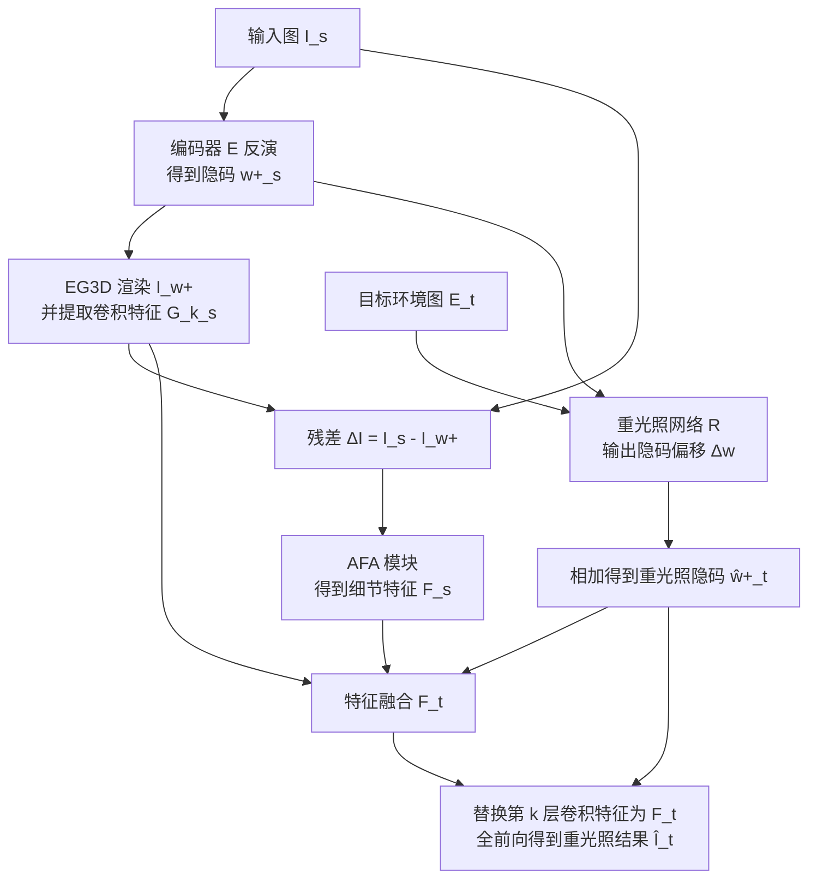

## 一句话总结

Lite2Relight 借助预训练 3D 生成模型 EG3D 的先验与 light stage 数据集，通过前馈式编码器把单张野外人像图映射到可重光照的 3D 隐空间，在交互帧率下实现 3D 一致的视角合成与物理合理的重光照。

## 研究背景

面向 AR/VR 的人像编辑需要同时做到照片级真实感、3D 一致的视角合成，以及物理准确的重光照，而现有方法在这些维度上普遍难以兼顾。

- 基于 2D 生成先验（如 StyleGAN）的方法缺乏原生 3D 表示，换视角时身份和光照容易漂移。
- 从大规模野外图学习的 3D 生成模型（如 EG3D）能建模高频细节与丰富的身份隐空间，但本身不支持重光照；一些扩展试图隐式解耦反照率、高光与法线，但训练数据是低动态范围的野外图，缺少真值监督，导致重光照物理上不准确。
- 使用 light stage 采集的物理准确数据能做到精确解耦，但已有方法（如 NeLF 需多视角输入、VoRF 依赖昂贵的隐式表示且需测试时逐图反演微调约 10 分钟）要么泛化差、要么无法交互。

本文的目标是填补这一空白：从单张野外图出发，做到泛化、3D 一致、物理准确且交互速度的重光照。

## 方法

整体框架：以冻结的 EG3D 生成器为骨干，先用几何感知编码器把输入图反演进 EG3D 隐空间，再用一个在 light stage 合成数据上训练的映射网络把隐码平移到目标光照，最后结合源/目标卷积特征做全前向渲染，得到重光照且可换视角的结果。

关键设计：

- 数据合成。使用含 353 名受试者、每人 $N=150$ 个点光源 OLAT、16 个视角的 light stage 数据集，按图像重光照公式线性组合 OLAT 与环境图得到自然光照下的成对监督数据：

$$\mathbf{I} = \sum_{i=0}^{N} E(i) \cdot \mathbf{O}_i$$

其中 $\mathbf{O}_i$ 为单光源图像，$E$ 为下采样后的环境图。所有受试者在采自室内外 HDRI 库的 50 种自然光照下被重光照。

- 3D GAN 反演。编码器 $E$ 把源图映射为隐码 $w^+_s \in \mathbb{R}^{14\times512}$；由于低维隐码不足以表达丰富人像细节，进一步用自适应特征对齐模块 AFA 以图像残差 $\Delta I$ 与生成器第 $k$ 层卷积特征 $G^k_s$ 为输入，得到高维特征 $F_s$。

- 重光照。MLP 网络 $R$ 以源隐码与目标环境图预测隐码偏移，$\Delta w = R(w^+_s, E_t)$，再叠加得到目标隐码 $\hat{w}^+_t = w^+_s + \Delta w$。为保留身份细节，把源/目标卷积特征做融合：

$$F_t := F_s + G^k_r - G^k_s$$

随后替换第 $k$ 层特征并做完整前向渲染得到重光照图像 $\hat{I}_t = G_{dec}(G_{sg}(\hat{w}^+_t, F_t), c)$。

- 损失。仅训练 $R$，其余网络冻结；总损失结合 $L_1$ 重建损失、LPIPS 感知损失与隐空间 $L_2$ 损失：

$$\mathcal{L}_{total} = \lambda_0 \mathcal{L}_{lat} + \lambda_1 \mathcal{L}_C + \lambda_2 \mathcal{L}_{LPIPS}$$

## 实验结果

在基于 light stage 的评测集（10 名未见受试者、10 种新光照、12 个新视角）上，与主流方法比较（新视角下重光照）：

| 方法 | SSIM ↑ | LD ↓ | PSNR ↑ |
| --- | --- | --- | --- |
| NeLF（3 视角） | 0.75 | NA | 19.72 |
| PhotoApp | 0.72 | 34.08 | 29.13 |
| VoRF | 0.69 | 16.90 | 20.21 |
| NeRFFaceLighting | 0.79 | 28.31 | 13.41 |
| Lite2Relight | 0.83 | 9.76 | 28.3 |

Lite2Relight 在 SSIM 与衡量 3D 几何一致性的关键点距离 LD 上明显领先，PSNR 与 PhotoApp 相当。消融显示特征融合项与感知损失都对身份细节和重光照准确性有贡献。方法可在 512×512 分辨率输出，推理达到交互帧率（7 至 31 fps），无需逐图优化或微调。

## 亮点与局限

亮点：

- 首次在单张野外图输入下同时实现物理准确重光照、3D 一致视角合成、语义编辑与免优化的前馈推理，达到交互速度。
- 巧妙复用 EG3D 的野外人像先验解决泛化，同时用 light stage 数据提供真值监督解决物理准确性，规避了反照率与光照的耦合歧义。
- 相比依赖隐式表示、需约 10 分钟逐图优化的 VoRF，基于 triplane 的表示既保留细节又大幅提速。

局限：

- 方法建立在 EG3D 隐空间与其编码器反演质量之上，超出该生成先验覆盖范围的极端外观可能难以准确重建。
- 训练监督来自受试者数量有限的 light stage 数据集，光照建模能力受限于该采集条件。
- 聚焦头部人像，环境图需下采样后线性组合，对复杂高频光照或全身场景的适用性未验证。

## 延伸思考

用「大规模野外数据的生成先验 + 小规模物理准确数据的真值监督」组合来同时获得泛化与物理正确性，是一条很有借鉴意义的路径，可推广到身体、物体等其他重光照与反射建模任务。把重光照约束在隐码偏移这一低维操作上、再用特征融合补回身份细节的做法，也提示了在冻结生成器上做可控编辑时「隐码控语义、特征保细节」的解耦思路。后续若能减轻对特定 3D GAN 隐空间的依赖，或引入更丰富的光照采集，泛化边界有望进一步扩展。
