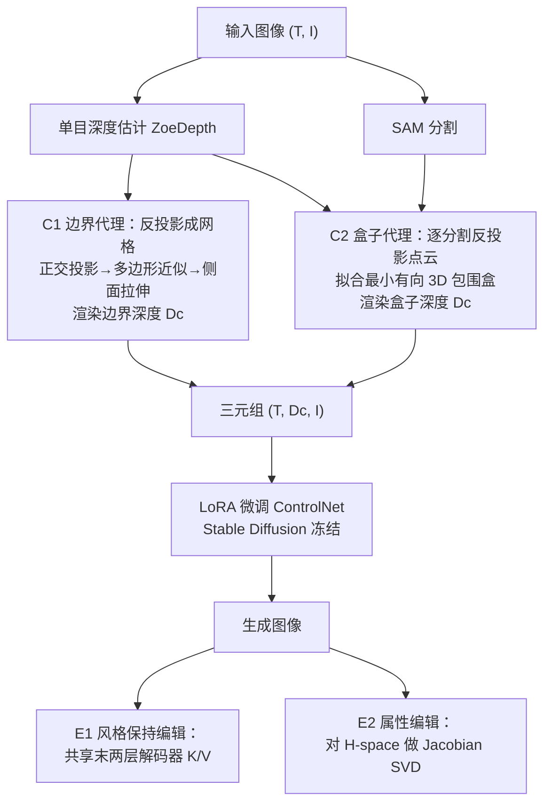

## 一句话总结

LooseControl 把 ControlNet 严格的「精确深度匹配」放宽为「布尔几何约束」，让用户仅凭场景边界或粗略 3D 包围盒（外加文本）就能可控地生成并编辑复杂环境。

## 研究背景

ControlNet 是当前深度条件图像生成的代表方法，但它要求提供逐像素精确的深度图作为引导。对很多创作场景来说，这个前提并不现实：

- 精确深度图难以制作。想用深度引导生成一间客厅，用户需要把墙面、家具直至小摆件的深度都刻画出来，这几乎和原任务一样难。
- 粗略引导会失效。若只给墙、地、天花板的深度，ControlNet 会生成空房间；若用家具的包围盒近似深度，又只会生成「方盒子」状的物体，都不符合预期。

作者提出：应把深度条件从「精确相等」推广为「满足某个布尔条件」的更宽松形式。形式化地说，普通控制要求生成图 $I_{gen}$ 的估计深度精确满足 $f_D(I_{gen}) = D_c$；而广义控制只要求存在布尔函数 $\phi$ 使 $\phi(f_D(I_{gen}), D_c)$ 为真。由此衍生出两种松控制：场景边界控制（C1）与 3D 包围盒控制（C2）。

## 方法

整体框架搭建在冻结的 Stable Diffusion 主干与 ControlNet 之上，用少量数据、LoRA 方式微调，让模型学会把「代理深度图」当作松约束来理解；再辅以两种交互编辑机制。核心是设计一个既兼容 ControlNet、又能自动从图像提取、还便于用户手工构造的代理深度 $D_c$。

两种松控制的布尔条件定义为：

$$\phi_{C1}: \ f_D(I_{gen}) \le D_c$$

$$\phi_{C2}: \ B_i \sim \mathrm{3DBox}(O^i_{gen}) \quad \forall i$$

即 C1 让 $D_c$ 只作为每个像素深度的上界（边界之内可自由填充更靠近相机的物体），C2 让 $D_c$ 只约束物体的近似位置、朝向与尺寸。

关键设计：

- 边界代理（C1）。对输入图估计深度并反投影成三角网格，为提高效率只保留竖直平面，把 3D 边界提取降为 2D 问题：将网格正交投影到水平面，用多边形近似其 2D 边界，再把多边形各边拉伸成与场景等高的平面，配合可选的地面/天花板平面，从原相机视角渲染出边界深度图。所有像素都继承边界面的深度值，即便边界被室内物体遮挡也是如此。
- 盒子代理（C2）。用 ZoeDepth 与 SAM 分别获得深度与分割，对每个分割块反投影成点云，拟合体积最小的有向 3D 包围盒并表示为立方体网格，再用原相机参数渲染其深度。作者自建了这套「稠密（任意物体类别）且不限领域」的单目近似 3D 检测流程，弥补现有单目 3D 检测器稀疏或领域受限的缺陷。
- 训练与推理调整。在 NYU-Depth-v2 上微调，用 BLIPv2 生成文本描述。对比两种微调：完整微调会导致颜色饱和伪影，而 LoRA 微调（对每个注意力块学习低秩更新 $W'x = Wx + BA x$）天然稳定。推理时引入可控缩放因子 $\gamma$，更新写作 $W'x = Wx + \gamma BA x$，默认 $\gamma = 1.2$，$\gamma > 1$ 时质量更高。作者还观察到注入 U-Net 瓶颈的残差主导条件遵循，高分辨率跳连残差主要贡献局部纹理。
- 3D 盒子编辑（E1）。为在改动包围盒时「锁定」场景风格，借鉴视频扩散思路，把目标图注意力层中的 key/value 替换为源图的对应值；但仅在解码器最后两层共享 K/V 才能既保留风格又遵循新条件（全层共享会退化成复制源图）。
- 属性编辑（E2）。聚焦语义性强的瓶颈特征空间（H-space），对 ControlNet 雅可比 $\partial \Delta h / \partial x$ 做奇异值分解，取前若干主方向 $e_i$，以 $\Delta h' = \Delta h + \beta e_i$ 连续调节家具密度、物体类型、材质等属性，且该控制空间与输入深度条件正交。

## 实验结果

由于本方法是严格更一般的深度控制，没有直接竞品，作者以不同条件权重的 ControlNet、以及在合成数据上重训的 ControlNet 作为对照，覆盖室内、街景、水下等多种场景。定性上，ControlNet 在松条件下会生成空房间或「方盒子」物体且文本遵循较差，而本方法能生成更真实、更贴合提示的场景。定量上以用户研究衡量：

| 指标 | 参与人数 | 偏好本方法比例 |
| --- | --- | --- |
| 生成的控制力与质量偏好 | 41 | 超过 95% |

## 亮点与局限

亮点：

- 首次把深度条件从「精确相等」推广为「布尔约束」，并落地为场景边界与 3D 包围盒两种易于手工构造的松控制，开启了「只画边界与盒子即可生成复杂环境」的创作流程。
- 全程建立在冻结的 Stable Diffusion 与 ControlNet 上，靠 LoRA 少步微调即可获得新能力，避免遗忘原生成权重，且与普通深度框架保持后向兼容。
- 自建的自动代理深度提取流程无需人工标注，边界与盒子两条流水线都能从任意图像批量生成训练三元组。
- 两种编辑机制补齐了交互闭环：K/V 共享实现风格保持的顺序编辑，H-space 的雅可比 SVD 给出连续、正交于深度条件的属性调节方向。

局限：

- 对主要物体控制良好，但对次要物体的控制较弱，作者归因于训练数据中次要物体较少，认为基于场景的生成器可能改善。
- 与原始 ControlNet 类似，输入约束过多会降低生成结果的多样性。

## 延伸思考

把「精确相等」松弛为「布尔条件」是一个很有启发的抽象：它让条件生成从「用户必须提供完美中间量」转向「用户只需划定一个可行域」，把扩散模型的补全能力当作填充这一可行域的手段。这一视角可推广到边缘、法线、分割等其他 ControlNet 通道——例如草图生成中只标注主要边缘，比画全 Canny 边缘对用户友好得多。方法对 H-space 雅可比做 SVD 来发现连续语义方向的做法，也提示了在冻结主干上「按需探索条件可行域内变化模式」的通用编辑范式。若能与掩码、MultiControlNet 结合，并引入平滑变化引导下的时序一致生成，有望向可控视频与 6DOF 物体编排延伸。
