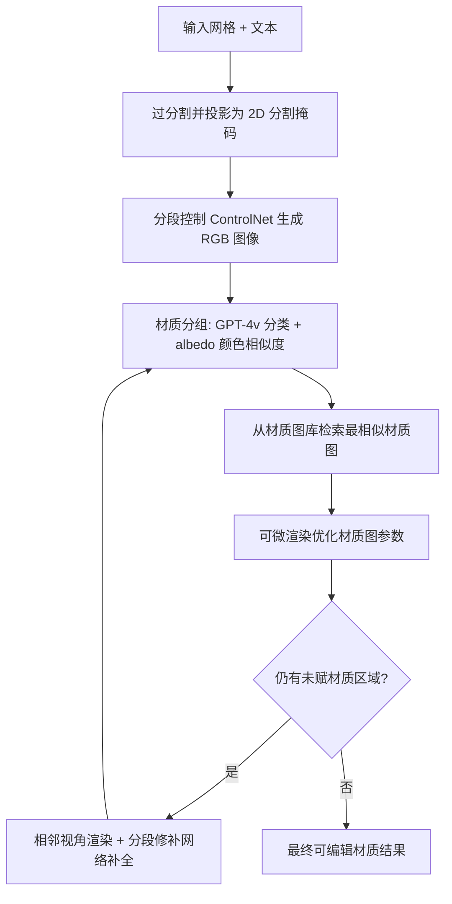

## 一句话总结

MaPa 从文本描述为 3D 网格生成分段式程序化材质图（procedural material graph），借助预训练 2D 扩散模型作为文本与材质之间的桥梁，产出可高质量渲染、可重光照、便于编辑的照片级材质。

## 研究背景

3D 内容生成在游戏、影视、VR/AR 中应用广泛，但为已有网格设计外观通常依赖大量手工劳动。现有 3D 纹理合成方法只能生成带有烘焙光照的纹理图，无法在不同光照下正确渲染，缺乏对真实材质属性的建模。少数尝试生成材质的工作（如 Fantasia3D）通过从 2D 生成模型蒸馏外观先验，但优化不稳定、结果常显卡通化，并且采用逐点材质表示，不便于用户后续修改。

作者观察到现实中新制造物体的材质在特定区域内往往是一致的（源于制造工艺的性质）。据此提出：以分段方式分别生成材质并保证局部区域内的一致性，可以得到更整洁、更真实且易于替换单个区域材质的结果。难点在于如何在没有大量「文本—网格—材质图」配对数据的情况下训练生成模型，MaPa 的思路是用预训练 2D 扩散模型作为中间桥梁来引导程序化材质图的优化。

## 方法

整体框架：给定网格与文本提示，先将网格过分割为若干 segment 并投影到选定视角得到 2D 分割掩码；用分段控制的扩散模型生成对齐网格部件的 RGB 图像；再以该图像为监督，通过材质分组、材质图选择与可微渲染优化，逐视角迭代补全所有区域的材质。

关键设计：

- 分段控制的图像生成：不同于以往用深度到图像的扩散模型（易在同一 segment 内产生多个色块、导致优化不稳定），MaPa 在自采数据上微调 SAM 条件的 ControlNet 得到分段条件 ControlNet，使生成的 2D 图像与网格部件更精确对齐，提升后续优化稳定性。视角从 360 度方位角、25 度俯仰、半径 2 的采样点中选取 2D segment 数量最多者。

- 材质分组：以每个 segment 为节点，材质类别相同且颜色相近则连边，取连通分量作为分组，从而每组只优化一个材质图以节省时间并提升一致性。材质分类用 GPT-4v 零样本完成；颜色相似度用在 ABO 数据集上微调的 albedo 估计网络去除阴影与强光影响后，在 CIE 色彩空间比较中值颜色，阈值 $$\lambda=2$$。

- 材质图选择与可微优化：材质图库预渲染 8 张环境光缩略图增强检索鲁棒性，用 CLIP 做零样本检索。优化时用可微渲染模块（可微渲染器 + DiffMat v2）把材质图转为纹理空间贴图，采用微表面 BRDF 与 2D 空间变化入射光照模型，公式为
$$A_{uv}, N_{uv}, R_{uv} = \mathrm{DiffMat}(G),\quad I_{rend} = R(A, N, R, L)$$
其中光照初值由 InvRenderNet 预测，训练中以 2D 哈希网格存储的残差光照 $$\tilde{L}$$ 叠加到初始光照上。为避免过拟合强光影，引入让材质图 albedo 渲染结果贴近预测 albedo 图的正则项。

- 迭代材质恢复与下游编辑：选取与初始视角相邻的视角，对未赋材质或投影面积不足的 segment 用 SAM 条件修补网络补全并复用分组与优化流程，直至全部覆盖。生成的材质图可导入 Substance Designer 编辑，并借鉴 VISPROG 提供文本驱动的高层编辑接口（通过 GPT-4 与预定义 API 生成命令）。

## 实验结果

在 300 把椅子（TMT）与 30 个 ABO 物体上，用 FID 与 KID 衡量渲染图与真实图的分布距离，并做用户研究（整体质量、文本忠实度，1~5 分）。MaPa 全面优于三个强基线。

| 数据集 | 方法 | FID↓ | KID↓ | 整体质量↑ | 忠实度↑ |
| --- | --- | --- | --- | --- | --- |
| Chair | TEXTure | 94.6 | 0.044 | 2.43 | 2.41 |
| Chair | Text2tex | 102.1 | 0.048 | 2.35 | 2.51 |
| Chair | Fantasia3D | 113.7 | 0.055 | 1.98 | 2.08 |
| Chair | Ours | 88.3 | 0.037 | 4.33 | 3.35 |
| ABO | Ours | 87.3 | 0.014 | 4.10 | 3.22 |

消融显示：去掉 albedo 估计网络会因阴影与光照干扰而无法正确合并相似颜色 segment；去掉材质分组结果差异不大但平均优化时间从 7 分钟增至 33 分钟；去掉材质图优化则外观相似度明显下降。整体流程在 A6000 上可在 10 分钟内完成，快于 Text2tex（15 分钟）与 Fantasia3D（25 分钟）。

## 亮点与局限

亮点：以分段程序化材质图作为外观表示，天然支持分辨率无关、可平铺、照片级且高度可编辑的材质；用 2D 扩散模型作桥梁绕开了对大规模「文本—网格—材质图」配对数据的需求；支持图像提示的外观迁移与文本驱动的下游编辑。

局限：扩散模型（自然图像）与 albedo 估计网络（合成图像）之间的域差异会导致部分渲染结果与生成图像不匹配；对分段不明显的复杂物体，过分割与分段条件 ControlNet 可能给不出合理的分组引导；材质图的表达力受限，只有当图中包含相应可优化节点时才能产生空间变化外观，复杂纹理更多依赖下游编辑检索预定义图案。

## 延伸思考

作者提出可训练一个摊销推理网络直接从图像预测材质图参数以大幅提升效率，这指向从「逐物体优化」走向「前馈预测」的方向。方法的上限很大程度上取决于材质图库的规模与表达力，扩充更丰富、含更多可优化节点的图库有望覆盖更复杂目标。此外，把材质分类（GPT-4v）、albedo 估计、光照反演等模块随更强基础模型升级替换，是一条低成本的持续改进路径。
