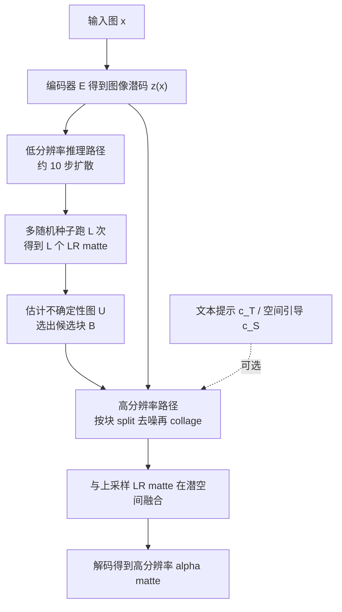

## 一句话总结

本文把传统的回归式图像抠图重新表述为条件生成问题，利用预训练潜在扩散模型的丰富先验，在无引导与有引导两种设置下都能生成分辨率高、边界细节丰富的高质量 alpha matte。

## 研究背景

图像抠图的目标是从输入图中同时预测前景与 alpha matte，其前向合成模型为：

$$C = \alpha F + (1 - \alpha) B$$

其中 $C$ 为输入，$F$ 为前景，$B$ 为背景，$\alpha \in [0, 1]$ 为线性组合系数。仅知道输入 $C$ 时这是一个高度病态的逆问题，难点在于既要判断前景在哪里，又要在边界处估计正确的不透明度。

- 有引导方法借助 trimap、涂鸦、粗掩码（如来自 SAM）降低歧义，但严重依赖引导质量，粗糙的初始分割会显著劣化边界抠图效果。
- 无引导（trimap-free）方法从零训练端到端网络，通常需要把应用域约束到人像并施加隐式分割先验，但边界区域因低可见度与人工标注不完美仍难以处理。
- 关键痛点在于训练用的真值 matte（无论人工还是机器生成）常常模糊或缺细节，回归式模型会过拟合这些有缺陷的标签，导致合成结果不自然。

本文主张：把抠图看作条件生成，用带有海量图像语义与细节先验的扩散模型来正则化训练，从而缓解不完美标签的负面影响，甚至生成超越真值质量的边界。

## 方法

整体框架：以预训练的 Stable Diffusion 潜在扩散模型为骨干，将 alpha matte 编码到潜空间并建模其分布，以输入图为条件生成 matte；推理时先用低分辨率路径得到粗 matte 与不确定性图，再在高不确定区域做基于块的高分辨率细化；额外的文本或空间引导可在推理时无缝注入。

关键设计：

- 生成式建模。用预训练编码器 $E$ 把 matte 编码为潜码 $z_0 := z(\boldsymbol{\alpha}) = E(\boldsymbol{\alpha})$，前向扩散逐步加噪：

$$z_t = \sqrt{1 - \beta_t}\, z_{t-1} + \sqrt{\beta_t}\, \boldsymbol{\epsilon}_{t-1} = \sqrt{\sigma_t}\, z_0 + \sqrt{1 - \sigma_t}\, \boldsymbol{\epsilon}$$

以输入图潜码为条件训练去噪网络，目标为：

$$\mathcal{L} = \mathbb{E}_{\boldsymbol{\epsilon}, t, z_0, z(x)} \left[ \lVert \boldsymbol{\epsilon}_t - \epsilon_\theta(z_t, z(x), t) \rVert_2^2 \right]$$

模型以 Stable Diffusion 权重初始化，通过复制输入层（新增层权重初始化为 0）来接收拼接的图像条件，再做微调。

- 高分辨率推理配低分辨率引导。利用 matte 分数值稀疏、随机性主要出现在边界的特性：先下采样跑 $L$ 次 LR 推理得到候选集 $A = \lbrace \hat{\boldsymbol{\alpha}}_1, \dots, \hat{\boldsymbol{\alpha}}_L \rbrace$，据其标准差估计不确定性图 $U = \sqrt{\mathbb{E}(A - \mathbb{E}(A))}$，只在高熵候选块上做基于块的细化，从而在保证质量的同时减少计算。

- 引导机制。块推理缺乏全局上下文易出错，故不从纯噪声起步，而是从上采样的 LR matte 潜码出发：

$$z_T = \sqrt{(1 - \sigma_T)/\sigma_T}\, \boldsymbol{\epsilon} + \hat{z}_0^{\uparrow}$$

由于噪声会淹没 $z_0$ 中可能不准的高频（边界）信息，模型学会从含噪样本中提取正确的低频（前景/背景）信息，因此 LR 引导既提供上下文又不锁死错误边界。

- 额外引导。文本引导用 BLIP2 为训练图标注前景描述，通过交叉注意力注入 CLIP 特征；空间引导（trimap、粗掩码、涂鸦）在推理时按下式注入，无需重新训练：

$$z_T = \sqrt{(1 - \sigma_T)/\sigma_T}\, \boldsymbol{\epsilon} + (1 - m_{unknown})\, c_S$$

## 实验结果

在 P3M-10K 训练，在 P3M-P、PPM-100、RVP 三个真实数据集上评测，指标为 MSE、MAD、SAD、Conn（MAD/MSE 乘以 $10^3$）。无引导人像抠图对比（数值越低越好）：

| 方法 | PPM MSE ↓ | PPM MAD ↓ | P3M-P MSE ↓ | P3M-P MAD ↓ |
| --- | --- | --- | --- | --- |
| MODNet | 4.5 | 10.1 | 11.3 | 17.4 |
| P3M | 5.8 | 9.6 | 2.7 | 5.1 |
| ViTAE-S | 3.4 | 6.5 | 1.8 | 4.3 |
| Ours | 2.5 | 6.3 | 1.6 | 4.1 |

无引导设置下本方法在所有指标上均取得最好成绩；即便与 ViTAE-S 数值接近，视觉上在发丝、鞋带等细结构处细节更清晰、更忠实于输入。消融显示：去掉预训练去噪先验后 MSE 从 2.5 飙升到 63.6（丢失语义、人物残缺），去掉分块特定提示词、多尺度数据或改用像素损失都会明显变差，验证了生成先验、提示策略、多尺度训练与潜空间操作的必要性。有引导设置下，掩码引导在粗糙掩码场景优于依赖高质量 trimap 的 DiffMat；而 trimap 设置下 DiffMat 数值更好，但作者指出其基于像素扩散会过拟合不完美标签，视觉效果反不如本方法。

## 亮点与局限

亮点：

- 首次将潜在扩散模型引入图像抠图，把回归问题转成条件生成，利用十亿级图像先验缓解不完美标签的过拟合，能生成语义正确甚至超越真值质量的边界。
- 提出「LR 引导 + 稀疏候选块」的高分辨率推理，只在高不确定边界区做细化，兼顾细节与效率，可处理任意分辨率输入。
- 一套模型同时支持无引导与文本、trimap、掩码、涂鸦等多种引导，且空间/文本引导可在推理时直接注入而无需重训。

局限：

- 扩散模型固有的采样开销使其效率低于回归方法，512×512、50 步在 V100 上约需 5 秒。
- 在人像数据上训练，可迁移到动物等相近域，但对火焰等特性差异极大的对象不适用。
- 面向单图设计，逐帧处理会导致视频时间不一致，时序连贯性仍是未来工作。

## 延伸思考

把「有噪声、不完美的真值」问题交给生成先验来正则化，是这篇工作最有启发的一点：当标注本身就是质量瓶颈时，回归会忠实地复制缺陷，而生成模型反而能借助大规模先验「幻想」出更合理的细节。其 LR 引导机制本质上是「用低频锚定语义、让高频由生成先验重建」的频域解耦思路，可推广到超分、去模糊等其他需要在稀疏区域补细节的稠密预测任务。若能结合快速采样与视频时序建模，这一范式有望在效率与时间一致性上补齐短板，走向实用的通用抠图。
