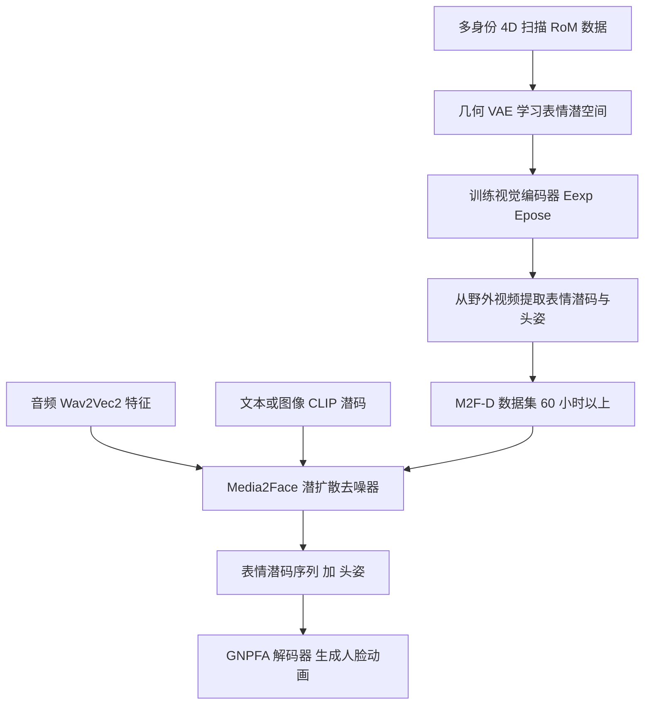

## 一句话总结

Media2Face 用一个通用神经参数化人脸资产（GNPFA）从海量视频中蒸馏出高质量表情与头姿数据，构建大规模 4D 语音人脸数据集，并在该潜空间中训练扩散模型，实现由音频、文本与图像共同引导的高保真、可风格化协同语音人脸动画生成。

## 研究背景

从语音合成 3D 人脸动画长期受两大瓶颈制约。其一是高质量 4D 人脸数据稀缺：现有方法多在 VOCASET、BIWI 等小规模数据集上训练，语音状态覆盖有限，缺乏情感与人物特质的多样性；一些工作尝试用 2D 数据集扩充说话风格，但依赖的视频人脸追踪器往往给出次优表情或忽略头部运动，难以还原自然表情。其二是缺乏灵活的条件控制与解耦：已有方法仅提供关键帧、隐式风格或表情符号式控制，来自文本和图像等更丰富多模态的忠实条件控制仍是开放难题。

作者以「三部曲」应对上述挑战：先造一个把人脸几何与图像映射到同一高度泛化表情潜空间、并将表情与身份解耦的变分自编码器（GNPFA）；再用它从大量野外视频中提取高质量表情与准确头姿，形成带情感与风格标注、扫描级质量的大规模数据集 M2F-D；最后在 GNPFA 潜空间中训练扩散模型 Media2Face，接受音频、文本、图像的多模态引导来生成协同语音人脸动画。

## 方法

整体框架：先训练 GNPFA 学习一个解耦身份的表情与头姿潜空间，并训练视觉编码器从 RGB 图像中提取表情潜码与头姿，从而把海量野外视频「重塑」为 4D 数据（M2F-D）；随后在该潜空间中训练基于 Transformer 的潜扩散模型 Media2Face，以音频特征与 CLIP 潜码为条件，去噪出由表情潜码与头姿拼接而成的人脸动画序列。

关键设计：

- 表情潜空间与几何 VAE：几何 VAE 由几何编码器 $$E_{geo}$$ 与以中性几何为条件的 UNet 生成器 $$G_{geo}$$ 组成。给定输入几何 $$G_R$$ 及其配对中性几何 $$\bar G_R$$，编码得表情潜码 $$z_R=E_{geo}(G_R)$$，再解码重建 $$\tilde G_R=G_{geo}(\bar G_R, z_R)$$，重建损失为
$$L_{recon,R}=\lVert \tilde G_R-G_R\rVert_2^2$$
同时用个性化混合形状（blendshape）作数据增强，并训练映射网络 $$M$$、$$M'$$ 在混合形状权重与潜码间互转，兼容传统 CG 动画管线。几何用坐标图（coordinate map）表示，具备非线性与顶点级粒度。

- 图像表情提取：冻结几何 VAE 后训练两个视觉编码器 $$E_{exp}$$、$$E_{pose}$$，从图像 $$I_R$$ 提取表情潜码 $$\hat z_R=E_{exp}(I_R)$$ 与头姿 $$\hat p_R=E_{pose}(I_R)$$，经解码与可微渲染 $$R$$ 得重建图像，训练损失结合几何与图像项
$$L_{exp,R}=\lVert \hat G_R-G_R\rVert_2^2+\lVert \hat I_R-I_R\rVert_2^2$$
借助 GNPFA 约 500 fps 的推理速度，可高效地从野外视频批量提取高质量表情与头姿。

- 潜扩散模型：每帧把表情潜码 $$z_e^i$$ 与头姿 $$\theta^i$$ 拼成状态 $$x^i=[z_e^i,\theta^i]$$，序列 $$X^{1:N}$$ 联合建模表情与头姿。仿照 MDM 直接预测干净信号 $$\hat X_0^{1:N}=G(X_t^{1:N},t,A^{1:N},P)$$，其中 $$A$$ 为 Wav2Vec2 音频特征，$$P$$ 为 CLIP 文本或图像风格潜码。训练目标由重建、速度、平滑三项组成
$$L=\lambda_{simple}L_{simple}+\lambda_{velocity}L_{velocity}+\lambda_{smooth}L_{smooth}$$

- 多分类器自由引导与解耦：训练时对 CLIP 潜码与拼接后的条件分别施加两次随机掩码，使模型同时具备风格化与非风格化、语音驱动与非语音驱动去噪能力，从而把风格控制与语音内容解耦。推理时用两个强度因子 $$s_A$$、$$s_P$$ 分别调节语音与风格引导强度
$$\hat X_0^{1:N}=(1-s_A-s_P)\,G(X_t^{1:N},t)+s_A\,G(X_t^{1:N},t,A^{1:N})+s_P\,G(X_t^{1:N},t,A^{1:N},P)$$

- 重叠批量去噪与编辑：借鉴 StreamDiffusion 的批量去噪并扩展为重叠窗口批量去噪，把自回归长序列生成转为可并行处理，使长音频推理时间不随长度线性增长；同时支持时域扩散修补（inpainting）做关键帧编辑，以及逐帧分配风格提示、用梯度掩码平滑过渡的 CLIP 引导风格编辑。

## 实验结果

在从 M2F-D 划出的两小时测试集上，用唇部顶点误差（LVE）衡量唇形同步、上脸动态偏差（FDD）衡量表情多样性、节拍对齐（BA）衡量头姿与音频同步。与仅生成表情的 3D 方法及带头姿的 2D 方法 SadTalker 对比，Media2Face 在唇形精度、表情风格化与头部运动三方面均领先。

| 方法 | LVE(mm)↓ | FDD(×10⁻⁵m)↓ | BA↑ |
| --- | --- | --- | --- |
| FaceFormer | 18.19 | 21.37 | N/A |
| CodeTalker | 16.74 | 21.95 | N/A |
| FaceDiffuser | 16.33 | 22.38 | N/A |
| EmoTalk | 14.61 | 17.84 | N/A |
| SadTalker | — | — | 0.219 |
| Ours | 10.44 | 12.21 | 0.254 |

消融显示：去掉 GNPFA（改用线性混合形状）会使 LVE 明显变差，验证其对精确唇形建模的作用；去掉分类器自由引导则 FDD 变差，因模型无法生成风格化头部运动。数据规模从 10% 增至 70% 时，FDD 与 BA 持续提升而 LVE 保持稳定，说明小数据即可学到精确唇同步，但生成丰富情感与恰当头部运动需要大规模富条件数据。用户研究中，Media2Face 在带风格提示的一般情形下获得超过 90% 的偏好率。

## 亮点与局限

亮点：以「数据重塑」思路用 GNPFA 从海量野外视频蒸馏出扫描级 4D 数据，绕开昂贵的多视角采集与繁琐标注，构建了 60 小时以上、覆盖多情感多语言的 M2F-D；在解耦的表情潜空间中做扩散生成，联合建模表情与头姿使二者自然协同；多分类器自由引导让音频、文本、图像条件可分别调节强度，支持关键帧与风格的细粒度编辑；重叠批量去噪支撑长音频与实时应用。

局限：整体质量依赖 GNPFA 表情空间与 CLIP 条件编码的表达力；头姿与情感虽可由提示引导，但复杂细腻情感的忠实还原仍受数据与条件粒度限制；方法主要面向固定拓扑的人脸网格，与更一般的头部几何表示的兼容性有待拓展。

## 延伸思考

这项工作最具启发的一点是把「表示学习 + 数据合成 + 生成模型」串成闭环：先用一个泛化的表情自编码器把难获取的 4D 监督信号从廉价的 2D 视频里「解码」出来，再反哺下游扩散模型，从而把数据瓶颈转化为可扩展的自动标注流程。这种用中间潜表示打通异构数据源的范式，对其他缺乏高质量真值的时序生成任务同样值得借鉴。此外，把音频、文本、图像统一到分类器自由引导的强度调节框架，为构建可控、可编辑的多模态数字人交互提供了清晰的接口，也提示后续可探索更强的情感理解与跨语言泛化，让虚拟角色与人建立更自然的情感连接。
