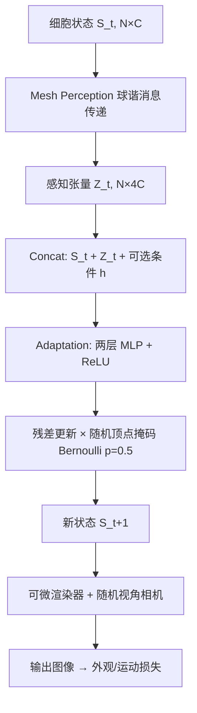

## 一句话总结

MeshNCA 把神经元胞自动机（NCA）从规则网格推广到任意 3D 网格的顶点上，用基于球谐函数的消息传递代替卷积核，仅在一个二十面体球（icosphere）上训练就能实时地、无需 UV 贴图地在任意未见网格上合成高质量的静态与动态表面纹理，并支持方向控制、嫁接、再生等多种测试期交互。

## 研究背景

纹理是提升虚拟环境真实感的核心要素。给 3D 物体合成纹理主要有两条路线：一是先在 2D 域合成再通过 UV 映射贴到 3D 表面，二是直接在 3D 空间中合成。UV 映射是主流做法，但为复杂网格制作准确 UV 图往往带来重叠、扭曲、可见接缝等瑕疵。直接在 3D 上合成则天然无缝，且更贴近纹理在自然界的生成方式（生长、侵蚀、沉积等均发生在 3D 表面）。

作者将直接 3D 合成方法分为三类，并指出各自短板：

- **实体纹理（Solid Texture）**：给 3D 体内每个点上色，适合木材、大理石这类"整块雕出"的纹理，但无法表达发生在物体表面的过程（如运动、侵蚀）。
- **表面纹理（Surface Texture）**：直接给表面每个点上色，能感知 3D 表面，但要么需要为每个网格单独优化，要么依赖大规模有纹理网格数据集训练，从而受限于训练集内的网格/纹理类别，且不支持实时交互。
- **元胞自动机（Cellular Automata, CA）**：用局部更新规则迭代生成纹理，能实时、可泛化到新网格、支持丰富交互；但传统 CA 规则需要人工设计，无法训练去拟合一个目标纹理。

本文选择改进 CA 路线，因为它交互性最强，对设计、艺术和创意应用尤为重要。作者基于可微分的神经元胞自动机（NCA）展开工作。NCA 的一大限制是：现有模型的元胞排列在规则网格（如图像像素或六边形晶格）上，难以推广到网格这类不规则结构。MeshNCA 正是要突破规则网格的束缚，让 NCA 直接运行在网格顶点这种任意排列的元胞集合上。

## 核心方法

MeshNCA 把网格 $$G=(V,E)$$ 的每个顶点当作一个"元胞"，边定义元胞间的邻居关系。所有元胞共享同一套局部更新规则，从全零初始状态 $$S^0$$ 出发迭代演化。每一步更新分为**感知（Perception）**与**适应（Adaptation）**两个阶段。

### 关键设计一：球谐函数消息传递感知

核心洞察是：任意 2D 卷积核本质上是一个离散查找表，可以改写成一个连续函数 $$filter(\phi_{ij}, r_{ij})$$，把中心像素 $$i$$ 与邻居 $$j$$ 之间的距离 $$r_{ij}$$ 和极角 $$\phi_{ij}$$ 映射为权重系数 $$w_{ij}$$。例如 vanilla NCA 用到的 Sobel 核可写为：

$$K_x(\phi_{ij}, r_{ij}) = \begin{cases} 0 & \text{if } r_{ij}=0 \\ 2\,\mathrm{sgn}(\cos\phi_{ij})\cos^2(\phi_{ij}) & \text{otherwise} \end{cases}$$

把这一思路推广到 3D：对 3D 空间中任意两个元胞 $$i, j$$，滤波器可写为其连接向量球坐标的函数 $$f(r_{ij}, \theta_{ij}, \phi_{ij})$$。作者发现去掉对距离 $$r_{ij}$$ 的依赖不损害纹理合成的表达力，因此只保留角度依赖 $$f(\theta_{ij}, \phi_{ij})$$，并选用**球谐函数** $$Y_l^m(\theta, \phi)$$ 作为感知滤波器的基。取一阶球谐（$$l \le 1$$）得到四个基函数。每条从邻居 $$j$$ 传到中心 $$i$$ 的消息定义为：

$$\Phi(i \leftarrow j) = w_{ij}(s_j - s_i), \quad w_{ij} = Y_l^m(\theta_{ij}, \phi_{ij})$$

每个元胞的感知向量是所有邻居消息之和：

$$z_i = \sum_{j \in \mathcal{N}(i)} \Phi(i \leftarrow j)$$

在这套消息传递方案下，前四个球谐基恰好与 NCA 的经典核对应：$$Y_0^0$$ 对应拉普拉斯核 $$K_{lap}$$，$$Y_1^1, Y_1^0, Y_1^{-1}$$ 分别对应 Sobel 核 $$K_x, K_z, K_y$$。感知阶段完全**非参数化**，不参与训练；由于用了四个基，通道数扩为原来的 4 倍，感知输出为 $$Z^t_{N \times 4C}$$。球谐正是球面上拉普拉斯方程的解，天然适合在流形上编码邻居的各向异性影响。

### 关键设计二：适应阶段与随机异步更新

每个元胞把当前状态 $$s^t_i \in \mathbb{R}^C$$、感知向量 $$z^t_i \in \mathbb{R}^{4C}$$ 以及可选的逐元胞条件向量 $$h_i \in \mathbb{R}^d$$ 在通道维拼接（共 $$5C+d$$ 维），送入一个两层 + ReLU 的 MLP。MLP 输出残差更新，再被一个服从伯努利分布（$$p=0.5$$）的随机掩码 $$M$$ 调制后加回原状态：

$$s^{t+1}_i = \begin{cases} s^t_i & M=0 \\ s^t_i + \mathrm{MLP}(s^t_i, z^t_i, h_i) & M=1 \end{cases}$$

随机顶点掩码引入更新的异步性，让 NCA 能随时间持续生成新纹理。适应阶段的所有操作都是逐顶点的，可完全并行，因此实现高效。

### 关键设计三：嫁接（Grafting）

作者提出一个有趣的测试期属性——"嫁接"，用于在两种纹理之间做空间/时间插值。关键观察是"兼容性"：若模型 $$T$$ 用模型 $$S$$ 收敛后的权重 $$W_S$$ 做初始化再训练另一种纹理，则来自 $$S$$ 与 $$T$$ 的元胞能在同一网格上协作共存、在边界处形成连贯过渡；若两者各自从零训练，这种协作就消失。作者把同源（从共同祖先训练而来）的模型称为"兼容"，类比生物学中的基因联系。

嫁接时并非简单把两种元胞并排（那样只在边界处协调），而是**按插值权重混合两个兼容模型计算出的更新**。对每个顶点取软嫁接掩码值 $$0 \le \alpha \le 1$$，每步同时计算 $$u_S, u_T$$ 后融合：

$$u = \alpha \cdot u_T + (1-\alpha)\cdot u_S$$

由此得到自然过渡的混合纹理。为避免为每对纹理两两训练（复杂度随纹理数平方增长），作者用一个"父"纹理训练出祖先模型，其余所有模型都用父模型权重初始化，从而保证同一血缘的兼容性，同时收敛更快、质量相当或更高。

## 技术细节

**训练框架**：MeshNCA 相当于定义在网格图上的 PDE，迭代产生一串元胞状态；从中抽取不同通道作为顶点属性，用可微分渲染器（Nvidia Kaolin）以随机视角透视相机渲染成图像，再对不同目标模态计算损失。

**图像引导训练**：用预训练 VGG16 抽取深度特征，采用 Kolkin 等人提出的风格损失——由松弛 Wasserstein 距离 $$\mathcal{L}_W$$ 与矩匹配项 $$\mathcal{L}_M$$ 组成，多视角、多层特征聚合：

$$\mathcal{L}_{appr-im} = \frac{1}{K}\sum_{k=1}^{K}\sum_{l=0}^{L}\left(\mathcal{L}_W(A_k^l, B^l) + \mathcal{L}_M(A_k^l, B^l)\right)$$

得益于 NCA 各通道天然结构对齐的特性，MeshNCA 可用不同通道**同时拟合多张 PBR 贴图**（3 通道 albedo、3 通道法线、各 1 通道的高度/粗糙度/环境光遮蔽），满足物理渲染需求。

**文本引导训练**：借助 CLIP（ViT-B/32），用模板 prompt "An image of a/an &lt;Object&gt; made of &lt;Prompt&gt;"。取前 3 通道为顶点颜色、第 4 通道为沿法线的几何位移。分别渲染带颜色+几何和仅几何两种图，做全局/局部增强后编码，并把方向性 CLIP 损失扩展到 3D：以灰色无形变网格为"负样本"，计算方向向量并对齐：

$$\mathcal{L}_{appr-tx} = \sum_i D_{cos}(\Delta R_i, \Delta C)$$

**动态纹理合成**：3D 表面的运动只能发生在局部切平面，且没有现成的 3D 逐顶点运动估计器。作者把用户定义的 3D 运动场投影到每个顶点的切空间得到 $$U^t$$：

$$U^t_i = U^v_i - (U^v_i \cdot \hat{n}_i)\hat{n}_i$$

并把 $$U^t$$ 作为逐顶点条件向量，形成**运动位置编码（Motion Positional Encoding, MPE）**。再把切向运动投影到相机平面得到 2D 目标光流，用预训练光流网络估计合成图像间的光流，通过方向损失 $$\mathcal{L}_{dir}$$ 与强度损失 $$\mathcal{L}_{str}$$ 监督。最终动态损失为：

$$\mathcal{L}_{dyn} = \mathcal{L}_{appr} + \lambda \mathcal{L}_{mot}$$

**模型规模**：cell state 维度 $$N_C=16$$、MLP 首层输出 $$N_{FC}=128$$，仅 **12432 个可训练参数**（加运动监督时 $$N_C=32$$，约 25k 参数）。所有实验仅在 icosphere 上训练，用 Adam（初始学习率 0.001），在 A100 上进行。作者还用 WebGL 着色语言实现前向过程，做成可在 PC 与手机上实时运行的在线演示。

## 实验结果

**图像引导**：收集 72 张 CC0 许可的 PBR 纹理（含 albedo、粗糙度、高度、AO、法线）。MeshNCA 合成的纹理在颜色和结构上都比对比方法更忠实于目标，而其他方法常出现错误结构、错误颜色或高频噪声。

**文本引导**：与 Text2Mesh、X-Mesh 对比，MeshNCA 结果更连贯、噪声更少；对比方法常出现尖刺几何或非纹理伪影（如 jelly beans prompt 里冒出人头）。值得注意的是 MeshNCA 甚至没有针对每个网格-prompt 做定制训练，仅靠泛化就超过它们。

**泛化到未见网格**：这是 MeshNCA 最突出的优势。仅在 icosphere 上训练即可无损地泛化到任意未见网格；对比中 Text2Mesh 只能保留大致颜色而丢失结构，各向同性的反应扩散模型无法合成正确结构，实体纹理法难以合成高保真纹理。

**用户研究（Amazon Mechanical Turk）**，MeshNCA 以极小参数量取得压倒性偏好：

| 图像引导方法 | 参数量 | 训练显存 | 训练时间 | 合成时间 | 用户偏好 |
| --- | --- | --- | --- | --- | --- |
| Gutierrez et al. 2020 | 85k | 1.5GB | 28min | 150ms | 10.9% ± 0.6% |
| Mordvintsev et al. 2021 | 8k | 19GB | 27min | 280ms | 15.3% ± 0.7% |
| Michel et al. 2022 | 659k | 4GB | 4min | 130ms | 2.8% ± 0.3% |
| **MeshNCA（Ours）** | **12k** | 9GB | 16min | 180ms | **71.1% ± 0.9%** |

| 文本引导方法 | 参数量 | 训练时间 | 合成时间 | 用户偏好 |
| --- | --- | --- | --- | --- |
| Michel et al. 2022 | 0.66M | 13min/mesh | 150ms | 17.3% ± 0.7% |
| Ma et al. 2023 | 9.61M | 11min/mesh | 150ms | 18.7% ± 0.7% |
| **MeshNCA（Ours）** | **0.01M** | 105min | 180ms | **64.0% ± 0.9%** |

**动态纹理**：仅对 albedo 通道施加运动监督，由于 NCA 通道隐式对齐，其他属性通道也自动跟随相同的动态模式，且运动能泛化到未见网格。

## 贡献与局限

**主要贡献**：
- 提出 MeshNCA，首个可在任意 3D 网格上实时、交互式合成纹理的 NCA 模型，具备出色的跨网格泛化能力和丰富的测试期属性。
- 用球谐消息传递把 vanilla NCA 的卷积感知推广到非网格结构，是 2D NCA 到 3D 的自然延伸，且保持了参数高效、并行、可控等优点。
- 支持图像与文本多模态引导；通过 MPE 与 2D 光流监督实现可泛化的 3D 动态纹理合成。
- 提出模型嫁接方案，让同源模型协作合成混合纹理。
- 提供可在低端边缘设备实时运行的 WebGL 在线演示。

**局限**：
- 不同纹理贴图通道虽结构相似，但在少数纹理上会出现错位，导致错误的着色效果（源于对齐是隐式监督）。
- 纹理属性挂在顶点上，因此质量依赖输入网格质量与顶点数，要求高多边形、顶点均匀分布（平均价约 6.0）的网格。
- 对渲染分辨率、相机距离等渲染参数较敏感，参数不当会得到次优结果。
- 对网格的语义结构无感知，难以合成语义相关的纹理（如区分人体网格的头与手臂）。

**未来方向**：让 MeshNCA 作用于网格面而非顶点以降低对高多边形的依赖；用正交投影减少透视畸变；引入基于物理的渲染器提升保真度；乃至扩展到粒子系统，实现实时点云与流体风格化。

## 延伸思考

MeshNCA 最优雅之处在于"卷积核即连续角度函数"这一视角——它把规则网格上的离散卷积无缝翻译成流形上的球谐消息传递，从而让"纯局部通信"这一 NCA 的核心哲学得以在任意拓扑上成立。正因为规则完全局部且非参数感知不绑定具体几何，模型才能在单一 icosphere 上训练却泛化到任意网格，这与依赖大数据集的表面纹理方法形成鲜明对比。以约 1.2 万参数就在用户研究中取得 60–70% 的压倒性偏好，也再次印证了强归纳偏置（局部性 + 各向异性球谐）在小模型上的威力。嫁接机制则揭示了一个耐人寻味的现象：从共同权重派生的 NCA 之间存在"可协作性"，这为纹理插值乃至更广义的模型组合提供了新思路。
