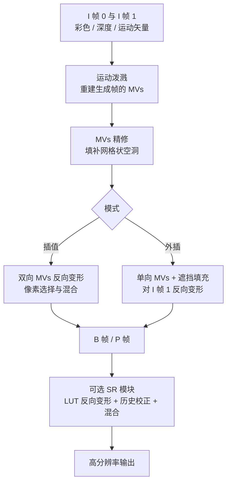

## 一句话总结

Mob-FGSR 提出了一套面向移动端、完全不依赖神经网络的轻量级超采样框架，通过基于泼溅（splatting）的运动矢量重建，把帧生成（插值与外插）和超分辨率统一起来，在骁龙 8 Gen 3 上以毫秒级耗时大幅提升移动实时渲染的帧率与画质。

## 研究背景

现代智能手机普遍配备 2K 分辨率、120Hz 或 144Hz 刷新率的屏幕，但受限于移动 GPU 性能与功耗预算，高质量高帧率的实时渲染难以实现。桌面端已有成熟的超采样方案：一类利用时域帧冗余做插值或外插的帧生成，另一类先低分辨率渲染再用超分辨率上采样，近期的 DLSS 3、FSR 3、ExtraSS 则把二者结合。

问题在于这些方法几乎都依赖高端 GPU 的最新特性，需要神经网络推理硬件或光流估计硬件，还常常要求延迟渲染管线额外输出 G-buffer，因此并不适用于移动平台。要在移动端实现帧生成与超分的联合方案，作者指出必须解决两个核心挑战：一是在没有高端硬件光流、也没有生成帧运动矢量的情况下，设计快速且准确的运动重建方法；二是在不使用神经网络的前提下，构建高效的生成帧与超分帧重建模型，以达到目标帧率。即便是为移动端优化的 MNSS，在 720P 下也需额外约 11ms，仍不够实用。

## 方法

### 整体框架

框架输入仅为前向渲染常见的三类数据：彩色图 $I$、深度图 $D$ 和运动矢量 $M$。以时刻 0 和时刻 1 的两个渲染帧（称为 I 帧）为输入，框架支持四种模式：插值（Ours-I）、外插（Ours-E），以及二者各自叠加超分的版本（Ours-ISR、Ours-ESR）。借用视频编码术语，渲染帧记为 I 帧，插值帧记为 B 帧，外插帧记为 P 帧，生成帧的时间位置用下标 $\alpha$ 表示，插值时 $\alpha \in (0,1)$，外插时为 $1+\alpha$。

### 运动矢量重建

核心创新是基于泼溅的快速运动估计。方法假设相邻帧之间为匀加速的二次运动，利用 I 帧 -1、0、1 处的位置 $p_{-1}, p_0, p_1$（由图像空间运动矢量 $m_0, m_1$ 给出）推导目标时刻的位置。插值与外插位置分别为：

$$p_{\alpha} = p_1 - (1-\alpha)\left(\frac{m_0 + m_1}{2}\right) + \frac{(1-\alpha)^2}{2}(m_1 - m_0)$$

$$p_{1+\alpha} = p_1 + \alpha\left(\frac{m_0 + m_1}{2}\right) + \frac{\alpha^2}{2}(m_1 - m_0)$$

得到生成帧中像素的运动后，用最近邻方式把运动矢量「泼溅」到对应像素。为解决物体边缘多个矢量落到同一像素的冲突，方法采用深度感知的泼溅加原子操作，保证前景（深度最小）像素的矢量被写入。由于最近邻泼溅会留下网格状空洞，作者借鉴 FSR 2 的思路，用细物体检测识别空洞（检查每个像素 $3\times3$ 邻域是否缺少特征相似的 $2\times2$ 块），再用均值滤波填补。

作者强调，相比 Xu 等人在时刻 0 估计二次「流」的做法，本方法直接计算时刻 $\alpha$ 的二次「位置」，理论上更准确，且避免了高斯泼溅的高计算量。

### 帧生成

插值时，两个相邻 I 帧分别用 $M_{0\to\alpha}$ 和 $M_{1\to\alpha}$ 反向变形，再混合成 B 帧。混合需要处理两个难点：直接平均会因运动矢量微小误差导致模糊，遮挡和着色变化区域会产生伪影。混合策略如下：

$$I^{i}_{\alpha}(r) = \begin{cases} I^{w}_{0\to\alpha}(r), & \Delta D(r) > T_D \\ I^{w}_{1\to\alpha}(r), & \Delta D(r) < -T_D \\ I^{w}_{0\to\alpha}(r), & \alpha \leqslant 0.5,\ \lvert\Delta D(r)\rvert \leqslant T_D,\ \lvert\Delta B(r)\rvert \leqslant T_B \\ I^{w}_{1\to\alpha}(r), & \alpha > 0.5,\ \lvert\Delta D(r)\rvert \leqslant T_D,\ \lvert\Delta B(r)\rvert \leqslant T_B \\ \mathrm{lerp}(I^{w}_{0\to\alpha}(r), I^{w}_{1\to\alpha}(r), \alpha), & \lvert\Delta D(r)\rvert \leqslant T_D,\ \lvert\Delta B(r)\rvert > T_B \end{cases}$$

其中 $\Delta D$ 为两张变形深度图的差异，$\Delta B$ 为亮度差异。大的深度差通常代表遮挡，深度相近但亮度差异大则代表着色变化。基本原则是：色彩优先从时间上更近的帧采样；遮挡处从两帧中挑选合适像素避免重影；着色变化处则用线性插值实现平滑过渡。

外插时缺少后续帧参考，作者放弃了背景填充、遮挡运动矢量等高开销方案，改用简化的遮挡填充：直接用 I 帧 1 的运动矢量填补外插帧遮挡区域缺失的 MVs，在效率与画质间取得平衡。外插还省略了着色变化的处理，因此在移动阴影等区域可能出现低帧率效果。

### 超分辨率与数据驱动优化

SR 模块复用历史帧的累积时域样本来构建高分辨率当前帧，可无缝替换帧生成中的图像变形模块。为避免双线性反复重采样导致模糊、双三次插值计算量过大，作者引入基于查找表（LUT）的变形：预训练一个 MLP 学习重采样权重，把偏移 $dx, dy$ 量化为 32 级，权重存入 $32\times32\times16$ 的 LUT，推理时快速查表得到 16 个像素的权重。最终把校正后的历史帧与低分辨率 I 帧混合：

$$q = a \cdot \frac{\sum_{s \in \Omega_p}(1 - b \cdot d_s)\cdot s}{n} + (1-a)\cdot q_w$$

其中 $q$ 为重建像素，$q_w$ 为对应的变形历史像素，$s$ 为邻域样本，$d_s$ 为样本到 $q$ 的距离。阈值和混合系数均由数据驱动标定：$T_D = 0.0028$、$T_B = 0.13$、$a = 0.34$、$b = 0.81$；LUT 方法的平均 SSIM 达 0.933（双线性 0.907、双三次 0.931），耗时 0.905ms，快于双三次的 1.145ms。

## 实验结果

在 Unity 场景（Street View、Hilly Area、Meadows、Dragon Park）上，帧生成部分本方法明显优于其他轻量级方案，平均 SSIM 至少提升 0.049、PSNR 至少提升 4.22dB；超分部分虽略低于基于深度学习的 NSR 与 MNSS，但保持有竞争力的水平。

| 方法 | SV (PSNR) | HA (PSNR) | ME (PSNR) | DP (PSNR) |
| --- | --- | --- | --- | --- |
| 3DWarp | 22.70 | 26.62 | 29.21 | 29.19 |
| BSR | 21.91 | 26.07 | 27.14 | 27.90 |
| AFME | 20.87 | 24.81 | 25.79 | 26.98 |
| Ours-E | 26.60 | 30.85 | 31.53 | 30.65 |
| Ours-I | 27.57 | 31.78 | 32.47 | 32.77 |
| NSR | 29.07 | 33.56 | 34.22 | 30.41 |
| MNSS | 28.95 | 32.90 | 32.17 | 30.87 |
| Ours-SR | 28.42 | 31.73 | 32.36 | 30.62 |

运行时性能（骁龙 8 Gen 3）是最大亮点。720P 帧生成下 Ours-I、Ours-E 分别为 2.21ms、1.92ms；540P 到 1080P 的帧生成加超分下，Ours-SR、Ours-ISR、Ours-ESR 分别为 1.66ms、2.34ms、1.75ms。作为对比，3DWarp 需 24.16ms、MNSS 需 12.84ms，Ours-SR 比 MNSS 快近七倍。

| 模式 | 分辨率 | 总耗时 |
| --- | --- | --- |
| Ours-I | 720P | 2.21ms |
| Ours-E | 720P | 1.92ms |
| Ours-SR | 540P→1080P | 1.66ms |
| Ours-ISR | 540P→1080P | 2.34ms |
| Ours-ESR | 540P→1080P | 1.75ms |

在 UE 延迟着色场景（Bunker、Western Town）中，帧生成落后于能直接获取运动矢量与基色的 ExtraNet，但 Ours-SR 在超分任务上略优于 TSR。作者也坦承，DLSS 2 等基于深度网络的方法在低采样率下抑噪与预测边缘纹理的能力更强，画面更平滑。

## 亮点与局限

亮点在于运行时模型完全不含神经网络，因此可直接部署在现成移动设备上；基于泼溅的二次运动重建在细物体和遮挡区域比 3DWarp、BSR 更准确；框架同时支持插值、外插、超分及其组合，并兼容前向渲染管线，契合主流移动渲染。该方法已落地商用（如一加 Ace 3 Pro 在《原神》上实现稳定 120 帧）。

局限主要有两点：一是为节省算力忽略了帧生成中的着色变化，导致阴影、反射、透明物体出现低帧率效果，只能通过软阴影、减少大面积反射与透明材质来缓解；二是外插虽能降低延迟，但在遮挡区域可能产生重影，作者建议采用「首帧外插降延迟、次帧插值减伪影」的两帧生成策略，并推荐输入帧率高于 30fps。

## 延伸思考

这项工作展示了一条与主流「堆神经网络」相反的技术路线：在移动端算力和专用硬件受限的现实约束下，用经典的运动学建模、深度感知泼溅、查表加速等手工设计的高效算子，把问题拆解成可在毫秒内完成的确定性模块。这种「数据驱动标定参数 + 无网络运行时」的折中，既借用了深度学习离线训练 LUT 与阈值的能力，又规避了在线推理的硬件门槛，值得资源受限场景借鉴。

另一方面，论文也清晰指出了非神经网络方法的天花板：着色变化预测、低采样率去噪、快速运动边缘等恰恰是深度网络的强项。未来若能设计出可在移动 SoC 上低成本运行的轻量着色变化预测或遮挡填充模块（例如借鉴 G-buffer 引导变形的思路），有望进一步缩小与高端方案的画质差距。此外，把这套框架扩展到 XR 头显的低延迟需求、或与移动端 AI 加速单元协同，也是自然的延伸方向。
