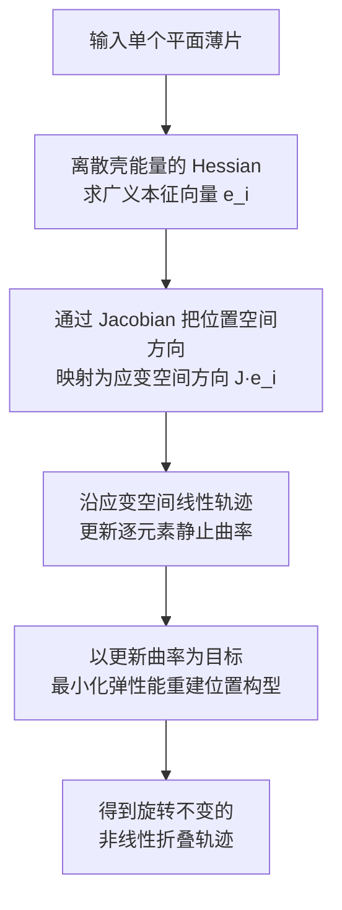

## 一句话总结

作者提出 Modal Folding，把线性弹性本征模在应变空间中做非线性推广，用逐元素静止曲率的内在驱动方式，从单个输入形状自动发现能量最优、几乎不拉伸的光滑折叠图案。

## 研究背景

折叠能把一块普通布料变成令人惊叹的艺术品，但为薄片材料寻找新的折叠变换一直是件既需要经验又依赖实物试验的难事。作者希望给出一套系统化、自动化的方法。

一个自然的想法是：给定形变幅度，什么样的构型能让内部弹性能最小？把这个问题写成约束优化，会直接与经典的弹性本征模（eigenmode）挂钩——对线性材料和小形变，最低阶本征模就是局部最优解，它倾向于弯曲而非拉伸。但线性模有个根本缺陷：它无法表达折叠所需的旋转运动，沿线性方向走远后会诱发大量拉伸，能量急剧上升。核心挑战就在于如何保留本征模"弯曲优先"的优点，同时获得旋转不变性。

## 方法

整体框架：先回顾线性本征模并指出其局限，再引入在应变空间（strain space）中定义的非线性模，通过调制静止曲率驱动薄片变形，最后扩展到多维子空间以支持逆向设计。

关键设计：

- 线性本征模的能量视角。用离散壳模型描述薄片力学，在静止态附近对弹性能做二阶展开，得到约束优化问题

$$\min \tfrac{1}{2}\mathbf{u}^{T}\mathbf{H}\mathbf{u}\quad \text{s.t.}\quad \tfrac{1}{2}\mathbf{u}^{T}\mathbf{M}\mathbf{u}=b^{2}$$

  其一阶最优条件 $\mathbf{H}\mathbf{u}+\lambda\mathbf{M}\mathbf{u}=0$ 表明最优位移与 Hessian 的广义本征向量共线，最小本征值对应用最少机械功产生给定幅度位移的方向。

- 应变空间模（strain-space mode）。线性模缺乏旋转不变性，作者转而调制逐元素静止曲率 $\bar{\boldsymbol{\kappa}}$（逐边二面角或逐三角形形状算子）。给定静止曲率后，最小化膜能与弯曲能之和得到最佳逼近该目标曲率的形变构型：

$$\mathbf{x}^{*}=\arg\min_{\mathbf{x}} W(\mathbf{X},\bar{\boldsymbol{\kappa}},\mathbf{x})$$

  当目标曲率"相容"（无需拉伸即可实现）时重建能量为零，否则会以材料感知的方式平衡面内形变与曲率偏差。

- 用本征模确定目标曲率。要求轨迹初始切向与本征向量一致 $\dot{\mathbf{x}}(0)=\mathbf{e}_{i}$，其在曲率上的变化率为 $\dot{\boldsymbol{\kappa}}=\mathbf{J}\mathbf{e}_{i}$，由此定义线性应变空间轨迹 $\bar{\boldsymbol{\kappa}}(t)=\bar{\boldsymbol{\kappa}}(0)+t\mathbf{J}\mathbf{e}_{i}$，再逐点重建为非线性位置空间轨迹。这种内在驱动天生旋转不变，驱动力对大形变仍近似垂直于曲面，因此几乎不产生拉伸。

- 多维扩展与逆向设计。把静止曲率推广为多个模态方向的线性组合 $\bar{\boldsymbol{\kappa}}(\mathbf{c})=\bar{\boldsymbol{\kappa}}(0)+\sum_{j}c_{j}\mathbf{J}\mathbf{e}_{j}$，形成非线性子空间，可通过优化模态系数完成逆向折叠。求解时用带自适应正则与线搜索的牛顿法，加入障碍势处理自碰撞，并用上一状态初始化下一状态以获得光滑轨迹。

- 周期折叠图案。支持平移拼贴（对边位移相同）与反射拼贴（每条边界落在公共反射面内），通过消去自由度并引入边界位移或反射面距离作为变量，得到自动满足周期条件的本征向量，再转换为应变空间模。

## 实验结果

作者在方形、圆盘、生命之花镂空片等多种形状上验证，并用棉布、纸、铜片制作实物原型。模式对比实验（20cm 方片，杨氏模量 2.9GPa，泊松比 0.3，厚 1mm）显示：线性模、非线性柔顺模（NCM）、旋转-应变模（RSM）在大形变下都会诱发拉伸使能量陡增，只有本方法保持接近零拉伸、能量增长缓慢，并能复现 3×3 折纸的扭转运动。

| 示例 | 节点数 | 单元数 | 每状态平均耗时 |
| --- | --- | --- | --- |
| 生命之花 | 1975 | 2262 | 3.48 秒 |
| 圆盘 | 817 | 1536 | 1.53 秒 |
| 方片 40×40 | 1681 | 3200 | 3.87 秒 |
| 方片 60×60 | 3721 | 7200 | 7.96 秒 |

逆向设计中，用前 50 个应变空间模让半径 10cm 的圆盘装入半径 6cm 的球，得到光滑且三重对称的折叠；而用接触驱动逐步压缩球半径的对照方案只能得到褶皱状而非折叠的结果。

## 亮点与局限

亮点：

- 把"应变空间中的线性模 + 能量最小化重建"结合，从单个输入形状自动导出丰富的非线性折叠图案，无需第二个目标形状或用户指定方向。
- 通过调制静止曲率的内在驱动实现旋转不变性，使大弯曲变形几乎不产生拉伸，能量显著低于已有非线性模。
- 覆盖前向探索、周期拼贴与逆向设计，并用布、纸、铜片多种材料的实物原型验证可行性。

局限：

- 应变空间模并非自动可展：逐元素弯曲应变可能在顶点处合成非零高斯曲率，从而诱发拉伸（经验上较小，但不为零）。
- 结果对网格拓扑敏感——细分同一拓扑影响不大，但相同分辨率下改变拓扑会显著改变单个模式。
- 折痕锐利程度依赖材料厚度，尚不能直接生成真正的尖锐折痕；模式融合的探索也较为有限。

## 延伸思考

这项工作的巧妙之处在于换了个"作用空间"：不在位置空间里硬推位移，而是在旋转不变的应变（曲率）空间里做线性外推，再让物理能量最小化把它翻译回真实形状。这种"在不变量空间中线性化、在物理空间中重建"的思路，对其他强非线性、需要旋转不变性的形变问题（如可展曲面设计、超材料、可部署结构）都有借鉴意义。值得进一步思考的是，如何在保持自动化的同时施加等距（isometry）约束以避免寄生拉伸，以及能否用能量最小化重网格来削弱对网格拓扑的依赖，从而让发现的折叠图案更稳健、更可控。
