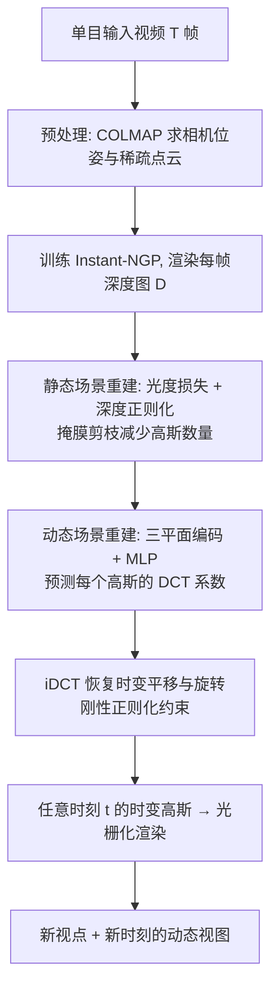

## 一句话总结

从单目视频出发，本文在 3D 高斯泼溅（3DGS）基础上，用离散余弦变换（DCT）基函数为每个高斯建模周期性运动轨迹，配合深度正则化、刚性正则化与场景归一化等策略，实现无界自然场景（如随风摇曳的树木、植物）中高质量、可外推的动态自由视点合成。

## 研究背景

我们身处一个充满细节纹理与运动的动态世界：树叶随风律动、草叶轻轻摆动，这种"环境动态"（ambient motion）让观看体验更具沉浸感。本文的目标，是从单目拍摄的环境场景（尤其是植物场景）中，重建出高质量、可自由视点漫游的动态视图。

已有的动态视图合成大多基于 NeRF：或在规范空间学习静态模板，或跨时间戳建模运动场，但受限于训练速度与整体重建质量。近来 3DGS 以显式 3D 高斯表示复杂静态场景，兼具高保真与快速训练，并被扩展到 4D 动态重建。然而这些扩展存在明显约束：

- 多数依赖多相机采集，对普通用户不现实；
- 少数支持单目输入的方法只能处理有界（bounded）场景；
- 它们通常假设所有运动都被观测到，因此无法泛化到未观测的运动。

本文针对无界环境场景的单目动态重建这一空白展开，核心思路是利用环境运动的周期性来学习运动轨迹模型，从而在缺乏直接监督时也能合理地复现与外推运动。

## 方法

### 整体框架

给定 $T$ 帧输入视频及对应相机参数，方法用一组带时间维度的 3D 高斯来同时表达场景的几何、外观与运动，分为三个阶段：预处理、静态场景重建、动态场景重建。

### 关键设计

3D 高斯泼溅基础。每个高斯 $G$ 由中心 $\mu$ 与协方差 $\Sigma$ 定义，$\Sigma = RSS^{T}R^{T}$，并带颜色 $c$（球谐系数）与不透明度 $\alpha$。渲染时按视点排序并做前向合成混合：

$$C = \sum_{i \in N} c_i \alpha_i \prod_{j=1}^{i-1}(1 - \alpha_i)$$

深度正则化。3DGS 严重依赖 COLMAP 初始点云的覆盖度，而无界场景远处因视差小难以可靠重建，导致背景几何错误、渲染模糊。作者用 10 分钟拟合一个 Instant-NGP，为每帧渲染深度图 $D$；再把混合公式中的颜色 $c_i$ 换成高斯深度 $z_i$ 得到高斯深度图：

$$\hat{D} = \sum_{i \in N} z_i \alpha_i \prod_{j=1}^{i-1}(1 - \alpha_i)$$

并用 $\hat{D}$ 与 NeRF 深度 $D$ 之间的 L2 损失做正则化，从而把高斯的影响力延伸到初始点稀疏的远景区域。

时变形变。静态重建后，为每个高斯预测时变平移 $\Delta\mu_t$ 与旋转 $\Delta q_t$，把它从规范空间形变到时刻 $t$：

$$\mu_t = \mu + \Delta\mu_t$$

$$q_t = \frac{q + \Delta q_t}{\lvert\lvert q + \Delta q_t \rvert\rvert}$$

但作者不直接预测形变，而是先建模运动轨迹、再在时刻 $t$ 采样，从而具备外推未观测运动的能力。高斯中心位置经体素/三平面编码器编码后送入 MLP，预测预定义基函数的系数。

周期运动的 DCT 建模。受 DCT-NeRF 启发，用离散余弦变换基函数表示时变形变，每个高斯独立建模：

$$v(t) = \sqrt{\frac{2}{K+1}} \sum_{k=1}^{K} \phi_{v,k} \cos\!\left(\frac{\pi}{2T}(2t+1)k\right)$$

其中 $\phi_{v,k}$ 为第 $k$ 个基的系数，$v(t)$ 可以是某轴的平移或旋转分量。所有实验取 $K = \lceil \tfrac{1}{4}T \rceil$，把形变参数量压到约四分之一。DCT 的两大好处：存储高效；且因其周期特性，在有监督处可拟合运动、在遮挡或出画等无监督处能复现运动，提升泛化。

场景归一化。编码器输入范围固定为 $[-1,1]$，需归一化高斯位置。按点云范围归一化会浪费表示能力（前景模糊、背景乱动）；Mip-NeRF-360 的 $\infty$-范数收缩仍会背景模糊。作者提出按相机位置范围归一化，并把范围外的点映射到边界，既为前景显著运动保留高分辨率，又对远处运动起到正则作用。

刚性正则化。相邻高斯常出现空间不一致的形变，导致运动不自然。作者引入刚性正则化，要求每个高斯的邻居随时间遵循该高斯坐标系的刚体变换，并保持相近旋转，以增强时空一致性。

显存高效的多趟渲染。时变 MLP 需缓存每个样本的隐层特征，显存吃紧。作者用两趟渲染：第一趟不缓存特征，仅确定参与当前图像渲染的高斯并存其形变状态；第二趟只处理这些高斯并缓存特征做反传，还把高斯分成每块至多 50 万样本做梯度累积，逐块缓存、反传后释放，突破显存瓶颈。

## 实验结果

在单张 NVIDIA A100（40GB）上实现。作者提出 Forest 数据集：10 个无界动态环境场景，1080p、30fps、时长 10~30 秒。评测在 forest 序列上以 PSNR / SSIM / LPIPS 衡量，并做了 24 人参与的用户研究。基线为 4D-GS 与 RoDyNeRF。

主实验（全参考指标）：

| 方法 | PSNR ↑ | SSIM ↑ | LPIPS ↓ |
|------|--------|--------|---------|
| 4D-GS | 19.04 | 0.472 | 0.414 |
| RoDyNeRF | 18.12 | 0.393 | 0.512 |
| Ours | 21.94 | 0.675 | 0.278 |

本方法在三项指标上均显著领先：RoDyNeRF 受隐式表示与光流约束限制、图像偏模糊；4D-GS 能捕捉部分静态内容但远景伪影明显、环境运动不准。用户研究中，本方法在"几何外观"与"运动质量"两种设定下的胜率都明显更高。

消融（forest 序列，PSNR / SSIM / LPIPS）：

| 配置 | PSNR ↑ | SSIM ↑ | LPIPS ↓ |
|------|--------|--------|---------|
| 去深度正则化 | 20.17 | 0.588 | 0.335 |
| 去 DCT 变换 | 21.65 | 0.663 | 0.282 |
| 去轨迹 MLP | 18.27 | 0.423 | 0.452 |
| 去刚性正则化 | 21.74 | 0.666 | 0.280 |
| 去场景归一化 | 21.67 | 0.662 | 0.281 |
| 完整模型 | 21.94 | 0.675 | 0.278 |

轨迹 MLP 的作用最关键（去掉后 PSNR 从 21.94 跌到 18.27，因直接逐高斯优化 DCT 系数会导致运动闪烁）；深度正则化次之。方法还能推广到烛焰、随风摆动的风铃、飘动的纸条等更多样的动态场景，产生真实、平滑、周期性的运动。

## 亮点与局限

亮点：

- 首次在无界环境场景下，从单目视频实现高质量动态自由视点合成，直击"多相机/有界场景/无法泛化未观测运动"三大痛点。
- 用 DCT 基 + 轨迹 MLP 建模周期运动，天然支持在遮挡、出画、无监督时段复现与外推运动，兼具存储效率。
- 一整套工程化策略（NeRF 深度正则化、基于相机范围的场景归一化、掩膜剪枝、两趟渲染 + 梯度累积）系统性地解决了无界场景的几何与显存难题。

局限：

- 无法处理复杂的非周期运动。
- 在输入视点范围之外做外推时，视图合成质量会明显下降。
- 依赖 COLMAP 位姿与 Instant-NGP 深度，训练时长跨度较大（约 1.5~8 小时），对场景复杂度较敏感。

## 延伸思考

本文的核心洞见是"用运动的周期性先验换取对未观测运动的泛化"——把时间维度的形变投影到一组 DCT 基上，本质是对自然振荡运动的低频、周期结构做了强假设。这个思路的边界也正是它的局限：一旦运动非周期或需大幅外推视点，先验就失效。作者也指出，引入生成模型（如扩散模型）来补全未观测时空是自然的下一步。此外，"先在规范空间重建静态几何、再回填运动"的解耦策略，以及深度正则化把隐式表示（NeRF）当作显式表示（3DGS）几何先验的做法，都是可迁移到其他动态重建任务的通用工程经验。
