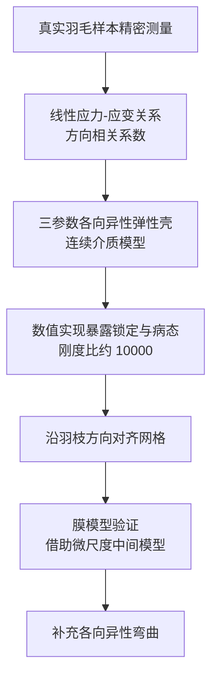

## 一句话总结

从真实羽毛样本的精密测量出发，作者把羽片（vane）建模为一个仅含三个参数的强各向异性弹性壳，并针对羽枝（barb）与羽小枝（barbule）方向刚度相差上万倍带来的数值锁定与病态问题给出解决方案。

## 研究背景

羽毛具有高度各向异性的力学行为，这来源于它复杂的层级微结构：一根根羽枝（barb）夹持在中央羽轴（rachis）上，相邻羽枝又通过微小的钩状羽小枝（barbule）相互连结。这种结构让羽片在沿羽枝方向和沿羽小枝方向上的力学响应差异极大，给数值建模带来独特挑战。

要在图形学中可信地模拟羽毛，就需要一个既忠实于真实材料、参数又足够简洁的连续介质模型。难点在于：真实羽片的各向异性极端强烈，直接照搬通用的壳模型会在数值求解时暴露严重问题。

## 方法

整体框架分为四步：先在真实羽毛样本上做精密测量以标定材料行为，再据此构建三参数各向异性壳的连续介质模型，接着解决极端刚度比引发的数值问题，最后针对膜模型做大量实验验证并补充各向异性弯曲。

关键设计：

- 测量协议。作者设计了针对真实羽毛样本的精密测量流程，用来提取羽片膜的力学参数。实验结果表明羽片膜满足线性的应力-应变关系，但其系数依赖于方向：

$$\sigma = C(\theta)\,\varepsilon$$

  其中系数矩阵 $C(\theta)$ 随载荷相对羽枝方向的取向而变化，体现出膜层面的各向异性。

- 三参数各向异性壳模型。基于测量发现，羽片被表示为一个仅需三个参数的各向异性弹性壳，把复杂的层级微结构抽象为连续介质，兼顾忠实性与简洁性。

- 处理极端刚度比。测量显示羽枝方向与羽小枝方向的刚度比达到约 $10^{4}$ 量级。如此极端的各向异性在数值实现时会引发严重的锁定（locking）与病态（ill-conditioning）。作者的关键做法是把网格沿羽枝方向对齐，从而缓解这些数值问题。

- 微尺度中间模型与验证。为了减少所需的实验室实验次数，作者引入一个微尺度中间模型作为桥梁，并据此对膜模型与真实测量结果进行了大量对照验证。

- 各向异性弯曲。在膜模型之外，进一步为模型补充了各向异性的弯曲行为，使其更完整地刻画羽片的力学响应。

## 实验结果

作者在真实羽毛样本上开展测量，并借助微尺度中间模型，对膜模型与实验室测量结果进行了广泛对照验证。核心的定量发现如下：

| 观测量 | 结论 |
| --- | --- |
| 羽片膜应力-应变关系 | 线性，系数随方向变化 |
| 羽枝方向与羽小枝方向刚度比 | 约 $10^{4}$ 量级 |
| 数值实现的主要障碍 | 极端刚度比导致锁定与病态 |

## 亮点与局限

亮点：

- 以真实羽毛测量为依据，把复杂的层级微结构凝练为仅三个参数的各向异性壳模型，简洁且有实测支撑。
- 直面强各向异性带来的锁定与病态难题，用沿羽枝方向对齐网格的思路给出务实解法。
- 通过微尺度中间模型减少实验成本，并对膜模型做了系统性的实验验证。

局限：

- 极端刚度比意味着模型对网格取向敏感，网格需与羽枝方向对齐，这可能限制在任意网格上的直接适用性。
- 该开放副本为会议扩展摘要，缺少完整的实现细节、参数取值与更丰富的定量结果，具体性能与泛化性有待正文进一步说明。

## 延伸思考

把生物结构的极端各向异性抽象为低参数连续介质模型，是一条兼顾可信度与可控性的路径。沿主纤维方向对齐网格来对抗刚度比引发的数值退化，这一思路对其他强各向异性材料（如织物、植物叶脉、复合材料薄壳）同样有借鉴意义。值得思考的是，当难以获得沿纤维方向对齐的网格时，是否能用各向异性重网格或专门的离散化格式达到类似的数值稳健性。
