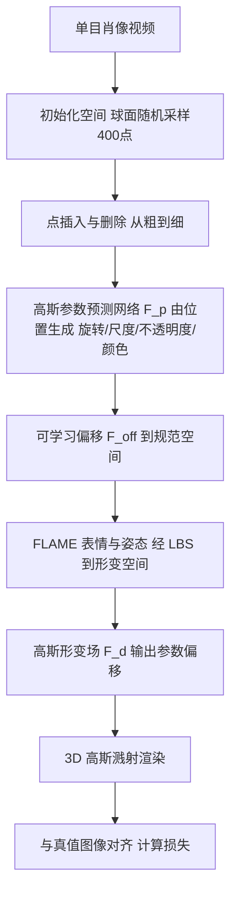

## 一句话总结

MonoGaussianAvatar 用可变形的 3D 高斯点表示头部化身，配合一个高斯形变场从单目肖像视频中学习显式头像，兼顾灵活拓扑、高效形变与高质量渲染，在结构相似度、图像相似度与峰值信噪比上超越此前方法。

## 研究背景

从单目肖像视频重建可驱动的照片级头部化身，是连接虚拟与现实（AR/VR 可穿戴设备如 Apple Vision Pro、Meta Quest）的关键一步，要求兼具照片级几何、精细外观与准确的动态表情。已有工作主要沿三条路线展开，各有短板：

- 三维可变形模型（3DMM）：能高效表达粗略面部几何并泛化到新形变，但受限于预定义的固定拓扑，只能表示类曲面几何，难以建模眼镜、头发等配饰。
- 神经隐式表示：NeRF 类擅长捕捉发丝、眼镜等细节，SDF 类擅长重建几何，但生成单个像素需沿相机光线查询大量采样点，训练与渲染效率都受损。
- 其他显式表示：以 PointAvatar 为代表，点可用可微光栅化高效渲染、用线性混合蒙皮（LBS）高效形变，比网格更灵活。但它把渲染半径固定统一，为保证质量需要大量点，训练负担重；面部大幅运动时会出现空洞；牙齿等刚性部件还会随嘴唇一起形变导致不准确。

作者针对 PointAvatar 的问题提出 MonoGaussianAvatar，用 3D 高斯点表示外观与几何，并引入连续的高斯形变场做动画。相比点云，高斯点在尺度与旋转上更灵活，能补上大幅运动时的空洞、维持牙齿等刚性区域，并在等量点数下获得更好的渲染质量。

## 方法

整体框架：把人头建模为一组可学习的、参数化的形变 3D 高斯点，每个点带均值位置、颜色、不透明度、旋转与尺度。流程分四步——先在初始化空间用「点插入与删除」策略随球面采样并从粗到细更新点的位置；再用一个高斯参数预测网络由均值位置生成其余高斯参数；接着通过可学习偏移把点从初始化空间变到规范空间，并用 FLAME 表情与姿态参数经 LBS 变到形变空间；最后用 3D 高斯溅射渲染并与真值图像对齐。

关键设计：

- 两阶段初始化与点插入删除：第一阶段在球面随机采样 $$400$$ 个点作为均值位置，随训练用点插入删除迭代更新。策略借鉴 PointAvatar，但由于高斯溅射的尺度、旋转、不透明度都在变化，直接照搬会得到粗糙的渲染与几何。作者改为每轮按设计数目随机上采样点、在指定轮次衰减采样半径，并给尺度加一个逐轮衰减的渲染半径以稳定收敛，同时剪除形变空间中不透明度 $$o^d<0.1$$ 的不可见点，从而实现快速的从粗到细优化。
- 高斯参数预测：用 MLP 网络 $$F_p$$ 把初始化空间的均值位置映射到旋转、尺度、不透明度与颜色，即 $$(r^c,s^c,o^c,c^c)=F_p(x^c)$$；再用可学习函数 $$F_{off}$$ 把点从初始化空间搬到规范空间 $$x^o=x^c+F_{off}(x^c)$$。
- 高斯形变：学习一个个体专属、拓扑一致的模板（含形变 blendshape 与蒙皮权重），用目标 FLAME 表情与姿态参数把点从规范空间变到形变空间
$$x^d=\mathrm{LBS}\lvert x^o+B_P(\theta;\mathcal P)+B_E(\psi;\mathcal E),\ J(\psi),\ \theta,\ \mathcal W\rvert$$
- 高斯形变场：作者发现从规范空间到形变空间时保持其余高斯参数不变并不合理，会导致新姿态下模糊、几何不一致。于是用一个 MLP 形变场 $$F_d$$ 输出参数偏移
$$(r_{off},s_{off},o_{off},c_{off})=F_d(x^c,x^d,F_{off}(x^c))$$
再更新形变参数 $$r^d=r^c+r_{off}$$、$$s^d=s^c+s_{off}$$、$$o^d=o^c+o_{off}$$、$$c^d=c^c+c_{off}$$。MLP 的归纳偏置带来参数形变的局部平滑先验，比逐点独立特征更稳。
- 高斯溅射渲染：形变空间中每个高斯由均值位置与协方差 $$\Sigma$$ 定义，投影到相机平面后按深度做透明度混合
$$C_{pix}=\sum_{i\in S}c^d_i\,\Pi(f^d_i)\prod_{j=1}^{i-1}\lvert 1-\Pi(f^d_j)\rvert$$
- 训练目标：逐像素 RGB 损失、整图上的 VGG 感知损失、约束表情/姿态/蒙皮权重贴近 FLAME 伪真值的 $$L_{flame}$$，以及 D-SSIM 项，合为
$$L=\lambda_{rgb}L_{RGB}+\lambda_{flame}L_{flame}+\lambda_{vgg}L_{vgg}+\lambda_{D\text{-}SSIM}L_{D\text{-}SSIM}$$

## 实验结果

在来自 IMavatar、Nerface 的被试及用智能手机采集的被试上，与 Nerface、IMavatar、PointAvatar 三个方法在相同人脸追踪结果下对比，指标包括 L1、LPIPS、SSIM、PSNR。

| 场景 | 方法 | L1↓ | LPIPS↓ | SSIM↑ | PSNR↑ |
| --- | --- | --- | --- | --- | --- |
| case 1 | Nerface | 0.028 | 0.1443 | 0.8487 | 24.05 |
| case 1 | IMavatar | 0.028 | 0.1622 | 0.8454 | 23.39 |
| case 1 | PointAvatar | 0.021 | 0.0845 | 0.8759 | 25.71 |
| case 1 | Ours | 0.019 | 0.0733 | 0.8964 | 27.03 |
| case 2 | Nerface | 0.013 | 0.1471 | 0.8910 | 29.76 |
| case 2 | IMavatar | 0.017 | 0.1799 | 0.9172 | 27.43 |
| case 2 | PointAvatar | 0.015 | 0.0798 | 0.9211 | 29.58 |
| case 2 | Ours | 0.010 | 0.0776 | 0.9432 | 32.55 |

在 DSLR 与手机视频上均取得最优指标（case 2 的 LPIPS 与 PointAvatar 接近，作者归因于该测试序列运动有限）。定性上，方法在牙齿等刚性结构上更精细，大幅运动时不出现空洞、保持牙齿刚性；对发丝等体积结构与皮肤细节也优于隐式与 NeRF 类方法。消融显示：去掉高斯形变场会在新姿态下出现配饰结构变化与模糊；照搬 PointAvatar 的点插入删除策略几何与外观都更差；用球面随机 400 点初始化优于在 FLAME 模板上采样 $$100000$$ 个良好初始化点（后者点删除失效，只能靠形变精修）。

## 亮点与局限

亮点：首个把 3D 高斯点显式表示与面部表情、姿态结合的头部化身模型，能从单目视频重建细致几何与外观；利用高斯的各向异性在大幅运动下维持牙齿等刚性结构、补齐空洞；针对高斯溅射设计了更契合的点插入删除策略实现快速从粗到细收敛；用高斯形变场保住新姿态下眼镜等配饰结构并消除模糊。

局限：无法建模眼镜镜片的反射（作者认为需引入光折射物理模型，且因高斯点缺乏法向属性，颜色解耦方法不能依赖法向）；受 3DMM blendshape 与蒙皮权重先验约束，难以处理超出预定义先验范围的极端表情。作者也提示该技术可能被滥用于「深度伪造」，部署前需谨慎。

## 延伸思考

这项工作的核心洞见，是把「点云化身」升级为「高斯化身」后，用各向异性的尺度与旋转去弥补固定半径点云的两大痛点——大幅运动的空洞与刚性部件的错误形变。更值得玩味的是它对形变的处理：不仅让点的位置随 LBS 运动，还专门为不透明度、旋转、尺度、颜色学习一个形变场，说明在动态高斯建模里「几何位置形变」与「外观/形状参数形变」需要分别建模，单靠位置搬运会把多帧信息平滑成一帧而丢细节。此外，从粗到细的点插入删除与初始化实验揭示了一个反直觉现象：少量球面随机点反而比大量良好初始化的模板点更利于精修，因为过度良好的初始化会让点删除失效。这些经验对后续单目动态高斯重建、可驱动数字人以及配饰/头发等复杂拓扑建模都有直接借鉴价值。
