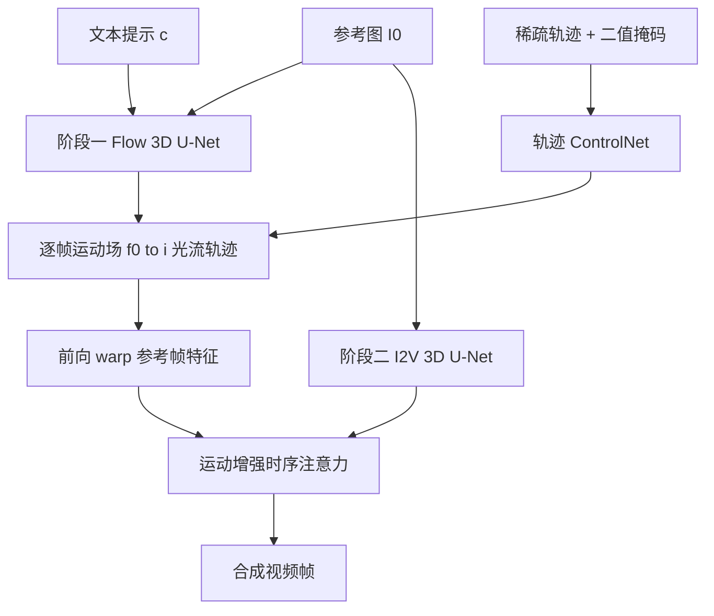

## 一句话总结

Motion-I2V 把图像到视频生成拆成「显式运动建模」两阶段：第一阶段用扩散模型从参考图与文本预测逐像素运动场（光流轨迹），第二阶段用运动增强的时序注意力按预测轨迹把参考图特征传播到各帧，从而在大幅度运动与视角变化下仍保持一致性，并借助稀疏轨迹 ControlNet、运动笔刷与零样本视频到视频翻译提供精细可控性。

## 研究背景

图像到视频生成（I2V）的目标是把一张静态图动画化为具有自然动态的视频片段，同时保持视觉外观，在影视、增强现实、广告与社交媒体内容创作中应用广泛。传统 I2V 方法多聚焦于特定类别（如人体头发、流体、人脸肖像），难以推广到开放域场景。

近年来在网络规模图像数据上训练的扩散模型带来了高质量、多样的图像生成能力，研究者随之给文本到图像模型加上一维时序注意力模块以构建视频基础模型。但 I2V 比静态图像生成更难：它需要建模复杂的时空先验，而一维时序注意力的时间感受野狭窄，难以在大幅度运动下保证时序一致性。另一个短板是可控性有限——这些模型主要依赖参考图与文本作为条件，缺乏对生成运动的精确甚至交互式控制，与图像编辑领域已成熟的拖拽式、区域式控制形成鲜明对比。

作者由此提出 Motion-I2V，把运动建模与视频细节生成解耦：不直接学习复杂的图到视频映射，而是先显式预测运动，再据此渲染，从而缓解仅靠一维时序注意力学习复杂时空模式的压力。

## 方法

整体框架：把 I2V 拆分为两阶段。第一阶段是基于扩散模型的运动场预测器，以参考图 $$I_0$$ 与文本 $$c$$ 为条件，预测参考帧与每个未来帧之间的运动场；第二阶段以第一阶段预测的运动场为指引，用运动增强时序注意力把参考帧内容传播到合成帧。

关键设计：

- 运动场建模：第一阶段的预测目标是一组二维位移图 $$\lbrace f_{0\to i}\mid i=1,\dots,N\rbrace$$，其中 $$f_{0\to i}\in\mathbb{R}^{2\times H\times W}$$ 是参考帧与第 $$i$$ 帧之间的光流。对参考图中任一源像素 $$p$$，可直接得到其在第 $$i$$ 帧的对应坐标 $$p'_i=p+f_{0\to i}(p)$$。训练时用 FlowFormer++ 与 DOT 分别估计光流与多帧轨迹作为真值。

- 三步微调训练运动预测器：先微调预训练 LDM，让其在参考图与文本条件下预测单张位移场；再冻结该 LDM 并插入一维时序模块构成 VLDM，联合去噪整段运动场序列以学习时序运动分布；最后整体微调得到最终运动场预测器。运动场经光流 VAE 编码到潜空间，并把干净参考图的潜码沿通道维拼接以支持图像条件；帧间隔 $$i$$ 经两层 MLP 嵌入后加到时间嵌入上，作为运动强度条件。基底采用 Stable Diffusion 1.5。

- 运动增强时序注意力：第二阶段增强朴素 VLDM 的一维时序注意力。对某层特征，用参考帧特征 $$z[0]$$ 按每个运动场做前向 warp
$$z[i]'=\mathcal{W}(z[0], f_{0\to i})$$
再把 warp 后的特征与原始特征沿时间维交错拼成增强特征 $$z_{\text{aug}}=[z[0],z[1]',z[1],\dots,z[N]',z[N]]$$。随后把空间维移到 batch 轴当作一维 token，做时序注意力
$$z''=\text{Attention}(Q,K,V)=\text{Softmax}(QK^{T})V$$
其中 $$Q=W^{Q}z'$$ 来自原始特征，$$K=W^{K}z'_{\text{aug}}$$ 与 $$V=W^{V}z'_{\text{aug}}$$ 来自增强特征，即 warp 特征仅作键值。并对 $$z$$ 与 $$z_{\text{aug}}$$ 加正弦位置编码以感知交错特征的时序次序。此操作在预测运动场的指引下扩大了时序模块的感受野。基底采用 AnimateDiff v2。

- 选择性加噪：去噪每一步都把干净参考图的潜码 $$z_{\text{ref}}$$ 沿时间轴与其他含噪潜码拼接，保证参考图内容被忠实保留。

- 精细可控性：训练一个轨迹 ControlNet，克隆第一阶段 3D-UNet 的下采样与中间块作为可训练分支，用零初始化卷积接入冻结主干，额外接收稀疏位移场 $$f_{\text{sparse}}$$ 与二值掩码 $$m$$，把稀疏轨迹补全为稠密光流，实现稀疏轨迹引导 I2V。把 $$f_{\text{sparse}}$$ 置零、仅用掩码指定动画区域即得到运动笔刷式的区域可控生成。第二阶段还天然支持零样本视频到视频翻译：先用图到图工具转换首帧风格，再用现成稠密点追踪器提取源视频位移场来驱动转换后的首帧。

## 实验结果

基底为 Stage 1 的 SD v1.5 与 Stage 2 的 AnimateDiff v2，均在 WebVid-10M 上训练，随机采样步长 8 的 16 帧片段，32 张 A100 训练。评测集自建 80 张来自 Pixabay 的免版权图，覆盖人类活动、动物、车辆、自然场景与 AI 生成图，用 ChatGPT-4V 生成提示；以 CLIP 图文 logits 衡量提示一致性、相邻帧 CLIP 余弦相似度衡量时序一致性，并估计首帧与后续帧光流衡量运动幅度。

| 方法 | 提示一致性↑ | 帧一致性↑ | 平均位移 |
| --- | --- | --- | --- |
| VideoComposer | 32.62 | 0.9393 | 67.15 |
| I2VGen-XL | 33.69 | 0.9650 | 17.70 |
| DynamiCrafter | 34.60 | 0.9860 | 3.31 |
| Ours | 34.86 | 0.9871 | 20.06 |

Motion-I2V 在提示跟随与时序一致性上均最好，同时能生成相对较大的运动。消融实验对比了关键设计：

| 阶段一 | 融合方式 | 提示一致性↑ | 帧一致性↑ | 平均位移 |
| --- | --- | --- | --- | --- |
| 无 | - | 32.95 | 0.9505 | 66.44 |
| 有 | 相加 | 33.99 | 0.9542 | 48.91 |
| 有 | 注意力 | 34.86 | 0.9871 | 20.06 |

去掉第一阶段、仅靠一维时序模块学习时序依赖时，推理不稳定、易生成崩坏结果，对应极低一致性与异常大的运动；加入第一阶段但简单地把 warp 特征直接相加，能稳定预测、提升一致性；进一步改用注意力自适应注入 warp 特征，得到一致性最高、且能避免极端畸变的最终模型。

## 亮点与局限

亮点：以「显式运动建模」把运动预测与视频渲染解耦，是应对大幅度运动时序一致性的关键——先用扩散模型预测逐像素光流轨迹，再用运动增强时序注意力按轨迹 warp 参考特征，等于给狭窄的一维时序注意力提供了动态、可控的时间感受野；充分复用预训练模型先验（SD 1.5、AnimateDiff、ControlNet），并让运动场这一显式中间表示自然承接稀疏轨迹补全、运动笔刷区域控制与零样本视频到视频翻译等多种可控能力；在提示一致性与帧一致性上均超过 VideoComposer、I2VGen-XL、DynamiCrafter 等开源方法。

局限：作者观察到方法倾向于生成中等亮度的视频，这与噪声调度未强制最后时间步达到零信噪比有关，制约了明暗对比的表现范围。

## 延伸思考

Motion-I2V 最值得借鉴的是「显式中间表示」的解耦思路：把难以端到端学习的复杂时空映射，拆成一个可解释、可编辑的运动场，再让渲染阶段围绕它展开。这不仅缓解了一维时序注意力感受野狭窄的老问题，更把「可控性」从事后技巧变成了框架内生的能力——因为运动一旦被显式表示为光流轨迹，稀疏轨迹、区域掩码、源视频点追踪都能自然地作为条件接入同一个中间层，而无需为每种控制单独设计模型。这种「以显式物理量作为生成枢纽」的范式，对相机运动控制、深度/法线引导生成乃至更一般的时空条件生成任务都有参考价值。另一方面，中间表示的质量会成为上限：运动场预测本身依赖光流与点追踪真值的准确度，且两阶段误差可能累积，如何联合优化或引入更鲁棒的运动先验，是这一路线值得继续探索的方向。
