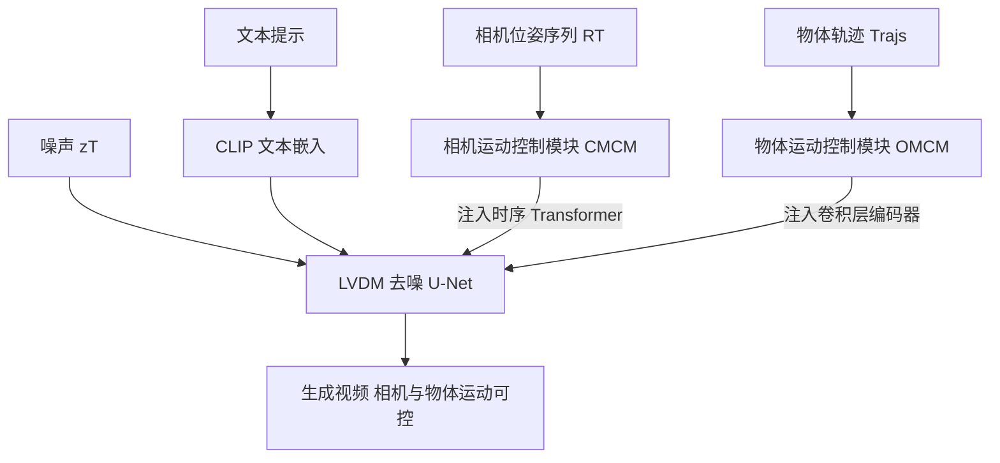

## 一句话总结

MotionCtrl 在预训练视频扩散模型上分别挂载相机运动控制模块与物体运动控制模块，用相机位姿序列驱动全局运动、用轨迹驱动局部物体运动，从而在同一个模型里独立且可组合地控制相机与物体两类运动，实现细粒度、可泛化的可控视频生成。

## 研究背景

视频不同于图像，需要在一连串帧之间生成连贯流畅的运动，因此运动控制是文本到视频生成的关键环节，却长期研究不足。视频中的运动主要分两类：相机移动带来的全局运动（相机运动）与物体移动带来的局部运动（物体运动）。已有方法要么只聚焦其中一类，要么不区分二者：AnimateDiff、Gen-2、PikaLab 主要用独立的 LoRA 模型或额外相机参数触发相机运动；VideoComposer 与 DragNUWA 则用同一种条件（运动矢量或轨迹）同时表示两类运动。由于缺乏对相机与物体运动的清晰解耦，这些方法难以做到细粒度且多样的运动控制。

构建统一控制器面临两大挑战。其一，相机运动与物体运动在移动范围和模式上差异很大：相机运动是整个场景随时间的全局变换，通常用一串相机位姿表示；物体运动则是场景中特定物体的局部位移，通常用一簇像素的轨迹表示。其二，没有现成数据集能同时包含视频片段的文本描述、相机位姿与物体运动轨迹三种完整标注，从头构建这样的数据集代价高昂。

## 方法

整体框架：MotionCtrl 以隐空间视频扩散模型 LVDM（VideoCrafter1）为骨干，在其去噪 U-Net 上扩展两个适配器式模块——相机运动控制模块（CMCM）与物体运动控制模块（OMCM）。考虑到相机运动的全局性与物体运动的局部性，CMCM 与 LVDM 的时序 Transformer 交互，OMCM 则与卷积层在空间上协作。通过多步训练策略，用两个各自增强的数据集分别训练两个模块，规避了缺乏统一综合数据集的难题。

关键设计：

- 相机运动控制模块（CMCM）：由若干全连接层构成的轻量模块。因为相机运动是帧间的全局变换，CMCM 与时序 Transformer 协作，且只介入其中第二个自注意力模块以尽量少影响生成质量。相机位姿用 $$3\times 3$$ 旋转矩阵与 $$3\times 1$$ 平移矩阵表示，拼成 $$RT\in\mathbb{R}^{L\times 12}$$（$$L$$ 为视频长度）。$$RT$$ 被扩展到 $$H\times W\times L\times 12$$，与第一个自注意力模块的输出 $$y_t\in\mathbb{R}^{H\times W\times L\times C}$$ 在最后一维拼接后，经全连接层投影回原尺寸，再送入第二个自注意力模块。

- 物体运动控制模块（OMCM）：轨迹表示为一串空间位置，为显式暴露物体移动速度，改用相邻帧位移表示
$$u(x_i,y_i)=x_i-x_{i-1},\quad v(x_i,y_i)=y_i-y_{i-1},\quad 0<i<L$$
未被轨迹经过的位置记为 $$(0,0)$$，最终 $$Trajs\in\mathbb{R}^{L\times\hat H\times\hat W\times 2}$$。OMCM 由多个卷积层加下采样构成，从 $$Trajs$$ 提取多尺度特征并加到 LVDM 卷积层的输入上。借鉴 T2I-Adapter，轨迹只施加于去噪 U-Net 的编码器，以在生成质量与运动控制能力之间取得平衡。

- 多步训练与数据构造：CMCM 只需带文本与相机位姿标注的数据，采用 Realestate10K（六万余段视频、相机位姿标注较干净），并用 Blip2 为其补生成文本。由于冻结 LVDM 大部分参数、仅训练新增 MLP 与第二个自注意力模块，Realestate10K 场景多样性有限的问题几乎不影响生成质量。OMCM 需要带文本与物体轨迹的数据，用 ParticleSfM 的运动分割模块为 WebVid 约 243000 段视频合成动态物体轨迹。为避免用户提供稠密轨迹的不便，OMCM 用从稠密轨迹中随机选取的 $$n\in[1,N]$$ 条稀疏轨迹训练（最大轨迹数 $$N=8$$），并对稀疏轨迹施加高斯滤波缓解过于分散的问题，先用稠密轨迹训练、再用稀疏轨迹微调。训练 OMCM 时 LVDM 与 CMCM 均冻结。

## 实验结果

骨干在 $$256\times 256$$、16 帧序列上训练。评测涵盖相机运动（基础位姿与相对复杂位姿）与物体运动（283 个手工轨迹与提示样本）。质量指标用 FID、FVD、CLIPSIM，运动控制精度用预测与真值之间的欧氏距离，分别记为 CamMC（相机）与 ObjMC（物体），预测视频的位姿与轨迹由 ParticleSfM 提取。与 AnimateDiff、VideoComposer 的对比如下：

| 指标 | AnimateDiff | VideoComposer | MotionCtrl |
| --- | --- | --- | --- |
| CamMC↓（基础位姿） | 0.0548 | - | 0.0289 |
| CamMC↓（复杂位姿） | - | 0.0950 | 0.0735 |
| ObjMC↓ | - | 36.8351 | 28.877 |
| CLIPSIM↑ | 0.2144 | 0.2214 | 0.2319 |
| FID↓ | 157.73 | 130.97 | 124.09 |
| FVD↓ | 1815.88 | 1004.99 | 852.15 |

MotionCtrl 在相机与物体运动控制精度上均优于两个对比方法，同时在文本相似度与视频质量上也更好。消融实验表明，把相机位姿融进时间嵌入、空间交叉注意力或空间自注意力都无法赋予相机控制能力（CamMC 接近原始 LVDM 的 0.9010），因为这些组件主要负责空间内容生成、对相机运动不敏感；只有把 CMCM 接入时序 Transformer 才能把 CamMC 降到 0.0289 并保持视频质量，这与相机运动主要引起随时间的全局视角变换的性质一致。

## 亮点与局限

亮点：以「相机位姿驱动全局运动 + 稀疏轨迹驱动局部物体运动」把两类运动清晰解耦，可独立控制也可自由组合；两个控制模块均为适配器式，冻结骨干、分别用各自增强的数据集训练，巧妙绕开了缺乏三重标注综合数据集的难题；运动条件（位姿与轨迹）是无外观信息的，几乎不影响生成物体的外观与形状，避免了 VideoComposer 稠密运动矢量误捕物体轮廓导致的失真；一次训练即可泛化到多种相机移动与轨迹，无需针对每种运动单独微调，并可迁移到 AnimateDiff 等结构相近的生成模型。

局限：相机位姿控制依赖 Realestate10K，其场景以房产视频为主、多样性有限；物体轨迹来自 ParticleSfM 的自动合成，质量受运动分割算法约束；模型在 $$256\times 256$$、16 帧的较低分辨率与较短时长上验证，长视频与高分辨率下的表现仍待检验；轨迹只施加于 U-Net 编码器是质量与控制力的折中，暗示更精细的物体控制仍有提升空间。

## 延伸思考

MotionCtrl 最值得借鉴的是「按运动的物理性质对齐注入位置」的思路：相机运动是全局的、随时间演化的，就注入时序模块；物体运动是局部的、空间定位的，就注入卷积层。消融里把相机条件塞进空间注意力几乎无效，恰恰说明控制信号该注入哪里不是随意的，而应与被控量的本质结构匹配，这对其他可控生成任务的条件设计有普适启示。另一个务实亮点是用适配器式模块 + 分数据集分步训练，把「需要一个不存在的综合标注数据集」拆解为「多个已有数据集各管一件事」，既降低数据成本又保持骨干能力。这种「解耦条件、分而治之、冻结骨干搭便车」的范式，对在大型预训练生成模型上叠加多种可控能力是一条可复用的工程路线。
