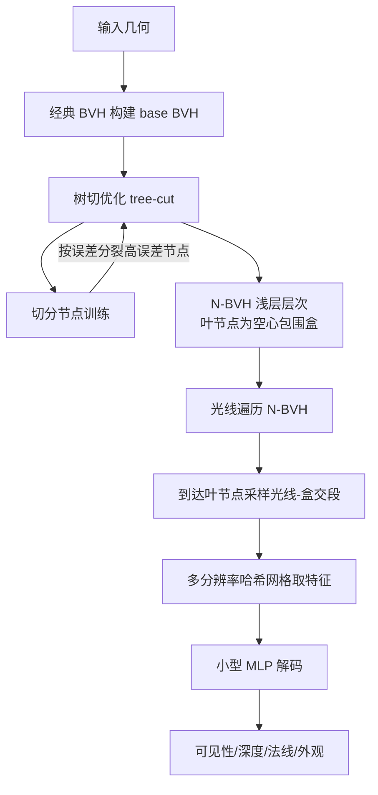

## 一句话总结

N-BVH 把一个多分辨率哈希网格神经模型嵌入到浅层包围盒层次结构中，用光线查询（可见性、深度、法线、外观）替代原始三角形几何，在无缝接入标准路径追踪管线的同时，对所表示的几何实现一个数量级以上的压缩。

## 研究背景

物理级渲染引擎的核心操作是光线追踪，而复杂场景中海量的多边形、纹理以及为加速求交而构建的层次结构，会带来沉重的显存开销，在 GPU 有限的空间上难以管理。

神经表示在压缩复杂信号方面表现突出，但已有方法大多针对点查询设计（例如评估以有向距离场表示的形状），难以直接嵌入以光线求交为基本操作的渲染管线。作者的关键观察是：只要训练样本落在感兴趣信号的近旁，任何神经压缩模型都能被高效优化。在渲染场景中，感兴趣的信号就是三维表面，而它们通常已经被组织在包围盒层次结构（BVH）中用于加速求交。由此，作者提出把先进的神经数据结构嵌入 BVH，得到面向光线查询的 Neural BVH（N-BVH）。

## 方法

整体框架：用一个覆盖整个几何的全局神经模型来回答光线求交查询，并用一个浅层 BVH 提供近表面的高效训练与推理。BVH 在训练时充当"探针机器"，仅在表面附近生成"光线查询/响应"训练对；在渲染时则继承传统 BVH 的空区跳过与前后向遍历特性，到达叶节点时触发一次神经查询，避免了完整深层 BVH 的遍历与存储。

关键设计：

- 光线查询编码：最朴素的做法是用光线进出包围盒的两点参数化查询，但这些编码点离真实交点太远，导致模糊与精度损失。作者转而在光线与盒的相交区间内做分层点采样，在每个采样点从多分辨率哈希网格收集特征，将拼接后的特征向量（拼接顺序编码了光线方向）送入一个小型 MLP 解码出结果。只要采样点中有一个落在表面附近即可获得高质量重建；实践中每节点固定采样三个点在推理速度与质量间取得较好平衡。

- 误差驱动的 N-BVH 构建：不从头构建层次，而是复用现成的输入几何 BVH（base BVH），把任务简化为在其中寻找一个"树切"。构建自顶向下交替进行"模型训练"与"节点分裂"：每步先在当前切上的节点内训练模型若干次，再分裂误差最大的节点，直至达到目标节点数。节点误差取训练损失 $$q$$ 与随机光线命中概率 $$p$$ 的乘积，并用对数阻尼的排序启发式 $$r = 2\log q + \log p$$ 来避免对大而低损失的节点过度分裂。

- 训练与损失：可见性作为二分类问题用 sigmoid 加二元交叉熵损失；交点位置采用相对节点范围的局部一维距离并用 $$L_1$$ 损失（一维信号比三维更易学习）；外观 albedo 用相对 $$L_2$$ 损失，法线用 $$L_1$$ 损失。混合管线的组合损失为 $$L = 2L_{\text{visibility}} + 2L_{\text{distance}} + L_{\text{normal}} + L_{\text{albedo}}$$，对可见性与距离加权更高以获得更好的几何重建。

- 细节层次（LoD）：在构建时定义多个 base BVH 树切，每个对应一个 LoD；由于分裂调度让树切节点数呈指数增长，在固定训练迭代间隔注册新 LoD，得到 LoD 之间近似线性的深度增长，训练时随机选取一个树切进行训练。

- 实现：基于纯软件 CUDA 波前路径追踪器，使用 tiny-cuda-nn 半精度；MLP 含 4 个隐藏层、每层 64 神经元；哈希网格 8 层、基分辨率 $$8^3$$ 到最大 $$1024^3$$、每层 4 个特征。混合渲染采用两级结构（TLAS 下挂多个 BLAS），每个 BLAS 可以是经典 BVH 或 N-BVH，二者产出同类型的交点数据。

## 实验结果

在混合路径追踪的六个场景上与经典 CUDA 路径追踪器对比。作者刻意选取最复杂的资产做神经表示。下表为忠实摘录（•◦ 与 •◦ 为两种不同节点数/质量权衡的配置，FLIP 为误差，越低越好）：

| 场景 | 经典 PT 时间/显存 | 混合配置 A 时间/显存/FLIP | 混合配置 B 时间/显存/FLIP |
| --- | --- | --- | --- |
| Chess | 6.6 ms / 329 MB | 10 ms / 36 MB / 0.057 | 19 ms / 37 MB / 0.019 |
| Bonzai | 28 ms / 853 MB | 29 ms / 181 MB / 0.069 | 102 ms / 186 MB / 0.023 |
| Exhibition | 13 ms / 2.69 GB | 14 ms / 181 MB / 0.027 | 34 ms / 182 MB / 0.010 |
| Andalusian Room | 28 ms / 309 MB | 31 ms / 108 MB / 0.088 | 55 ms / 109 MB / 0.055 |
| City Block | 24 ms / 1.55 GB | 22 ms / 180 MB / 0.039 | 80 ms / 185 MB / 0.014 |
| Statuette | 4.9 ms / 642 MB | 3.7 ms / 10.8 MB / 0.020 | 12 ms / 11.2 MB / 0.007 |

整体渲染时间约为经典路径追踪的 2 至 4 倍，但显存大幅下降，使得原本无法上传到低端 GPU 的复杂场景得以渲染。仅就神经表示的几何部分，压缩率可超过 1000 倍；就整个场景则为 5 至 100 倍。重建质量与性能主要与 N-BVH 节点数相关，对哈希网格大小的敏感度较低；整套管线训练仅需几分钟。

在神经外观预滤波应用中，作者用 N-BVH 替换 Weier 等人（2023）方法中的稀疏体素可见性网格，保留其外观网络。结果在结构化与非结构化几何上均取得相当或更优的重建质量，同时训练更快、显存更低（例如 Bay Cedar 场景训练从约 11 分钟降至约 3.5 分钟），渲染约 2 倍加速。

## 亮点与局限

亮点：

- 从"点查询"转向"光线查询"的神经压缩范式，天然契合标准光线追踪管线，可与经典 BVH 在同一场景中混合、重叠使用。
- 复用现成 base BVH 做误差驱动的树切优化，无需显式访问几何，自动在难学区域加深、易学区域变浅，对输入网格的实际细分密度不敏感。
- 支持可见性、深度、法线、外观等多信号，并自带简单的多尺度 LoD 方案；训练仅数分钟，压缩率高。
- 相比边折叠、聚类等专用几何简化方法，在同等显存下对复杂场景中多样信号更鲁棒。

局限：

- 假设神经节点内几何的凸性（或凹性）以保证求交估计正确，节点数很低时可能造成二次光线原点的错误偏移（但随树加深该问题趋于消失，实测中即使 1.2k 节点也未出现）。
- 每节点固定采样点数是一个约束，缺乏按难度自适应的采样。
- 渲染速度仍不及原生路径追踪；且当前无法压缩动态几何，朴素方案需每帧重训。

## 延伸思考

作者仅凭光线查询结果拟合表示，因此该方法原则上适用于任何"可被求交"的表面表示，并能继承 BVH 结构未来的改进。一个值得关注的方向是把 N-BVH 落到硬件光追上，实现"边遍历树、边即时推理"的融合算子，避免每次推理的上下文切换开销。此外，如何将神经光线查询扩展到动态内容，是把该范式推向实时交互与生产管线的关键一步。
