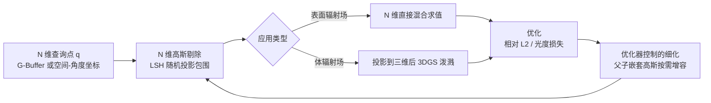

## 一句话总结

把高斯泼溅从三维推广到任意 $N$ 维，用 Cholesky 分解无约束参数化协方差、用受局部敏感哈希（LSH）启发的高维剔除加速训练与推理、再用优化器控制的父子嵌套细化自适应增容，从而首次以紧凑的显式表示在几分钟内拟合依赖位置、方向、材质、光照等多维输入的高维各向异性函数，并做到毫秒级渲染。

## 研究背景

近年计算机图形学涌现大量基于优化的重建与表示方法（NeRF、哈希网格、3D 高斯泼溅等）。相比把全部信息隐式塞进网络权重的纯神经方法，混合式与显式表示因为把可学习参数直接绑定到某些输入维度、从而能按需访问数据，往往在质量与效率上更优。

但这类显式表示大多为低维、频率结构清晰的域（空间或可分离的空间-角度域）设计，难以扩展到更高维度。而现实图形问题常需要处理高维输入：例如同时考虑材质属性、光照条件、时间变化下的高质量外观。作者要解决的正是把显式表示扩展到高维时的两个核心困难：

- 当混合分量数量增大、且每个分量都是高维各向异性分布时，如何恢复训练与评估的效率。
- 在事先不知道域相关的维度依赖或维度间相关性的情况下，如何自适应地细化表示以保持紧凑又高质量。

作者选择 $N$ 维高斯混合模型（GMM）作为目标表示，因为高斯能很好地拟合高维数据的强各向异性分布，且延续了 3D 高斯泼溅显式、可从稀疏点优化的优点。

## 方法

### 整体框架

输入是一批 $N$ 维查询点（由 G-Buffer 各通道或空间-角度坐标拼成），经高维剔除筛掉无关高斯，再对保留的高斯做混合求值（表面辐射场直接在 $N$ 维评估，体辐射场先投影到三维再泼溅），优化过程同时由父子嵌套的细化机制控制新高斯的引入。

### 关键设计

无约束 $N$ 维参数化。每个分量由均值 $\mathbf{m}\in\mathbb{R}^N$ 与完整协方差 $V\in\mathbb{R}^{N^2}$ 描述：

$$G_V(\mathbf{x}-\mathbf{m}) = e^{-\frac{1}{2}(\mathbf{x}-\mathbf{m})^{T}V^{-1}(\mathbf{x}-\mathbf{m})}$$

3D 高斯泼溅所用的"尺度加旋转"参数化在高维下不好用，因为旋转越来越难描述。作者改用 Cholesky 分解 $V = LL^{T}$，直接优化下三角矩阵 $L$：对角元用指数激活 $L_{[i,i]}(x)=e^{x}$ 保证正定并稳定训练，非对角元用 $L_{[i,j]}(x)=2\cdot\mathrm{sigmoid}(x)-1$ 约束在 $\lbrack -1,1\rbrack$。$L$ 在酉变换意义下唯一地把标准正态映射到目标高斯，天然适合后面细化时的层级变换。

高维剔除。为避免对每个查询点评估全部高斯，作者借鉴 LSH：向高维空间中 $k$ 个随机单位向量 $\mathbf{r}$ 投影，把查询点、均值、协方差分别投影为 $q_r=\mathbf{q}^{T}\mathbf{r}$、$m_r=\mathbf{m}^{T}\mathbf{r}$、$\sigma_r^2=\mathbf{r}^{T}V\mathbf{r}$，若查询投影落在 $3\sigma$ 置信区间外即安全剔除：

$$\lvert q_r - m_r\rvert < 3\sigma_r$$

为控制成本，剔除按 $16\times 16$ 像素分块进行，用块的空间范围包围查询点，保证保守性（绝不误删本应求值的高斯）。

优化器控制的细化。高维参考数据稀疏，基于统计估计的显式分裂/合并启发式越来越不可靠。作者不做显式细分，而是让每个高斯默认携带一个"子高斯"：子高斯 $G_{V_c}$ 在父高斯的参考系里用相对参数 $U$、$\mathbf{m}_u$ 定义，初始贡献极小且铺满父高斯，并自动继承父的更新：

$$V_c = LU(LU)^{T},\qquad V_p = LL^{T}$$

$$\mathbf{m}_c = L\mathbf{m}_u + \mathbf{m}_p$$

只有当父高斯无法表达的细节确有需要时，优化器才会抬高子高斯的不透明度/亮度；越过阈值后子高斯被"物化"为独立分量，父子各自再分配一个新的默认子高斯。由于子协方差同样用局部下三角矩阵 $U$ 参数化、两个下三角矩阵之积仍是下三角，物化后的子高斯依旧保持该参数化。这种父子依赖是关键：否则子高斯会漂到父外被冗余使用。整个流程分阶段进行（约每 300 次迭代细化一次），物化阈值（不透明度取 $0.1$、亮度取 $0.01$）直接对应期望输出，是直观的超参，且因不做显式扰动而避免了损失突刺与域相关调参。

两类应用。其一是可变合成场景的全局光照着色：几何与材质经 G-Buffer 给出，位置 $xyz$、视方向、反照率 $rgb$、粗糙度等构成 10 维输入，再拼接可变维度（如物体位置、光源位置，按各自范围归一化）；此时高斯无不透明度，参数 $\alpha$ 控制颜色 $c$ 的亮度，某点颜色为各高斯加权和 $c(\mathbf{x})=\sum_k G_{V_k}(\mathbf{x}-\mathbf{m}_k)\alpha_k c_k$，用相对 L2 损失训练。其二是含强视相关效果的真实场景新视角合成：仅改渲染步骤，把 $N$ 维高斯投影到三维再用 3DGS 泼溅，用 SfM 点初始化并丢弃低不透明度高斯，无需 3DGS 那样周期性重置不透明度。

## 实验结果

在合成着色场景上，本文方法优于隐式的 Pixel Generator（大网络需数十小时才收敛，相近训练时长下仅得到模糊结果）与哈希网格加浅层 MLP 解码器（无法处理额外 7 维输入下的哈希冲突）。在真实高各向异性反射场景的新视角合成上，本文方法在相近训练时长（约 21～23 分钟）下的 PSNR 优于 3DGS 与 Instant NGP，并用约半小时达到与 NeX 相当的平均 PSNR，而 NeX 需数十小时且高分辨率下超出 24 GB 显存。

高维剔除的消融最能体现效率收益（推理时每块覆盖面积小，可丢弃大比例高斯）：

| LSH 阈值 | 平均求值数 | 推理时间（ms） |
|----------|-----------|---------------|
| Brute Force（无剔除） | 7856.0 | 245 |
| $3\sigma$（本文） | 1984.89 | 131 |

阈值取得比 $3\sigma$ 更激进时，平均求值数与推理时间进一步下降，但会因误删原本有贡献的高斯而出现块状伪影，故 $3\sigma$ 是质量与速度的折中。

## 亮点与局限

亮点：

- 把显式高斯表示从低维推广到任意 $N$ 维，首次在紧凑显式表示下处理超越"位置加视角"的多维外观（材质、光照、时间等），几分钟拟合、毫秒渲染。
- Cholesky 无约束参数化巧妙回避了高维旋转难以描述的问题，并保持正定与层级变换友好。
- 受 LSH 启发的分块高维剔除保守且高效，推理端可丢弃大比例分量；优化器控制的父子细化无需域相关启发式，避免损失突刺，超参直观。

局限：

- 与任何拟合参考数据的表示一样存在过拟合与走样，且随变量数增多而加剧，需要相应增大训练样本；真实 360 度数据分布更难，可能需专门调参。
- 朴素 GMM 参数化下每个分量存储成本随维度平方增长，更稀疏的参数化（如牺牲维度间完整自适应换取少数主成分轴）留待未来。
- 高斯混合对不连续边界的表达存在尺度相关的锐度问题（ReLU 类隐式模型更擅长真正的不连续边界）。
- 时间维求值本质是对静态高维高斯混合的切片，尚未隐式解决相干运动物体的对应关系。

## 延伸思考

这篇工作把 3D 高斯泼溅的"显式、局部、可优化"三大优点抽象为一种通用的高维函数拟合器，核心洞见是显式表示的参数影响具有局部性——这不仅利于剔除与效率，也天然支持把存储容量按需分配到域的不同部分，为向更大输入域自适应扩展提供了良好基础。与之相对，隐式神经表示常把固定容量分配给域的固定部分。两条路线最终都要面对高维输入下的大规模剔除问题（如层级化方案）。把外观建模显式地表达为维度间各向异性关系（如位置与视方向的耦合让反射随相机在世界空间中真实移动），也提示了一条与"堆更大网络"不同的、以基元结构承载高频与相关性的路径。
