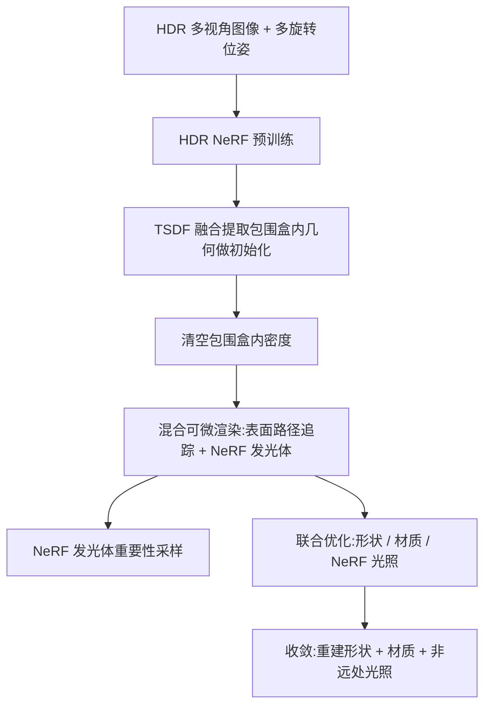

## 一句话总结

本文用神经辐射场（NeRF）替代传统环境贴图，作为一个「非远处」的环境光源接入基于物理的反演渲染管线，从而准确建模空间变化（近距离、带视差）的真实光照，提升形状、材质与光照的联合重建质量。

## 研究背景

基于物理的反演渲染（physics-based inverse rendering）通过「分析即合成」，从 2D 图像联合优化物体的形状、材质与光照。要获得准确重建，光照模型必须尽量贴近真实拍摄环境。

现有方法在以物体为中心的采集场景下，通常只对目标物体建模形状与材质，而把周围环境近似为「远处环境光」，其中环境贴图（environment map）是最常用的表示。但环境贴图基于「光照无限远」的假设，认为入射辐射的分布在空间上不变。

当光源并非无限远时（例如物体旁边放一盏灯），光照会呈现明显视差效应：物体表面不同位置接收到的光来自不同方向、强度也不同。此时空间不变的光照模型会失真，导致重建结果出现阴影错位、高光不匹配、反射被「烘焙」进材质等伪影，进而影响重光照与形状重建。

作者观察到 NeRF 天然适合表示真实且空间变化的光照：环境贴图本质上是无限远处的 2D 辐射场，而 NeRF 是存在于 3D 非远处体密度中的辐射场；把着色点的移动类比为视点的移动，即可在物体表面任意着色点合成 3D 一致的入射辐射。因此本文提出把 NeRF 作为非远处环境光源接入反演渲染。

## 方法

### 整体框架

采用「表面 + NeRF」的混合场景表示：用户放置一个包围盒，盒内区域用表面与材质表示（目标物体），盒外区域用 NeRF 表示环境光照。渲染时把标准的表面渲染方程推广为同时考虑表面与 NeRF 的形式。

入射辐射被拆为表面贡献与 NeRF 贡献之和：

$$L_i(\mathbf{p}, \omega) = L_i'^{s}(\mathbf{p}, \omega) + L_i'^{v}(\mathbf{p}, \omega)$$

表面贡献遵循表面光传输，并额外考虑 NeRF 的遮挡透射率：

$$L_i'^{s}(\mathbf{p}, \omega) = T(\mathbf{p}, \omega, t_0)\, L_o(\mathbf{r}(\mathbf{p}, \omega, t_0), -\omega)$$

NeRF 贡献类似体渲染方程，但包围盒内密度为零，且积分上限取到第一个表面交点 $t_0$（无交点时取 $\infty$）：

$$L_i'^{v}(\mathbf{p}, \omega) = \int_{0}^{t_0} T(\mathbf{p}, \omega, t)\, \sigma(\mathbf{r}(\mathbf{p}, \omega, t))\, \mathbf{c}(\mathbf{r}(\mathbf{p}, \omega, t), -\omega)\, dt$$

当光路最终离开包围盒射向无穷远时，就查询 NeRF 计算环境入射辐射，行为等价于常规光源。由于包围盒内密度恒为零且盒为凸形，一条光路最多只需对进入或离开包围盒的两条射线计算 NeRF，大幅降低开销。

### 关键设计

- 物理正确性与简化：NeRF 本质是辐射场，适合表示场景中的「辐射」这一物理量。它把包围盒外的互反射简化为「发光」，但保留盒内的光路，因此虽无法建模重建后编辑场景带来的光照变化，却能有效建模采集阶段的互反射，适用于反演渲染。为缓解歧义，实验中约束包围盒内自发光为零（可选，要求发光体位于盒外）。

- NeRF 发光体重要性采样：NeRF 是无固定拓扑的体光源，直接采样困难。作者用简单几何基元近似 NeRF 中辐射贡献显著的区域：
  1. 从包围盒内随机发射射线，记录对渲染辐射贡献最大的深度 $t_{\max}$，在该处向点云添加带权样本；
  2. 借鉴 MIS 补偿，减去平均权重、只保留正权重样本，使其聚焦于极亮区域并配合 BSDF 采样保持无偏；再把点云聚类为 $M = 64$ 个各向同性高斯；
  3. 在着色点处把高斯投影为 von Mises–Fisher 分布做方向采样。随 NeRF 参数在联合优化中更新，周期性重建该高斯混合模型。

  投影关系为：

  $$\hat{\mu}_i = \frac{\mu_i - \mathbf{p}}{\lVert \mu_i - \mathbf{p} \rVert_2}, \quad \hat{\kappa}_i = \frac{\kappa_i}{\lVert \mu_i - \mathbf{p} \rVert^2}, \quad \hat{\lambda}_i = \lambda_i$$

- 可微混合渲染：需计算 NeRF 辐射对射线起点 $\mathbf{p}$ 的梯度 $\partial_{\mathbf{p}} L_i$（用于优化形状），通过自动微分获得。对体渲染方程求导会产生因上限 $t_0$ 依赖形状而来的边界项，但由于密度在包围盒边界连续趋零、盒内为零，该边界项恒为零，从而避免了体渲染中棘手的可见性不连续问题。

- 多阶段优化：先做常规 NeRF 训练初始化场景，用 TSDF 融合提取盒内几何初始化物体形状并清空盒内密度，最后经反演渲染联合优化直至收敛。

- 系统实现：结合 NeRFStudio 与 Mitsuba 3。NeRF 部分在 PyTorch 计算，重要性采样在 Dr.Jit 中执行；用单样本 MIS 让一批光路的发光体查询同时进行，把渲染拆成两个 megakernel，中间夹入神经网络计算。为省显存不存计算图而在反传时重算，并开发多 GPU 系统分发 NeRF 查询。NeRF 基于 nerfacto，输出用指数激活以表示 HDR 辐射。

## 实验结果

采集了含非远处光照的真实数据（四个样本，各四个旋转位姿，每位姿 50~80 张 HDR 多视角图，用扫描仪获取真值几何），并用 Mitsuba 3 合成对应数据。基线为在同一可微 SDF 框架上使用环境贴图发光体的方法，唯一差异在于光源模型。合成数据集上的定量对比：

| 方法 | 新视角 PSNR↑ | 新视角 SSIM↑ | 新视角 LPIPS↓ | 重光照 PSNR↑ | 重光照 SSIM↑ | 重光照 LPIPS↓ | 形状 CD↓ |
| --- | --- | --- | --- | --- | --- | --- | --- |
| 本文 | 30.70 | 0.97 | 0.019 | 27.99 | 0.96 | 0.040 | $8.35 \times 10^{-6}$ |
| 环境贴图 | 22.41 | 0.95 | 0.054 | 21.32 | 0.92 | 0.088 | $1.20 \times 10^{-4}$ |

本文方法在新视角合成、重光照与形状重建上全面优于环境贴图基线。定性上，基线在阴影边界、高光、Cornell 盒彩色墙反射等场景会出现阴影错位、几何隆起、反射被烘焙进材质等伪影；本文方法的阴影/高光更贴合输入、重光照更干净。消融实验显示，在低采样数（256 spp）下，本文的发光体重要性采样相比纯 BSDF 采样显著降低梯度估计方差，且高采样数（8192 spp）时与有限差分参考高度吻合。

## 亮点与局限

亮点：

- 指出并实证了环境贴图「远处光照」假设在真实近距离光照下的失效，提出用 NeRF 作为非远处环境光源的通用模块，可接入多种反演渲染系统。
- 给出「表面 + NeRF」混合场景的渲染与可微渲染推导，利用密度在边界连续趋零使体渲染边界项恒为零，规避了可见性不连续难题。
- 提出面向 NeRF 的发光体重要性采样（点云 → 高斯混合 → vMF 投影 + MIS 补偿），有效降低方差。

局限：

- 计算开销大：8 张 RTX 4090 上约需 4.5 小时，而环境贴图基线单卡约 1 小时。
- 重要性采样未考虑发光函数的方向依赖，对强方向依赖发光体会增大方差；也忽略了表面对 NeRF 的遮挡，未降低被遮挡发光体的采样概率。
- 把盒外互反射简化为发光，无法建模重建后场景编辑带来的光照变化。

## 延伸思考

- 该工作的核心洞见是「移动着色点等价于移动视点」，把新视角合成的 NeRF 直接复用为空间变化光源，为反演渲染的光照表示提供了比环境贴图更贴近真实的选择，尤其适合桌面级、近光源的采集场景。
- 性能是主要瓶颈，作者也指出可借助自适应壳层（Adaptive Shells）等 NeRF 加速、以及减少反演渲染每像素采样数的工作（如参数空间 ReSTIR）来提速，这些方向的结合值得探索。
- 更进一步的开放问题是为体光源设计考虑方向依赖与遮挡的引导（guiding）策略，以及是否能用更轻量的表示（如 3D 高斯）替换 NeRF，在保真度与效率之间取得更好平衡。
