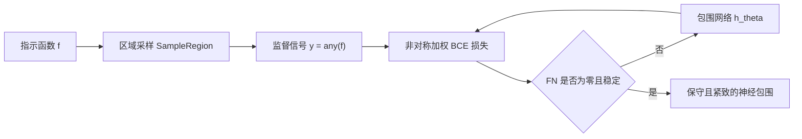

## 一句话总结

该工作把"包围体"重新定义为"把空间分类为可能占据或一定为空"的学习问题，用一个动态加权的非对称损失训练神经网络，得到既紧致又严格无假阴性的保守包围，在多种维度与查询类型上把假阳性率降低了最多约一个数量级。

## 研究背景

在图形与视觉中，测试点、射线或区域是否与复杂几何相交是很多交互式任务的核心，例如流体粒子与动画角色网格求交、射线与医学体数据求交、无人机航迹与动态障碍物求交。为加速这些查询，常用层级测试：若与简单包围体（如盒子）的相交测试失败，就能跳过昂贵的复杂几何测试。

要保证算法正确，第一层测试的假阴性率必须为零，即包围绝不能漏掉真正的相交；而效率主要取决于假阳性率，即包围体命中但更精细测试却未命中的比例，这类情况会浪费计算。传统的球、盒、有向盒、$k$-DOP 等方法在高维下往往因保持凸性而假阳性率很差，且实现成本高。

已有的神经相交函数（NIF）等方法只是拟合占据或有向距离，不保证保守性，可能漏掉物体的一部分（如漏掉海豚的鳍），因此不能直接当作包围体使用。作者的关键观察是：只要正确初始化并安排假阳性与假阴性的权重调度，就能"诱导"一个神经网络成为保守且紧致的包围体。

## 方法

### 整体框架

输入是一个 $n$ 维指示函数 $$f(\mathbf{x}) \in \mathbb{R}^n \to \{0,1\}$$，物体内部及表面取 $1$，其余取 $0$；在其之上定义查询函数 $$g(\mathbf{r}) \in \mathbb{R}^m \to \{0,1\}$$，只要区域 $\mathbf{r}$ 内有任一点使指示函数为 $1$ 就取 $1$（点查询时 $g=f$）。核心是学习一个带参数 $\theta$ 的函数 $$h_\theta(\mathbf{r}) \in \mathbb{R}^m \to \{0,1\}$$，要求在 $g$ 为 $1$ 处严格取 $1$，但允许在别处也取 $1$（即允许假阳性）。

### 关键设计

理想训练目标是对区域上的代价积分，其中假阴性代价 $\alpha$ 须为无穷大以保证保守，假阳性代价 $\beta$ 定为 $1$：

$$c(\mathbf{r}) = \begin{cases} 0 & g=0,\ h_\theta=0 \\ \alpha & g=1,\ h_\theta=0 \\ \beta & g=0,\ h_\theta=1 \\ 0 & g=1,\ h_\theta=1 \end{cases}$$

但无穷大且几乎处处零梯度的损失无法直接优化。作者做两处修改：其一，把常数 $\alpha,\beta$ 换成随迭代变化的调度 $\alpha(t),\beta(t)$，让假阴性代价在极限下趋于无界，从而最终收敛到保守解；其二，用加权二元交叉熵近似以获得平滑梯度：

$$\hat{\mathcal{L}}(\theta) = -\mathbb{E}_i\left[\alpha(t)\, y_i \log(\hat{y}_{i,\theta}) + \beta(t)\,(1-y_i)\log(1-\hat{y}_{i,\theta})\right]$$

在此基础上还提出三点扩展：一是神经包围层级，把网络堆叠成类似 BVH 的结构，且高层能紧致保守地包住内层；二是神经提前退出，通过额外的保守且取反的中间损失，让网络同时产出最终结果与一个"反保守"的早期结果，测试时先跑简单的早期网络，若判负即可提前结束，平均提速约 $24.3\%$；三是把非对称损失用于非神经表示，用梯度下降优化 $k$-DOP 的平面（OurkDOP）。

网络实现为 MLP 以支持任意维查询，隐藏层用正弦激活，输出层经 Sigmoid 后四舍五入到 $\{0,1\}$；用 Adam、学习率 $1\times10^{-3}$、批大小 $200000$，每 $10000$ 次迭代推进一次调度，当假阴性达到零并稳定六个调度周期即早停，通常需 $20$ 到 $60$ 分钟。

## 实验结果

在 $2$、$3$、$4$ 维、点/射线/平面/盒四类查询上以假阳性率为主指标（越低越好，假阴性对所有保守方法均为零）。下表摘取代表性的假阳性率对比：

| 方法 | 2D 点 | 2D 射线 | 3D 点 | 3D 射线 | 4D 点 | 4D 盒 |
| --- | --- | --- | --- | --- | --- | --- |
| AABox | 28.4% | 43.9% | 28.5% | 69.3% | 81.7% | 38.0% |
| kDOP | 28.4% | 33.4% | 22.0% | 65.6% | 75.3% | 36.4% |
| BVH | 10.4% | 28.9% | 10.0% | 34.4% | 39.8% | 35.2% |
| OurkDOP | 19.5% | 18.5% | 15.1% | 40.0% | 62.0% | 31.6% |
| OurNN | 3.2% | 2.7% | 4.2% | 7.6% | 10.9% | 11.3% |
| OurNNEarly | 2.8% | 3.3% | 2.9% | 10.1% | 11.5% | 17.2% |

OurNN 一致地以较大优势领先，在 4D 点查询上相对最强基线约有 $8\times$ 提升，平均假阳性减少约 $12\times$；BVH 排名第二。速度上神经查询虽比球、轴对齐盒慢（最多约 $19.6\times$），但与 $k$-DOP 及部分有向包围方法接近；作者用代价模型论证：当对真实几何的相交测试比包围查询昂贵到一定倍数（$k$-DOP 情形仅需约 $9\times$，平均约 $70.2\times$）时，更紧致的方法总时间更优，而百万三角形网格轻易满足该条件。

## 亮点与局限

亮点在于视角转换：把长期作为计算几何问题的包围重新表述为空间分类的学习问题，并用非对称损失与代价调度巧妙地把"严格无假阴性"这一硬约束转化为可优化目标；方法与维度、查询类型无关，天然适配高维动态场景，还能推广到层级、提前退出以及非神经的 $k$-DOP 优化。

局限也很明确：作者坦言该方法是启发式，并不提供严格保证；受浮点数值限制，在训练集上保守的解在隐藏测试集上可能出现极少量假阴性（实测在一亿次查询中少于一次，需靠加 epsilon 与更多训练来缓解）；网络查询速度本身仍慢于最简单的包围体，其价值依赖被包围几何足够昂贵这一前提；树的层级结构仍需用户提供，方法也不追求跨物体的泛化。

## 延伸思考

这项工作把"保守性"作为一种可以被激励的属性，与 eikonal、Lipschitz 连续、不定积分等约束并列，提示我们许多几何硬约束或许都能通过损失塑形被近似地"学"出来。一个自然的问题是能否为神经包围提供可验证的保守性保证，例如结合区间算术或形式化验证，把"少于一亿分之一的假阴性"变成真正的零。此外，把非对称损失反向使用得到"一定被命中"的保守内包围，为碰撞检测的广相测试提供了对称的双向剪枝思路，值得在实时物理与路径规划中进一步探索。
