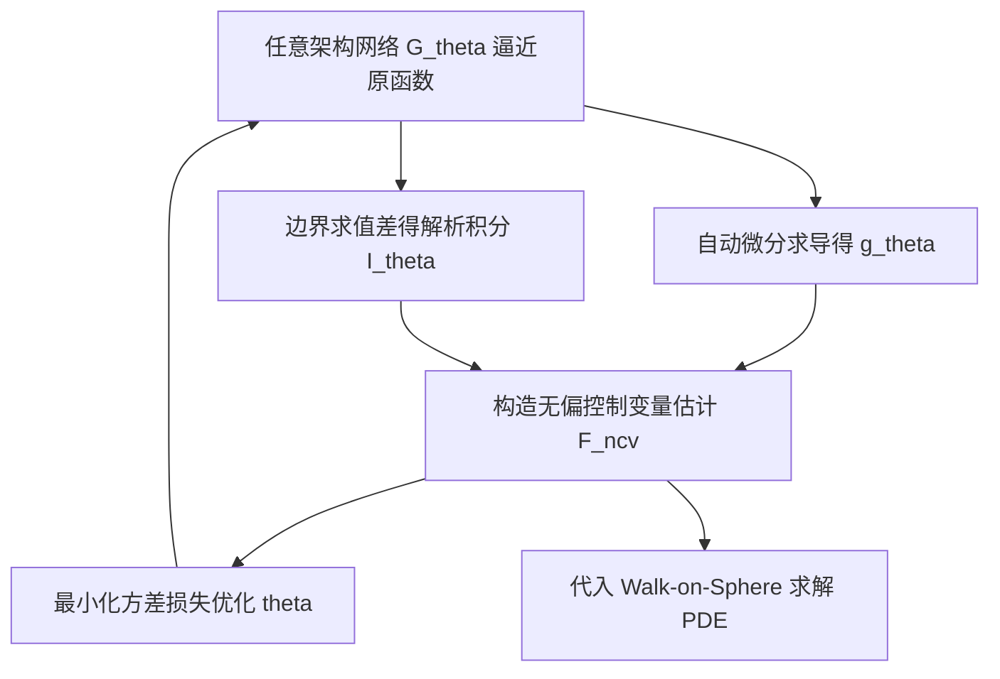

## 一句话总结

本文提出用任意神经网络架构构造控制变量：不再让网络直接逼近被积函数，而是让网络逼近被积函数的原函数（反导数），再借助自动微分同时得到"有已知解析积分的函数"及其导数，从而把控制变量方法的表达能力扩展到任意网络架构，并应用于 Walk-on-Sphere 求解偏微分方程时的方差缩减。

## 研究背景

蒙特卡洛积分是计算机图形学的核心工具，既能在不离散化的前提下求解偏微分方程，也能通过光线追踪渲染真实图像。它给出无偏估计，但方差高，往往需要大量样本才能得到精确结果。

控制变量是常用的方差缩减手段。对一维函数 $f$，它利用如下恒等式改写积分：

$$\int_l^u f(x)\,dx = G + \int_l^u \bigl(f(x) - g(x)\bigr)\,dx$$

其中 $G$ 是函数 $g$ 的解析积分。只要 $f-g$ 比 $f$ 方差更小，右式就能以更少样本达到同样精度。难点在于找到既与被积函数高度相关、又拥有已知解析积分的 $g$。

传统方法靠启发式挑选 $g$（例如取 $f$ 中已知积分的一部分），常与被积函数相关性不足。近期工作把控制变量参数化为可学习函数 $g_\theta$ 并从样本中学习参数，但要构造"对任意参数都拥有已知积分"的表达型 $g_\theta$ 仍然困难，因此已有方法在网络架构上受限，比如只能用带已知积分的简单基函数之和，或归一化流这类特殊结构。本文的出发点正是打破这一架构限制。

## 方法

### 整体框架

核心思路借鉴神经积分方法 AutoInt：定义网络 $G_\theta$ 去建模 $g$ 的原函数，使得 $\frac{\partial}{\partial x}G_\theta(x)=g(x)$。由微积分基本定理：

$$G_\theta(u) - G_\theta(l) = \int_l^u \frac{\partial}{\partial x}G_\theta(x)\,dx$$

于是可用自动微分构造一个可学习的控制变量：

$$\int_l^u f(x)\,dx = G_\theta(u) - G_\theta(l) + \int_l^u \Bigl(f(x) - \frac{\partial}{\partial x}G_\theta(x)\Bigr)\,dx$$

由于 $\frac{\partial}{\partial x}G_\theta(x)$ 只是又一个神经网络，可以用基于梯度的优化器去寻找使 $f(x)-\frac{\partial}{\partial x}G_\theta(x)$ 方差最小的 $\theta$。$G_\theta$ 可以是几乎任意架构，从而大幅拓宽了可用于控制变量的参数化函数类。

### 关键设计

神经空间积分：图形学应用需要在球面、圆盘等空间域上积分。作者先构造一个把超立方体 $U=[-1,1]^d$ 映射到目标域 $\Omega$ 的可逆变换 $\Phi$，再把 AutoInt 从线积分推广到多变量的空间积分。对任意网络 $G_\theta$，利用多重偏导与边界取值之和得到解析积分，并通过换元处理雅可比：

$$I_\theta = \int_U \frac{\partial^d}{\partial \mathbf{u}}G_\theta(\mathbf{u})\,d\mathbf{u} = \int_\Omega \frac{\partial^d}{\partial \mathbf{u}}G_\theta(\mathbf{u})\,\lvert J_\Phi(\mathbf{u})\rvert^{-1}\,d\mathbf{x}$$

该恒等式对任意网络架构都成立，并给出了二维圆、二维圆盘、三维球三种域的 $\Phi$ 与 $\lvert J_\Phi\rvert$。

数值稳定的估计器：把上式代入控制变量恒等式即得单样本估计 $\langle F_{\text{ncv}}(\theta)\rangle$。当 $\lvert J_\Phi\rvert$ 取值很小时（例如二维圆盘半径接近 0）估计器数值不稳定。作者引入一个把域映射到数值稳定区域的变换 $\Phi_\epsilon=\Phi\circ T_\epsilon$，并加入指示函数丢弃越界样本，构造出仍然无偏且稳定的估计器。

最小化方差的训练目标：直接以估计器方差作为损失不可行，因为其中含有未知的真值积分项。作者借助"梯度无偏"这一性质，构造伪损失 $\mathcal{L}_{\text{int}}$ 与 $\mathcal{L}_{\text{diff}}$，使得

$$\nabla_\theta \mathbb{V}\bigl[\langle F_{\text{ncv}}(\theta)\rangle\bigr] = \nabla_\theta \mathcal{L}_{\text{diff}}(\theta,\Omega) - \nabla_\theta \mathcal{L}_{\text{int}}(\theta,\Omega)$$

并在 $\lvert J_\Phi\rvert$ 很小的区域令梯度为零以保稳定。

积分族的建模：很多图形学任务需要在随位置变化的域与被积函数上做大量积分。作者让网络额外接收一个条件隐向量 $\mathbf{c}$ 来参数化域 $\Omega(\mathbf{c})$，并在多个 $\mathbf{c}$ 上联合优化 $\mathcal{L}_{\text{multi}}$，用一个条件网络预测整族积分的控制变量。实验中采用 CatSIREN、ModSIREN 以及借鉴 instant-NGP 多分辨率特征网格的 MGC-SIREN 三种条件化方案。

## 实验结果

作者在 Walk-on-Sphere 框架下验证方法。首先在二维圆、二维圆盘、三维球上用随机初始化的不同架构测试，均方误差随样本数稳定衰减，说明估计器对任意架构都无偏。随后在等样本设置下与无控制变量的 WoS、归一化流（NF）、多项式基（POLY）两类学习型控制变量对比，求解二维 Poisson 与三维 Laplace 方程，本文方法在所有设置下都取得最低误差；NF 与 POLY 因产生过度平滑的控制变量而残留高频方差。

墙钟时间方面，作者在三维 Laplace 任务上生成 $1024\times1024$ 分辨率、目标精度的解。虽然本方法因需计算高阶梯度而训练与推理开销更大，但达到目标精度所需总时间最短，两种神经控制变量基线在给定时间内无法达到该精度。下表为等推理时间（1 小时）下 Spot 形状三维 Laplace 解的均方误差：

| 方法 | MSE（越低越好） |
| --- | --- |
| NF | $2.4 \times 10^{-3}$ |
| POLY | $2.29 \times 10^{-4}$ |
| WoS | $5.45 \times 10^{-5}$ |
| Ours | $2.76 \times 10^{-5}$ |

## 亮点与局限

亮点：把"逼近原函数、再由自动微分得到已知积分的导数网络"确立为一种通用范式，彻底解除了控制变量对特殊网络架构的依赖，可直接采用 SIREN、instant-NGP 等先进架构；将 AutoInt 从线积分推广到圆、圆盘、球等空间域，并给出数值稳定的无偏估计器与相应方差缩减损失；把 AutoInt 放进控制变量内部，既享受神经积分的灵活性，又保留蒙特卡洛的无偏保证。

局限：训练需要对网络反复计算高阶梯度，单步迭代慢、稳定性差、学习率受限，收敛需大量迭代；推理时要同时评估积分网络与导数网络，单步比原始 WoS 更慢；因此只有在需要产生大量高精度查询的场景下才体现墙钟时间优势。本文定位为概念验证，主要在 PDE 求解上展示效果。

## 延伸思考

该方法把方差缩减问题转化为"学习一个原函数网络"，这一视角有望迁移到物理渲染的光线追踪积分、重要性采样、辐射度缓存等更广泛的蒙特卡洛场景。方法与缓存等正交的方差缩减技术可以叠加，作者也展示了与缓存结合能进一步提升墙钟效率，提示未来可把它作为通用组件嵌入现有渲染与仿真管线。真正的瓶颈在于高阶梯度带来的训练与推理开销，若能在网络结构或微分实现上降低这部分成本，方法的适用范围将显著扩大。
