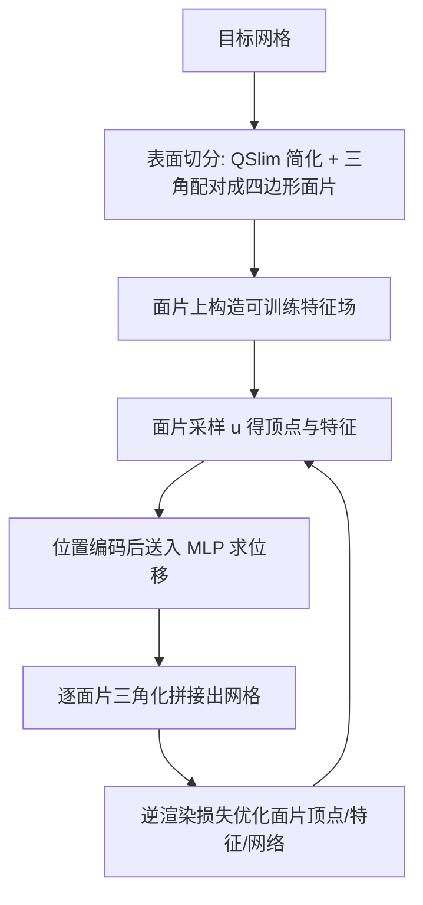

## 一句话总结

本文提出神经几何场（Neural Geometry Fields），用一组粗糙的四边形面片加坐标神经网络位移场来紧凑表示三角网格：既保留网格可 UV 参数化、可直接采样出标准三角网格的优点，又借助神经场的紧凑性，实现了显著优于传统简化与神经隐式方法的网格压缩效果。

## 研究背景

近年来神经场在表示表面几何上进展显著，但主流工作集中在隐式表示（有符号距离场、占据网格、体密度）。要把这些隐式表示用到场景建模、表面纹理、真实感渲染等下游任务，通常还要额外一步（例如 Marching Cubes）把它们转成网格，这既带来处理开销，又丢掉了神经表示的紧凑性。

一个自然的想法是让神经网络直接生成网格，但难点在于网格需要显式的连接性信息，而不同多边形方案与拓扑的连接性很难用梯度下降来优化，因此此前几乎没有工作用神经网络直接表示网格。作者注意到早期的几何图像（geometry image）工作提供了一种规则的、基于图像的离散网格表示方式：把表面切开映射到平面图像、在像素上记录三维坐标，再由每个 $2\times2$ 像素隐式重建四边形。本文正是借用这一思路，用轻量 MLP 去位移一张粗糙网格，从而在压缩与几何表示上取得当前最优效果。

## 方法

### 整体框架

方法把一个神经几何场过拟合到指定目标表面 $\Gamma$。核心是用神经网络把一张基网格 $\Sigma$ 连续地位移到目标表面。整个流程分三步：先把表面切分为易参数化的四边形面片，并在面片上构造可训练的特征场 $\Psi:\Sigma\to\mathbb{R}^F$；再通过在面片上采样得到顶点与特征、送入网络得到位移，抽取出标准三角网格；最后用由粗到细的逆渲染优化面片、特征与网络权重。

### 关键设计

表面切分（Surface Partitioning）：用四边形而非三角形作为面片，因为覆盖同一表面所需的四边形更少，且四边形天然是简单的插值域。每个面片 $\sigma$ 与单位方域微分同胚，由四个角顶点经双线性插值定义：

$$\sigma(\boldsymbol{u}) = (1-\boldsymbol{u}_y)\bigl((1-\boldsymbol{u}_x)\,\boldsymbol{v}_{00} + \boldsymbol{u}_x\,\boldsymbol{v}_{10}\bigr) + \boldsymbol{u}_y\bigl((1-\boldsymbol{u}_x)\,\boldsymbol{v}_{01} + \boldsymbol{u}_x\,\boldsymbol{v}_{11}\bigr)$$

特征向量 $\boldsymbol{f}_{ij}$ 用同样的双线性插值构成面片内平滑的特征场。基网格用非退化四边形网格表示，共享边对应共享的连续边界；孤立面片则允许表示非流形基面。为得到拓扑保持且面数尽量少的基网格，作者先用 QSlim 简化目标网格，再贪心地把相邻三角形配成近矩形四边形并剔除非流形三角形。

网格抽取（Mesh Extraction）：把顶点位置与特征先做位置编码再拼接：

$$\mathrm{enc}(\boldsymbol{v},\boldsymbol{f}) = \bigl(\sin(2^0\boldsymbol{v}),\cos(2^0\boldsymbol{v}),\dots,\sin(2^L\boldsymbol{v}),\cos(2^L\boldsymbol{v}),\boldsymbol{f}\bigr)$$

面片上任一样本经网络位移后的表面坐标为：

$$\Lambda(\boldsymbol{u}) = \sigma(\boldsymbol{u}) + \mathrm{MLP}_\theta\circ\mathrm{enc}\bigl(\sigma(\boldsymbol{u}),\Psi(\boldsymbol{u})\bigr)$$

抽取时在每个面片上沿两维各取 $k$ 个样本（共 $k^2$ 个），生成顶点与特征、评估网络得到位移，再按高度场式的规则连接成三角形，跨面片拼合即得半规则网格。作者还引入抖动采样：在内部样本上叠加半径 $\omega$ 的圆盘随机扰动 $\boldsymbol{u}\sim\hat{\boldsymbol{u}}+D(\omega)$，边界样本保持 $\omega=0$，从而在低面片数下提供更丰富的梯度信号，起到正则化、避免表面粗糙的作用（需满足 $\omega<0.5/(k-1)$ 防止三角形翻折）。

逆渲染优化（Optimization）：采用基于光栅化的逆渲染，由粗到细在 $k\in\{4,8,12,16\}$ 上优化。作者发现基于外观的损失比 Chamfer 距离或 SDF 查询等基于距离的方法更稳定。目标函数只用参考表面的法向缓冲，并加一个拉普拉斯项促使顶点分布均匀：

$$\mathcal{L} = \frac{1}{\lvert N(\cdot)\rvert}\,\lVert N(\Gamma)-N(\Sigma)\rVert_1 + \frac{1}{\lvert V\rvert}\,\lVert LV\rVert_1$$

相机布置上按测地距离聚类三角形、每簇朝质心放一台相机（通常 200 台），并用深度剥离渲染多层深度以覆盖被遮挡几何。网络为两层各 64 神经元的浅层 MLP，位置编码 $L=8$，特征维度 $F=20$，用 Adam、学习率 $10^{-3}$。

## 实验结果

在压缩任务上，方法与经典简化 QSlim、外观驱动的 nvdiffmodeling，以及量化压缩 Draco、神经隐式 Instant NGP 等对比。以多视角渲染损失和对称 Chamfer 距离衡量，本方法在不同模型、不同存储预算下均一致优于基线，且质量随面片数增加而稳定提升，即使在 2.5K 面片的最高质量下存储仍不足 1 MB。以下摘取教师图中龙模型在约 $50\times$ 压缩、相同存储约束下的 Chamfer 误差（$\times10^6$，越低越好）：

| 方法 | Chamfer 误差 |
| --- | --- |
| Nvdiffmodeling | $202.28$ |
| QSlim | $161.31$ |
| Instant NGP | $60.72$ |
| 本文 NGF | $7.70$ |

评估还表明：视觉指标在 $k=16$ 附近趋于饱和，故管线以此为上限；特征维度 $F$ 越大重建越好但存储线性增长，$F=20$ 在 1000 面片下总存储通常低于 200 KB，取得质量与体积的平衡。运行时上，即便最密配置的网格抽取仍保持交互级（$k=16$、2500 面片约 21 毫秒），训练耗时与已有神经方法相当（4 到 12 分钟）。

## 亮点与局限

亮点：把表面切分与神经信号表示结合，首次给出一种直接生成离散三角网格的神经表示，避免了隐式表示转网格的额外处理与存储开销；面片边界天然连续（不同于多图幅几何图像图集的边界不连续），使神经回归更容易；表示由极少的外在网格数据加特征与浅层 MLP 构成，压缩率高且可 UV 参数化、可交互抽取。

局限：当面片数相对目标拓扑极度稀缺时，逆渲染管线可能无法重建出目标网格的基本形态；方法以外观（法向）为主要监督，对相机难以覆盖的高亏格、频繁遮挡区域重建更困难；整体定位为对单一目标表面的过拟合表示。

## 延伸思考

作者提出可为每个顶点附加法向量，使面片升级为贝塞尔面片以更好捕捉曲率，这提示"粗基面 + 神经位移"范式还有更高阶几何表达的空间。补充材料给出了低成本光栅化管线，作者推测类似思路可推广到光线追踪——结合免细分与非线性光追等内存高效技术，或能让神经几何场直接进入渲染管线。更广地看，这种把连接性交给规则四边形面片、把细节交给坐标网络的分工，为在网格上承载纹理、材质等其它表面信号提供了紧凑而可微的载体。
