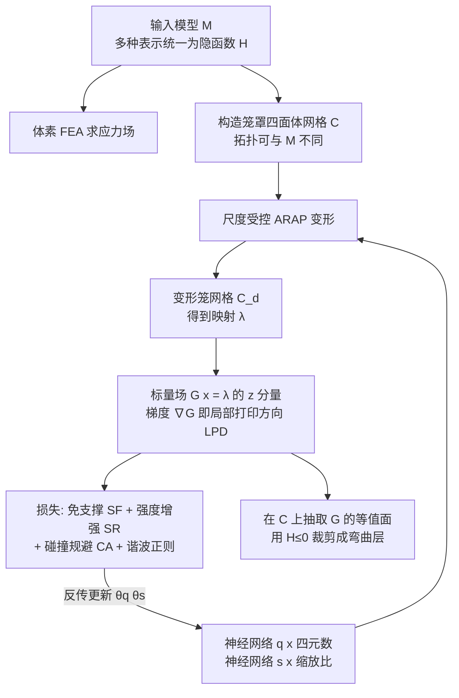

## 一句话总结

本文提出一个基于神经网络的、与模型表示无关（representation-agnostic）的多轴 3D 打印曲面切片器：用神经网络参数化一个作用于输入模型周围空间的变形映射，从中导出标量场并抽取等值面作为弯曲打印层；由于整条管线可微，制造目标（免支撑、强度增强）可以直接以"局部打印方向"为变量写成损失函数进行优化，从而摆脱对高质量四面体网格与初值的依赖。

## 研究背景

多轴 3D 打印相比传统平面分层打印，凭借额外的运动自由度（DOF）带来诸多优势：减少支撑结构的需求、改善表面光滑度、增强机械强度。这类方法通常在输入模型 $M$ 内部定义一个标量场 $G(\mathbf{x})$，把它的等值面抽取为用于打印的弯曲层。核心问题就转化为：如何计算一个满足制造目标的优化标量场。

最新的代表工作 $S^3$-Slicer 通过对模型四面体网格做由旋转驱动的非线性变形来同时满足多个目标，再把变形网格上的高度值映射回原模型得到 $G(\mathbf{x})$。但它存在三个突出问题：

- 需要高质量的四面体网格——对几何和拓扑复杂的模型，网格会变得稠密且难以生成；
- 优化目标是间接定义在单元旋转上，而非直接定义在弯曲层上——变形空间与模型空间之间的畸变可能导致回映到模型空间后违反制造要求（例如免支撑角度在变形空间满足、映射回来却产生更大悬垂）；
- 非线性优化强烈依赖输入模型的初始姿态，初值不佳会得到次优结果。

本文希望用神经网络管线一次性解决上述三类难题，做出首个能处理多种表示、复杂拓扑并直接优化制造目标的曲面切片器。

## 核心方法

### 整体思路

对任意离散表示的输入模型 $M$，都可统一评估为一个隐函数 $H(\mathbf{x})$：$H(\mathbf{x})<0$ 表示点在实体内部，$H(\mathbf{x})>0$ 在外部，零水平集近似为模型表面。方法要计算一个连续映射 $\lambda:\mathbf{x}\mapsto\mathbf{y}$，用 $\mathbf{y}$ 的 $z$ 分量定义切片标量场：

$$G(\mathbf{x}) := \mathrm{proj}_z\,\mathbf{y} = \mathrm{proj}_z\,\lambda_\theta(\mathbf{x})$$

不同的网络系数 $\theta$ 对应不同的场。为让学习收敛，作者不直接用一个无几何含义的网络表示 $\lambda$，而是把它参数化为 $\lambda(\mathbf{q}(\mathbf{x}), \mathbf{s}(\mathbf{x}))$：其中 $\mathbf{q}(\mathbf{x})\in\mathbb{R}^4$ 是局部旋转的四元数，$\mathbf{s}(\mathbf{x})\in\mathbb{R}^3$ 是三个正交方向的局部缩放比，二者各由一个神经网络（系数 $\theta_q$、$\theta_s$）表示。

### 可微变形作为映射

映射在一个"笼罩"输入模型的中间四面体网格 $C$ 上数值计算，这个网格独立于 $M$ 的离散表示，其拓扑甚至可以远比模型简单（例如亏格 $g=22$ 的 Bunny Head 用亏格 $g=0$ 的笼网格）。采用 $S^3$-Slicer 提出的尺度受控 ARAP（as-rigid-as-possible）变形：对每个单元用其中心处的四元数和缩放比得到旋转矩阵 $\mathbf{R}_e$ 与缩放矩阵 $\mathbf{S}_e$，通过最小化下式求解变形网格 $C_d$：

$$\arg\min_{C_d}\ \sum_{e\in C}\lVert (\mathbf{N}\mathbf{V}_e^d)^T - \mathbf{R}_e\mathbf{S}_e(\mathbf{N}\mathbf{V}_e)^T\rVert_F^2 + \gamma\sum_{v\in C}\lVert \mathbf{v}^d-\mathbf{v}\rVert^2$$

写成正则最小二乘 $\arg\min_\xi\lVert \mathbf{A}\xi-\mathbf{b}\rVert^2+\gamma\lVert\xi-\xi_0\rVert^2$，其闭式解为 $\xi=(\mathbf{A}^T\mathbf{A}+\gamma\mathbf{I})^{-1}(\mathbf{A}^T\mathbf{b}+\gamma\xi_0)$。查询点 $\mathbf{x}$ 用重心坐标 $a_i(\mathbf{x})$ 插值得到映射 $\mathbf{y}=\sum_i a_i(\mathbf{x})\mathbf{v}_i^d$，标量场为 $G(\mathbf{x})=\mathrm{diag}(0,0,1)\sum_i a_i(\mathbf{x})\mathbf{v}_i^d$。作者推导了 $G$ 对网络系数的解析导数（含通过 Kronecker 积表达的 $\partial\xi/\partial\mathbf{s}$、$\partial\xi/\partial\mathbf{q}$），使整条管线可反向传播，实际实现用自动微分完成。

### 切片算法三阶段

- 预处理（步骤 1–5）：把各种表示转成隐函数 $H(\mathbf{x})$；体素 FEA 求内部应力场；用 Nested Cage + TetGen 生成笼罩四面体网格 $C$；在表面采样点集 $B$（用于免支撑损失）；在应力最大前 10% 区域的体素中心采样点集 $T$（用于强度增强损失）。
- 映射优化（步骤 6–10）：初始化 $\mathbf{q}$、$\mathbf{s}$ 网络，用 ARAP 求变形网格 $C_d$，准备反传微分，按损失用神经求解器更新网络，迭代至收敛。
- 后处理（步骤 11）：在 $C$ 上抽取 $G(\mathbf{x})$ 等值面，用隐式实体 $H(\mathbf{x})\le 0$ 裁剪得到弯曲层，再按 $S^3$-Slicer 方法生成刀路与机器人运动轨迹。

### 损失函数

所有损失都定义在局部打印方向 LPD 上：$\mathbf{d}_p=\nabla G(\mathbf{x})/\lVert\nabla G(\mathbf{x})\rVert$。

强度增强（SR）：当 LPD 近似垂直于最大主应力方向 $\tau_{\max}$ 时打印件强度最强，即要求 $\lvert\mathbf{d}_p\cdot\tau_{\max}\rvert\le\sin\beta$，损失为

$$\mathcal{L}_{SR} := \sum_{\mathbf{p}\in T} \lvert V_e\rvert\,\sigma\!\big(k_{SR}(\lvert\mathbf{d}_p\cdot\tau_{\max}(\mathbf{p})\rvert-\sin\beta)\big)$$

其中 $\sigma$ 为 sigmoid，$\beta=10^\circ$、$k_{SR}=15$。

免支撑（SF）：基于表面法向 $\mathbf{n}(\mathbf{p})=-\nabla H(\mathbf{p})/\lVert\nabla H(\mathbf{p})\rVert$ 和自支撑角 $\alpha$，要求 $-\mathbf{n}(\mathbf{p})\cdot\mathbf{d}_p\le\sin\alpha$：

$$\mathcal{L}_{SF} := \sum_{\mathbf{p}\in B} \lvert A_p\rvert\,\sigma\!\big(k_{SF}(-\mathbf{n}(\mathbf{p})\cdot\mathbf{d}_p-\sin\alpha)\big)$$

此外针对"点悬垂"（表面点相对 LPD 成为局部极小）引入避免损失 $\mathcal{L}_{PO}=\sum_{\mathbf{p}\in B}\lvert A_p\rvert\max(0,\min_{\mathbf{p}_j\in\mathcal{N}_p}((\mathbf{p}_j-\mathbf{p})\cdot\mathbf{d}_p))$，用 min-pooling 与 ReLU 实现。

碰撞规避（CA）：打印头呈锥形（顶角 $\varphi$），凹面二面角小于 $\varphi$ 会局部碰撞。用相邻单元法向的 $(\mathbf{n}_L\times\mathbf{n}_R)\cdot\mathbf{h}$ 衡量凹凸，按打印头是尖是扁写成不同的 ReLU 型损失，并作为硬约束 $\mathcal{L}_{CA}=0$ 处理（仅考虑局部碰撞，全局碰撞留给运动规划）。

谐波正则：$\mathcal{L}_{HS}$ 抑制相邻单元缩放比的剧变（避免层厚突变），$\mathcal{L}_{HQ}$ 用四元数点积形式抑制法向剧变（保证打印头运动平滑）。

总损失为 $\mathcal{L}=w_1\mathcal{L}_{SF}+w_2\mathcal{L}_{SR}+w_3\mathcal{L}_{OP}+\mathcal{L}_{HS}+\mathcal{L}_{HQ}$，在 $\mathcal{L}_{CA}=0$ 的硬约束下最小化。

## 技术细节

- 网络结构：$\mathbf{q}$、$\mathbf{s}$ 均用 SIREN（周期激活）网络，10 个隐层、每层 512 神经元，输入为 $\mathbf{x}\in\mathbb{R}^3$。
- 优化器：Adam，初始学习率 1e-3，最小阈值 1e-6，配 `ReduceLROnPlateau` 调度。
- 硬约束：采用 DC3 框架，在计算损失与反传前先做一步梯度修正把解拉向 $\mathcal{L}_{CA}=0$ 的可行域。
- 笼网格生成：把各种表示（含卷积曲面表示的骨架）转为隐函数后，用 Marching Cubes 提零水平集，再用 Nested Cage 生成表面笼、TetGen 生成体网格。
- 实现：Python + C++，PyTorch 建网络与自动微分，PyVista 做网格处理；实验平台 i5-12600K + RTX 4080 + 32GB，Ubuntu 20.04。

## 实验结果

在多个几何/拓扑复杂的模型上测试：Bunny Head（混合表示：四面体实体 + 开曲面壳 + 圆柱骨架 + 管状骨架，亏格 $g=22$）、Yoga、拓扑优化生成的高亏格 Shelf（$g=30$）、Ring、Tubes、Spiral Fish、Bridge。整条切片计算可在 15 分钟内完成，笼网格亏格可与输入模型不同。

- 免支撑质量：在 Tubes 模型上相对 $S^3$-Slicer 把残余悬垂区域减少 95%，且本文只用 16.5k 单元的笼网格，而 $S^3$-Slicer 用了 430k 单元的稠密四面体网格。Ring 模型上因为直接在模型空间评估 SF 损失，避免了 $S^3$-Slicer 因映射畸变带来的悬垂。
- 强度增强：Bridge 模型上本文自动得到近似平面、却更好对齐最大应力的"聪明"解；各向异性 FEA 显示 Shelf 最大应变较平面层降低 43.3%，Bridge 较 $S^3$-Slicer 降低 40.5%，Bunny Head 加入 SR 后较仅 SF 降低 36.8%。
- 消融（点悬垂损失）：去掉 $\mathcal{L}_{PO}$ 会在兔耳尖产生悬垂，导致打印序需要额外支撑；加入后可完全免支撑打印。
- 初值鲁棒性：Spiral Fish 从平面高度场、热方法测地场、$S^3$-Slicer 结果三种不同初值出发，学习曲线均收敛到同一弯曲层结果，悬垂面积较 $S^3$-Slicer 再减少 94.2%。
- 物理实验：在 ABB IRB 2600（6-DOF）+ A250 定位器（2-DOF）共 8-DOF 系统上打印，PLA 为主、PVA 打支撑。三点弯曲测试中本文层比 $S^3$-Slicer 断裂力提升 101.9%（翻倍）；Bunny Head 压缩测试中加入 SR 后断裂力提升 30.6%，断裂位置从耳根转移到耳孔。免支撑弯曲层还普遍减轻了模型重量（省去支撑材料）。

## 贡献与局限

贡献：
1. 把曲面切片问题形式化为对两个连续函数 $\mathbf{q}(\mathbf{x})$、$\mathbf{s}(\mathbf{x})$ 的优化，二者定义映射 $\lambda$ 进而定义切片标量场 $G(\mathbf{x})$；
2. 构建可微的神经网络优化管线，损失直接基于 $\nabla G(\mathbf{x})$（真实 LPD），降低对初值的依赖；
3. 在该管线内推导出面向多轴 3D 打印制造目标（免支撑、强度增强、碰撞规避）的损失函数。这是已知首个能处理多种表示、复杂拓扑且直接优化 LPD 制造需求的曲面切片器，并经物理打印验证。

局限：
- 强度增强所用应力场来自各向同性 FEA，$\tau_{\max}$ 在优化中固定，忽略了弯曲层引入的各向异性对主应力方向的反馈影响；将各向异性 FEA 纳入优化循环会显著增加计算量，且主应力分析如何可微仍待研究；
- 映射计算依赖中间笼网格，不同分辨率的笼网格收敛速度与最终损失不同，且可能有不同亏格；
- 全局碰撞的处理沿用 $S^3$-Slicer 的策略——加大谐波项权重使层趋于平面，极端情况会退化为平面层，从而牺牲其他制造目标。

## 延伸思考

这项工作最值得玩味的一点，是把"切片"从离散网格上的几何构造问题，转写成了在连续神经场上的可微优化问题：一旦制造目标能表达为关于场梯度（局部打印方向）的损失，就能借助现代深度学习求解器的强大与对初值的鲁棒性来求解，而不再受限于四面体网格的质量和拓扑。用四元数场 + 缩放场来参数化变形（而非直接回归位移场），既保留了旋转不变性、又赋予映射清晰的几何语义，是让学习快速收敛的关键设计，也为其他"几何处理 + 制造约束"的问题提供了范式借鉴。若未来能把各向异性 FEA、甚至全局碰撞与机器人运动学都做成可微并纳入同一优化环，这套神经切片框架有望从"生成弯曲层"进一步走向"端到端优化整个多轴制造过程"。
