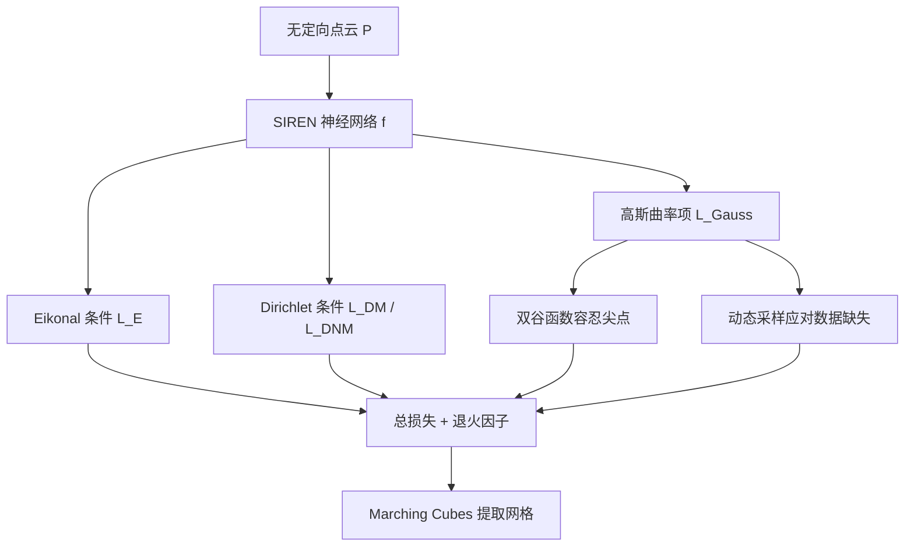

## 一句话总结

NeurCADRecon 是一种自监督神经隐式方法，利用「CAD 曲面分片近似可展」这一先验，通过让高斯曲率趋近于 0 的损失项，从无定向、低质量点云中重建出保留尖锐特征的高保真 CAD 曲面。

## 研究背景

从低质量、无定向点云直接重建 CAD 模型一直是逆向工程中的难点。有机物体的神经符号距离函数（SDF）重建已相当成熟，但 CAD 模型的表面常包含尖锐的特征点与特征线，这给用神经 SDF 编码形状带来了很大障碍。

作者观察到 CAD 模型的关键特性：其表面通常是分片光滑的，每个曲面片近似可展，即使在特征线附近也大致成立。由于可展性可用「零高斯曲率」来刻画，因此在重建中鼓励高斯曲率趋近于 0 是合理的先验。

一个数学上等价的传统做法是约束 SDF 的 Hessian 矩阵秩最多为 1。但作者指出这一约束存在数值不稳定：Hessian 的微小变化会导致秩发生跳变；而且对于立方体这类模型，神经 SDF 无法在极窄空间内精确匹配真实（不可微的）SDF，Hessian 的秩难以反映真实情形。因此本文改为最小化整体绝对高斯曲率。

## 方法

### 整体框架

方法沿用现有自监督隐式重建范式：输入无定向点云 $$P$$，学习神经 SDF $$f(\boldsymbol{x}; \Theta): \mathbb{R}^3 \rightarrow \mathbb{R}$$，其零等值面即为待重建曲面。网络采用 SIREN 架构（4 个隐藏层，每层 256 单元，正弦周期激活）。在保真项（Dirichlet 条件 + Eikonal 条件）之外，新增鼓励高斯曲率趋零的可展性损失项。

### 关键设计

保真项。Eikonal 条件要求 SDF 梯度处处为单位长度：

$$L_E = \frac{1}{\lvert P\rvert + \lvert Q\rvert} \int_{P \cup Q} \left(1 - \lVert \nabla f(\boldsymbol{x}; \Theta)\rVert\right) \, d\boldsymbol{x}$$

Dirichlet 条件要求输入点落在零等值面上（$$f(\boldsymbol{p}) = 0$$），而空间采样点 $$Q$$ 远离曲面（$$f(\boldsymbol{q}) \neq 0$$）。

高斯曲率约束。曲面点处 SDF 的 Hessian 有至少两个零特征值，法向对应一个零特征值，可展性要求两个主曲率之一为零。作者不采用秩约束，而是直接通过 Hessian 估计并最小化绝对高斯曲率：

$$k_{\text{Gauss}}(\boldsymbol{x}) = -\frac{\begin{vmatrix} H_f(\boldsymbol{x}) & \nabla f^T(\boldsymbol{x};\Theta) \\ \nabla f(\boldsymbol{x};\Theta) & 0 \end{vmatrix}}{\lVert \nabla f(\boldsymbol{x};\Theta)\rVert^4}$$

双谷函数。尖点（角点）处高斯曲率并非零，而是接近 $$\pi/2$$。若强行约束为 0，会在尖点附近产生凸起。作者设计了一个四次的双谷函数 $$\text{DT}(t)$$，将 $$\pi/2$$ 附近的高斯曲率映射到较小值，从而在 0 与 $$\pi/2$$ 两处形成谷底，容忍尖点存在（谷底高度 $$a$$ 默认取 $$1/4$$）：

$$L_{\text{Gauss}} = \frac{1}{\lvert \Omega\rvert} \int_{\Omega} \text{DT}\left(\lvert k_{\text{Gauss}}(\boldsymbol{x})\rvert\right) \, d\boldsymbol{x}$$

退火因子。总损失中的高斯曲率项带退火因子 $$\tau$$：前 20% 迭代保持为 1，在 20%~50% 区间线性衰减到 $$10^{-4}$$，末段降为 0。这样既能利用可展先验，又能在收尾阶段保真地重建非可展曲面（如球面）和微小结构。

动态采样。当点云稀疏或有缺失时，围绕输入点的采样集 $$\Omega$$ 无法覆盖缺失区域。作者将采样点沿梯度投影到当前曲面：

$$\boldsymbol{x}' = \boldsymbol{x} - \frac{\nabla f(\boldsymbol{x};\Theta)}{\lVert \nabla f(\boldsymbol{x};\Theta)\rVert} \cdot f(\boldsymbol{x};\Theta)$$

并在 $$\Omega \cup Q'$$ 上评估高斯曲率项，随曲面更新而动态调整，从而在缺失区域也能有效约束曲面演化。

## 实验结果

在四个 CAD 数据集（ABC、Fusion Gallery、DeepCAD、CAPRI-Net）上做过拟合式重建，指标为 Normal Consistency（NC↑）、Chamfer Distance（CD↓）、F1-score（F1↑）。以下为 ABC 数据集（10K 点）与部分基线的对比：

| 方法 | NC ↑ | CD ↓ | F1 ↑ |
| --- | --- | --- | --- |
| SPSR（需法向） | 95.16 | 4.39 | 74.54 |
| DiGS | 94.48 | 6.91 | 66.22 |
| NG（监督） | 95.88 | 3.60 | 81.38 |
| NSH | 97.42 | 3.27 | 88.62 |
| Ours | 97.57 | 3.12 | 89.03 |

在 5K 稀疏点云下，本文 F1 比次优方法高约 6.48%。在 Fusion Gallery、DeepCAD、CAPRI-Net 数据集上，方法在多数指标上取得最优或次优；对细管、微小连接、尖角、窄缝等复杂结构的重建保真度明显优于对比方法，且不产生冗余面片。

## 亮点与局限

亮点：

- 将「CAD 曲面近似可展」的几何先验转化为可优化的零高斯曲率损失，无需法向、无需监督数据即可重建尖锐特征。
- 用最小化绝对高斯曲率替代秩约束，规避了后者的数值不稳定问题。
- 双谷函数巧妙容忍尖点处的非零曲率，退火因子兼顾可展与非可展区域，动态采样应对稀疏与缺失。
- 得到的高保真神经 SDF 可直接提取特征对齐网格并分解为光滑曲面片，降低恢复参数化 CAD 设计的难度。

局限：

- 当输入点云缺失区域过大时，无法保证恢复出真实形状。
- 虽然全实验共用同一高斯曲率权重，但存在需要针对几何复杂度微调该权重的特殊情形。

## 延伸思考

该工作展示了「几何先验 + 神经隐式」的有效结合：把领域知识（可展性）编码为损失项，比纯数据驱动更具泛化力。值得延伸的方向包括：如何自适应地设置高斯曲率权重以摆脱手工调参；能否将可展性约束推广到更一般的分片光滑（非 CAD）曲面；以及二阶导数（Hessian）计算带来的显存与时间开销，是否可用更高效的曲率正则化近似来降低成本，这也正是后续若干工作关注的问题。
