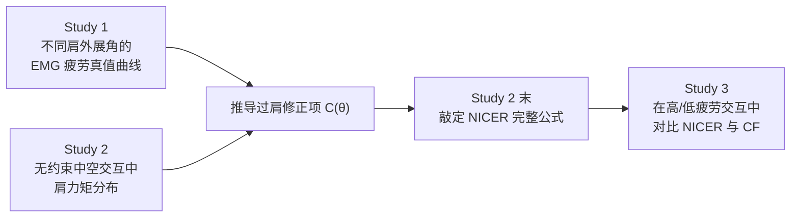

## 一句话总结

NICER 是一个即插即用、无需再训练的中空（mid-air）手势肌肉疲劳模型，在经典 Consumed Endurance（CE）基础上融合了「力矩 + 肌肉收缩」的混合出力估计与恢复因子，首次同时解决了低强度交互、姿态相关最大肌力、疲劳恢复、耐力时间预测以及过肩交互这五大历史局限，并在中空选择任务中比此前的 Cumulative Fatigue（CF）模型更能区分不同疲劳程度的交互方式。

## 问题背景

中空手势交互（隔空挥手、抓取、指点）正随着 Apple Vision Pro、Meta Quest 3 等头显走向主流，但长时间保持手臂悬空会导致上肢沉重疲劳，即俗称的「大猩猩手臂（gorilla-arm）」效应。设计师需要一个能定量预测出力水平与可持续时长的工具，来在「提供体感挑战」和「避免过早疲劳」之间做权衡。

已有两个里程碑式的疲劳模型，但都各有短板：

- **Consumed Endurance（CE）**：首个能从动态手臂运动预测耐力时间的模型，但它沿用 Rohmert 耐力函数，假设低于 15% 最大肌力的低强度交互可以「永远不疲劳」，因此无法刻画中空计算中典型的低强度活动。
- **Cumulative Fatigue（CF）**：能建模交互中的疲劳恢复，但采用监督学习把参数拟合到主观 Borg CR10 量表，需要针对具体任务做耗时训练，且无法直接预测最大交互时长。

更关键的是，CE 和 CF 都以**肩关节力矩**作为出力的唯一指标。力矩公式 $Torque = r \cdot F \cdot \sin(\theta)$ 关于 90° 对称，意味着它假设过肩（>90°）与低于肩的出力相同，从而**系统性低估了抬臂过肩时的真实疲劳**。前作 NICE 指出可用「力矩 + 肌肉收缩」的混合思路修正，但其修正项只基于 90° 与 120° 两点线性外推，且从未在真实交互任务中验证。本文正是要补全这一空缺，做出一个覆盖全部历史局限的完整模型。

## 核心方法

NICER = **NICE + Recovery**（新且改进的消耗耐力与恢复度量）。作者按 CE 原公式的计算顺序，向其中集成四项改进：

1. **修正后的耐力（ET）曲线**：把 CE 里的 Rohmert 曲线换成针对肩关节、由文献中静态与动态手势数据拟合的元 ET 函数（图 2 绿线），使模型能处理低强度交互。
2. **过肩出力的修正项 $C(\theta)$**：基于肌肉收缩（EMG）实测的疲劳真值，修正力矩在过肩时被低估的问题（Study 1 与 Study 2 联合推导）。
3. **姿态相关的最大肌力**：用 Chaffin 最大肌力模型替代 CE 的常数 `Max_Torque`，纳入被试个体差异与动态手势差异。
4. **恢复因子**：借鉴工业工效学中针对完全放松休息的恢复模型，在检测到从活动切换到休息时衰减估计疲劳值。

整体分为三个递进的研究：

## 技术细节

### Study 1：不同肩外展角下的肌肉疲劳真值

24 名右利手被试做侧向抬臂耐力任务（仅自重、无额外负重），肩角取 45°/60°/75°/90°/105°/120°/135° 共七档（比前作 NICE 的 30° 粒度更细），每档最长保持 10 分钟（比 NICE 的 5 分钟更长，以便 EMG 呈现清晰的线性增长）。用四个 EMG 传感器采集上斜方肌、中三角肌、前三角肌、冈下肌的收缩，配合 VICON 动捕。

以 EMG 时域特征（RMS）随时间的回归斜率作为疲劳指数。结果发现：低于 90° 时，Borg 斜率随肩角增大而增大、耐力时长随之下降（与既有文献一致）；但**过 90° 后趋势打破对称，Borg 斜率与耐力时长在 90°–135° 间基本保持恒定**。这条真值曲线用 sigmoid 拟合：

$$f(\theta) = \frac{0.0095}{1 + \exp\left(\frac{66.40 - \theta}{7.83}\right)}, \quad 0^{\circ} < \theta < 180^{\circ}$$

### Study 2：用真实中空交互标定修正项并敲定公式

数据来自一个沉浸式 3D 散点图点选任务（不约束肩外展与肘伸展），合并两种远距选择交互方式的数据以获得丰富的时间与运动变化。先对肘伸直（肘屈角 ≤35°）时的原始力矩分布按性别拟合正弦函数 $t(\theta)$，再通过令真值曲线与力矩在 90° 对齐求得放大因子 $\beta$（女性 1005、男性 1230）。修正项定义为放大后真值曲线与力矩之差（以女性为例）：

$$C_{female}(\theta) = \frac{0.0095 \cdot 1005}{1 + \exp\left(\frac{66.40 - \theta}{7.83}\right)} - \frac{\sin\left(\frac{\theta \cdot 2\pi}{360}\right)}{0.11}, \quad 90^{\circ} < \theta < 180^{\circ}$$

加入修正项、姿态相关 `Max_Torque` 与恢复因子后，NICER 的最终公式为：

$$NICER_{active} = \frac{Duration \cdot \left(\frac{Torque + C(\theta)}{Max\_Torque} \cdot 100\right)^{1.83} \cdot 0.000218}{14.86} \cdot 100$$

$$NICER_{rest} = NICER_{active} \cdot \exp^{-0.04 \cdot \delta t}$$

值得强调的是，修正项来自无约束交互中的手臂运动分布，因此 NICER 适用于任意徒手交互而**无需额外训练**，这与 CF 需要拟合主观评分的监督式做法根本不同。

## 实验结果

Study 3 用两种此前被证实主观疲劳显著不同的交互方式（High_Fatigue 与 Low_Fatigue），在受控 15 秒休息间隔的点选任务上对比 NICER 与 CF（2017、2023 两版）。作者提出三条评价标准：能否泛化区分不同交互设计、能否反映休息期的疲劳恢复、能否准确预测疲劳水平。

配对 t 检验（备择假设：High_Fatigue 预测均值 > Low_Fatigue）结果：

| 模型 | Target-wise | Block-wise | 能否正确区分高/低疲劳 |
| --- | --- | --- | --- |
| Borg CR10（主观真值） | NA | $t_{119}=6.264,\ p<.001$ | — |
| CF_2017 | $t_{371}=-1.362,\ p=.913$ | $t_{119}=-1.028,\ p=.847$ | 否（方向反了） |
| CF_2023 | $t_{371}=-4.868,\ p=1$ | $t_{119}=-2.709,\ p=.996$ | 否（方向反了） |
| NICER | $t_{371}=8.147,\ p<.001$ | $t_{119}=4.503,\ p<.001$ | **是** |

与主观 Borg CR10 的 Pearson 相关系数上，NICER 在高疲劳（$\rho=0.978$）与低疲劳（$\rho=0.976$）两种条件下都优于 CF_2023（0.966/0.923）与 CF_2017（0.954/0.940）。

三条标准的结论：**（1）泛化**——只有 NICER 能正确区分两种交互方式，CF 因过拟合 Borg 评分而失败；**（2）恢复**——NICER 的预测随任务块上升、休息后明显下降，与主观感受一致，CF_2017 完全不降、CF_2023 仅微降；**（3）准确度**——NICER 预测幅度（24%–69%）偏高，可能高估主观疲劳，而 CF 因参数就是拟合 Borg 而幅度更贴近，但作者指出 NICER 到 Borg 的换算尚无验证过的转换因子。总体上 NICER 的恢复衰减略显激进，CF 则偏保守。

## 贡献与局限

**贡献**：

- 首个覆盖全部历史局限的综合中空疲劳模型：可预测最大交互时长、适配不同强度、刻画过肩额外出力、纳入姿态相关最大肌力、反映休息恢复；输入只需 HMD 实时手部追踪即可获得，开箱即用、无需再训练。
- Study 1 首次在不同垂直肩角下用低强度长时任务（每档 10 分钟）系统测量 EMG 疲劳发展，揭示了过 90° 后疲劳趋于恒定这一打破力矩对称假设的真值规律。
- 提出「力矩 + 肌肉收缩」混合出力估计，用 EMG 真值曲线校正力矩对过肩出力的低估，并在真实交互任务中完成验证。

**局限**：

- Study 1 只考察垂直平面（水平 0°），水平方向不同位置的疲劳差异未纳入；力矩在固定垂直角下不变，无法捕捉水平差异。
- 评价仅通过与主观测量对比完成，是否能泛化到更多样的真实交互（动态强度、不同恢复时长）尚待验证。
- NICER 预测与主观真值之间的「距离」仍不清楚，缺乏经过验证的换算方式，预测幅度偏高可能高估疲劳；恢复衰减可能过于激进。
- 建模参数仅区分性别、被试偏年轻，未纳入年龄、身高、上肢长度等因素；且只考虑单侧右臂，双手与全身交互尚未覆盖。
