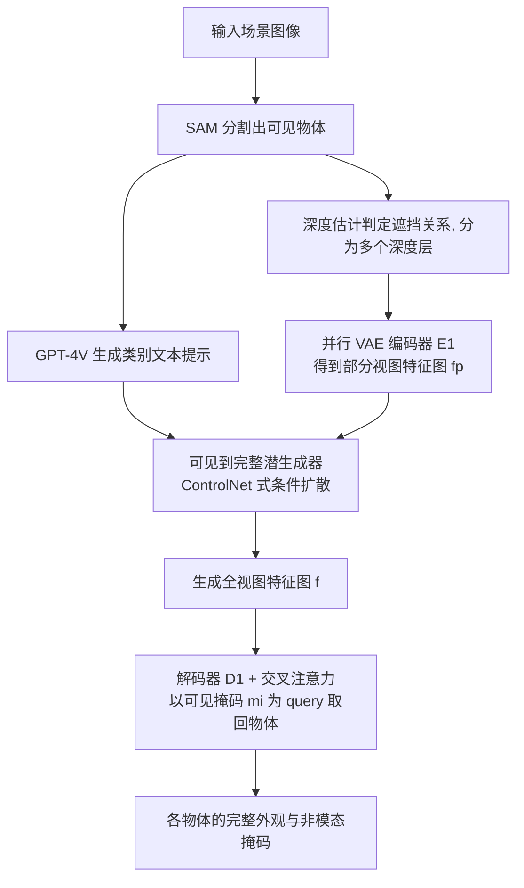

## 一句话总结

提出自监督的并行"可见到完整"扩散框架 PACO，把预训练扩散模型的先验用于物体级场景去遮挡，仅凭可见掩码与类别文本就能在一次去噪中同时补全同层的多个被遮挡物体。

## 研究背景

真实场景照片中物体相互遮挡，给图像编辑带来很大困难。去遮挡（deocclusion）任务的目标是在给定每个物体可见掩码的前提下，预测其被遮挡区域的形状与外观。以往方法大多局限于玩具或合成数据集、或只处理车辆、人、披萨等特定类别，难以泛化到一般真实场景；当前在真实场景上表现最好的 SSSD 把去遮挡当作回归问题用判别式方法求解，生成新内容的能力受限，保真度不足。

直接借用现成基础模型也不可行：一方面图像修复（inpainting）模型需要用户提供被遮挡区域的掩码，而去遮挡任务里这种掩码并不存在；即便给定真值遮挡掩码，修复模型也常常分不清缺失区域属于遮挡者还是被遮挡者，甚至会凭上下文生成全新物体，而不是补全原有物体。另一方面，用扩散模型逐个物体去遮挡在计算上开销巨大，效率很低。

## 方法

### 整体框架

PACO 采用两阶段训练加分层推理的设计。核心思想是：把一叠完整物体编码进一张"全视图特征图"，让解码器能凭各自的可见掩码从中取回单个物体，再训练一个扩散生成器学会仅从可见物体的"部分视图特征图"隐式地生成"全视图特征图"，从而在潜空间完成去遮挡。

### 关键设计

并行变分自编码器（Parallel VAE）：编码器 $$E_1$$ 分别提取每个完整物体的特征，并在初始卷积后立即以求和方式做早期融合，避免对物体排列顺序产生偏置，也节省显存；融合后映射为高斯分布 $$\mathcal{N}(\mu,\sigma)$$ 并采样得到全视图特征图 $$f$$。解码器 $$D_1$$ 用交叉注意力，以可见掩码 $$m_i$$ 作为 query 从 $$f$$ 中选择性取回物体特征：

$$f_i = \mathrm{softmax}\!\left(\frac{W_Q(m_i)\,W_K(f)^{T}}{\sqrt{c}}\right)W_V(f)$$

作者发现用不含外观信息的掩码 $$m_i$$ 而非可见物体 $$v_i$$ 作为 query 更好，因为后者会让解码器过度依赖可见外观、削弱对全视图特征图的利用，重建质量反而更低。

可见到完整潜生成器：以 U-Net 结构实现，冻结扩散编码器 $$E_2$$ 保留基础模型先验，微调解码器 $$D_2$$。借鉴 ControlNet，克隆一份可训练副本 $$E_{2c}$$ 接收条件 $$f_p$$，并在入口与各层插入零卷积，使初始状态与预训练一致、逐步迁移生成能力。除 $$f_p$$ 外，还把物体及其遮挡者的掩码 $$m_o$$、边缘图 $$E$$ 拼接进条件，并把所有采样物体的类别名聚合成一条文本提示经交叉注意力注入。训练目标为预测并去除噪声的 $$L_2$$ 损失：

$$\mathcal{L}_{v2c} = \mathbb{E}_{t,C_0,\epsilon}\!\left[\lVert \epsilon - \epsilon_\theta(f_t,t,f_p,T,E,m_o)\rVert^{2}\right],\quad \epsilon\sim\mathcal{N}(0,I)$$

分层推理策略：用深度估计模型判定相邻物体间的遮挡关系，把场景切成若干深度层，同一深度层的所有物体在一次统一的去噪过程中并行去遮挡。这样既提升效率，又减少邻近物体的相互干扰、减轻全视图特征图的表征负担。作者还讨论了把整场景一次性去遮挡的"Once-for-All"策略，效率最高但质量会明显下降。

自监督数据集：为解决缺乏带真值遮挡外观的数据问题，作者构建了 Object Ensemble（OE）数据集——用深度引导法从 COCO 训练集挑出 85k 个无遮挡物体，随机堆叠到空白画布上合成 500k 张既含遮挡又含完整物体的图像，从而实现自监督训练，并鼓励模型专注于补全原物体、而非凭上下文生成新物体。

## 实验结果

在 COCOA 验证集上与最先进方法 SSSD 比较，PACO 在非模态掩码精度（IoU）、外观保真度（FID）与遮挡顺序准确率上均更优：

| 方法 | IoU（↑） | FID（↓） | 遮挡顺序准确率（↑） |
| --- | --- | --- | --- |
| SSSD | 87.59 | 15.05 | 89.4 |
| PACO（本文） | 89.52 | 13.93 | 90.0 |

去遮挡策略的消融（COCOA 验证集）表明，分层策略在保持与逐个处理相当的 FID 的同时，把每张图所需扩散过程数量减少超过 65%：

| 策略 | FID | 每图平均扩散次数 |
| --- | --- | --- |
| 逐个处理（One-by-one） | 13.79 | 7.19 |
| 分层（Layer-wise） | 13.93 | 2.50 |
| 一次性（Once-for-all） | 14.56 | 1 |

此外作者还与 VINV 做了定性比较（PACO 补全的杯底、车尾灯等区域更清晰），并系统分析了三种基于 Stable Diffusion 修复的策略，说明即便给定真值非模态掩码，修复模型也无法可靠完成去遮挡，印证修复与去遮挡是本质不同的任务。模型在 ADE20k 等跨域场景与训练集未覆盖的新类别上也展现了泛化能力，并可用于单视图三维场景重建与物体重排等下游应用。

## 亮点与局限

亮点：把去遮挡从判别式回归转为在潜空间做生成，充分利用预训练扩散模型的世界先验；并行 VAE 加分层推理实现同层多物体一次去噪，在保真与效率间取得良好折中；通过合成 OE 数据集实现自监督，绕开了非模态掩码与遮挡区域的繁琐标注；仅需易获取的可见掩码与类别文本作为输入。

局限：推理管线依赖 SAM 分割、GPT-4V 生成类别名与深度估计等多个外部模型，误差会级联传递；"一次性"策略在复杂重遮挡（如多只斑马）场景下质量明显下降；训练数据由 COCO 物体随机堆叠合成，与真实遮挡分布仍存在差异；物体级去遮挡对被遮挡的背景区域仍需借助额外的图像修复模型处理。

## 延伸思考

把"补全缺失区域"重新表述为"从可见特征生成完整特征"，是这篇工作值得借鉴的思路转换——它绕开了必须先知道非模态掩码这一现实中难以获取的前提。全视图特征图能同时编码多物体、再靠掩码 query 取回单体的机制，本质上是一种共享潜空间的多实例表征，或许可迁移到多物体三维重建、可编辑场景表示等任务。随着更强的开放词表分割与深度/顺序估计出现，这类依赖前置模块的管线有望进一步减少级联误差；而 OE 式的合成自监督策略，也为其它缺乏真值标注的补全类任务提供了低成本的数据构造范式。
