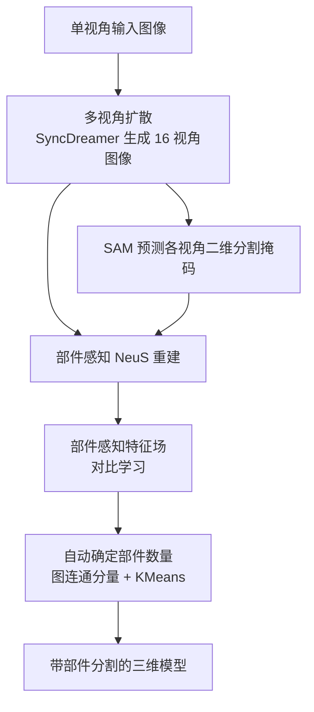

## 一句话总结

Part123 从单张图像重建出带有结构化部件分割的三维模型，通过多视角扩散生成图像、用 SAM 得到二维分割，并借助对比学习在神经渲染框架中学习部件感知特征场，实现对任意物体的高质量部件分割重建。

## 研究背景

从单视角图像重建三维物体是视觉计算中的经典难题，缺乏三维线索使其成为一个病态问题。近年扩散模型为单视角重建打开了新局面，但已有方法都把目标物体重建为一个不含任何结构信息的封闭网格，忽略了部件层级结构。而部件结构对形状建模、形状检索、纹理映射、动画等诸多下游应用都至关重要。

一个自然的想法是先重建再做三维分割，但重建出的网格往往噪声大、表面不光滑、纹理模糊，直接套用三维分割方法效果很差。此外，现有三维分割方法大多依赖预定义的部件结构或明显的几何特征，只对特定类别或高质量模型有效，泛化能力不足，其根源在于大规模三维数据的稀缺。

Part123 的核心思路是：绕开质量欠佳的三维模型，转而利用图像上的二维分割，并在重建过程中同步将其提升到三维空间。这样既能借助 SAM 等强泛化的二维分割基础模型，又不受三维模型质量的影响。

## 方法

### 整体框架

方法接收单张图像，输出带部件分割的三维模型，主要分三步：先用多视角扩散生成一组多视角一致的图像，再用 SAM 预测每个视角的二维分割掩码，最后基于这些二维分割做部件感知重建并自动提取部件。

### 关键设计

第一，多视角生成。采用 SyncDreamer 在固定视点生成 $$N=16$$ 张多视角一致图像。多视角扩散在标准扩散模型基础上建模所有视角的联合分布，前向过程对每个视角独立加噪，反向去噪过程则通过三维空间体积与注意力机制关联各视角特征，从而增强多视角一致性。

第二，对比学习驱动的部件感知重建。SAM 产生的掩码是语义无关的，不同视角掩码之间没有对应关系，且同一部件在不同视角下可能被分成不同的掩码，存在严重的多视角不一致。作者没有直接聚合二维标签，而是在 NeuS 的神经渲染框架上增加一个部件分割分支：对每个三维点 $$x$$，该分支以 SDF 网络的中间特征为输入，输出一个 $$N_c$$ 通道的部件感知特征 $$F_x$$，并通过体渲染沿光线累积得到像素级特征。

训练时每步先采样 $$N_q$$ 个查询像素，对每个查询像素从同一掩码内采样正样本、从同视角内不同掩码采样负样本，不同视角像素之间不施加任何约束。使用 InfoNCE 损失做对比学习：

$$L_{contra} = -\mathbb{E}\left[\log \frac{f(x_q, x_{pos})}{\sum_{n=1}^{N} f(x_q, x_n)}\right]$$

总损失为 $$L = L_{rec} + \alpha L_{contra}$$，其中 $$L_{rec}$$ 为原始 NeuS 的重建损失，权重 $$\alpha$$ 实验中设为 $$0.02$$（过大会导致几何伪影）。虽然只在同视角内约束特征，但 NeuS 的优化过程会全局关联多视角信息，因此跨视角一致性能自然涌现。模型训练 $$2\text{k}$$ 步。

第三，自动部件分割。训练后用 Marching Cubes 提取网格，对每个顶点取出部件感知特征，用 KMeans 聚成 $$M$$ 个部件。为自动确定聚类数量与初始中心，作者提出图方法：每个掩码是图中一个顶点，若相邻帧两个掩码被判定属于同一部件则连边。判定方式是根据 NeuS 深度将源掩码投影到下一视角，若重叠比例超过阈值 $$\tau$$ 则连边（同时可基于深度检测遮挡）。图中的连通分量数即部件数量，每个部件最大掩码的内部参考像素对应的三维点作为 KMeans 初始中心。通过在 $$0.2\sim 0.7$$ 范围内取不同重叠比例可得到不同部件数的多个结果，最后用 Davies-Bouldin 分数（越低越好）挑选出分割质量最优的结果作为最终输出。

## 实验结果

在 Google Scanned Objects 数据集上，用 Chamfer Distance 和 Volume IoU 评估重建质量。结果表明 Part123 在实现部件感知的同时，重建质量与基线 SyncDreamer 相当，且明显优于其他三种方法，即部件感知没有牺牲重建质量。

| 方法 | Chamfer Dist. ↓ | Volume IoU ↑ |
| --- | --- | --- |
| Point-E | 0.0541 | 0.2598 |
| Shap-E | 0.0532 | 0.3275 |
| One-2-3-45 | 0.0870 | 0.2906 |
| SyncDreamer | 0.0359 | 0.4876 |
| Ours | 0.0354 | 0.4943 |

在部件分割的用户研究中（22 个测试案例、46 名参与者），Part123 以 $$73.3\%$$ 的偏好率远超 WCSeg（$$7.2\%$$）、SEG-MAT（$$9.4\%$$）和 SAM3D（$$10.1\%$$），说明其分割结果更符合人类对三维结构的感知。

消融与分析显示：更大的重叠比例产生更细粒度的部件；用估计的掩码中心初始化 KMeans 比随机初始化更稳健；即便只用 6 个视角也能保持稳定的部件分割；换用 Wonder3D 骨干、甚至用法线图的分割掩码，方法依然有效，体现了对不同骨干与图像域的泛化能力。

## 亮点与局限

亮点：一是首次在单视角重建语境下把结构感知通过对比学习融入重建过程，而非依赖显式融合；二是巧妙规避了跨视角掩码无对应、不一致的难题，只在同视角内约束，让多视角一致性由 NeuS 优化自然涌现；三是借助 SAM 的强泛化能力摆脱了对三维标注数据和预定义类别的依赖，可处理任意物体；四是提出全自动的部件数量估计与聚类初始化算法，无需用户干预。产出的部件模型还能支持保特征重建、基元拟合、形状编辑等下游应用。

局限：方法整体质量受多视角扩散骨干的生成质量制约；重叠比例、DB 分数等启发式选择仍带有一定经验性；RGB 图像与法线图的分割会因关注点不同（纹理 vs 几何）导致局部部件划分出现差异，部件"正确性"缺乏统一客观标准，主要依赖人类感知评估。

## 延伸思考

把"分割"从三维搬回二维再提升回三维，本质上是在用数据更丰富、模型更强的二维基础模型来弥补三维数据的稀缺，这一思路对其他三维理解任务（如材质、语义、可动性预测）同样具有借鉴意义。对比学习"只约束局部、让全局一致性从联合优化中涌现"的设计也颇具启发，可推广到其他存在跨视角/跨模态不一致的融合场景。未来若能引入语义或层级化的部件结构，或将部件感知与可动关节、物理属性结合，或许能进一步推动从单图到可交互三维资产的落地。
