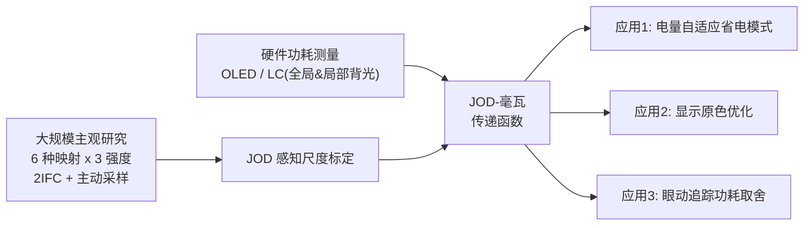

## 一句话总结

首次在统一的感知框架下横向评测六种「省电显示映射算法」，把每种算法的画质损失量化到统一的 JOD（just-objectionable-difference）尺度，并结合硬件精确的功耗模型建立「JOD-到-毫瓦」传递函数，从而为 XR 显示的功耗预算、显示原色设计、眼动追踪取舍等系统级决策提供可直接查表使用的定量依据。

## 问题背景

XR（AR/VR）头显要同时满足高刷新率、高分辨率、宽视场、高动态范围，还要塞进轻量、符合人体工学的形态里，导致功耗压力极大。显示屏本身就能吃掉消费电子设备高达 40% 的功耗预算，对电池受限的一体机尤为致命。

学术界和工业界已经提出了很多「省电显示映射」（display mapping）方法：从最简单的整屏调暗，到复杂的、受感知启发的色彩重映射。但这些方法各说各话——有的用客观指标衡量画质，有的用心理物理阈值，有的做主观问卷，有的只跟某个基线比。缺乏统一标准导致一个根本问题无法回答：这些方法省下的电，到底以多大的画质代价换来的？哪种在「省电 vs 画质」上更划算？

本文的目标就是填补这个空白：在统一架构下、用自然图像与自由观看的真实条件，第一次系统测量不同省电方法在常见显示类型上的感知影响，并把结果与硬件级功耗模型对接，形成可落地的设计指南。

## 核心方法

工作分三步走：先精确刻画两类主流 XR 显示的功耗模型；再用大规模主观实验把六种省电算法的画质损失统一标定到 JOD 尺度；最后把两者拼成「JOD-毫瓦」传递函数并落到三个应用上。

### 两类显示的功耗建模

作者选了两台商用头显作为两类显示的代表：发光型 OLED 的 HTC VIVE Pro Eye，与透射型液晶（LC）的 Meta Quest Pro。

- **LC 显示**：用示波器测量显示板供电轨上跨分流电阻的压降，配合欧姆定律算出电流，得到隔离的功耗。背光单元（BLU）功耗被建模为相对亮度 $y$ 的线性函数：

$$M_B(y) = \alpha y + \delta$$

其回归相关系数 $r^2 = 0.99$。液晶面板部分则用每个 RGB 通道的二阶多项式求和描述：

$$M_{LC}(\mathbf{c}) = \sum_{p=0}^{3} \alpha_p \mathbf{c}_p^2 + \delta_p$$

关键发现是：BLU 功耗变化（>570mW）比 LC 面板（<20mW）大一个数量级以上，所以后续计算直接忽略 LC 面板贡献。全局调光时功耗由整幅图的最大像素强度决定；局部调光时各背光 LED 独立驱动，需要借助点扩散函数（PSF，用洛伦兹函数拟合）来精确计算驱动值。

- **OLED 显示**：功耗建模为显示原色的线性函数：

$$P(I) = \sum_{\mathbf{c} \in I} \mathbf{p}^\top \mathbf{c} + \delta$$

直接沿用前人对同款显示测得的参数。

### 六种省电显示映射算法

每种算法都引入一个调制因子 $\alpha$ 来控制强度：

1. **整屏调暗（Uniform Dimming）**：线性缩小所有像素值，$\mathbf{c}' = (1-\alpha)\mathbf{c}$。手机低电量模式的常见做法。
2. **高光裁剪（Luminance Clipping）**：只压制高亮区域的亮度，保留大部分图像的亮度但牺牲高光细节。
3. **亮度衰减（Brightness Rolloff）**：眼动追踪方法，用高斯型剖面对周边视野调暗，中央凹（$\theta=10°$ 偏心度内）保持不变。相比前人的线性衰减，高斯剖面保证 $C^1$ 连续，避免视觉伪影。
4. **双眼异调（Dichoptic Dimming）**：只调暗一只眼对应的显示。因约 70% 人口右眼主导，作者选择只调暗左眼。
5. **色彩中央凹化（Color Foveation）**：利用人眼色彩敏锐度随偏心度下降的特性，在偏心度处把像素色彩往功耗更低、但感知上不可区分的方向偏移（在 DKL 色空间用径向基网络求功耗最小色）。
6. **白点偏移（Whitepoint Shift）**：利用色适应，把整屏白点往更省电的白点偏移，通过 Bradford 色适应变换矩阵实现。

### 大规模主观研究

- **协议**：两间隔强迫选择（2IFC）+ 成对比较法，比直接评分噪声更小。用户可在参考视频与两个测试视频间自由切换，切换时插入 500ms 灰屏防止直接「翻页」对比，允许自然的眼动头动以模拟真实使用。
- **规模**：6 种映射 + 1 参考 × 3 强度 × 5 场景 = 105 个条件。全成对设计需约 40 小时，作者用主动采样方法 ASAP（挑选信息增益最大的比较）把每人时长压到平均 49 分钟。
- **强度标定**：先用 QUEST 自适应阶梯法在专家上做预试确定 1 JND 阈值，再用两轮 pilot（各 8 名专家）按 magnitude-JOD 线性拟合，最终把三个强度定在 1、2、3 JOD 处。
- **被试**：30 名 25–65 岁付费素人，通过石原色盲测试、视力正常或矫正正常，经 IRB 批准。
- **标定**：成对数据用 Thurstone Case V 模型经贝叶斯极大似然（pwcmp 软件）标定为 JOD，参考设为 0。JOD 差 1 表示 A 被选中的概率是 75%。

## 技术细节与实验结果

### 主研究关键发现

- **亮度衰减**在所有强度下感知影响最低（最接近参考）。
- **整屏调暗**和**双眼异调**是内容无关的，在不同显示类型上表现一致。
- **白点偏移**在各强度下感知影响最差。
- ANOVA 显示：映射技术类型（$F=23.49$）与强度（$F=35.67$）都极显著（$p \ll .001$）；场景、显示类型、观察者均不显著。

代表性结果（OLED，最高强度）如下：

| 算法 | 感知影响 (JOD) | 功耗节省 |
| --- | --- | --- |
| 亮度衰减 Brightness Rolloff | -0.6 | 41% |
| 整屏调暗 Uniform Dimming | -1.4 | 28% |
| 双眼异调 Dichoptic Dimming | -1.9 | 15% |
| 白点偏移 Whitepoint Shift | -1.4 | 22% |
| 色彩中央凹化 Color Foveation | -2.3 | 45% |
| 高光裁剪 Luminance Clipping | -3.1 | 9.5% |

（JOD 越接近 0、节省越高者越优。）

### JOD-毫瓦传递函数

作者给每种映射拟合 Weibull 型心理测量函数（约束：$\alpha=0$ 时 JOD 为 0），从而在连续尺度上外推感知影响；再套上功耗模型，得到 OLED、全局调光 LC、局部调光 LC 三类显示上的「JOD vs 相对省电」传递函数。这条曲线能回答两个实用问题：

- **Q1：给定省电目标，哪种方法画质最好？** 例如 OLED 上 20% 省电目标，可对六种方法排序。
- **Q2：给定画质目标，哪种方法最省电？** 表 1 汇总了 -1 JOD 下各方法在单目/双目、有无眼动追踪的组合下的省电率。

外推的有效性用一个验证研究（$N=5$）确认：传递函数预测的 JOD 与实测 JOD 高度相关（20% 省电 $r=0.943$；40% 省电 $r=0.999$）。

### 三个应用

1. **电量自适应省电模式**：可依据剩余电量或充电计划，以及设备是否支持眼动/立体，动态选择映射强度与方法。
2. **显示原色优化**：用基于原色光效的代理功耗模型 $K(\lambda) = k \cdot \eta(\lambda)V(\lambda)$，在 1000 个激光原色候选里做约束优化，联合最小化色差与功耗。结果表明可在色准损失极小的情况下显著省电，并给出 3/4/5 原色显示的最优原色方案（在 ImageNet 500 图子集上验证）。
3. **眼动追踪功耗取舍**：亮度衰减虽在 OLED/局部调光 LC 上最优，但若把眼动追踪本身的功耗（Tobii Pro Glasses 3 约 189.69mW，理想系统应 <100mW）算进去，它就未必划算——除非设备本来就需要眼动追踪，此时亮度衰减能抵消掉理想眼动追踪功耗甚至过半的 Tobii 功耗。

## 贡献与局限

**贡献**：
- 第一次在统一框架、真实自由观看、自然图像条件下横向评测六种主流省电显示映射，产出统一的 JOD 感知尺度。
- 建立硬件精确的功耗模型（OLED 与 LC 全局/局部背光），并对接成首创的「JOD-毫瓦」传递函数。
- 把结果落到显示原色设计、电量自适应、眼动追踪取舍等系统级实际问题上，并开源代码与数据。

**局限**：
- 研究基于商用 VR 设备，其光学畸变、眼动延迟/误差、色彩再现不准、对比度有限等自身缺陷会与省电方法叠加影响画质。
- 只评测了固定的六种技术，未覆盖不同的衰减剖面或多种技术的组合。
- 只优化了显示功耗，未涉及计算功耗（如中央凹渲染、自适应着色）。
- 目前只涵盖 OLED 与 LC 显示，mini/micro-LED、LCOS 等其他显示模态需按本文模板另做实验与建模。

## 延伸思考

这篇工作的价值不仅在具体结论，更在它提供的「方法论模板」：先把画质损失标定到统一的感知尺度（JOD），再与硬件精确的物理量（毫瓦）建立可外推的传递函数，最后据此回答工程决策问题。这种「感知量 ↔ 物理量」的桥接思路，可推广到功耗之外的其它权衡场景，比如延迟、带宽、算力预算与画质的取舍。对做 XR 系统设计的人来说，「亮度衰减最省电但要算上眼动追踪的账」「白点偏移看似省电其实感知代价最大」这类反直觉结论，本身就有很强的实践指导意义。
