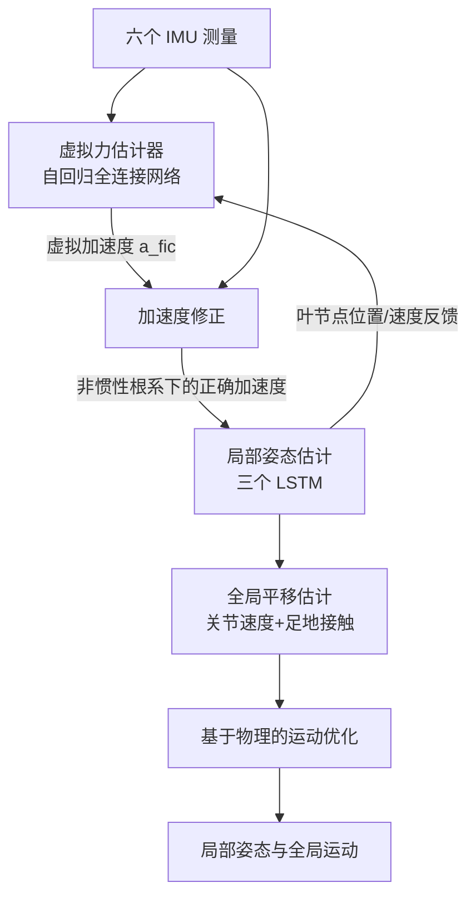

## 一句话总结

本文指出稀疏惯性动捕长期把人体根坐标系当作惯性系的物理缺陷，通过一个遵循物理规律的自回归神经估计器建模非惯性系中的虚拟力，从而正确补偿加速度测量，使网络能真正利用加速度信息重建以往难以捕捉的抬手抬腿等动作。

## 研究背景

用六个可穿戴惯性测量单元（IMU）做人体动捕，因不受遮挡与光照限制、成本低、可自由移动，正成为走向日常动作理解的重要方向。为便于建模，动捕任务通常被拆解为「根相对局部姿态估计」和「全局运动积分」两部分。为估计局部姿态，以往方法先按根部 IMU 读出的旋转，把 IMU 测量从世界坐标系变换到人体根坐标系。

作者识别出这一流程的物理缺陷：世界坐标系是惯性系，只有当根坐标系也是惯性系时该变换才成立。但人在运动时根关节持续经历线加速度与旋转，根坐标系其实是非惯性系。把加速度从惯性世界系投影到非惯性根系，必须引入离心力、科氏力等虚拟力来补偿原始加速度读数。以往工作忽略了这些力，导致「错误」的加速度测量与真实局部运动不匹配，因此模型学不好加速度与运动的关联，实际上丢弃了大部分加速度信息。这使它们在朝向几乎不变、只能靠加速度分辨的动作（如抬手抬腿）上失效。

此外，训练依赖大量成对的真实加速度与姿态数据，而这类数据难以获取；以往仅用真值运动直接合成 IMU 测量，忽略了传感器噪声与标定误差，导致合成数据与真实数据之间存在明显域差。

## 方法

整体框架：输入是放在五个叶节点（前臂、小腿、头）和根节点（骨盆）的六个 IMU 测量（加速度、角速度、朝向），输出为局部姿态与全局运动。流程先在非惯性根坐标系中估计虚拟力，用它修正加速度后估计局部姿态，再估计全局平移，最后用基于物理的优化器精修。

关键设计：

- 虚拟力建模：在非惯性根坐标系下，任一叶节点受到的虚拟力由四项组成——线性惯性力、离心力、科氏力与欧拉力：
$$\boldsymbol{f}_{fic}=-m\left(\boldsymbol{a}_{RR}+[\boldsymbol{\omega}_{RR}]_{\times}^{2}\boldsymbol{p}_{RL}+2[\boldsymbol{\omega}_{RR}]_{\times}\dot{\boldsymbol{p}}_{RL}+[\dot{\boldsymbol{\omega}}_{RR}]_{\times}\boldsymbol{p}_{RL}\right)$$
其中 $$m$$ 为质量，$$[\cdot]_{\times}$$ 为叉乘的反对称矩阵。它表明从根系观测叶节点加速度时，读数与惯性世界系下的原始 IMU 值不同，需加上由虚拟力引起的「虚拟加速度」。

- 神经估计器替代解析计算：叶节点位置与速度并非直接可测，需靠估计姿态推算。作者不用公式直接算，而用一个自回归全连接网络（四层、隐宽 512、ReLU、L2 损失）估计虚拟加速度 $$\boldsymbol{a}_{fic}=\boldsymbol{f}_{fic}/m$$。输入为根节点动力学（加速度、角速度、角加速度）与叶节点动力学（位置、速度、加速度、朝向），其中叶节点量取自上一帧估计并由网络隐式外推到当前帧。用网络有三点考量：外推未知的叶节点位置与速度、抑制角速度测量噪声、可联合估计所有叶节点并融入人体运动先验。

- 局部姿态与全局运动估计：把修正后的加速度与叶节点旋转拼接为 $$\lbrace\boldsymbol{R}_{RL},\boldsymbol{a}_{RL}+\boldsymbol{a}_{fic}\rbrace$$ 输入，沿用先前工作用三个 LSTM 依次回归叶节点位置、全部关节位置、全部关节旋转；叶节点位置及其有限差分速度反馈给虚拟力估计器供下一帧使用。全局平移则回归关节速度与足地接触概率，因相对静止世界系（惯性系）故无需虚拟力，最后做基于物理的优化保证物理合理性。

- 仿真式 IMU 合成：先用 SMPL 从低帧率（60FPS）动捕数据合成每个 IMU 的 6DoF 轨迹，并把传感器滑动与旋转误差建模为随机游走噪声；再基于能量优化（受最小加加速度变化率启发）在高帧率（180FPS）下求解原始加速度与角速度信号，磁力计假设 x 轴为北向；对信号加入随机游走偏置与高斯白噪声后，用带零速更新的误差状态卡尔曼滤波做传感器融合得到朝向；最后显式建模 T-pose 标定误差，对表征传感器放置与 IMU 世界系朝向的两个旋转矩阵加随机扰动，以提升对标定误差的鲁棒性。

## 实验结果

在 DIP-IMU、TotalCapture、AMASS 上按前人设定划分训练/测试，与 DIP、TransPose、TIP、PIP 对比。TotalCapture 有两套标定：官方标定误差较大（12.1°），DIP 标定误差较小（8.6°），用于检验鲁棒性。下表为姿态精度主结果节选（各指标越小越好）：

| 数据集 | 方法 | SIP Error（°） | Ang Error（°） | Pos Error（cm） | Mesh Error（cm） |
| --- | --- | --- | --- | --- | --- |
| TotalCapture（官方标定） | PIP | 14.52 | 13.85 | 6.22 | 7.21 |
| TotalCapture（官方标定） | 本方法 | 11.35 | 11.10 | 4.89 | 5.60 |
| TotalCapture（DIP 标定） | PIP | 12.93 | 12.04 | 5.61 | 6.51 |
| TotalCapture（DIP 标定） | 本方法 | 10.89 | 10.45 | 4.74 | 5.45 |
| DIP-IMU | PIP | 15.33 | 8.78 | 5.12 | 6.02 |
| DIP-IMU | 本方法 | 13.71 | 8.75 | 4.97 | 5.77 |

本方法在各数据集上一致优于以往工作，TotalCapture 上网格误差降低约 19%、DIP-IMU 上降低约 4%；由于所有方法都在 DIP-IMU 上训练，其在 TotalCapture 上的显著提升说明合成数据带来了更好的泛化。全局平移漂移也最低。消融显示：去掉仿真式 IMU 合成（w/o SynIMU）在两套标定间差距巨大，而完整方法始终稳定；去掉虚拟力（w/o FicAcc）整体数值差距不大，但那是因为需要加速度的歧义动作（如抬臂抬腿）占比小、被平均稀释，在这些动作上差异显著。抖动虽略高于 PIP，但反映的是对加速度更敏感、能更准确捕捉大动作，而非系统不稳。

## 亮点与局限

亮点：从物理原理出发，首次指出并纠正了稀疏惯性动捕把根坐标系默认当惯性系的缺陷，用离心力、科氏力等虚拟力补偿加速度，让网络第一次能真正利用加速度信息，攻克抬手抬腿这类朝向不变、仅靠加速度可辨的动作；将物理公式与数据驱动巧妙结合，用自回归网络既遵循物理又能外推未知量、抑噪并融入运动先验；提出仿真式 IMU 合成，直接生成原始信号并显式建模传感器噪声与标定误差，显著缩小合成与真实间的域差、增强鲁棒性；系统在无 GPU 的笔记本上实时运行于 60FPS。

局限：IMU 合成假设磁场均匀恒定，对现实中常见的磁干扰鲁棒性较弱；工作只关注姿态估计并假设被捕捉对象为平均体型，未处理体型差异带来的影响。

## 延伸思考

这项工作最有启发的地方，是把一个被长期忽视的「坐标系是否为惯性系」的物理前提重新摆上台面——很多数据驱动方法之所以「学不好加速度」，未必是网络能力不足，而是喂进去的信号本身在物理上就被处理错了。它提示我们，在用神经网络拟合传感器数据前，先审视测量量所处的参考系与其背后的物理假设，往往能解锁被无意丢弃的信息。另一条值得延展的线索是「仿真式合成 + 显式噪声/标定建模」：与其在小规模真实数据上反复微调去弥合域差，不如在合成阶段就把硬件级噪声与标定误差建进去。顺此方向，若进一步放宽平均体型假设、引入抗磁干扰的传感器融合，或把这套非惯性建模推广到多人、动物乃至软组织场景，稀疏惯性动捕有望在更自由的真实环境中兼顾精度与鲁棒性。
