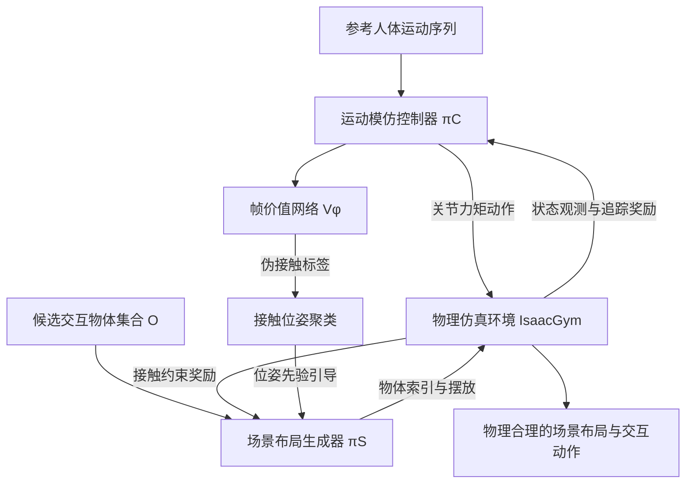

## 一句话总结

INFERACT 把「给动捕人物配场景」建模成物理仿真中的运动追踪最大化问题，用强化学习同时优化运动模仿控制器与场景布局生成器，从人体运动反推出能支撑其交互的物体及摆放，从而生成无穿插、无漂浮的物理合理场景。

## 研究背景

在影视与游戏制作中，角色动作常在蓝幕摄影棚里采集，现场并没有真实的家具与物体。这就导致规划动作与实际采集动作之间存在偏差，动画师往往需要手动挑选合适的家具（比如一把椅子）、摆到正确位置，再调整人物动作去贴合它。若能自动为给定动作生成一个合理的交互场景，就能显著减轻这一繁琐负担。

已有的从人体运动合成场景布局的方法存在两类问题。一类是数据驱动方法，只能输出房间布局的语义包围盒，不建模人与物体的接触关系；另一类基于网格的方法（如 SUMMON、MIME）通过接触与碰撞损失做后优化来放置物体，但这类软约束无法保证物理正确的交互，接触时仍会出现穿插与漂浮等物理违背现象，而且依赖预训练的接触语义预测器，泛化到不同动作类型的能力受限，可交互物体类别也不够丰富。

作者提出：在物理仿真环境中模拟虚拟角色，从而施加更严格的物理约束；并基于人与场景的物理关系来推断被接触的物体，其核心直觉是——现实世界里人需要物体来支撑交互。

## 方法

整体框架：给定一段人体运动序列与一个候选交互物体集合，框架把场景布局生成表述为「在物理仿真中最大化运动追踪分数」的优化问题，并对两个模块做联合（对偶）优化——一个运动模仿控制器驱动仿真角色去追踪参考动作，一个场景布局生成器预测合适的接触物体及其摆放。两者共用运动追踪奖励作为目标，用强化学习（PPO）在 GPU 并行仿真器 IsaacGym 中训练。

关键设计：

- 场景—角色联合优化：给定长度为 $$T$$ 的运动序列 $$m=p_{1:T}$$ 与 $$N$$ 个物体的集合 $$O=\lbrace o_i\rbrace_{i=1}^{N}$$，目标是找到最优的物体子集与摆放 $$\lbrace o^{*}_{i_j}\rbrace$$、$$\lbrace q^{*}\rbrace$$，使仿真角色在物理约束下尽可能复现参考动作 $$\hat p_{1:T}\approx p_{1:T}$$。

- 运动模仿控制器：把物理追踪建模为马尔可夫决策过程用强化学习求解。策略 $$\pi_C(s_t)$$ 输出目标关节位置作为动作，经 PD 控制器换算为力矩驱动一个 28 自由度的人形角色。状态由本体感知、场景布局状态与相对追踪特征三部分构成。追踪奖励综合根位置、根朝向、根速度、关节位置、关节速度与关键身体点：
$$r_t=w_p r^{p}_t+w_o r^{o}_t+w_v r^{v}_t+w_{jp} r^{jp}_t+w_{jv} r^{jv}_t+w_k r^{k}_t$$

- 接触约束奖励重塑：单纯的追踪奖励在角色尚未真正接触物体时反馈稀疏。为此对生成器奖励引入二值乘子，只有当人与物体发生接触时才给予奖励，把追踪问题转化为带接触约束的分数最大化：
$$R_{track}=\mathbb{1}\left(\sum_{t=1}^{T}c_t>0\right)\sum_{t=1}^{T}\gamma^{t} r_t$$

- 无监督伪接触标签：不同于依赖预训练接触估计器的做法，作者训练一个隐式帧价值函数 $$V_\phi(p_t,c_t)$$，用运动模仿控制器 critic 网络的价值估计作监督：
$$L_{frameval}=\lVert V_\phi(p_t,c_t)-r_t-\gamma\hat V(s_{t+1})\rVert_2^2$$
再通过比较「有接触」与「无接触」两种查询下的预测价值来推断伪接触标签：
$$\hat c_t=\mathbb{1}\left(V_\phi(p_t,1)-V_\phi(p_t,0)>0\right)$$

- 接触位姿先验引导：对被判为接触的人物骨盆位姿做聚类，聚类中心 $$\bar q_r=(t_x,t_y,r_{yaw})$$ 作为物体位置的粗略指示，聚类数还可指示交互物体数量。最终生成器奖励为：
$$R=R_{track}+\alpha\lVert q-\bar q_r\rVert_2^2$$

## 实验结果

在 SAMP、PROX 室内动作及户外撑越（vaulting）动作上评测，物体集含 3D-Future 的 32 件家具（椅、沙发、桌、床）。用追踪分数与成功率衡量物理合理性：成功指关键身体点最大追踪误差小于 0.3m；对基于网格的 SUMMON 则以无明显穿插（非碰撞分数低于 0.85）判定成功。

| 方法 | 追踪分数 | 成功率 |
| --- | --- | --- |
| SUMMON | - | 0.53 |
| SUMMON in physics | 0.61 | 0.68 |
| Ours w/ POSA | 0.67 | 0.84 |
| Ours | 0.67 | 0.84 |

结果显示本方法生成的场景物理合理性显著优于 SUMMON 与 MIME，且用无监督伪接触标签（Ours）与使用真值接触（Ours w/ POSA）性能相当，说明无需预训练接触估计器即可迁移到新动作。消融实验表明：接触约束相比纯强化学习明显加速学习，位姿先验进一步提升收敛后的追踪分数，并能抑制「作弊式」摆放（例如让角色靠在扶手上而非真正坐下）。方法还能生成同一动作下多样的物体选择（如为坐姿动作以 0.82 概率选中最合适的椅子，几乎不选桌子），并可直接泛化到户外撑越动作。

## 亮点与局限

亮点：把场景生成重构为物理仿真中的运动追踪最大化，用物理约束从根本上避免穿插与漂浮，而非事后软约束修正；对偶优化框架让控制器与布局生成器共享奖励、协同进化；提出无监督的帧价值函数来估计伪接触标签，摆脱对预训练接触估计器的依赖，从而能泛化到室内数据未覆盖的户外动作；接触约束与位姿先验的奖励塑形有效缓解稀疏反馈与奖励作弊。

局限：所有物理交互都用刚体接触近似，难以精确刻画真实世界中复杂的人—场景动力学，接触时仍可能出现运动抖动等视觉瑕疵；支持的交互关系范围有限，尚未覆盖更广泛的交互类别。

## 延伸思考

这项工作最值得借鉴的一点，是把「物理仿真」当作生成任务的隐式判据：与其训练模型去预测接触语义，不如让角色在仿真里真正去交互，用能否完成追踪来反推场景该长什么样。这种「用可执行的物理反馈替代数据标签」的思路，天然带来了对分布外动作的泛化能力，也让无监督伪接触标签成为可能。顺此方向，若能把刚体接触升级为更细粒度的柔性或关节体接触建模，并引入更综合的交互目标，或许能覆盖搬运、攀爬、多人协作等更丰富的人—场景交互，让自动配景真正走向通用。
