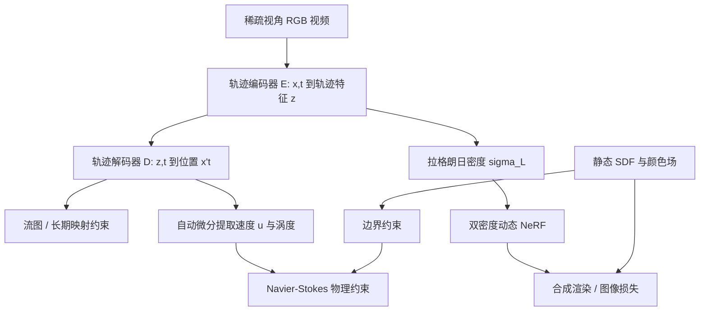

## 一句话总结

提出神经特征轨迹场（Neural Characteristic Trajectory Field），用欧拉神经场隐式建模拉格朗日流体轨迹，把长期守恒约束与短期物理先验统一到端到端训练中，从稀疏视角 RGB 视频重建出解耦的烟雾、速度、涡度与障碍物几何。

## 研究背景

从稀疏视角 RGB 视频重建物理合理的流体面临诸多困难：遮挡带来的不确定性、密度与光照的歧义、以及静态与动态成分的纠缠。已有把物理信息神经网络（PINN）与神经辐射场（NeRF）结合的工作（如 PINF、HyFluid）主要施加短期物理约束，通过偏微分方程作为软约束逐帧监督，但缺乏长期守恒监督，容易陷入局部最优，导致重建结果平滑且耗散。

在前向流体仿真中，特征映射法（Method of Characteristic Mapping, MCM）通过追踪流图（flow map）实现长期守恒，能较好地保留涡度。但把 MCM 用于重建并不容易：它需要在每次训练迭代中做参数敏感的速度积分，还要为每次积分做反向计算，代价高昂。本文的目标是同时利用长期与短期物理约束，缓解稀疏观测下的不确定性。

## 方法

### 整体框架

方法把场景解耦为两部分：用带符号距离场（SDF）与颜色场表示的静态障碍物，用随时间变化的 NeRF 表示的动态烟雾。核心是神经特征轨迹场，它由一个轨迹编码器 $E$ 与一个轨迹解码器 $D$ 组成，为长期映射约束与短期物理先验提供统一的可微分基础；SDF 重建的障碍物几何进一步提供流体的边界条件。

### 关键设计

神经特征轨迹场。假设每条粒子轨迹拥有一个高维特征嵌入 $z\in\mathbb{R}^{D}$（实现中 $D=16$），编码器学习欧拉坐标到该特征的映射 $z=E(x,t)$，解码器把特征还原为轨迹上任意时刻的位置 $x(t)=D(z,t)$。给定一个四维点与目标时刻 $t'$，一次前向传播即可得到对应位置 $x'=D(E(x,t),t')$，从而以闭式形式给出速度积分：

$$\int_{t}^{t'} u\, d\tau = x' - x = D(E(x,t),t') - D(E(x,t),t)$$

这一表示是拓扑无关且可自动微分的，支持超过 50 帧的长期映射，避免了逐帧数值积分。

物理信息学习。训练包含两类自监督。其一是内在约束（Intrinsic Constraints），源自轨迹的拉格朗日本质：自映射约束要求粒子被映射回自身，长期一致性约束要求同一轨迹上的特征保持一致，特征输运约束要求特征满足输运方程：

$$L_{feature}=\left\lVert \frac{\partial E(x,t)}{\partial t} + u\cdot\nabla E(x,t) \right\rVert_{2}^{2}$$

其二是物理约束（Physical Constraints），欧拉速度等于对解码器关于时间的偏导 $u(x,t)=\partial D(z,t)/\partial t$，由此通过二阶自动微分得到物质导数，配合输运方程、Navier-Stokes 方程与无散度约束，并借助协向量平流（covector advection）施加长期速度映射约束。

双密度 NeRF。为缓解稀疏视角下密度的欠定问题，保留细节 NeRF 密度 $\sigma_{N}$ 作为场景表示（自由度大、含高频细节），同时引入以轨迹特征为输入的拉格朗日密度 $\sigma_{L}=F_{L}(E(x,t))$（受物理强约束、梯度更结构化），用后者引导速度学习、用前者补充细节，并用蒸馏损失 $\lvert \sigma_{N}-\sigma_{L}\rvert$ 联系两者。

障碍物与场景解耦。用 NeuS 把静态障碍物表示为 SDF，据此判断点是否位于物体内部，施加边界约束：物体内部无烟雾、流体速度沿表面法向为零 $u\cdot n_{x}=0$。为分离静态与动态成分，把动态元素视为"半透明遮挡"，用带可见度权重的遮挡图像损失让静态模型从"被遮挡"的图像中重建持久成分，再逐渐过渡到合成渲染损失。

## 实验结果

在三个含障碍物的合成场景上与 PINF 对比，新视角合成质量全面领先：

| 数据集 | PINF PSNR↑ | Ours PSNR↑ | PINF LPIPS↓ | Ours LPIPS↓ |
| --- | --- | --- | --- | --- |
| Cylinder | 25.01 | 28.28 | 0.1611 | 0.1473 |
| Game | 21.72 | 26.99 | 0.3187 | 0.2140 |
| Car | 22.89 | 24.45 | 0.1778 | 0.1481 |
| 平均 | 23.21 | 26.57 | 0.2192 | 0.1698 |

物理属性的体素级 $l_{2}$ 误差同样更低（密度 0.0058 对 0.0083，速度 0.0703 对 0.2781，散度 0.0034 对 0.0083）。在 ScalarFlow 真实上升烟羽数据上，本文取得最优 FID 166.6，优于 PINF 的 172.8 与 HyFluid 的 187.7，密度噪声更低、涡度更锐利。

## 亮点与局限

亮点：提出混合欧拉–拉格朗日的轨迹表示，首次以闭式自动速度积分实现任意帧间的高效流图计算；把长期守恒约束与短期物理先验统一进 NeRF 重建；通过自监督实现静态障碍物与动态流体的解耦，并用高保真 SDF 几何提供此前难以获得的边界约束。

局限：稀疏视角下捕捉高频细节的能力仍受限，这是基于 NeRF 方法的共同瓶颈；轨迹编解码器因自动微分的时间复杂度而规模较小，进一步影响细节；方法假设无黏流体并弱化压强差影响，可能难以准确重建复杂的烟雾或液体行为。

## 延伸思考

这项工作的核心价值在于用神经场把"轨迹特征沿流线不变"这一拉格朗日直觉变成可微分的闭式表示，从而绕开了传统特征映射法在重建中逐帧积分的高昂代价。它把仿真界成熟的守恒思想（特征映射、协向量平流）迁移到了逆问题重建，是物理先验与神经表示结合的一个有代表性的范式。作者也指出可结合 3D Gaussian Splatting 与高阶可微网络来提升稀疏视角下的重建效率与细节，以及探索入流、压强估计乃至多物理现象，这些都是值得跟进的方向。
