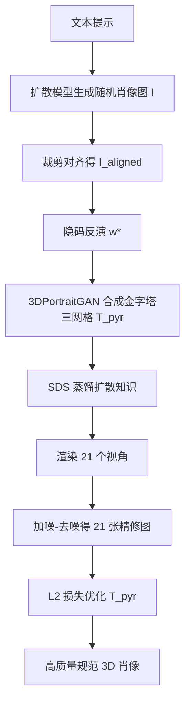

## 一句话总结

Portrait3D 用一个能生成 360° 完整头肩 3D 肖像的 3D 感知 GAN（3DPortraitGAN，配金字塔三网格表示）作为联合几何-外观先验，再用扩散模型的分数蒸馏与图像精修优化，从文本生成高质量、视角一致且规范的 3D 肖像。

## 研究背景

基于神经渲染的文本到 3D 肖像生成通常借助人体几何先验（SMPL、FLAME、DensePose、imGHUM 等）配合扩散模型提供引导。但只依赖几何信息会带来一系列问题：Janus 问题（多面/正反面重复）、纹理不一致或不真实、以及在粗糙初始化上直接施加分数蒸馏采样（SDS）导致的过饱和与过平滑。

作者认为，要生成真实且高质量的 3D 肖像，需要一个稳健的联合几何-外观先验，它既要包含完整头部的几何与外观信息，又要有足够表达力去刻画多样的肖像。为此，作者主张用 3D 感知 GAN 作为先验，它学习了肖像几何与纹理的联合分布。但直接在许多 3D 感知 GAN 常用的基于特征图的 3D 表示（三平面/三网格）上做 SDS，会因表示中被独占的高频信息而产生明显的「网格状」伪影（grid-like artifact）。Portrait3D 正是围绕「用 GAN 先验 + 缓解网格伪影的新表示 + 扩散精修」来解决这些问题。

## 方法

整体框架：先训练 3DPortraitGAN（金字塔三网格版）作为能产出 360° 规范头肩肖像的先验；生成时，给定文本提示，先用扩散模型随机生成一张对齐的肖像图并反演（inversion）到生成器隐空间得到隐码 $$w^*$$，据此合成金字塔三网格作为起点；随后冻结神经渲染器，用 SDS 把扩散模型知识蒸馏进金字塔三网格；最后用扩散模型精修多视角渲染图，再以精修图为监督优化三网格，消除不真实颜色与伪影。

关键设计：

- 金字塔三网格（pyramid tri-grid）：原始三网格 $$T\in\mathbb{R}^{3\times3\times32\times256\times256}$$ 是单分辨率的基于特征图表示，独占高频信息会在 SDS 中诱发网格状伪影。作者受多分辨率哈希编码启发，构造包含多种分辨率的三网格金字塔 $$T_{pyr}=[T_8\in\mathbb{R}^{3\times3\times12\times8\times8},\cdots,T_{512}\in\mathbb{R}^{3\times3\times12\times512\times512}]$$，分辨率取 $$\lbrace 8,16,32,64,128,256,512\rbrace$$，通道维取 12。查询特征时把不同分辨率三网格上的特征求和聚合，从而在保留细节与抑制高频噪声之间取得更好平衡。

- 3D 感知金字塔三网格生成器：在原始 2D StyleGAN 骨干上加入一个 3D 感知分支（受 Mimic3D 启发）以加强跨特征图上 3D 相关位置间的通信。每层 2D 分支输出特征图 $$F_{2D}$$ 送入 3D 分支，3D 感知块经 $$\times2$$ 上采样得到 $$F_{3D}$$ 并 reshape 为一层三网格，同时 $$F_{3D}$$ 继续送往下一 3D 层，逐层堆出金字塔三网格。神经渲染流程为 $$x_{rgb}=R(T,c,w)$$：点沿光线采样投影到三网格查询特征，求和后经解码器得颜色特征与密度做体积渲染，再由隐码调制的 ToRGB 模块转为 RGB。

- 基于扩散的 3D 肖像生成：以 $$T_{pyr}=G(w^*)$$ 为起点，冻结神经渲染器，用 SDS 把扩散模型知识蒸馏进金字塔三网格：
$$\nabla_{\theta}\mathcal{L}_{SDS}=\mathbb{E}_{t,\epsilon}\left[\omega(t)\left(\hat{\epsilon}_{\phi}(z_t;y,t)-\epsilon\right)\frac{\partial z_0}{\partial x}\frac{\partial x}{\partial\theta}\right]$$
其中 $$x=R(T_{pyr},c,w^*)$$ 为渲染图，$$z_0$$ 为其经自编码器编码的隐变量，$$y$$ 为文本嵌入，$$\theta$$ 为三网格参数。

- 基于扩散的 3D 肖像优化：SDS 后仍有不自然伪影。作者渲染 21 个视角（7 个均匀方位角 $$[0°,360°]$$，每个配 3 个俯仰角区间 $$[55°,65°]$$、$$[85°,95°]$$、$$[115°,125°]$$），对渲染图加固定噪声再用扩散模型去噪得到无伪影的精修视图，最后以精修视图为目标做 $$L_2$$ 优化：
$$\theta^*=\arg\min_{\theta} L_2\left(x^c_{refined},\ R(T_{pyr},c,w^*)\right)$$
优化时保持神经渲染器参数不变，得到最终高质量、视角一致的 3D 肖像。

## 实验结果

作者与面向通用物体的文本到 3D 方法（DreamFusion、LucidDreamer）以及面向 3D 肖像/化身的方法（TADA、AvatarCraft、AvatarStudio、HumanGaussian、AvatarVerse、HumanNorm、SEEAvatar、TECA）对比。评测包含 20 名参与者的用户研究（对渲染视频按整体质量与提示对齐度打 1∼5 分）、FID（渲染视图与扩散模型生成图的分布距离）和 CLIP Score（提示与视图的语义对齐）。下表为 25 个提示上的平均结果（可获取代码的方法）。

| 方法 | 质量↑ | 对齐↑ | FID↓ | CLIP Score↑ |
| --- | --- | --- | --- | --- |
| DreamFusion | 1.10 | 1.54 | 285.5 | 0.61 |
| LucidDreamer | 2.28 | 3.36 | 202.5 | 0.65 |
| TADA | 2.57 | 3.24 | 197.2 | 0.68 |
| AvatarCraft | 1.25 | 1.40 | 248.9 | 0.57 |
| HumanGaussian | 3.30 | 3.66 | 203.9 | 0.73 |
| HumanNorm | 3.41 | 2.90 | 163.1 | 0.67 |
| Ours | 4.77 | 4.69 | 110.6 | 0.80 |

结果显示 Portrait3D 在质量、对齐、FID、CLIP Score 上均领先。消融实验表明：相比单分辨率三网格，金字塔三网格显著缓解了（尤其在 T 恤等区域明显的）网格状伪影，渲染更平滑真实；在随机初始化上直接 SDS 会出现 Janus 问题，只用 GAN 先验而不优化会有不自然颜色，二者结合才能得到几何与外观都更真实的结果。运行时上，单张 RTX 4090（24GB）约需 0.5 小时（反演约 4 分钟、生成约 22 分钟、优化约 5 分钟），在 12GB 显存的 RTX 3080Ti 上约需 1.5 小时。

## 亮点与局限

亮点：用 3D 感知 GAN 提供联合几何-外观先验，从根本上抑制了 Janus 问题、过饱和与过平滑；提出金字塔三网格这一多分辨率特征表示，专门缓解 SDS 在特征图表示上的网格状伪影；「SDS 蒸馏 + 扩散精修再优化」的两阶段流程进一步提升真实感；生成结果为 360° 规范空间的完整头肩肖像，且 12GB 显存即可运行。

局限：受反演方法影响，部分结果并非完全规范，会残留形变；提示中的背景语义会串到主体（如「雪山背景」使头发出现意外的雪）；仍有语义不一致（正面 T 恤、背面却像马甲）；几何有时不准（发辫被硬编码为纹理而未体现在几何上）；受训练数据与网络结构限制，只能生成头、颈、肩区域；细节丰富度与网格伪影抑制之间存在权衡，需要谨慎选学习率。作者也提示了真实 3D 肖像生成的伦理风险，强调需经本人同意。

## 延伸思考

Portrait3D 的核心思路是把「学到联合几何-外观分布的生成式先验」放到文本到 3D 的起点，用一个稳健初值替代仅靠几何模板的粗初始化，这对缓解 SDS 的固有病态很有启发；而金字塔/多分辨率表示对抑制高频伪影的作用，也提示后续基于特征图的 3D 表示在做蒸馏优化时应关注频率结构。作者展望的方向包括：用更强的几何感知扩散模型（如 HyperHuman）改善几何、用背面外观幻构器解决正反语义不一致、以及用 3D 全身生成器突破仅头肩的范围。把这类「GAN 先验 + 扩散蒸馏 + 精修」范式迁移到说话头、3D 化身重建等任务，值得进一步探索。
