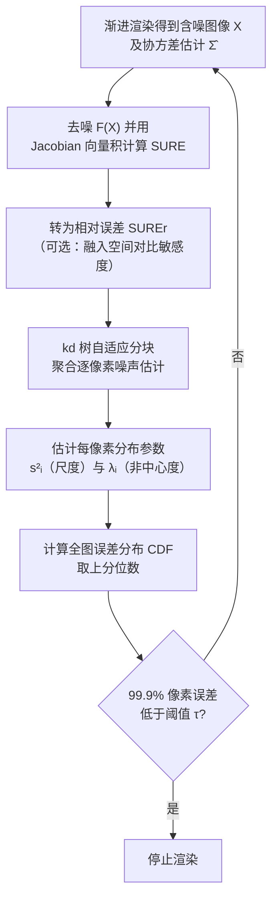

## 一句话总结

本文为"蒙特卡洛光线追踪 + 深度学习去噪"的渲染流程提出了一套实用的全局误差估计框架：在合理假设下证明去噪像素的平方误差服从缩放的非中心卡方分布，并通过分层聚合逐像素的偏差与方差估计来求出分布参数，进而给出一个只需指定误差阈值、无需人工试错设置采样数的自动停止准则。

## 研究背景

路径追踪等蒙特卡洛算法已成为生产渲染的事实标准，但不同场景之间、乃至同一场景图像空间内部的采样方差普遍是非均匀的。这意味着渲染到可接受的误差水平往往需要用户反复试错，去猜测某个场景合适的采样数。

蒙特卡洛去噪本质上是"用偏差换方差"，它进一步使这一过程复杂化：容易被人眼察觉的随机噪声被抹掉后，艺术家失去了判断收敛程度的直观线索，重要细节也可能被模糊掉。已有工作虽然通过自适应采样、保证一致性等方式改善去噪收敛，却没有解决"如何估计去噪图像的全局误差以支持停止准则"这一问题。

对于无偏渲染，图像误差可直接用样本方差估计，用户便能指定最大误差而非采样数。但去噪器不可避免地引入偏差（估计器的均方误差 MSE 等于方差加偏差平方），且现代去噪器多基于深度学习，其偏差并不显式可见。此前用于估计去噪图像 MSE 的手段包括误差预测网络、双缓冲法与 Stein 无偏风险估计（SURE）。本文聚焦 SURE，并指出它作为停止准则时的两大问题：在低采样数下噪声很大；它估计的是逐像素平方误差的期望值，而非某一次实现的实际误差。

## 方法

### 整体框架

设去噪器为 $F:\mathbb{R}^N \mapsto \mathbb{R}^N$，$X\in\mathbb{R}^N$ 为含 $N$ 个像素通道的未去噪渲染图像。作者把去噪像素 $F_i(X)$ 用邻域像素的加权平均加偏差来近似（即其泰勒展开的前两项）：

$$F_i(X) = W_i^{\top} X + b_i$$

在中心极限定理下假设 $X$ 服从均值 $\mu$、协方差 $\Sigma$ 的正态分布，则误差 $F_i(X)-\mu_i$ 也是正态的，其均值与方差为：

$$\mu_{e,i} = W_i^{\top}\mu + b_i - \mu_i, \qquad s_{e,i}^2 = W_i^{\top}\Sigma\, W_i$$

由此，误差的平方服从自由度为 $1$ 的缩放非中心卡方分布 $s_i^2\,\chi^2_{1,\lambda_i}$，其中缩放参数 $s_i^2 = s_{e,i}^2$，非中心参数 $\lambda_i = \mu_{e,i}^2 / s_{e,i}^2$。这一分布正向偏斜，因此对平方误差施加确定性上界不切实际，只能采用概率意义上的界。上述结论同样适用于相对平方误差（RelSE，即平方误差除以一个常数）。

整体流程如下：

### 关键设计

基于 SURE 的相对误差估计。SURE 可无偏估计正态随机变量均值点估计的 MSE。用于去噪图像时，逐像素期望平方误差估计为：

$$\mathrm{SURE}[F_i(X)] = (F_i(X)-X_i)^2 + 2\,(J_F(X)\,\Sigma)_{ii} - \Sigma_{ii}$$

其中 $J_F(X)$ 是去噪器在 $X$ 处的雅可比矩阵。由于该量偏向图像最亮处，作者除以去噪像素最大通道值的平方（加一个正 $\varepsilon$）得到相对平方误差的（有偏但可接受的）估计。

融入空间对比敏感度。相对平方误差常在锐利边缘等小的走样细节处形成单像素峰值，而这些在正常观看条件下未必有感知意义。受 FLIP 误差度量启发，作者以 $Y c_x c_z$ 对立色空间中的一组低通滤波器表达人眼的空间对比敏感度。由于所涉操作（色彩变换与滤波卷积）均为线性，可推导出融入该矩阵 $M$ 的无偏误差估计：

$$\mathrm{SURE}_M[F_i(X)] = (M F(X) - M X)_i^2 + \big(M\Sigma(2 J_F^{\top}(X)-I) M^{\top}\big)_{ii}$$

其证明依赖 Stein 引理的多元形式。中间的迹型项通过二次型的期望性质，用从 $\mathcal{N}(0,\hat{\Sigma})$ 采样的随机向量 $\epsilon$ 配合雅可比向量积（前向模式自动微分）来估计，避免显式构造雅可比矩阵。

kd 树自适应分块。逐像素 SURE 虽无偏但方差极高，常出现负值。作者在图像空间构造 kd 树，沿最长轴自适应地把像素块分裂，只要分裂后两个子块的块平均 SURE 估计仍可靠即继续分裂。分裂判据源自 Bellec 与 Zhang 的结论：当实际误差量级大于 $\sigma^2 N^{1/2}$ 时 SURE 才可靠。对某块 $B$ 的每个子块 $B_j$ 与各颜色通道 $C_k$，若下式成立则分裂：

$$\lvert B_j\cap C_k\rvert^{-1/2}\sum_{i\in B_j\cap C_k}\hat{\Sigma}^r_{ii} < \sum_{i\in B_j\cap C_k}\mathrm{SUREr}[F_i(X)]$$

估计分布参数与停止准则。将每像素误差建模为 $s_i^2\,\chi^2_{1,\lambda_i}$：尺度 $s_i^2$ 取去噪像素的相对方差估计；非中心参数由块估计的 SURE 与块内方差之比按比例确定：

$$\lambda_i = \max\!\left(\frac{\sum_{j\in B(i)\cap C(i)}\mathrm{SUREr}[F_j(X)]}{\sum_{j\in B(i)\cap C(i)}\mathrm{Varr}[F_j(X)] + 10^{-6}},\ 1\right) - 1$$

有了参数即可算出全图误差分布的累积分布函数 $F(x) = (1/N)\sum_i F_i(x)$，估计误差低于阈值 $\tau$ 的像素比例，并据此定义停止函数 $P_F(X\mid p,\tau) = \mathbf{1}[F(\tau)\ge p]$。实践中固定 $p=0.999$，即要求 $99.9\%$ 的像素误差低于用户指定阈值 $\tau$。

## 实验结果

实现基于 Mitsuba 3 渲染、Intel Open Image Denoise 加后校正去噪，并配合自适应采样，以 $32$ spp 为迭代步长渐进评估。在 $20$ 个公开场景、$6$ 个阈值上，将本方法的终止采样数与"$99.9\%$ 像素真正达到阈值时的采样数"对比。"良好一致"定义为在真实采样数的三分之一或一步（$32$ spp）以内停止。

| 实验设置 | 良好一致案例 | 备注 |
| --- | --- | --- |
| SUREr（相对平方误差阈值） | 52 / 60（87%） | 失败多为场景相关 |
| SUREr$_M$（融入空间对比敏感度） | 49 / 60（82%） | 估计量级更小，阈值取更小 |

在开销方面，以 BATHROOM 场景（$1024\times1024$）为例，去噪与 SURE 计算耗时 $90$ 毫秒、分块 $29$ 毫秒、停止函数 $11$ 毫秒，相对每次迭代 $3.2$ 秒的渲染时长仅约 $4\%$ 额外开销；若已在用自适应采样，因去噪与雅可比向量积本就要算，停止准则仅带来 $1\%\sim2\%$ 的运行时增量。与仅估计方差的既有工作相比，本方法通过可靠估计非中心参数 $\lambda_i$，能同时计入偏差，避免了对平方误差的低估。

## 亮点与局限

亮点在于把去噪图像的误差估计建立在明确的统计模型上：证明平方误差服从非中心卡方分布，用 kd 树分层聚合把高方差的逐像素 SURE 变得可靠，同时兼顾方差与偏差，最终只用一个误差阈值参数就实现跨场景一致的自动停止，几乎不增加运行开销，并可选地融入感知层面的空间对比敏感度。

局限方面：SURE 依赖样本均值近似正态的假设，而实际采样分布可能存在离群点甚至无限方差（如含镜面/折射的场景），导致收敛缓慢与误差估计失准，是主要失败来源；分裂判据在 SURE 被错误估计为过小或负值时会失效，有时需先预分成较小块；所借用的理论结论未计入协方差矩阵估计本身带来的额外方差与异方差性；感知度量受"仅线性操作、仅平方差"的限制，色差在线性 RGB 空间按通道等权计算，更具感知相关性的可无偏估计度量仍是未来工作。

## 延伸思考

这项工作提示，去噪时代的渲染质量控制需要从"估计方差"转向"估计完整的误差分布"，而把偏差与方差统一到一个可解析的分布族（非中心卡方）中，是让"指定质量、自动停止"变得实用的关键一步。其分层聚合噪声估计的思路，本质上是在统计可靠性与空间分辨率之间做权衡，这一权衡在自适应采样、误差可视化、乃至神经渲染的置信度评估中都可能复用。若能放宽正态性假设、处理重尾与无限方差场景，并找到可无偏估计的更强感知度量，这类框架有望成为生产渲染中默认的、面向用户的质量旋钮。
