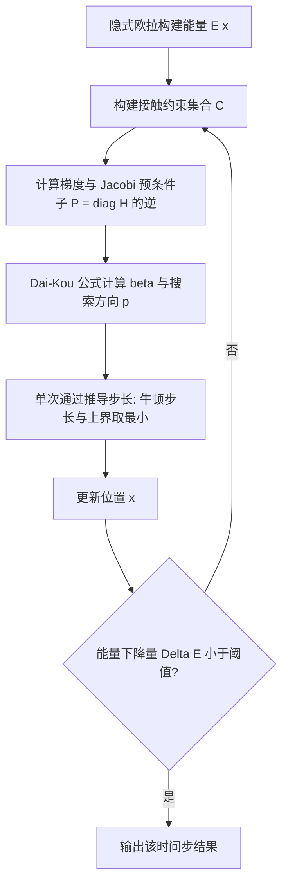

## 一句话总结

提出一种 Jacobi 预条件的非线性共轭梯度（PNCG）方法，直接对内点法（IPC）构建的无约束优化问题求解，配合单次通过的步长推导与简化的 Hessian 计算，在 GPU 上实现超过 10 万四面体、复杂自碰撞场景下的实时超弹性仿真。

## 研究背景

弹性可变形体的接触仿真广泛应用于手术训练、机器人、AR／VR 与数字时尚等领域，但弹性本身的非线性与非凸特性，加上接触的非光滑行为，使得鲁棒且精确的仿真非常困难。近年提出的增量势接触（Incremental Potential Contact，IPC）用对数障碍函数近似碰撞与接触带来的不等式约束，把问题转化为无约束优化，再用牛顿法求解，因而具备鲁棒、精确、可微的优点。

但 IPC 的主要瓶颈在于速度，具体有两处开销：

- 每次牛顿迭代都要求解由牛顿法导出的大规模线性系统；
- 线搜索依赖连续碰撞检测（CCD）来确定无穿透的最大步长，CCD 计算昂贵且难以在 GPU 上并行，且即便有 CCD 给出的上界，仍需回溯线搜索才能保证收敛。

作者的关键观察是：既然整体优化问题本身高度非线性，与其"先用牛顿法、再用线性共轭梯度解子系统"，不如直接用非线性共轭梯度（NCG）方法求解整个优化问题。NCG 过去在仿真领域少被采用，原因是它需要多次向量点积；但随着 GPU 硬件与并行技术进步，点积开销已大幅下降（例如 15K 顶点模型上一次向量点积从早期的 0.41 ms 降到约 0.012 ms），这一瓶颈不再成立。

## 方法

### 整体框架

方法建立在隐式欧拉离散化的变分优化上。第 $t+1$ 步的位置通过最小化"惯性势 + 超弹性能量 + 障碍势"求解：

$$E(x) = \frac{1}{2}(x-\tilde{x})^{\top} M (x-\tilde{x}) + h^{2}\Psi(x) + \kappa \sum_{k \in C} b(d_k(x))$$

其中 $\tilde{x} = x_t + h v_t + h^{2} M^{-1} f_{ext}$，$\Psi$ 为超弹性能量，$b$ 为 IPC 的对数障碍函数，$\hat{d}$ 控制碰撞排斥阈值、$\kappa$ 控制排斥强度。求解不再用牛顿法，而是用预条件非线性共轭梯度直接优化 $E(x)$。

整体流水线如下：

### 关键设计

一、共轭梯度算法选择。作者比较了多种 NCG 变体（CD、HZ、FR、PRP、DK），发现 Dai-Kou（DK）算法在鲁棒性与收敛速度上表现最佳。其搜索方向更新为：

$$p_{k+1} = -g_{k+1} + \beta_k^{DK} p_k$$

$$\beta_k^{DK} = \frac{g_{k+1}^{\top} y_k}{y_k^{\top} p_k} - \frac{y_k^{\top} y_k}{y_k^{\top} p_k}\cdot\frac{p_k^{\top} g_{k+1}}{y_k^{\top} p_k}$$

其中 $y_k = g_{k+1} - g_k$。DK 的 $\beta$ 由"最接近尺度化无记忆 BFGS 方向"推导而来，兼具高效与鲁棒。

二、Jacobi 预条件。采用 $P = \operatorname{diag}(H)^{-1}$ 作为预条件子。由于障碍函数的对数项，靠近碰撞的顶点 $\operatorname{diag}(H)$ 值很大，从而其搜索方向尺度变小，无碰撞顶点尺度较大，最终各顶点收敛速率趋于一致，有效缓解此前方法中的"锁死"（locking）问题。得益于对角 Hessian 计算的简化，预条件子可与梯度在同一循环内每次迭代都重新求值，而非隔多次迭代才更新一次。

三、单次通过的线搜索。这是加速的核心之一。由于弹性高度非线性、障碍函数的 Hessian 在相邻迭代间可能剧烈变化，插值法与 Barzilai-Borwein 都难以给出合适步长。作者改用牛顿法线搜索，对目标函数做二次近似：

$$\alpha = -\frac{g_{k+1}^{\top} p_{k+1}}{p_{k+1}^{\top} H_{k+1} p_{k+1}}$$

再受"CFL 启发的裁剪"思想约束，限制顶点最大位移小于 $\hat{d}/2$，得到步长上界 $\alpha_{upper} = \hat{d} / (2\lVert p_{k+1}\rVert_{\infty})$，最终步长取 $\alpha = \min(\alpha_{upper}, \alpha)$。这样一次即可推出合适步长，完全省去线搜索中的碰撞检测模块。

四、简化并行的 Hessian 计算。方法只需要 $\operatorname{diag}(H)$（用于预条件）与 $p^{\top} H p$（用于线搜索），无需组装完整 Hessian。对超弹性部分，借助 $I_1, I_2, I_3$ 不变量把 $\partial^2\Psi/\partial x^2$ 拆成六项，每项以极少浮点运算完成——对 Neo-Hookean，计算 $\operatorname{diag}(\partial^2\Psi/\partial x^2)$ 与 $p^{\top}(\partial^2\Psi/\partial x^2)p$ 分别仅需 143 与 314 FLOPs，而先算 $\partial^2\Psi/\partial F^2$ 再做矩阵乘则需 624 与 3590 FLOPs。对障碍函数部分，作者引入向量 $t$ 统一表示点-三角形（PT）与边-边（EE）距离，使 $\partial^2 t/\partial x^2 = 0$，从而只需两个可完全并行的 for 循环（一个遍历四面体、一个遍历接触约束）即可完成全部 $\operatorname{diag}(H)$ 与 $p^{\top} H p$ 计算。

五、实现细节。采用较大的 $\hat{d}$ 加速收敛（建议取平均边界边长的 30%～70%），并用空间哈希在静止姿态预筛除自碰撞约束；对多物体或长条物体，按碰撞／非碰撞部分拆分，分别使用独立的步长 $\alpha$ 与方向 $p$，进一步提升收敛速度。终止条件用能量下降量的相对判据 $\Delta E < \epsilon \Delta E_0$。

## 实验结果

实验在 NVIDIA RTX 4090 GPU 与 Intel Core i9-13900X 上进行，使用 Taichi 与 MeshTaichi 做 GPU 加速、单精度浮点。消融实验表明：在预条件一致的前提下，各 PNCG 变体均优于 Chebyshev 加速的下降法，其中 DK 收敛最快；PNCG 每次迭代约 1.2 ms，而牛顿法每次迭代需超过 400 ms。

主要场景性能如下（均在 RTX 4090 上）：

| 场景 | 材料 | 四面体数 | 平均迭代 | FPS 平均（最低） |
| --- | --- | --- | --- | --- |
| 拖拽 armadillo | SNH | 55K | 108.1 | 40.1（25.0） |
| 8 个 "E" 下落 | NH | 27K | 32.8 | 46.6（24.3） |
| 48 个 "E" 下落 | ARAP | 164K | 25.0 | 32.2（27.9） |
| 四条长面条 | ARAP | 101K | 24.9 | 27.6（25.8） |
| 挤压四个 armadillo | ARAP | 168K | 24.1 | 28.9（25.6） |
| 扭转垫子 | FCR | 133K | 138 | 7.4（5.6） |
| 扭转四根杆 | FCR | 202K | 107.5 | 10.2（6.9） |

作为对比，原始 CPU 版 IPC 在扭转垫子场景下每个时间步需约 33 秒，最新方法在类似场景下约 1 FPS，而本方法在超过 10 万四面体的复杂自碰撞场景下达到实时或近实时速度，并对所有示例逐帧做离散碰撞检测验证无穿透。

## 亮点与局限

亮点：

- 换了个视角——直接用非线性共轭梯度求解整个 IPC 优化问题，而非"牛顿法外层 + 线性 CG 内层"，形式简洁且天然适合 GPU 并行。
- 单次通过的牛顿法线搜索配合基于 $\hat{d}/2$ 的步长上界，彻底移除迭代内的 CCD，是速度提升的关键。
- 将超弹性与障碍函数的 $\operatorname{diag}(H)$、$p^{\top} H p$ 计算简化到与算梯度同量级的 FLOPs，可完全并行。
- 支持任意超弹性材料，不依赖投影动力学或位置动力学那样对材料模型的简化。

局限：

- 收敛速度随刚度上升而变差，杨氏模量从 1e4 增到 1e6 时明显变慢，不适合仿真很硬的物体。
- 因移除碰撞检测模块并使用固定的 $\hat{d}$ 与 $\kappa$，超参选择很关键；在极端形变（如多圈扭转垫子）下弹性项占主导时，需频繁调整 $\kappa$ 才能保持无穿透，且难以找到普适取值。
- 当物体速度很高、惯性势主导时，公式推得的步长可能导致穿透（这也是"48 个 E 堆叠下落"里用较小重力 0.5 的原因）；鲁棒的自适应障碍刚度策略仍在研究中。

## 延伸思考

这项工作提示我们，随着 GPU 并行能力增强，一些"因点积昂贵而被弃用"的经典一阶优化方法值得重新评估——瓶颈变了，算法选择的权衡也随之改变。把线搜索中的 CCD 替换为保守步长上界 + 额外迭代，是"用便宜的迭代换昂贵的检测"的典型权衡，前提是每次迭代足够快。后续可探索的方向包括：与摩擦接触及其他碰撞排斥方法结合；引入自适应的 $\kappa$／$\hat{d}$ 策略以应对惯性主导或极端形变场景；以及借鉴分层预条件（如多层 MAS 类方法）进一步改善对高刚度材料的收敛性。
