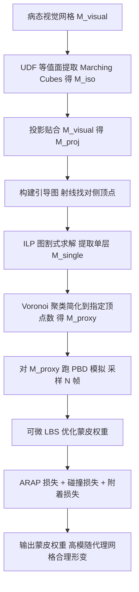

## 一句话总结

面向游戏实时布料，作者提出一条全自动流水线：把带有褶皱、多层、非流形、断裂等「病态」几何的高分辨率视觉网格，转换成极低多边形（如 128 顶点）的单层代理网格；再用可微蒙皮优化一套精心设计的损失，自动生成让高模在模拟中「看起来合理」的蒙皮权重——把原本需要美术数天试错的活压到十几分钟。

## 研究背景

布料模拟能极大提升游戏沉浸感，但计算开销巨大。业界常用的折中方案是「代理网格（proxy mesh）」技术：用一张低分辨率、可快速实时模拟的布料几何作为代理，模拟出它的顶点位置与法向后，再通过线性混合蒙皮（Linear Blended Skinning, LBS）把形变传递到高分辨率的「视觉网格（visual mesh）」上做渲染。

问题在于：从给定视觉网格生成一张合适的代理网格并配好蒙皮权重，是件极其耗人力的活，熟练美术往往要花好几天反复调。难点有二：

- 视觉网格是「病态」的。它包含精细褶皱、皱纹、断裂组件、层叠结构和非流形面。传统网格简化方法（如 QEM 边折叠）依赖良态拓扑，直接拿来做代理网格会产生质量低劣、无法进入物理模拟器的网格。
- 代理网格必须极度简化才能实时。同时蒙皮权重要既维持低模与高模的整体相似、又保住细节，这需要技术、艺术判断与对角色运动的理解三者结合，美术只能靠反复试蒙皮、跑动画、再修，直至满意。

作者指出，此前没有任何方法能同时满足「从病态高模生成极简单层高质量代理网格」和「自动配好蒙皮权重」这两个目标。

## 核心方法

整条流水线分两大阶段：**代理网格生成** 与 **蒙皮权重优化**。

### 阶段一：代理网格生成

1. **等值面提取**：对视觉网格构造无符号距离场（Unsigned Distance Field, UDF），体素大小 $$D/N_v$$（$$D$$ 为包围盒最长边，$$N_v$$ 为体素分辨率）。用 marching cubes 在 iso 值 $$D/N_v$$ 处抽出水密等值面 $$M_{iso}$$。这一步对非流形、层叠、断裂天然鲁棒。

2. **网格投影**：把 $$M_{iso}$$ 收紧贴合到 $$M_{visual}$$。每个顶点找到视觉网格上的最近点 $$p^i_{visual}$$，最小化
$$\sum_i \lVert v^i_{proj}-p^i_{visual}\rVert^2 + \lambda_L\sum_i\Bigl\lVert v^i_{proj}-\tfrac{1}{|N(i)|}\sum_{j\in N(i)}v^j_{proj}\Bigr\rVert^2$$
第一项拉向视觉网格，第二项是拉普拉斯正则，保平滑与单元均匀。用 vector Adam 求解。此步不强制无自穿插——因为后续管线不要求代理网格无自交。

3. **单层提取（核心贡献）**：marching cubes 的水密特性会把薄壳结构包成双层，必须去掉一侧。作者构造一个「引导图」：对每个顶点沿负法向射线，找到对侧命中三角形的顶点，若两者距离小于 $$2D/N_v$$ 且法向近乎相反（$$n^j\cdot n^i<-1+\epsilon_o$$），则判为「对侧顶点对」并连边。随后求解一个图割式的 0/1 标注问题（$$l_i=1$$ 表示该顶点留在单层）：
$$\arg\min_{l_i\in\{0,1\}}\ \lambda_s E_s+\lambda_o E_o$$
其中平滑项 $$E_s=\sum_{ij}w^{ij}_s\,\mathbb{I}[l_i\neq l_j]$$，边权由曲率决定（低曲率边更倾向一致，高曲率边是潜在层边界）；对侧项 $$E_o$$ 强制每对对侧顶点只保留一个、并偏向保留外层。由于 $$E_o$$ 违反图割的正则性条件（无法用多项式时间图割算法解），作者引入辅助变量把它改写成标准**整数线性规划（ILP）**，用 Mosek 等现成求解器高效求解。

4. **简化**：对单层网格 $$M_{single}$$ 用基于 Voronoi 图（质心 Voronoi 图）的方法聚成 $$N_p$$ 个簇，取簇质心重建，去非流形面、拆非流形顶点，得到顶点数确定、单元均匀的 $$M_{proxy}$$。

### 阶段二：蒙皮权重优化

由于视觉网格可能不可模拟，作者把权重生成转成**逆问题**用可微编程求解。对良态的 $$M_{proxy}$$ 跑布料模拟采样若干帧，用可微 LBS 优化权重，使重建的 $$M_{visual}$$ 各帧都合理。

- **简化 LBS**：只考虑平移（省去逐顶点实时估旋转的开销）：
$$v^{i,t}_{visual}=v^{i,0}_{visual}+\sum_{j\in B(i)}w_{ij}\,(v^{j,t}_{proxy}-v^{j,0}_{proxy})$$
约束 $$w_{ij}\ge0,\ \sum_{j\in B(i)}w_{ij}=1$$（凸组合）。$$B(i)$$ 用静止姿态下的 kNN 固定确定，仅优化权重。数据由 PBD（NVIDIA PhysX）模拟生成，边弹簧抗拉伸、面对弹簧抗弯曲。

- **三个损失**：
  - ARAP 损失 $$L_r$$：用 As-Rigid-As-Possible 能量约束视觉网格局部近刚性（不可拉伸），基于 1-ring 拓扑邻居。
  - 碰撞损失 $$L_c$$：结构同 ARAP，但用几何 kNN 邻居而非拓扑邻居，防止空间相近顶点相互穿插（减少两层布料间碰撞）。
  - 附着损失 $$L_a$$：$$L_a=\sum_t\lVert V^t_{visual}-(I-K)V^t_{visual}\rVert^2$$，让「几何上相邻但拓扑上断开」的顶点保持相对距离，$$K$$ 按静止姿态距离反比加权——越近附着越强。
  
  总目标 $$\arg\min_{w_{ij}}\lambda_r L_r+\lambda_c L_c+\lambda_a L_a$$。用替代参数 $$w_{ij}=|s_{ij}|/\sum_j|s_{ij}|$$ 化去约束，AdamW 迭代求解，每步用 SVD 估局部旋转 $$R$$。

## 实验结果

在 100 件来自真实游戏项目的服装模型数据集上评测。参数取 $$N_v=32$$、$$N_p=128$$（对应移动平台常见的 256 骨骼上限）。

**代理网格生成对比**（与 MeshUDF、LevelSetUDF、DCUDF 等 SOTA UDF 表面提取方法比）：

| 方法 | 成功率 | 组件数 | 边界环数 | Hausdorff 距离 | 光场距离 LFD | 时间 |
| --- | --- | --- | --- | --- | --- | --- |
| MeshUDF 32³ | 100% | 2.1 | 3.8 | 0.28 | 4.6e3 | 0.3s |
| LevelSetUDF 32³ | 100% | 15.3 | 15.7 | 0.59 | 1.6e4 | 424.7s |
| LevelSetUDF 256³ | 100% | 1.8 | 2.3 | 0.63 | 7.1e3 | 491.2s |
| DCUDF 32³ | 74% | 1.1 | 1.4 | 0.35 | 4.7e3 | 40.8s |
| DCUDF 256³ | 75% | 2.4 | 3.4 | 0.33 | 4.5e3 | 82.1s |
| **Ours 32³** | **100%** | **1.0** | 2.0 | **0.22** | **3.6e3** | 8.4s |

本方法 100% 成功、生成单组件、几何逼近（HD/LFD）最优，整条生成流水线平均不到 10 秒（ILP 占约 60%、投影约 24%）。DCUDF 依赖随机初始种子、20 次尝试仍只有约 3/4 成功率；MeshUDF 在 UDF 梯度复杂时（如「流苏」）会严重失真；LevelSetUDF 因单层网格缺连通性，简化后常偏离输入。网格质量四项指标（最小面角、边比、纵横比、半径比）均值分别为 47.9°、0.78、0.76、0.93，满足模拟需求。

**蒙皮权重评估**：每个代理网格生成 200 帧模拟数据（顶端 5% 顶点固定、其余受随机风力），数据生成平均 0.54 秒，权重优化用 AdamW（学习率 $$10^{-3}$$、最多 200 epoch）平均 9 分钟。消融显示：去掉 $$L_r$$ 腰带不平滑；去掉 $$L_c$$ 腰带自穿插；去掉 $$L_a$$ 时飞镖、结等组件在大形变下与主体脱离。对未见风向、复杂舞蹈动作（旋转、扭动、抖动）均能保持合理外观。

**与美术手工对比**：「Scarf」模型，十年经验美术手工刷权重花 4 小时，结果仍结块、尖刺、离量产状态尚远；本方法仅 14 分钟且更平滑合理。Demo 部署在三星 S20（SD865），Unreal Engine Chaos Cloth 下 128 顶点代理网格单次 PBD 迭代仅需 0.86 ms。此外还与「几何简化+权重联合优化」的框架对比，后者因简化网格顶点分布不均导致形变不自然，验证了「分阶段」设计的合理性。

## 贡献与局限

**贡献**：
- 一条从病态高模自动生成极低多边形代理网格的完整流水线，核心是用 UDF 等值面 + ILP 图割式单层提取 + Voronoi 均匀简化，对非流形/层叠/断裂鲁棒。
- 一套基于可微蒙皮的权重优化框架，用 ARAP、碰撞、附着三种精心设计的损失，让不可模拟的视觉网格也能被代理网格合理驱动。
- 在 100 个真实游戏布料模型上的系统评测，展示了效果与效率（生成 <10s、权重优化约 9min，对比美术数天/数小时）。

**局限**（作者自述）：
- Voronoi 简化在 $$N_p$$ 极低时难以同时保住输入边界和精细结构；未来考虑加入边折叠/翻转等局部操作改善边界保持。
- 投影阶段未做连续碰撞检测防自交；当前假设不可拉伸材料，未来将支持可拉伸输入（推广 ARAP）。
- 目前几何简化与权重是分开优化的，未来希望联合优化以进一步提质；也可扩展生成多分辨率级联网格用于渐进式布料模拟。

## 延伸思考

这篇工作的价值在于它非常务实地对准了游戏工业的真实痛点——「资产准备」而非「模拟算法」本身。一个有意思的取舍是它反复强调「代理网格不必无自穿插」：因为实时游戏为性能通常关闭自碰撞检测，所以管线大胆地在投影、简化各步放弃了昂贵的无交约束，把复杂度让给了后续蒙皮权重去「视觉上」兜住。这提示我们，面向实时应用的几何处理，正确性标准应当由下游渲染/模拟的实际容忍度来定义，而非追求几何上的完美。

另一处巧思是把「单层提取」这个看似启发式的问题，通过「对侧顶点对」的能量项重铸为 ILP——由于对侧约束破坏了图割的正则性条件，无法用经典多项式算法，作者转而借助线性规划松弛的成熟工具链高效求解。这种「先识别问题的组合结构、再匹配到合适求解器」的思路，比堆启发式规则更稳健，也解释了为何它能拿到 100% 成功率而 DCUDF 的随机图割只有 3/4。最后，用「可微蒙皮 + 逆问题」替代「需要仿真就绪高模或大规模美术标注数据集」的数据驱动路线，是在数据稀缺的工业场景里一条很聪明的绕行——把先验塞进损失函数，而不是塞进数据。
