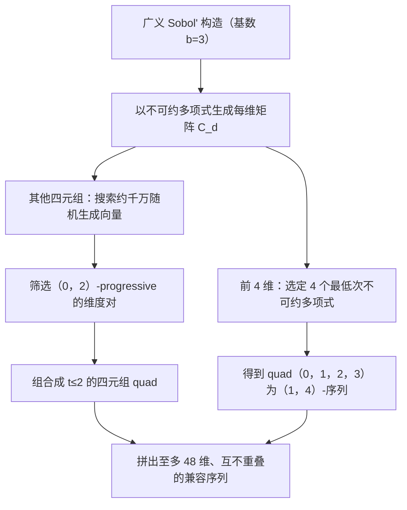

## 一句话总结

该工作在基数 3 的 Sobol' 构造上，通过对不可约多项式与生成矩阵做系统搜索，得到在所有连续二维投影上为 $$(0,2)$$-序列、在连续四维投影（quad）上为 $$(1,4)$$ 或 $$(2,4)$$-序列的低差异序列，在保留 Sobol' 序列性、高维、快速、紧凑等优点的同时，改善了连续二维与四维投影的采样均匀性。

## 研究背景

物理渲染的核心是对渲染方程做积分，通常用蒙特卡洛或拟蒙特卡洛方法。由 Koksma-Hlawka 不等式，积分误差受被积函数的规整性与样本均匀性共同约束：

$$\lvert I-\tilde{I}\rvert \le V_f\, D^{*}(X)$$

其中 $$V_f$$ 是 Hardy-Krause 变差，$$D^{*}(X)$$ 是点集 $$X$$ 的星差异（衡量均匀性）。在无法获知被积函数信息的前提下，提升样本均匀性是通用的降误差手段。

尽管学界为构造极均匀采样投入了大量努力，配合 Joe-Kuo 初始化表与 Owen 置乱的 Sobol' 序列，至今仍是生产渲染系统的首选。原因并不在于其均匀性最优，而在于它同时具备若干难以替代的工程优点：可产生任意长度的序列（支持渐进式渲染），可工作在（几乎）任意维度，样本生成快，表示紧凑（每维一个小二进制矩阵加低阶多项式系数）。而许多更均匀的方法只能给出点集而非序列，或仅限低维（甚至二维），或需要复杂优化与存储点本身。

不过 Sobol' 序列有一个已知弱点：高维投影上的分布逐渐变差，以至于一些生产渲染器只用其前几维。作者据此提出目标：在保留 Sobol' 全部优点的前提下，改善连续二维与四维投影上的均匀性。

## 方法

整体框架是对 Faure 与 Lemieux 推广的 Sobol' 构造做参数搜索，但从两个方向扩大自由度：一是把基数从 2 改为 3，二是把多项式集合从本原多项式放宽为不可约多项式。基数 3 带来更多自由度，而不可约多项式的次数增长比本原多项式更缓，使得在低次多项式内即可满足更强的均匀性质。

关键概念是 $$(t,m,s)$$-net 与 $$(t,s)$$-序列。在基数 $$b$$ 下，$$n=b^{m}$$ 个样本落在 $$s$$ 维单位超立方体中，若所有体积为 $$b^{t}/n$$ 的规范子区间恰好各含 $$b^{t}$$ 个点，则称 $$(t,m,s)$$-net；对所有 $$m$$ 都成立即为 $$(t,s)$$-序列。$$t$$ 越小越均匀，其差异上界随 $$b^{t}$$ 缩放：

$$N D^{*}_{n}(X) \le b^{t}\sum_{i=0}^{s-1}\binom{s-1}{i}\binom{m-t}{i}\left(\frac{b}{2}\right)^{i}$$

因此降低 $$t$$ 至关重要。Faure 与 Lemieux 证明：用次数为 $$\{e_0,\dots,e_{s-1}\}$$ 的不可约多项式构造 $$s$$ 个矩阵时，$$t$$ 被 $$t=\sum_{d=0}^{s-1}(e_d-1)$$ 界定，为降低 $$t$$ 提供了理论依据。

关键设计一（前 4 维）：直接取基数 3 下最低次的 4 个不可约多项式，按 $$x,\ x^{2}+1,\ x+1,\ x+2$$ 的顺序使用，对应生成矩阵分别为 $$[1]$$、$$\begin{pmatrix}1&1\\0&1\end{pmatrix}$$、$$[1]$$、$$[2]$$。这种重排使连续维度对保持 $$(0,2)$$-序列。由此四元组 $$(0,1,2,3)$$ 成为 $$(1,4)$$-序列（由定理直接保证），相比之下 Sobol' 前四维在基数 2 下 $$t=3$$，而本方法在基数 3 下 $$t=1$$。第一对维度 $$(0,1)$$ 数值验证到 $$m=100$$ 呈 $$(0,2)$$-progressive，作者猜想其为 $$(0,1)$$-序列但未给出证明。

关键设计二（其他四元组）：对前 196 个不可约多项式（次数 1 到 6）的所有配对，每对测试约一千万个随机生成向量，筛出 $$(0,2)$$-progressive 的维度对（即 $$t_\ell=0$$ 对所有 $$\ell\in\{1..m\}$$）；再穷举组合成四元组，仅保留所有 $$\ell$$ 下 $$t_\ell$$ 最大值不超过 2 的组合，并在多解中优先选 $$t=2$$ 出现在更大 $$\ell$$ 的解。四元组性质仅数值验证到 $$m=10$$（约 $$3^{10}\approx 59\text{k}$$ 个点）。该过程产出 11 个四元组，与第一个优质四元组组合，构成至多 48 维的渐进式序列。

关键设计三（基数 3 实现）：$$GF(3)$$ 上的算术即模 3 整数运算，无法使用基数 2 的异或与位移加速，因此用查找表做基数 3 分解，并借鉴 Gray-code 排序，使相邻样本仅改动一个基数 3 位，从而只需单列向量运算即可得到下一样本坐标。渲染中还需将 Owen 置乱推广到基数 3：每维用三叉树表示各位的置换，每个节点从 $$b!=6$$ 个随机置换中取一个。

## 实验结果

作者从二维投影、高维差异、合成被积函数积分误差与渲染误差四方面评估，并与 Sobol'+Owen、ZeroTwo、Padded Sobol'(0123)、Cascaded Sobol'、Faure-Lemieux 等对比。核心性质如下：

| 维度子集 | 性质 | 有效范围 |
| --- | --- | --- |
| 第一对 $$(0,1)$$ | $$(0,2)$$-progressive | 数值验证到 $$m=100$$ |
| 对 $$(2,3)$$、$$(0,2)$$、$$(0,3)$$ | $$(0,2)$$-序列 | 由构造保证（无穷） |
| 对 $$(1,2)$$、$$(1,3)$$ | $$(1,2)$$-序列 | 由构造保证（无穷） |
| quad $$(0,1,2,3)$$ | $$(1,4)$$-序列 | 由构造保证（无穷） |
| 其他 quad $$(4i,4i{+}1,4i{+}2,4i{+}3)$$ | 至多 $$(2,4)$$-progressive | 到 $$3^{10}\approx 59\text{k}$$ 点 |

在二维投影与合成积分误差上，除不构成序列的 Cascaded Sobol' 外，随维度升高本方法的均匀性与积分误差优于包括 Faure-Lemieux 在内的竞争者。ZeroTwo 与 Padded Sobol' 在远距离维度对上退化为白噪声行为。渲染实验分 6 维（含像素采样与直接光 MIS）与 10 维（额外一次间接光弹射）：仅直接光时，本方法在较简单场景上优于所有对比方法，在更复杂场景上与 Sobol'+Owen、Faure-Lemieux、Cascaded Sobol' 相当；间接光时，本方法优于只用前两维的 ZeroTwo，与用前四维的 Padded Sobol'(0123) 相当，凸显了连续四元组均匀性的重要性。

## 亮点与局限

亮点：给出了基数 3 下用不可约多项式构造 $$(0,2)$$-progressive 维度对、进而组合成 $$(2,4)$$-progressive 四元组的证据；前四维的 $$(1,4)$$-序列由构造严格保证，$$t$$ 值显著低于 Sobol' 基数 2 构造；所提多项式与矩阵可作为 Joe-Kuo 表的即插即用替代，且保留了序列性、高维、快速、紧凑等实用优点；开源了基数 3 实现。

局限：基数 3 无法使用高效的位运算，模 3 算术与基数 3 Owen 置乱都会降低速度；最高质量的样本数对应 3 的幂，增长快于常用的 2 的幂；受限于未优化的搜索实现与算力，初始化表只覆盖到 48 维（远少于 Joe-Kuo 的上万维）；除前四维外，其余性质仅在约 59k 样本内、且仅在所优化的四元组内数值验证，超出范围只能靠 Sobol' 构造的一般性 $$(t,s)$$-序列界保证。

## 延伸思考

这项工作提示了一个通用视角：低差异序列的质量并不需要在所有维度上一致，而可以针对应用中真正被配对使用的维度（如渲染里光源、BRDF、像素等成对成组的采样维度）做定向优化。把「连续二维/四维投影均匀」作为优化目标，正契合渲染流水线的维度使用模式。自然的延伸方向包括：把搜索实现工程化以扩展到更高维、突破 48 维限制；探索基数 3 之外的其他素数基或混合基以平衡自由度与速度；以及研究更大样本量（超过 59k）下四元组性质的理论保证，弥合数值验证与构造性证明之间的空白。
