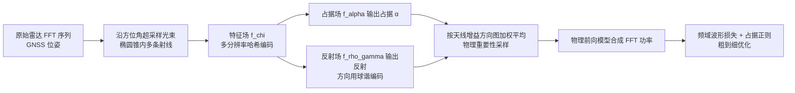

## 一句话总结

Radar Fields 直接在傅里叶频域拟合 FMCW 雷达的原始 FFT 波形，用一个基于物理的信号形成模型把雷达截面分解为占据与反射两部分，配合物理引导的光束发散重要性采样，在无需体渲染的前提下从二维鸟瞰雷达扫描恢复稠密三维场景占据，并能在雾天等恶劣天气下稳定重建。

## 研究背景

大规模室外场景重建是自动驾驶与机器人研发、验证的基础。现有神经场景表示（NeRF 及其变体）主要依赖 RGB 相机与 LiDAR，但这两类光学传感器在雾、雨、雪等恶劣天气或困难光照下会明显退化。工作在毫米波段（约 77 GHz）的雷达则天然互补：其波长大于雾雪粒径，能穿透散射介质，成本比 LiDAR 低约一个数量级，已在汽车、机器人等领域广泛部署。

然而，用雷达做稠密几何重建并不容易，主要障碍有：

- 角分辨率低。雷达波长比 LiDAR 大三个数量级，角分辨率低、点目标极其稀疏。
- 大多是二维传感器。常见低成本 FMCW 雷达只有方位分辨率、几乎没有俯仰分辨率，波束发散会把不同高度的回波混叠成单一距离回波，得到扁平的二维扫描，缺乏原生三维线索。
- 反射伪影难以剥离。雷达对强反射物体敏感，方向相关的饱和伪影与真实场景占据难以区分。

这些特性使得依赖多视角一致性与体渲染的现有神经渲染方法难以直接套用于雷达。作者据此提出 Radar Fields，把重建问题搬到频域，直接以原始波形为监督。

## 方法

### 整体框架

输入一段带 GNSS 位姿的原始雷达帧序列（二维鸟瞰的距离-方位 FFT），输出一个隐式三维占据场，可抽取几何并在新视角合成原始雷达回波。核心是把已知的 FMCW 物理写成可微前向模型，并用共享特征把雷达截面解耦为占据与反射。

### 关键设计

雷达信号形成模型。FMCW 雷达发射频率随时间线性变化的锯齿波啁啾，回波因距离产生时延，与发射信号混频、低通滤波后得到中频（IF）波形，其频率对应目标距离。经 FFT 得到各频率 bin 的功率，bin 频率与距离一一对应：

$$R_b = f_{IF_b}\,\frac{c\,T_s}{4\Delta f}$$

某距离 $R_b$ 处的接收功率由雷达方程给出：

$$P_r(b) = \frac{P_t\,G^2\,\sigma}{(4\pi)^3 R_b^2}$$

其中除雷达截面 $\sigma$ 外均已知。关键一步是把 $\sigma$ 分解为三项：

$$\sigma = \alpha \cdot \rho \cdot \gamma$$

$\alpha$ 是目标投影到波束截面的尺寸，仅依赖几何（即占据）；$\rho$ 为反射率、$\gamma$ 为指向性，二者还依赖材质金属性与入射角（合并为反射）。这一可解释的解耦让几何与视角/材质相关的反射分离，从而可分别用神经场学习。

隐式神经场表示。共享特征场 $f_\chi$ 从多分辨率哈希编码的空间位置预测特征 $\chi$；占据场 $f_\alpha$ 由 $\chi$ 预测 $\alpha$；反射场 $f_{\rho\gamma}$ 由 $\chi$ 与球谐编码的视线方向预测 $\rho\gamma$ 的乘积（二者无法独立区分，故合并预测）。该表示不需要体渲染：真值是原始时间分辨波形，射线采样点本身就是预测量。$\alpha$ 可单独用于重建几何，也可与 $\rho\gamma$ 相乘合成新视角波形。

物理引导的重要性采样。低成本雷达无俯仰分辨率，但波束在方位与俯仰上都会发散并对整个开口角积分，因而仍隐含三维信息。作者在每个波束中心周围的椭圆锥内均匀超采样 $S$ 条射线，方位与俯仰偏移分别服从 $a_i\sim U(-A,A)$、$e_i\sim U(-E,E)$，各自预测 $\hat\sigma_i$ 后按天线方向图 $A(\cdot)$、$E(\cdot)$ 加权平均：

$$\hat\sigma = \frac{\sum_{i=1}^{S}\sigma_i\,A(s_i[0])\,E(s_i[1])}{\sum_{i=1}^{S}A(s_i[0])\,E(s_i[1])}$$

偏离波束中心越远的样本贡献越小，从而把二维真值与学到的三维表示关联起来，实现"从无俯仰分辨率的二维扫描恢复三维"。

训练损失。总损失是频域重建损失与两项占据正则的加权和：

$$\mathcal{L} = \eta_W \mathcal{L}_W + \eta_R \mathcal{L}_R + \eta_P \mathcal{L}_P$$

$\mathcal{L}_W$ 用前向模型合成 FFT 功率并与真值逐 bin 比对；$\mathcal{L}_R$ 用一个基于贝叶斯更新与遮挡模型的占据估计器 $O(P_r)$ 约束学到的占据与原始信号一致；$\mathcal{L}_P$ 通过最小化占据概率高、低两组的标准差强制占据呈双峰分布，正确建模空域并去除漂浮物伪影。此外采用粗到细优化，按训练轮次逐步放开高分辨率哈希特征，防止早期把重建噪声累积到高频特征中。

数据集。作者用防水传感器架采集了包含原始雷达、LiDAR、RGB 相机与 GNSS 的多模态数据集：定制 Navtech CIR-DEV 雷达 360° 覆盖、最远 330 m、距离分辨率约 4 cm。在瑞士实地采集数小时素材，选取 15 段（每段 10~23 秒、40~90 帧），覆盖白天、夜晚、雾天以及城市街道与停车场等多样场景。

## 实验结果

在自采多模态数据集上评估鸟瞰占据重建（Chamfer 距离 CD、相对 Chamfer 距离 RCD，越低越好）与新视角合成（RMSE 越低、PSNR 越高越好），与雷达栅格建图基线以及 LiDAR-NeRF 对比，并对重要性采样与正则做消融。下表摘取代表性场景（CD 单位为米）：

| 场景 | 方法 | CD ↓ | RCD ↓ | RMSE ↓ | PSNR ↑ |
|------|------|------|-------|--------|--------|
| Scene 2 | 本文 | 0.296 | 0.007 | 0.190 | 20.43 |
| Scene 2 | 栅格建图 | 1.222 | 0.047 | 0.228 | 18.85 |
| Scene 2 | LiDAR-NeRF | 0.312 | 0.008 | - | - |
| Scene Fog | 本文 | 0.382 | 0.015 | 0.185 | 20.74 |
| Scene Fog | 栅格建图 | 0.614 | 0.048 | 0.255 | 17.89 |
| Scene Fog | LiDAR-NeRF | 0.797 | 0.087 | - | - |

结果显示：传统 DSP 处理得到的雷达点云过于稀疏，栅格建图几乎无法重建车辆等小目标，且被限制在二维鸟瞰；Radar Fields 借助原始 FFT 数据能重建包含车辆的稠密场景，并恢复三维几何。恶劣天气下，LiDAR-NeRF 因浓雾中距离信息受限而退化、Instant-NGP（RGB 输入）几乎无法重建，而 Radar Fields 仍能恢复建筑、护栏乃至车辆的清晰轮廓，CD/RCD 均优于 LiDAR-NeRF。消融证实：去掉重要性采样与正则后，占据与反射难以解耦，镜面效应污染占据场，新视角合成也变得不准确、收敛不稳定。

## 亮点与局限

亮点：

- 首个面向原始雷达数据的神经渲染重建方法，把重建搬到傅里叶频域、以原始波形为唯一监督，绕开了处理后雷达数据的分辨率限制与体渲染的计算开销。
- 基于 FMCW 物理的可解释前向模型，把雷达截面解耦为占据与反射，使几何可从视角/材质相关反射中分离。
- 物理引导的重要性采样建模波束发散，从无俯仰分辨率的二维扫描中恢复三维几何。
- 在雾天、夜间等 LiDAR 与相机失效的条件下仍稳健重建，凸显毫米波传感的互补价值，并配套发布多模态数据集。

局限：

- 依赖单一行驶轨迹的雷达帧序列与高质量 GNSS 位姿，受限且视角对齐。
- 真值几何本身难以仅从雷达获得，评估需借助累积的 LiDAR 数据构造密集参考。
- 雷达固有的低角分辨率仍是根本瓶颈，作者也指出未来需引入跨模态（如 LiDAR）输入与监督来弥合分辨率差距。

## 延伸思考

Radar Fields 的核心启示在于：当传感器的成像模型与主流神经渲染假设（多视角一致、体渲染）不匹配时，与其套用现成前向模型，不如回到传感器物理本身，在其"原生量测空间"（这里是频域 FFT 波形）建立可微前向模型并直接监督。把雷达截面解耦为占据与反射、用天线方向图加权的重要性采样从二维扫描"挤出"三维信息，都是这种物理先验驱动思路的体现，也为声呐、超声、SAR 等非光学主动传感的神经重建提供了范式参考。顺着作者指出的方向，融合 LiDAR 的跨模态监督有望在保留雷达恶劣天气鲁棒性的同时补上角分辨率短板，推动其走向实用化的多传感器场景表示。
