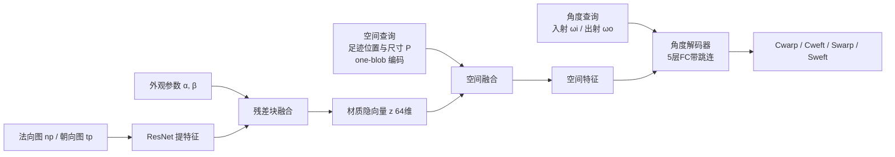

## 一句话总结

利用机织物图案规则、重复的特性，用一个轻量的编码器把不同织物的图案与外观参数压缩成 64 维材质隐向量，再由一个带空间融合的小解码器根据像素足迹（footprint）查询把它解释成分离后的四个 BSDF 分量，从而用单一神经网络在 RTX 3090 上以近 60 帧每秒实时渲染并编辑多种机织物，且质量接近真值、无可见锯齿与噪声。

## 研究背景

机织物在虚拟现实、游戏、数字人等场景中广泛使用，这些应用既要真实感又要实时性能。但织物由经纱（warp）与纬纱（weft）交织而成，每根纱线又由捻合的丝构成，微结构小于一个像素，导致强各向异性外观，采样不足时会产生严重锯齿与噪声。

已有方法各有取舍：体积模型与逐纤维散射模型真实感高，但过重无法实时；表面着色模型（如 SpongeCake 及后续 Jin 等、Zhu 等的工作）更实用，但仍需数百采样来避免锯齿，因为缺乏一个多尺度表示——而织物着色模型不能像漫反射贴图那样简单地用 mipmap 线性降采样。另一条路是用神经网络为通用材质构建多分辨率表示（如 NeuMIP、MIPNet），但它们要么需要逐材质训练、代价高，要么难以支持织物参数、不够灵活。

本文的核心洞察是：与通用材质不同，机织物的图案具有规则性与重复性，这使得用单一紧凑隐空间表示多种织物成为可能。

## 方法

### 整体框架

从 Jin 等的织物表面着色模型（含透射与纱线间遮蔽-掩蔽效应）出发，本文把聚合着色模型的高维映射用一个编码器-解码器网络来表示：编码器把织物图案（法向图、朝向图）与外观参数压成材质隐向量，解码器再结合空间与角度查询解出四个 BSDF 分量。

### 关键设计

着色模型的重表述与分离。聚合织物着色模型本质是从几何参数、外观参数与查询到一个 BSDF 值的映射，但它混合了镜面／漫反射与经纱／纬纱等多种高方差分布，轻量网络难以直接拟合。本文把映射拆分为四个更简单的分量——经纱漫反射、纬纱漫反射、经纱镜面、纬纱镜面。由于漫反射与镜面反照率 $k_d$、$k_s$ 只依赖纱线类型，可从网络输入中移除；纱线位置 $x_p$ 已被法向 $n_p$ 与朝向 $t_p$ 隐式表达，也一并移除。最终 BSDF 由四分量线性组合而成：

$$f_{\mathcal{P}}(\omega_i,\omega_o) = k_d^{\text{warp}}C_{\text{warp}} + k_d^{\text{weft}}C_{\text{weft}} + k_s^{\text{warp}}S_{\text{warp}} + k_s^{\text{weft}}S_{\text{weft}}$$

这样每个分量分布更简单，便于轻量网络表示，同时反照率解耦也让颜色编辑无需再跑网络。

编码器。以图案的几何贴图（法向图、朝向图）与程序化外观参数（粗糙度 $\alpha$、高度场缩放 $\beta$）为输入。先用改造过的 ResNet-18（去掉最后一个残差块）把贴图编码为特征，再与外观参数一起送入由两层 128 维全连接构成的残差块，输出 64 维材质隐向量。用程序化参数而非仅空间变化贴图来表示材质，使编辑更灵活。

解码器。查询含空间输入（着色位置与足迹范围 $\mathcal{P}$）与角度输入（光照与视线方向）。若把所有输入直接拼接，空间参数会主导分布、效果不佳。因此先对 $\mathcal{P}$ 的位置与尺寸做 one-blob 编码（3 通道扩到 24 通道）帮助网络区分空间输入，再用两层全连接把材质隐向量与空间参数融合得到空间特征；最后把空间特征与角度输入拼接，送入带一个跳连的五层全连接角度解码器输出四分量。光方向用三通道（$z$ 分量在透射时可为负），视方向用两通道。正是"先空间后角度"的融合让小解码器就能实现多尺度表示。

损失函数。用采样积分得到四个分量真值。镜面分布范围大，仿照 NeuMIP 对真值做 $g(x)=\ln(kx+1)$ 映射后再算 MSE（BRDF 取 $k=100$、BTDF 取 $k=1000$）；漫反射项直接用 MSE。总损失按纱线类型加权求和，$\lambda_S=0.4$、$\lambda_C=0.1$。

渲染与编辑。集成进 Falcor 并用 TensorRT 推理。渲染前先用编码器为场景中每种材质算好隐向量；渲染时每像素投射光线得到着色点，准备查询后仅需推理解码器得到四分量，与光照相乘即得结果。编辑反照率只需改颜色贴图、不跑网络；编辑其它参数则重跑编码器更新隐向量，约耗时 0.5 毫秒，仍可实时。

## 实验结果

在 RTX 3090 上以 $1920\times1080$ 渲染，取修改版 Jin 等 256 SPP 收敛结果为真值，用 MSE 衡量差异。相比 1 SPP 或等时的基线，本文结果无锯齿、更接近真值。相比 NeuMIP，本文单网络即可覆盖多种织物、无需逐材质训练，存储恒定且远小。

| 方法 | 存储 | 是否逐材质训练 | 备注 |
|------|------|--------------|------|
| 基线（Jin 等，1 SPP／等时） | — | 否 | 明显锯齿 |
| NeuMIP | 每材质 > 50 MB | 是 | 质量略高但存储大、不支持 BTDF |
| 本文 | < 5 MB（多材质恒定） | 否 | 无锯齿，质量接近真值 |

运行性能（各场景解码器推理耗时，单位微秒）：

| 场景 | 推理 | 其它（非神经步骤） |
|------|------|------------------|
| Single Cloth | 14.3 | 2.9 |
| Bowl Cloth | 13.9 | 4.0 |
| Lamp | 14.4 | 2.9 |
| Sofa | 13.6 | 4.8 |

消融显示：去掉足迹的 one-blob 编码会使 MSE 升高、镜面形状偏离真值；去掉空间融合（并相应加深角度解码器）会出现明显伪影与更高 MSE。材质隐空间还支持以粗糙度、高度场缩放为权重做插值与外推，能产生平滑过渡并匹配直接编码的结果。数据准备每材质约 22 分钟、共 165 小时，训练 10 个 epoch 约 4 天。

## 亮点与局限

亮点：

- 抓住机织物图案规则、重复的本质，用单一轻量网络覆盖多种织物（平纹、斜纹、缎纹等七种图案），避免了逐材质训练，存储仅 5 MB 且不随材质数量增长。
- 将 BSDF 按镜面／漫反射与经纱／纬纱分离成四个分量，把复杂高方差映射化简为轻量网络可学的简单分布，并借此解耦反照率、支持零成本颜色编辑。
- 以像素足迹作为查询输入实现多尺度表示、消除锯齿，配合"先空间后角度"的解码器融合与 one-blob 编码，在近 60 帧每秒下达到接近真值的质量，并支持实时材质编辑与隐空间插值。

局限：

- 表示能力受网络限制，无法处理非常剧烈的变化（如部分斜纹结果）。
- 主要关注 BSDF 求值，未考虑重要性采样；也不保证能量守恒（神经表示存在偏差，可能引入额外能量）。
- 织物模型排除了 delta 透射与程序化扰动，限制了真实感；目前仅支持三种典型机织物，针织物因结构差异大暂不支持，空间变化图案也有待探索。

## 延伸思考

这篇工作提供了一个很有借鉴意义的思路：当被表示的对象具有强结构先验（这里是织物图案的规则性与重复性）时，可以放弃"逐材质过拟合"的神经表示，转而学习一个跨材质共享的紧凑隐空间，从而在保持轻量、实时的同时大幅提升实用性。另一个关键经验是"分而治之"——把混合了多种高方差分布的复杂映射按物理语义（镜面／漫反射、经／纬）拆分成简单分量，既降低了网络负担，又自然带来了参数解耦与可编辑性。沿此方向，把重要性采样、能量守恒、delta 透射与程序化 glint 纳入同一框架，或把隐空间从机织物扩展到针织物与空间变化图案，都是让神经外观模型既高效又完整的自然演进路径。
