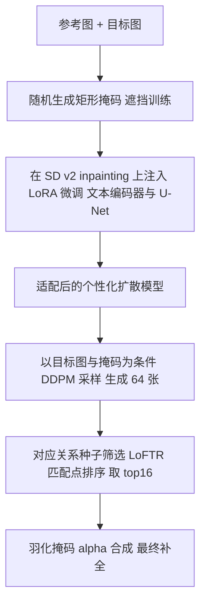

## 一句话总结

RealFill 提出「真实图像补全（Authentic Image Completion）」这一新问题：给定几张随手拍的参考图，把目标图缺失区域填成「本应存在」的真实场景内容。做法是在参考图与目标图上用 LoRA 微调一个预训练的 inpainting 扩散模型，再采样补全，并用「基于对应关系的种子筛选」自动挑出高保真结果。

## 研究背景

照片常常留有遗憾：没拍到完美的角度、构图或时机，而这些瞬间无法重来。作者举了一个典型例子——女儿在舞台上跳舞的近乎完美的照片里，她精致独特的皇冠被画框裁掉了一角；虽然演出中还有很多别的照片拍到了皇冠，但都没能捕捉那个跳到一半的姿态、表情和光线。人脑能想象出缺失部分该是什么样，但真正生成一张完整、可分享的图像却很难。

作者把这个问题定义为「真实图像补全」：给定至多五张参考图和一张缺了一块的目标图（二者大致是同一场景，但布局或外观可能不同），要用忠实于真实场景的高质量内容填补缺失区域。关键在于聚焦更有挑战、约束更少的非受限设定——参考图与目标图之间可以有剧烈的视角、光照、光圈、风格差异，甚至物体在运动。

已有方法各有短板。经典的几何管线依赖对应匹配、深度估计、3D 变换再做拼贴与融合，当场景结构无法准确估计（几何过于复杂或含动态物体）时会灾难性失败。而近来的生成模型尤其是扩散模型在 inpainting／outpainting 上表现强劲，但它们只受文本提示引导，无法利用参考图内容，因而只能「幻觉」出貌似合理却不真实的内容，难以恢复真实的场景结构与细节。Paint-by-Example 虽以参考图为条件，但依赖单张参考图的 CLIP 嵌入，只能捕捉高层语义。

## 核心方法

RealFill 的思路简单而有效：先把「场景知识」注入到预训练生成模型中——在参考图集合上微调它；再用这个适配后的模型，以目标图与掩码为条件生成补全结果，使其既保有良好的图像先验，又了解该场景的内容、光照与风格。

问题形式化：模型给定 $$n\ (n\le 5)$$ 张参考图 $$X_{ref}=\{I^k_{ref}\}_{k=1}^n$$、一张目标图 $$I_{tgt}\in\mathbb{R}^{H\times W\times 3}$$ 及其二值掩码 $$M_{tgt}\in\{0,1\}^{H\times W}$$（1 表示待填、0 表示已知区域），输出一张协调的图像 $$I_{out}$$：在 $$M_{tgt}=0$$ 处尽量与 $$I_{tgt}$$ 一致，在 $$M_{tgt}=1$$ 处忠实于参考图对应内容。假设参考图与目标图有足够重叠，使人类能想象出合理的补全。

## 技术细节

- 扩散与个性化基础：扩散模型训练时向数据 $$x_0$$ 加不同幅度高斯噪声得到 $$x_t$$：
$$x_t=\sqrt{\alpha_t}\,x_0+\left(\sqrt{1-\alpha_t}\right)\epsilon,\quad \epsilon\sim\mathcal{N}(0,I)$$
网络 $$\epsilon_\theta$$ 以条件 $$c$$（文本提示或被遮挡图像）预测噪声：
$$\mathcal{L}=\mathbb{E}_{x,t,\epsilon}\lVert\epsilon_\theta(x_t,t,c)-\epsilon\rVert_2^2$$
DreamBooth 通过在少量主体图上微调让 T2I 模型生成特定主体，并可结合 LoRA 只更新低秩残差 $$W+\Delta W=W+AB$$（$$A\in\mathbb{R}^{n\times r},B\in\mathbb{R}^{r\times n},r\ll n$$），冻结原始权重以省显存。

- 训练：从 SOTA 的 T2I inpainting 模型（开源的 Stable Diffusion v2 inpainting）出发，向其文本编码器与 U-Net 注入 LoRA 层，在 $$X_{ref}\cup\{I_{tgt}\}$$ 上以随机二值掩码 $$m$$ 微调，损失为
$$\mathcal{L}=\mathbb{E}_{x,t,\epsilon,m}\lVert\epsilon_\theta\!\left(x_t,t,p,m,(1-m)\odot x\right)-\epsilon\rVert_2^2$$
其中 $$p$$ 是固定语言提示（含罕见词的句子 "a photo of [V]"），$$(1-m)\odot x$$ 是被遮挡的干净图像。对目标图，损失只在其已知区域（$$M_{tgt}=0$$）计算，避免把「缺失」当成监督。随机掩码借鉴 LaMa 的做法：生成多个随机矩形并取并集或并集的补集。

- 推理：训练后用 DDPM 采样器以 $$p,I_{tgt},M_{tgt}$$ 为条件生成 $$I_{gen}$$。由于已知区域会被采样过程轻微扭曲，作者对 $$M_{tgt}$$ 做羽化（feather）处理，再用它把 $$I_{gen}$$ 与 $$I_{tgt}$$ 做 alpha 合成，得到已知区完全保留、生成区边界平滑过渡的最终 $$I_{out}$$。

- 基于对应关系的种子筛选（Correspondence-Based Seed Selection）：扩散推理具随机性，不同种子质量参差。本任务的独特之处在于生成内容与参考图之间存在真实对应关系。于是先批量生成一组 $$\{I_{out}\}$$，用 LoFTR 提取每张填充区域与 $$X_{ref}$$ 之间的特征对应点，按匹配点数量排序，自动过滤掉匹配太少的低质样本，大幅减轻人工挑选负担。

## 实验结果

作者构建了新基准 RealBench：33 个场景（23 个 outpainting、10 个 inpainting），每个场景含参考图、目标图、掩码与真值，参考图数量 1∼5 张不等，覆盖视角、散焦模糊、光照、风格、主体姿态等剧烈变化。评估用多层次相似度：低层 PSNR／SSIM／LPIPS（只在填充区计算），中层 DreamSim，高层 DINO／CLIP。

在与 prompt-based（SD Inpaint、Photoshop Generative Fill）和 reference-based（TransFill、Paint-by-Example）基线的对比中，RealFill 在所有指标上大幅领先：

| 方法 | PSNR↑ | SSIM↑ | LPIPS↓ | DreamSim↓ | DINO↑ | CLIP↑ |
| --- | --- | --- | --- | --- | --- | --- |
| SD Inpaint | 10.63 | 0.282 | 0.605 | 0.213 | 0.831 | 0.874 |
| Generative Fill | 10.92 | 0.311 | 0.598 | 0.212 | 0.851 | 0.898 |
| Paint-by-Example | 10.13 | 0.244 | 0.642 | 0.237 | 0.797 | 0.859 |
| TransFill | 13.28 | 0.404 | 0.542 | 0.192 | 0.860 | 0.866 |
| RealFill (ours) | 14.78 | 0.424 | 0.431 | 0.077 | 0.948 | 0.962 |

种子筛选有效：过滤率越高（如 75%）指标越好，PSNR 从 0% 的 14.78 升到 15.10，DreamSim 从 0.077 降到 0.060，验证匹配点越少质量越低的趋势。44 人、58 场景、每准则 2552 票的用户研究中，RealFill 在「最真实」拿到 63.7%、「最忠实」拿到 87.2%，远超所有基线（尤以忠实性突出）。

讨论中的两个假设揭示了为何有效：其一，把条件图设为空白画布时，模型能生成结构各异的场景变体（增删前景／背景、调整布局），说明它理解了场景构成；其二，即便参考图与目标图并非同一场景，模型仍能把参考内容语义合理地融入目标区，说明它捕捉了输入图之间真实或「臆造」的对应关系。消融还表明 DreamBooth（微调标准 SD 再补全）因从未用带掩码目标训练，效果远逊于 RealFill；商业图像拼接软件在光照剧变或物体运动时直接罢工。

## 贡献与局限

贡献：定义了「真实图像补全」新问题，目标是补出「本应存在」而非「可能存在」的内容；提出 RealFill，首个把生成式 inpainting 模型的表达力扩展到文本之外、可额外以多张参考图为条件的方法，配合基于对应关系的种子筛选；提出 RealBench 评测基准。

局限：需要基于梯度的逐场景微调，速度较慢；当参考图与目标图视角差异过大（尤其只有单张参考图）时，无法忠实恢复 3D 场景结构（如毛绒玩具姿态不符）；受限于基础模型的图像先验，对 Stable Diffusion 本就不擅长的文字、人脸、肢体等细节仍会失败（如店招文字拼错）；在与真值的两两对比中，RealFill 只获约 22∼24% 的偏好，说明距离完美的真实补全仍有差距。作者也讨论了此类生成技术可能篡改敏感个人特征等社会影响。

## 延伸思考

RealFill 最值得玩味的地方，是它把「个性化微调 + 生成先验」这套已在 DreamBooth 上验证的范式，巧妙迁移到了带掩码的补全任务上：不去改扩散模型的架构或引入新的图像编码器，而是让模型「记住」几张参考图里的场景，再借 inpainting 的掩码预测目标把记忆注入缺失区。相比依赖单张参考图 CLIP 嵌入的 Paint-by-Example，逐场景微调保留了像素级细节而非仅高层语义，这正是它在忠实性上碾压基线的根源。「本应存在 vs 可能存在」的问题设定也很有启发——它把生成模型从「造出合理内容」推向「还原真实内容」，为个人相册修复、去除遮挡物、恢复被裁边缘等实际场景提供了新范式。当然，逐场景微调的耗时与对基础模型先验的依赖，指向了未来的改进方向：更快的适配（如免微调的条件注入）、更强的多视角几何一致性，以及对文字、人脸等细节更鲁棒的底座模型。
