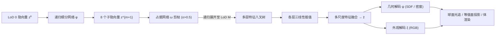

## 一句话总结

ReFiNe 用一个轻量神经网络，通过递归的八叉树式层次隐式表示，把整个数据集里成百上千个以"场"（SDF、彩色 SDF、NeRF）形式表达的 3D 资产压缩到各自的一个隐向量中，在保留高频几何与颜色细节的同时实现极高压缩率。

## 研究背景

神经场用 MLP 预测连续的场值，能以任意分辨率编码几何与外观，已广泛用于计算机视觉、机器人与图形学。但高保真方法大多只针对单个场景、对目标几何或外观过拟合；而能同时表示多个形状的方法通常会牺牲高频细节，限制了在流式传输、表示学习等场景的实用性。

已有做法可分两类。全局条件方法（每个形状一个隐向量）能在大量形状上学到隐空间，但需要 3D 真值监督，且在高频细节上表现不佳。局部条件方法把隐函数按空间划分，借助离散-连续混合结构获得更精确的重建，但通常只编码单个场景，并要额外维护辅助数据结构，用内存换取更简单的映射。此前的 ROAD 用递归八叉树同时利用全局与局部条件，但只建模几何、输出的是固定分辨率的有向点云，无法连续查询隐函数，因而不能做光线追踪或体渲染。

作者的核心动机来自自然物体的"自相似"性质：物体在不同尺度上与自身的一部分相似，这一性质正是分形压缩的基础。ReFiNe 把递归思想扩展到连续场设定，使得几何与颜色都能以更高保真度恢复，同时支持从直接 3D 监督（SDF 可选加 RGB）以及连续值场（NeRF）中学习。

## 方法

整体框架：每个物体 $O_k$ 被表示为一个从 3D 坐标到 $F$ 维场值的映射 $O_k: \mathbb{R}^3 \to \mathbb{R}^F$（SDF 时 $F=1$，辐射场时 $F=4$）。ReFiNe 用一个 $D$ 维隐向量 $\boldsymbol{z}^0$ 表示每个形状，并把它递归展开成最大细节层级（LoD）为 $M$ 的八叉树；八叉树每一层对应一个特征体，随后做空间插值与跨层特征融合，再解码成场值。整个数据集训练完成后，ReFiNe 由一组隐向量、一个用于八叉树展开的递归自解码器、一个占据预测网络，以及若干场专用解码器组成。

关键设计：

- 递归细分与剪枝：给定 LoD $m$ 的隐向量 $\boldsymbol{z}^m$，递归自解码器 $\phi: \mathbb{R}^D \to \mathbb{R}^{8D}$ 把它细分为 8 个子胞元，每个子胞元位于胞元中心，位置由 Morton 空间填充曲线定义。占据网络 $\omega: \mathbb{R}^D \to \mathbb{R}^1$ 对每个子隐向量预测占据值，只保留占据大于阈值的子集继续递归：

$$\mathcal{Z}^{m+1} = \{\boldsymbol{z}^{m+1} \in \phi(\boldsymbol{z}^m) \mid \omega(\boldsymbol{z}^{m+1}) > 0.5\}$$

训练时利用真值八叉树结构监督占据预测，被判为空的体素从结构中剪除，从而无需维护额外的辅助数据结构。

- 多尺度特征融合：直接把体素中心处的隐向量解码在低层级会得到粗糙近似，且与体素尺寸强绑定，难以扩展到高分辨率。作者改为在采样位置对同层级周围隐向量做三线性插值（首层除外），再把各层的中间隐向量融合成 $\bar{\boldsymbol{z}} \in \mathbb{R}^{\bar{D}}$。求和方案保持隐向量尺寸不变（$\bar{D}=D$）；拼接方案则 $\bar{D}=D \times M$，存储代价更高但重建质量更好。

- 跨模态解码与渲染：几何映射 $\psi$ 与外观映射 $\xi$ 在所有物体间共享。SDF 时 $\psi: \mathbb{R}^{\bar{D}} \to \mathbb{R}^1$ 输出距离值，可用等值面投影快速取表面点，或用球面光追渲染；彩色物体额外用 $\xi: \mathbb{R}^{\bar{D}} \to \mathbb{R}^3$ 输出 RGB。NeRF 时估计 4D 向量 $(\boldsymbol{c}, \sigma)$，颜色网络额外接收视角方向，体渲染沿光线合成：

$$\hat{\boldsymbol{c}}_{ij} = \sum_{k=1}^{K} w_k \hat{\boldsymbol{c}}_k, \quad w_k = T_k\left(1 - \exp(-\sigma_k \delta_k)\right), \quad T_k = \exp\left(-\sum_{k'=1}^{K} \sigma_{k'} \delta_{k'}\right)$$

- 网络与训练：$\phi, \omega, \psi, \xi$ 均由基于 SIREN 的周期激活 MLP 参数化，以利于恢复高频细节。总损失为占据的二元交叉熵损失、几何损失与颜色损失的加权和：

$$\mathcal{L} = w_o \mathcal{L}_o + w_g \mathcal{L}_g + w_c \mathcal{L}_c$$

SDF 用 $w_o=2, w_g=10, w_c=1$，NeRF 用 $w_o=2, w_g=1, w_c=1$。训练在单张 A100 上进行，小数据集约 10 小时、大数据集约 40 小时收敛。

## 实验结果

在 Thingi32 / ShapeNet150（SDF）基准上，ReFiNe 在 Chamfer 距离与 gIoU 上超过 DeepSDF 与 Curriculum DeepSDF，且存储最小；只需遍历到 LoD6 即可达到 ROAD 遍历到 LoD9 的水平：

| 方法 | Thingi32 CD↓ | Thingi32 gIoU↑ | ShapeNet150 CD↓ | ShapeNet150 gIoU↑ |
| --- | --- | --- | --- | --- |
| DeepSDF | 0.088 | 96.4 | 0.250 | 90.2 |
| ROAD / LoD9 | 0.017 | 98.7 | 0.036 | 94.9 |
| ReFiNe / LoD6 | 0.019 | 99.4 | 0.027 | 97.4 |

在 SRN Cars（NeRF，新视角合成）基准上，ReFiNe 在保持约 2.6 MB 网络体积的同时优于 SRN 与 CodeNeRF：

| 方法 | PSNR↑ | SSIM↑ | LPIPS↓ | Size(MB)↓ |
| --- | --- | --- | --- | --- |
| SRN | 28.02 | 0.95 | 0.06 | 198 |
| CodeNeRF | 27.87 | 0.95 | 0.08 | 2.8 |
| ReFiNe / LoD6 | 30.19 | 0.96 | 0.06 | 2.6 |

规模化上：GSO（1030 个彩色物体，SDF+RGB）用单个 45.6 MB 网络加 1.05 MB 隐向量，达到 0.044 Chamfer 与 25.36 的 3D PSNR，相较存原始网格（1.5 GB）与纹理（24.2 GB）压缩率超过 99.8%。RTMV（40 个复杂场景，NeRF）随隐向量维度增大重建质量单调提升：Lat 32 为 24.18 PSNR / 8.4 MB，Lat 256 为 26.72 PSNR / 45.6 MB；最轻量网络平均每场景仅约 210 KB 存储。

## 亮点与局限

亮点：递归公式天然地融合全局与局部条件，无需初始化和维护辅助数据结构即可扩展到上千个资产；跨模态统一表示（SDF、彩色 SDF、NeRF），输出可用球面光追、等值面投影或体渲染；连续场查询能力使其在同等 LoD 下比只能取离散胞元中心的 ROAD 更灵活，并支持光线追踪；压缩率极高（GSO 超 99.8%）。作者还观察到隐空间会依据形状与外观的相似性涌现出结构，促进跨形状的几何与颜色基元复用。

局限：当前表示仅限于有界场景，作者提出可借鉴反演球面背景模型来处理无界背景。

## 延伸思考

递归自相似这一先验把"分形压缩"的思想迁移到了连续神经场，提示我们物体/场景的层次冗余是一个仍未被充分利用的压缩维度。共享解码器加上每资产一个隐向量的设计，使隐空间天然具备生成与检索的潜力；作者也指出下一步希望结合扩散式生成模型，以文本、图像、深度等模态为条件做 3D 合成，这会把 ReFiNe 从"高效表示与压缩"推向"可控生成"。此外，拼接与求和两种融合方案在质量与存储之间的权衡，也为面向不同部署预算的自适应表示留下了调节空间。
