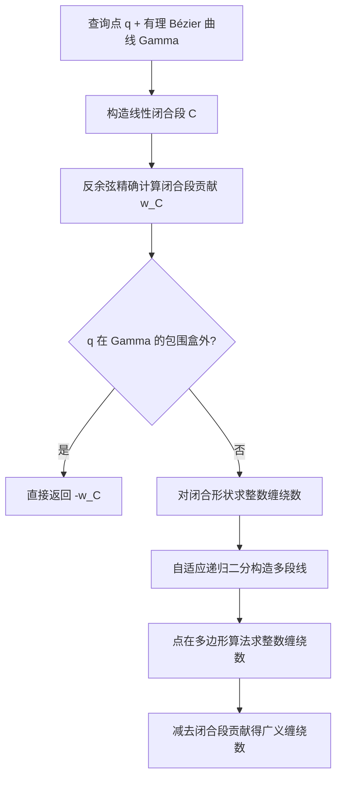

## 一句话总结

针对由一组有理参数曲线（有理 Bézier / NURBS）围成、且常存在缝隙、重叠、非流形等瑕疵的二维 CAD 几何，提出一套只依赖几何与三角运算、可在任意查询点稳定精确求解广义缠绕数的框架，从而给出对几何瑕疵鲁棒的点包含查询。

## 研究背景

点包含查询（判断空间任意点是否落在几何体内部）是图形学、计算机辅助几何设计（CAGD）与计算机辅助工程（CAE）中的基础谓词，广泛用于多物理场仿真中对背景网格积分点的内外分类、多材料体积分数初始化等场景。这些几何体通常用边界表示（B-Rep）描述，二维用 NURBS 曲线、三维用曲面。

真实的 CAD 模型大多由人工在建模软件中构造，不同软件、不同容差之间会产生人眼不可见但数值上显著的缝隙与重叠，形成所谓"脏"几何。对这类非水密、非流形的边界，传统方法在理论上站不住脚、在工程上常导致仿真软件出现难以预料的致命错误。

主流包含查询分两类：射线投射统计射线与边界的交点数并用奇偶规则判定，但对射线方向敏感、遇到顶点或整条边时需特判，且一旦射线恰好穿过模型缝隙就会把内部点误判为外部；缠绕数方法统计边界绕查询点的旋转圈数，天然回避了射线方向带来的特例。作者据此选择缠绕数路线。广义缠绕数把整数缠绕数推广为一个调和标量场，在瑕疵附近平滑退化，适合鲁棒包含查询，但此前文献主要针对线性三角网格或点云，缺少对一般曲线几何计算精确广义缠绕数的方法。直接对曲线积分公式做高斯求积，在查询点靠近曲线时因被积函数近奇异而失稳，且无法验证结果精度。

## 方法

### 整体框架

核心思想是把"曲线的广义缠绕数"化归为"闭合形状的整数缠绕数"，从而绕开近奇异积分。对任意参数曲线 $\Gamma$，定义连接其两端点的线性闭合段 $C(t)=(1-t)\Gamma(1)+t\Gamma(0)$。$\Gamma\cup C$ 构成闭合曲线，其缠绕数必为整数，于是

$$w_\Gamma(q)=w_{\Gamma\cup C}(q)-w_C(q)\in\mathbb{Z}-w_C(q).$$

其中闭合段贡献 $w_C$ 只需一次反余弦即可精确算出。整条形状 $\Gamma=\cup_i\Gamma_i$ 的广义缠绕数是各曲线独立贡献之和，正是这种"逐曲线独立可算"的性质带来了对缝隙、重叠的鲁棒性。

### 关键设计

对于"远点"（落在曲线包围盒或凸包之外），闭合形状的整数缠绕数为零，可直接用闭合段的反方向替代整条曲线，一次反余弦即得结果。模型中绝大多数曲线相对给定点都属此类。

对于"近点"，作者用自适应策略构造一条与原曲线在查询点处缠绕数可证相等的多段线 $\widetilde{\Gamma}$：利用 Bézier 曲线的凸包性质，若查询点落在某子曲线控制多边形凸包外，则该子段可用其线性闭合替代；否则对曲线二分并递归，直到子段近似为线性（各控制点到闭合段距离小于容差）。随后对闭合多边形用不含三角函数的点在多边形算法计算整数缠绕数，再减去闭合段贡献。由于 Bézier 曲线内部几乎处处光滑，即便查询点极近曲线，所需二分次数也很少。为提速，先做廉价的轴对齐包围盒测试，再用 Ying 与 Hewitt 的判据检测控制多边形是否简单且凸。该框架不限于有理 Bézier，凡能构造包围盒与线性闭合的曲线（含 NURBS）皆适用。

对于恰好落在曲线上的重合点，缠绕数严格意义上无定义。作者基于缠绕数场的调和性，取跨越跳变间断的平均值作为约定：线段上重合点缠绕数恒为零。由于内部重合点的投影计算昂贵，方法仅对端点做精确处理（端点由首末控制点精确插值），此时重合缠绕数等于非重合端点方向与该端点切向所张的有符号角；内部点通过反复二分在线性时间内变为端点。

## 实验结果

作者在含 87 段线段与 477 条三次 Bézier 曲线的模型上，删除一条曲线制造瑕疵：射线投射在远离几何误差处产生大面积误分类，而广义缠绕数场的退化仅局部化于误差附近，四舍五入后仍能沿 $1/2$ 等值线给出清晰边界。对刻意让相邻边彼此分离的形状，缠绕数与最近整数之差大于 $0.25$（判为不确定）的点极其稀疏。

性能上，由于缺乏能处理非水密曲线的直接对比方法，作者将二分搜索射线投射、Bézier clipping、以及本文算法都嵌入同一广义缠绕数框架，统计达到完美几何精度所需的曲线求值（二分）次数（次数越少越好）。

| 方法 | 三次 Bézier 模型 | 高阶有理 Bézier 曲线 |
| --- | --- | --- |
| 二分搜索射线投射 | 大量点需 15+ 次求值 | 表现最差，交点多导致开销大 |
| Bézier clipping | 明显改善 | 优于二分搜索 |
| 本文算法 | 无点超过 8 次，多数仅 1~2 次 | 仍显著领先 |

作者指出射线投射"信息过剩"：它额外定位了交点位置，而任意射线下这一信息几乎无用；本文方法不必求交点位置，故以更少的曲线求值收敛（尽管仅线性收敛）。对高阶、含自交与重叠的有理曲线，射线会多次相交，射线类方法开销尤其大，本文优势更明显。此外，纯线性化逼近即使高度细分，在 $10^5$ 个随机采样点中仍有相当数量误分类，无法满足对精度敏感的下游应用。

## 亮点与局限

亮点：把近奇异积分问题转化为纯几何与三角运算，对任意（含极近曲线的）查询点都能给出可证精确的广义缠绕数；逐曲线独立计算使方法对缝隙、重叠、非流形等"脏"几何天然鲁棒，退化局部化；对重合点（尤其端点）给出了数学上自洽的约定；算法不受曲线阶数与是否有理的限制，可直接推广到 NURBS；已集成进开源 HPC 库 Axom。

局限：方法仍假设曲线集合定向正确，单条曲线方向反转会局部翻转周边包含判定，这类误差当前未被处理；本文聚焦单条曲线的高效求值，尚未引入空间索引加速整体查询，也未做多线程 / GPU 并行；方法目前限于二维，三维曲面的推广面临无简单几何原语可闭合任意曲面的根本困难。

## 延伸思考

作者已把空间索引加速与并行化列为后续工作，这与 Barill 等人在点云缠绕数上的层级化思路一脉相承，是把该谓词推向大规模实用的自然方向。更具挑战的是三维曲面推广：二维中任意曲线都能用直线闭合，而三维缺乏有直接缠绕数公式的闭合原语，这提示或许需要新的闭合构造或与曲面求积方案结合。此外，"缠绕数与整数之差"作为分类置信度的思路，可与分割 / 能量最小化框架联动，用于自动定位并提示几何瑕疵位置，对 CAD 模型的鲁棒预处理颇有价值。
