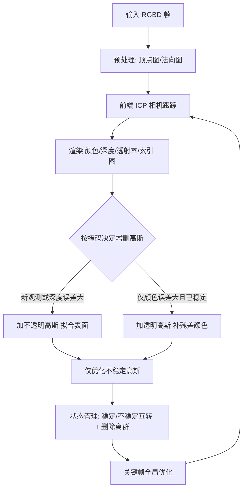

## 一句话总结

RTG-SLAM 用一套"紧凑高斯表示 + 高效在线优化"方案，让 RGBD 相机在单卡上以约 16 fps 实时重建大规模室内场景，速度约为最先进 NeRF SLAM 的两倍、显存约为其一半，同时保持可比的几何精度与更好的新视角合成质量。

## 研究背景

大规模实时三维重建在 VR／AR、机器人、交互式扫描等场景中至关重要。基于 RGBD 相机的传统 SLAM 用点云、面元（surfel）、有符号距离场（TSDF）等表示，能实时重建高质量几何，但普遍只关注几何精度，很少兼顾渲染真实感。

后续一批工作把神经辐射场（NeRF）作为隐式场景表示引入稠密 RGBD SLAM，希望同时得到高质量几何与外观，但体渲染代价高，难以做到实时，且显存开销大，难以覆盖大场景。

3D Gaussian Splatting（3DGS）作为辐射场的另一种表示，渲染与训练都远快于 NeRF，质量却相当甚至更好，但此前主要用于离线重建。若要把它用于顺序 RGBD 输入的在线重建，核心难点有两个：一是如何以低显存、低计算成本表示场景，二是如何做到实时的在线高斯优化。多个并发工作尝试把高斯塞进 RGBD SLAM，但离"大规模场景实时重建"仍有距离（此前报告的最快速度约 8.34 fps，且未在真实大场景上给出完整结果）。本文正是为解决这两个难点而提出 RTG-SLAM。

## 方法

### 整体框架

RTG-SLAM 的场景由一组 3D 高斯表示，每个高斯除位置、协方差、不透明度、球谐系数外，还额外记录法向、置信计数与创建时间戳，并被当作椭圆面元看待。系统包含两大核心贡献：一是紧凑高斯表示（配合独特的深度渲染方式），二是在线重建流程（高斯增删、状态管理、稳定／不稳定分类、相机跟踪与全局优化）。

### 关键设计 1：紧凑高斯表示与独立深度渲染

作者强制每个高斯要么"不透明"（$$\alpha=0.99$$），负责拟合表面与主色；要么"近透明"（$$\alpha=0.1$$），只补充残差颜色。目标是用单个不透明高斯拟合一小片局部表面，而不必像原始 3DGS 那样堆叠多个重叠高斯。

难点在于：即便是不透明高斯，若像渲染颜色那样用 alpha 混合渲染深度，深度会从高斯中心向外递减，无法准确表示一块近似平面的局部区域。为此，作者借鉴经典点渲染，把不透明高斯看作其主平面上的椭圆盘，深度取视线与最前一个不透明椭圆盘的交点深度。颜色渲染时高斯已按前后排序、并算好各自不透明度，只需取第一个满足 $$\alpha_j^r > \delta_\alpha$$ 的高斯做射线与平面求交即可，无需显式转换：

$$\theta_u = \frac{(p_j^r - t_g)\cdot n_j^r}{(R_g K^{-1}\dot{u})\cdot n_j^r}.$$

整个过程可微，因此高斯能直接从深度图损失反传优化。由此用远少的高斯即可拟合表面，大幅降低显存与计算。

### 关键设计 2：基于几何与外观的高斯增删

在线扫描时用现有高斯渲染出颜色图、深度图、透射率图与索引图，据此构造掩码决定在哪些像素补高斯：

$$M_s = \{u_s \mid \hat{T}_k(u_s) > \delta_T,\ \text{or}\ \lvert \hat{D}_k(u_s)-D_k(u_s)\rvert > \delta_d\},$$

$$M_c = \{u_c \mid \lvert \hat{C}_k(u)-C_k(u)\rvert > \delta_c,\ \text{and}\ u_c \notin M_s\}.$$

其中 $$M_s$$ 对应"透射率高（新观测区域）或深度误差大（新表面）"，需补不透明高斯拟合几何；$$M_c$$ 对应"几何已准但颜色误差大"的区域。为兼顾实时，仅在 $$M_s$$、$$M_c$$ 上均匀采样约 5% 像素补高斯：$$M_s$$ 采样点加不透明高斯；$$M_c$$ 采样点若对应高斯仍不稳定则继续优化，若已稳定则加一个透明高斯纠正颜色而不破坏既有观测。透明高斯不透明度低、对光能与其他视角影响小，且在深度渲染时被 $$\delta_\alpha$$ 自动滤除。

### 关键设计 3：稳定／不稳定分类与只优化不稳定高斯

高斯依置信计数分为稳定 $$S_{stable}$$ 与不稳定 $$S_{unstable}$$。优化用颜色与深度的 $$L_1$$ 损失，并对透明高斯加正则以固定其几何：

$$L = w_c L_{color} + w_d L_{depth} + w_{reg} L_{reg},\quad w_c=1,\ w_d=1,\ w_{reg}=1000.$$

为避免"遗忘"，每次优化后用加权平均把当前结果与历史融合。关键在于：稳定高斯已很好拟合历史观测、不再参与优化，且只渲染受不稳定高斯影响的像素，从而把待优化高斯数与待渲染像素数都大幅压缩，使优化能实时完成。状态管理负责稳定／不稳定互转以及删除长期不稳定的离群高斯。

### 关键设计 4：跟踪与全局优化

前端用帧到模型的 ICP 做里程计，用上一帧渲染的深度与法向做点到平面误差最小化：

$$E(\xi) = \sum \lVert (T_{g,k}V_k^l(u) - \hat{V}_{k-1}^{g*}(\hat{u}))\cdot \hat{N}_{k-1}^{g*}(\hat{u})\rVert.$$

同时用类似 ORB-SLAM2 的后端做地标图优化以减小大场景漂移。关键帧按相机运动（旋转超过 $$30^\circ$$ 或平移超过 0.3m）选取，新关键帧到来时对全局高斯做优化，扫描结束再用全部关键帧做更多轮次的收尾优化。

## 实验结果

在 Replica（Office 0）与自采 Azure（Home，约 $$70m^2$$）上比较时间与显存表现，RTG-SLAM 速度约为 NeRF SLAM 的两倍、约为同样基于高斯的 SplaTAM 的 46 倍，显存明显更低（SplaTAM 因用 alpha 混合渲染深度而产生数百万高斯并在 Home 场景 OOM，本文紧凑表示仅约 98.7 万高斯）。

| 方法 | 数据集 | FPS | 显存 (MB) |
|------|--------|-----|-----------|
| NICE-SLAM | Azure | 0.63 | 10057 |
| Co-SLAM | Azure | 8.65 | 17342 |
| ESLAM | Azure | 7.54 | 内存溢出 |
| Point-SLAM | Azure | 0.22 | 9950 |
| SplaTAM | Azure | 0.31 | 内存溢出 |
| Ours | Azure | 17.90 | 8782 |
| Ours | Replica | 17.24 | 2751 |

在 TUM-RGBD 上的相机跟踪精度（平均绝对轨迹误差，单位 cm）也全面领先其他 NeRF／高斯 SLAM，并接近经典 SLAM：

| 方法 | fr1_desk | fr2_xyz | fr3_office | 平均 |
|------|----------|---------|-----------|------|
| Co-SLAM | 2.92 | 1.75 | 3.55 | 2.74 |
| ESLAM | 2.49 | 1.11 | 2.74 | 2.11 |
| Point-SLAM | 2.56 | 1.20 | 3.37 | 2.38 |
| SplaTAM | 3.33 | 1.55 | 5.28 | 3.39 |
| Ours | 1.66 | 0.38 | 1.13 | 1.06 |
| ORB-SLAM2 | 1.60 | 0.40 | 1.00 | 1.00 |

在 ScanNet++ 的几何精度上，本文除逊于"深度始终准确"的 Point-SLAM 外优于其余方法（Acc. 0.95、Acc. Ratio 96.41、Comp. 1.11、Comp. Ratio 97.16），且在新视角合成上超越 NeRF SLAM。消融显示：紧凑高斯表示在相同深度精度下所需高斯远少于 alpha 混合的原始高斯；去掉透明高斯（纯不透明）会在新视角产生明显颜色误差。

## 亮点与局限

亮点：

- 提出紧凑高斯表示，用"不透明拟表面／透明补颜色"加上独立的椭圆盘深度渲染，让单个高斯拟合局部平面，大幅削减高斯数量、显存与计算；
- 在线优化只处理不稳定高斯、只渲染其占据像素，配合稳定／不稳定状态管理，使高斯 SLAM 首次在真实大场景上做到约 16 fps 实时重建；
- 在速度、显存、跟踪精度与新视角合成上全面优于或可比于最先进 NeRF SLAM 与并发高斯 SLAM，并在多种真实大场景上验证。

局限：

- 为实时只用不透明与透明两类高斯，渲染质量相比完整原始 3DGS 不可避免有所下降；
- 反射或透明材质会导致表面颜色随视角剧烈变化，使部分高斯在两种状态间频繁切换、难以充分优化；
- 目前面向静态室内场景，对户外、动态物体、快速相机运动与光照变化尚未处理。

## 延伸思考

这篇工作的核心不是提出新的表示，而是把 3DGS"改造"得适合在线、大规模、实时的重建约束：用几何先验（RGBD 深度）替代原始 3DGS 靠梯度自适应致密化的做法，把"何处该有高斯"变成可由深度／颜色误差掩码显式判定的问题，从而摆脱漫长的离线优化。"不透明拟合几何、透明补偿外观"的分工，本质上是把几何低频信号与外观高频残差解耦，这与其他把显隐表示或粗细信号分层处理的思路一脉相承。而"稳定即冻结、只优化活跃部分"的策略，则是把经典 point-based SLAM 的增量式思想迁移到可微渲染框架里，用工程化的状态管理换取实时性。值得进一步思考的是：如何在保留这套高效框架的同时提升渲染上限（例如对活跃区域用更丰富的高斯），以及如何把反射／动态／光照变化纳入同一套增删与状态机制，是这条技术路线通往更通用实时重建的关键方向。
