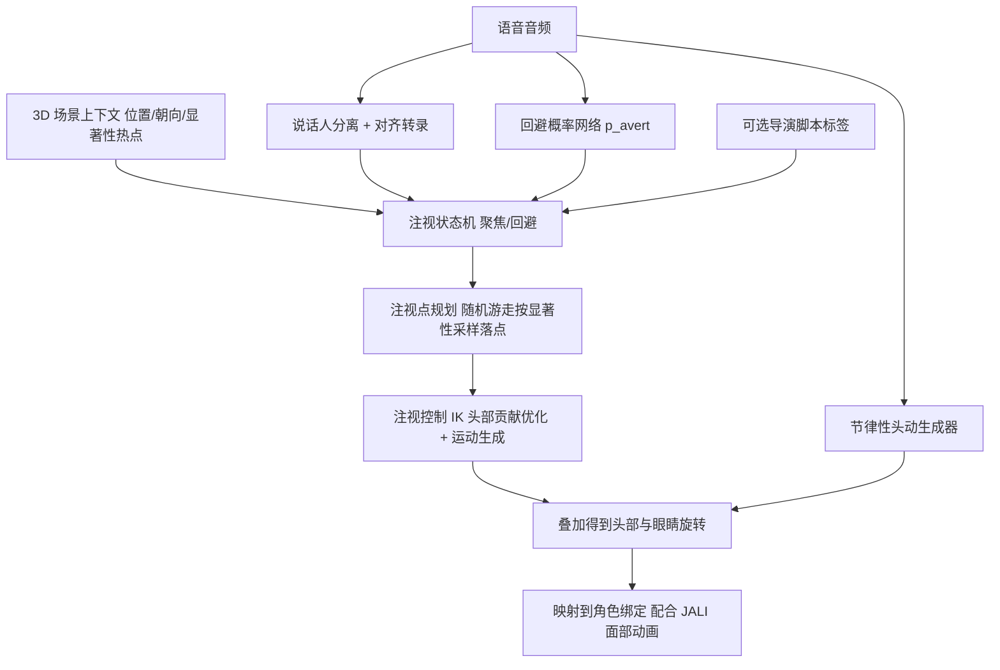

## 一句话总结

$$S^3$$ 是一个面向动画师的模块化框架：以对话语音、导演标注脚本和电影化 3D 场景为输入，自动生成对话角色头部与眼睛的三维旋转动画，核心思路是「语音决定注视回避的时机与节奏、3D 场景显著性决定注视的具体落点」。

## 研究背景

头部的节律性动作与眼睛的注视变化，是非语言沟通中最关键的表达通道之一。在对话中，头眼动作承担着表达思考、专注、理解、参与度以及话轮转换等调节功能。心理语言学研究指出，一次对话里约有百分之三十的时间是把视线从对话对象移开的，但现有的语音驱动面部动画大多只关注下半张脸的口型与说话表情，头眼旋转往往被留给身体动画随意处理，结果就是大量合成的说话人脸都直勾勾地盯着正前方。

以往的对话注视研究要么基于程序化的心理语言学启发式规则，要么是缺乏电影化场景上下文的数据驱动模型；也有工作只做非对话式的场景显著性注视，或只做无场景的对话注视。作者认为自己是首个把语音与 3D 场景上下文结合、面向动画师、系统性建模对话中头眼旋转的方案。

作者提炼自动画实践的关键洞察是：语音主要负责注视回避的模式与时机，而回避／聚焦的精确 3D 落点主要由电影化的场景上下文决定。$$S^3$$ 正是围绕这一观察，把对话头眼运动拆解成若干动画师友好的组件：语音驱动的节律性头动、脚本驱动的象征性头眼手势、以及由语音驱动的聚焦／回避配合场景显著性细化而成的注视轨迹。

## 方法

整体框架：$$S^3$$ 接收语音音频、3D 场景上下文与可选脚本三路输入，输出头部与注视轨迹。它由三个相互独立的模块组成——一个受深度学习指导的注视点（注视轨迹）规划器、一个逆运动学（IK）注视控制器，以及一个学习得到的节律性头动生成器。注视点生成器先为每个角色生成注视转移目标的时间序列 $$\{t_i, \vec{q}_i\}$$，交给 IK 控制器生成逐帧的头部旋转 $$\bar{\theta}_{head}(t)$$ 与注视 $$q(t)$$，最后叠加节律性头动 $$\Delta\theta_{head}(t)$$ 得到最终头部输出。

关键设计：

- 问题建模：语音为双人对话的两路音频流 $$A_1(t)$$、$$A_2(t)$$；场景用两位说话者的 3D 位置 $$p_1,p_2$$、中性朝向 $$\vec{d}_1,\vec{d}_2$$，以及 $$k$$ 个动画视觉热点的位置 $$\{v_i(t)\}$$ 与显著性权重 $$\{s_i(t)\}$$ 表示。头部建模为相对颈部的 3 自由度旋转（忽略滚转对注视的贡献），眼睛用世界空间注视点 $$q$$ 表示，眼球局部注视点 $$q_{eye}=(BH)^{-1}q-e$$，其俯仰／偏航角即眼旋转。用世界空间注视点的好处是契合大多数动画绑定的 look-at 控制器，并天然涵盖前庭眼反射。
- 数据准备：作者从 YouTube 上采集了 111 段试镜表演视频（共 379 分钟），每段有一位在镜演员与一位画外演员对话。选试镜的原因是被试演员始终在画面内（同时提供说话与倾听行为），且表演比实验室采集更自然多变。用现成注视估计模型得到注视方向，经基于离散度的滤波去除微扫视并切分为注视段，用高斯混合模型把最大簇中心作为画外演员方向 $$\vec{p}_{off}$$，据锥角 $$\phi$$ 判定回避：$$averted(\vec{p},\vec{p}_{off},\phi)=\lceil cos(\phi)-(\vec{p}\cdot\vec{p}_{off})\rceil$$，并对 $$\phi$$ 做线搜索以最大化聚焦／回避转移次数。
- 剥离节律性头动：为训练节律性头动模型，需要把节律性头动与注视引发的头动分开。作者用动态时间规整（DTW）度量注视旋转 $$\theta_{eye}(t)$$ 与头部旋转 $$\theta_{head}(t)$$ 的最优时间对齐相似度（因头动总是滞后眼动约 100 至 200 毫秒且更慢）。对齐代价低的样本认为头眼相关，减去对齐后的注视旋转；代价高的样本认为二者独立，将其朝向复位到正面静止姿态，最后拼接并插值得到节律性头动信号 $$\Delta\theta_{head}(t)$$。
- 回避概率网络：用循环神经网络预测每一时刻的注视回避概率 $$p_{avert}(t)$$，输入为韵律音频特征（MFCC、对数滤波器组能量、谱子带质心）与说话／倾听话轮时序。网络对称，交换两路输入即可预测对话伙伴的回避概率。在试镜数据上训练／验证准确率分别为百分之九十八点四与百分之七十八点九。
- 注视点规划状态机：每个角色维护回避状态 $$X_a\in\{0,1\}$$，在直接聚焦与回避之间切换。状态转移由三种信号驱动——语音回避概率 $$p_{avert}(t)$$、场景物体显著性的骤增 $$\dot{s}_n(t)>\tau$$（默认 $$\tau=0.5$$），以及对话伙伴的注视状态 $$X_b(t)$$（用于建模相互注视，分两遍处理）。回避时用随机游走按显著性采样落点，选择第 $$i$$ 个物体的权重为
$$\rho_i=s_i\cdot e^{-\kappa\cdot\max(1,1/dur)\cdot\lVert v_i-v_{prev}\rVert}$$
其中 $$\kappa=1.33$$，$$dur$$ 为回避时长（保证极短回避只做小幅注视转移），再经 softmax 得到选择分布，注视时长采样自已知的人类注视分布。
- 注视控制 IK：给定注视目标序列，先解一个优化问题确定头部贡献，三项分别是匹配头眼角度的学习相关性、最小化偏离对话伙伴的头动、最小化达成注视所需的眼动：
$$\bar{\theta}_{head}=\arg\min_{\theta}\left(w_p\lVert\theta-\theta_p\rVert^2+w_n(1-dwell)\lVert\theta-\theta_n\rVert^2+w_e\,dwell\lVert\theta-\theta_{eye}\rVert^2\right)$$
其中 $$dwell=\min(dur,1)$$ 随注视停留时间增大：停留短则抑制头动、鼓励用眼睛达成目标，停留长则相反。权重经网格搜索确定，使与标注头眼角度的均方误差最小。随后用改进的头眼运动生成器把目标序列插值成逐帧运动，眼／头子运动时长分别取 100 与 600 毫秒，并对注视点注入噪声以模拟不完美的知觉。
- 脚本控制与微扫视：支持三类可扩展标签——look-at 标签（临时放大某物体显著性）、方向标签（如向上回避表思考、向下回避表愧疚）、override 标签（强制聚焦／回避）。此外把注视停留超过 0.5 秒时的微扫视作为后处理加入以增强真实感。
- N 方对话：模块化设计使其可拓展到多人对话——把三方场景视作成对的双人对话，说话方切换时动态重新登记对话伙伴，第三方被当作显著场景物体处理。

## 实验结果

对回避预测网络（$$S^3$$ 的核心）与两个基线对比：stare（从不回避）与 statistical（按数据集分布随机采样聚焦／回避区间）。指标包括逐帧准确率、Jaccard 相似度（IOU）、注视转移对齐准确率与回避实例比。

| 模型 | Acc | IOU | Gaze-on Acc | Gaze-off Acc | 回避实例比 |
| --- | --- | --- | --- | --- | --- |
| Stare | 0.63 | 0.00 | 0.00 | 0.00 | 0.00 |
| Statistical | 0.47 | 0.23 | 0.31 | 0.33 | 1.04 |
| $$S^3$$ | 0.79 | 0.36 | 0.53 | 0.53 | 1.08 |

stare 因聚焦占主导而有百分之六十三的准确率，但在其余感知指标上全面失效；statistical 无法在感知合理的时机产生回避；$$S^3$$ 在所有指标上表现良好，且生成的注视转移数量与真值接近。此外，注视控制 IK 预测的头部角度均方误差为 10.92 度，优于 $$\theta_{head}=\theta_{eye}$$ 的 24.26、$$\theta_{head}=\theta_n$$ 的 16.04 与 $$\theta_{head}=\theta_p$$ 的 11.30；状态机在正确回避时选中正确回避簇的准确率为百分之九十点七。作者还与两项最接近的对话注视先前工作做了 36 人的四点强制选择感知研究（因无法获取其代码，用其视频音频跑本方法），结果显示 $$S^3$$ 相比两者均获显著偏好；动画师评价其具有「令人信服的相互注视」「合理的注视目标」，普通观众称其注视「合理」「自然」。运行时（1 分钟音频，RTX3060）大致为分离 25 秒、语音转文本 10 秒、音频特征 30 秒、节律头动与注视规划各 2 至 3 秒。

## 亮点与局限

亮点：首次把语音与 3D 场景上下文统一进对话头眼动画模型，且面向动画师工作流；模块化拆解（回避概率网络＋显著性状态机＋注视控制 IK＋节律头动）让系统可控、可插入现有 Maya／JALI 流程，并能自然拓展到多人对话；提出带停留时间项 $$dwell$$ 的头部贡献优化，比既有 IK 策略误差更低；配套发布了 379 分钟的分离标注对话数据集与音视频处理代码。

局限：脚本转录与音频的精确音素对齐在长音频、非词性或含糊声音、噪声、串话下仍是难题，可能影响脚本手势的时机；同时说话、串话、多人群体或对人群讲话等复杂场景留待未来；未利用语音或转录中的情绪／认知信息来调制头眼动画（目前只能靠脚本显式标注）；依赖现有方法生成眨眼等副语言行为，未显式建模眨眼与注视转移的关联。

## 延伸思考

这项工作真正的巧劲在于「解耦」二字：把语音负责的「何时移开视线（ego-centric 时机）」与场景负责的「往哪看（exo-centric 落点）」拆开，再用注视轨迹这一中间表示把两者缝合。这种分工既符合动画师对可控性的诉求，也让每个子问题都能用最合适的工具解决——时机用数据驱动的循环网络，落点用显著性随机游走，头眼分配用带停留时间的 IK 优化。相比端到端回归，模块化带来的可编辑性（脚本标签）与可拓展性（多人对话）是端到端模型难以企及的，这对追求「可控生成」的动画研究是很有价值的范式提醒。

它也暴露了流水线式方法的软肋：各模块误差会沿链累积，且情绪／认知这类跨越语音与视觉的高层语义没有被显式建模，只能靠人工标签补足。一个自然的延伸方向是，把情感分析与显著性预测融进同一表示，让注视的时机、落点与情绪表达联合优化；而作者在结论中点出的「头眼洞察可迁移到手势与体态动画」，也提示这套「语音定节奏、场景定目标」的思路有望推广到更广的对话式身体动画。
