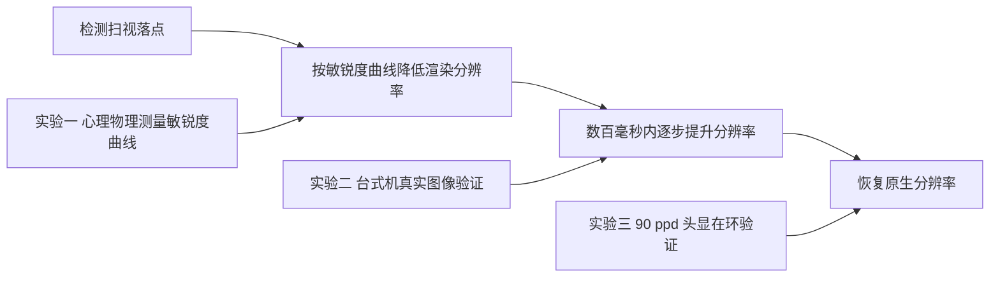

## 一句话总结

利用人眼在扫视（saccade）落点之后数百毫秒内视觉敏锐度暂时下降的现象，提出一种只需检测扫视、无需高精度注视点追踪的注视相关渲染算法，在扫视后短暂降低渲染分辨率以节省带宽与算力，并通过三项用户研究证明其不可察觉性。

## 研究背景

头戴显示器（HMD）要在移动、受电池与算力约束的形态下，以高帧率（大于90 Hz）渲染接近视网膜分辨率、宽视场的画面，压力巨大。已有的感知优化渲染多为注视点渲染（foveated rendering），即在远离注视中心的外周区域降低细节。这类方法依赖时空高精度的眼动追踪，而扫视这种快速、弹道式的眼球运动对追踪延迟要求极高（通常需要眼到光子延迟低于50到70毫秒），在实际硬件中难以达到，追踪不准时会产生明显伪影。

已有研究充分利用了视觉敏感度随视场空间位置的变化，却没有人利用其随时间的变化：扫视完成后视觉敏锐度并不会立即恢复。扫视会抑制视觉输入以掩盖视网膜运动模糊（扫视抑制），而落点之后需要依靠微扫视和眼球漂移逐步恢复对高空间频率的敏感度。本文首次系统刻画这一落点后（post-saccadic）敏锐度的时间演化，并将其转化为一种全新的、非注视点式的渲染优化手段。

## 方法

整体框架：检测到扫视后，算法立即把渲染分辨率降到与当前落点后视觉敏锐度相匹配的较低水平，再在随后数百毫秒内逐步把分辨率提升回原生分辨率。整个方法由三项用户研究驱动与验证。

关键设计一：落点后敏锐度模型。实验一用两选一强迫选择（2AFC）的 Gabor 朝向辨别任务测得，落点瞬间用户仅能分辨约10 cpd 的 Gabor，约500毫秒后提升到约27 cpd。用幂函数拟合（$$R^2 = 0.71$$）：

$$sf(t) = 1.9469\,t^{0.3475} + 9.5062$$

其中 $$sf$$ 为可分辨的最高空间频率，$$t$$ 为落点后时长。

关键设计二：带宽节省分析。以敏锐度曲线为准，把降分辨率窗口保守地限制在333毫秒，之后恢复原生分辨率。节省幅度强依赖显示原生分辨率与扫视频率，因为最大节省发生在落点后头100毫秒内。

关键设计三：头显渲染管线。在 OpenXR 上实现，请求应用以1.5倍原生分辨率渲染，仅在合成器最终阶段拦截帧，用高斯带通滤波下采样到目标分辨率，再用标准双线性上采样。目标分辨率按奈奎斯特（cpd 乘2）由敏锐度曲线换算，并引入线性斜坡使其在500毫秒恢复原生，限制最大8倍下采样，并加入可调敏锐度偏移 $$s$$ 供感知微调：

$$sf(t) = \max\left( \left(1.9469\,t^{0.3475} + 9.5062 + s\right),\ \frac{t \times 45}{500},\ \frac{90}{8 \times 2} \right)$$

## 实验结果

实验一（十名被试，每人600次有效试次）测得上述幂函数敏锐度曲线，确认落点后敏锐度显著降低并在100到200毫秒内快速回升。带宽分析显示：以每秒三到五次的自然扫视频率，40 ppd 显示节省约9到16个百分点，随分辨率提升迅速增长，50、60、70、80 ppd 分别约为32到44、53到61、65到71、73到78个百分点。

实验二（30张自然图像，35名有效被试）用四点李克特量表评估分辨率变化的可感知程度。基线（不改变分辨率）平均评分1.186（1表示无变化），仅在21.1 cpd、100毫秒与200毫秒两种条件下与基线无显著差异（p=0.810 与 p=0.393），这两点正好落在实验一敏锐度阈值曲线之上；其余条件均被显著感知（p<0.001）。

实验三在自建90 ppd、眼动到光子延迟30毫秒的头显中，16名被试用四点量表（1不可察觉，4不可接受）评估不同 $$s$$ 值：

| s | -12 | -9 | -6 | -3 | 0 | 3 | 6 |
|---|---|---|---|---|---|---|---|
| 平均评分 | 3.9 | 3.3 | 2.2 | 1.4 | 1.2 | 1.1 | 1 |
| 标准差 | ±0.3 | ±0.7 | ±0.7 | ±0.6 | ±0.4 | ±0.3 | ±0 |

默认曲线（$$s=0$$）下16人中13人评为"不可察觉"，其余最差也仅为"可察觉但不恼人"，三项研究结论一致。

## 亮点与局限

亮点：首次完整刻画落点后视觉敏锐度随时间与空间频率的演化，并将其转化为可用的渲染优化；方法非注视点式，只需低延迟扫视检测而不依赖空间精度高的眼动追踪，对追踪误差不敏感；仅在合成阶段模拟子原生分辨率渲染，无需大改现有 HMD 管线即可落地，并可与现有注视点等感知优化叠加使用；自建90 ppd 头显在接近真实的条件下完成验证。

局限：实验一未考察离心度对落点后敏锐度的影响；台式机实验用下巴托固定头部、预设固定扫视目标，简化了自然头眼运动；实验三头显为提高像素密度而大幅缩小视场（约33度）；对文字等偏离自然图像1/f²频谱特性的内容，降分辨率会不成比例地损害其频谱；未处理伴随深度变化、需要调焦的扫视场景。

## 延伸思考

该工作把"时间维度上的感知松弛"作为一种此前被忽视的压缩资源，与传统在"空间维度"上做文章的注视点渲染形成互补，两者理论上可叠加。它对眼动追踪的要求从"高空间精度"降为"低延迟的事件检测"，这与事件相机等新型低功耗传感方案天然契合，可能推动更紧凑、省电的 XR 眼动方案。未来若与变焦（varifocal）显示结合，因调焦本身需数百毫秒，落点后降分辨率窗口有望进一步延长，从而在高分辨率变焦头显上带来更大节省。
