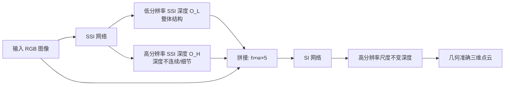

## 一句话总结

本文提出一个两阶段单目深度估计框架：先用改进的尺度平移不变（SSI）网络生成富含细节的结构信息，再把它作为输入喂给尺度不变（SI）网络，从而仅用合成数据训练即可实现高分辨率、可泛化到真实场景的几何深度估计。

## 研究背景

单目深度估计（MDE）是计算摄影管线（如 3D 照片、自由视点渲染、基于深度的图像编辑）的关键中层视觉任务。深度可分为几类：

- 度量深度：每个像素到相机的物理距离，需要相机焦距和物体尺寸的语义知识，机器人、自动驾驶等场景需要它。
- 尺度不变（SI）深度：几何一致但与真实深度相差一个未知比例，计算摄影的渲染任务只需这种深度即可。
- 尺度平移不变（SSI）深度：来自未知基线的立体像对视差，除比例外还相差一个未知偏移。

问题在于：直接估计 SI 深度非常困难，且缺乏高分辨率、大规模、多样化的 SI 训练数据集，导致以往方法边界精度差、泛化能力弱。而 SSI 深度可以在海量立体数据上训练，泛化性好、高分辨率细节也更佳，但由于丢失了几何准确性，无法直接用于图形学应用。

本文的核心思路是：既然 SSI 深度泛化好、细节丰富，就把它作为 SI 网络的输入，让 SI 网络的任务从「凭空估计几何」简化为「在已有结构上施加几何约束」，从而缩小合成数据与真实图像之间的域差距。

## 方法

整体框架分两步：第一步用 SSI 网络在低分辨率下捕捉场景整体结构、在高分辨率下捕捉锐利的深度不连续（边界细节）；第二步把这两路 SSI 输出与原始 RGB 图像拼接，送入 SI 网络回归出几何准确的高分辨率尺度不变深度，可投影为精确的三维点云。

关键设计一：稀疏序数损失（sparse ordinal loss）。SSI 深度的标准损失是在视差空间上的全局尺度平移不变损失

$$L_{ssi}=\frac{1}{N}\sum_{i}^{N}\left(f(O_i)-D^{*}_i\right)^2,$$

其中 $O$ 是估计视差，$D^{*}$ 是真值，$f(x)=ax+b$ 的参数 $(a,b)$ 通过最小二乘在每次估计上单独拟合（约束 $a>0$）。该损失是全局的，保证结构连贯，但难以生成锐利的深度不连续。作者引入序数损失来强化边界。对像素对 $(i,j)$，记 $\Delta O_{ij}=O_i-O_j$：

$$L_o(i,j)=\begin{cases}(\Delta O_{ij})^2 & \text{if } \lvert\Delta \hat{O}_{ij}\rvert<\delta\\ \mathrm{ReLU}\!\left(-\Delta O_{ij}\times \mathrm{sgn}(\Delta \hat{O}_{ij})\right) & \text{otherwise}\end{cases}$$

其中 $\hat{O}$ 是真值视差，阈值 $\delta=0.01$ 判定两点是否处于同一深度。对不同深度的像素对，仅在估计排序与真值不符时施加线性惩罚；对相近深度的像素对施加 $L_2$ 损失。相比经典 ranking loss（即使排序正确也有非零惩罚，因而与 SSI 损失冲突），本文的序数损失在排序正确时惩罚为零，从而能与 SSI 损失无冲突地联合使用。序数损失在图像上随机采样 2500 个像素对计算。SSI 网络的最终损失为

$$L_{ssiNet}=\lambda_{ssi}L_{ssi}+\lambda_{so}L_{so}+\lambda_{ssig}L_{ssig},$$

其中 $\lambda_{ssi}=3,\ \lambda_{so}=1,\ \lambda_{ssig}=0.1$，$L_{ssig}$ 为多尺度梯度损失作为边缘感知平滑项。

关键设计二：用 SSI 输入解决尺度歧义。SI 深度存在固有的尺度歧义，训练早期最小二乘拟合不稳定。作者利用全局一致的低分辨率 SSI 估计 $O_L$ 作为稳定参照，在逆深度空间中通过下式固定真值的任意比例：

$$c=\arg\min_{s}\sum_{i}\left(s\hat{D}^{*}_i-O^{L}_i\right)^2,\quad \hat{D}=c\hat{D}^{*},$$

同时把高分辨率输入 $O_H$ 的平均尺度对齐到 $O_L$，保证输入输出尺度一致。固定比例后即可使用无需尺度不变性的稠密损失。SI 网络的损失包含 $L_1$ 深度损失 $L_d$、多尺度梯度损失 $L_{dg}$、表面法向损失 $L_n$（估计法向与真值法向的余弦相似度），以及施加在法向上的多尺度梯度损失

$$L_{ng}=\frac{1}{NM}\sum_{m}\sum_{i}\left(\nabla\hat{n}^{m}_i-\nabla n^{m}_i\right)^2,$$

总损失为

$$L_{siNet}=\lambda_d L_d+\lambda_{dg}L_{dg}+\lambda_n L_n+\lambda_{ng}L_{ng},$$

其中 $\lambda_d=1,\ \lambda_{dg}=0.5,\ \lambda_n=0.1,\ \lambda_{ng}=0.01$。

实现上，SSI 网络采用 ResNeXt101 特征提取器，在多个合成与真实立体数据集上训练；SI 网络采用 EfficientNet-b7 骨干，训练分辨率 $1024\times1024$，仅在合成室内数据集 Hypersim 上训练。高分辨率输入 $O_H$ 的分辨率依据图像局部边缘密度自适应选择。

## 实验结果

在训练时未见过的三个数据集（Middlebury2014、iBims-1、DIODE 室内）上做零样本评估。SI 深度评估的主结果如下（部分指标，越低越好或越高越好如箭头所示）：

| 方法 | Middlebury RMSE ↓ | Middlebury δ1 ↑ | Middlebury D3R ↓ | iBims-1 δ1 ↑ | iBims-1 D3R ↓ |
|---|---|---|---|---|---|
| VN ICCV | 64.4 | 41.5 | 0.698 | 80.4 | 0.707 |
| LeReS | 42.6 | 56.0 | 0.415 | 68.7 | 0.431 |
| Ours SI | 41.3 | 55.4 | 0.215 | 86.7 | 0.342 |

本文方法在结构、深度分布、边界精度上整体优于现有方法，尤其在高分辨率复杂数据集（Middlebury、DIODE）上表现突出。

与度量深度方法对比中，PatchFusion、ZoeDepth 在未见数据集上因焦距不匹配而表现差，需匹配真值尺度后（标记 †）才有可比结果。本文方法仅 180M 参数、约 3 秒完成、只需管线中 3 次前向传播；而 PatchFusion 有 700M 参数、约 3 分钟，慢约 60 倍。

消融实验的两个关键结论：一是把 SSI 深度作为输入远优于仅用 RGB（后者 Middlebury δ1 仅 38.3，加入本文 SSI 输入后升至 58.8），且本文 SSI 输入优于 MiDaS 输入；去掉高分辨率输入 $O_H$ 或表面法向损失都会降低结构与细节精度。二是序数损失可与 SSI 损失联合并优于单独使用，而经典 ranking loss 与 SSI 损失联合反而更差。

## 亮点与局限

亮点：

- 用「SSI 输入喂给 SI 网络」的解耦思路，把难以泛化的 SI 任务简化为几何约束施加，从而仅靠单一合成室内数据集就实现真实场景泛化。
- 提出与 SSI 损失兼容的稀疏序数损失，解决了经典 ranking loss 排序正确仍有惩罚、无法与 SSI 联合的问题，显著提升边界细节。
- CNN 骨干可被已有的 boosting 框架进一步增强，在细节指标上超越包括 DepthAnything 在内的基线。
- 推理快（约 3 秒、180M 参数），适合计算摄影的 3D 照片等应用。

局限：

- 估计质量依赖输入图像质量，低分辨率或有噪声的图像会导致高分辨率序数输入无法给出准确的深度不连续，结果不够锐利。
- SI 网络因全局尺度不变约束需让整幅图像装入原生分辨率，难以随分辨率提升；作者认为 Transformer 更适合 SI 任务，但缺乏大规模 SI 深度数据集是训练 Transformer 的障碍。
- 在纯 SSI 的 ORD 结构指标上略逊于 DepthAnything，作者归因于 CNN 容量有限，在生成细节时难以维持全局一致性。

## 延伸思考

这篇工作的核心方法论价值在于「任务分解 + 输入迁移」：当某个任务（SI 深度）本身难以获得可泛化的数据，而一个相关但更松弛的任务（SSI 深度）有海量数据且泛化好时，可以把后者的输出当作前者的富信息输入，从而把泛化能力「借」过来，让下游网络只需学习被简化后的残余任务。这一思路对其他缺数据、缺泛化的中层视觉任务（法向、内在图像分解等）具有借鉴意义。

另一个值得关注的点是损失函数设计的「兼容性」：作者没有简单堆叠已有的 ranking loss，而是重新设计序数损失使其在排序正确时梯度为零，避免与全局 SSI 损失产生方向冲突。这提醒我们在组合多个监督信号时，除了权重调参，损失项之间的相容性本身就是关键设计。此外，作者也坦承 Transformer 可能是 SI 任务更好的骨干，未来若能构建大规模 SI 深度数据集或用生成模型/自监督缓解数据稀缺，这套框架的上限可能进一步提高。
