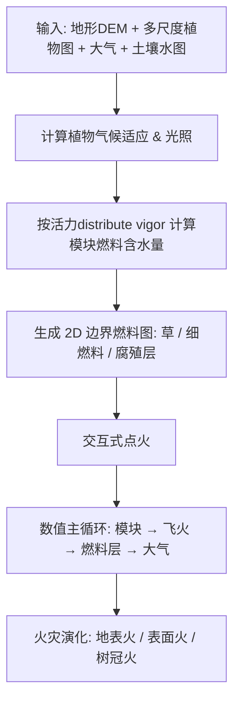

## 一句话总结

提出 Scintilla：一个统一的多尺度、多域（3D 植物 + 2D 地表燃料层 + 3D 大气）野火仿真框架，通过细致刻画不同燃料类型（草、细燃料、腐殖层、树枝）的燃料含水量、燃烧与跨域传热，并显式建模飞火（余烬/火星）的生成与输运，从而复现从地表火到树冠火、跨越不同生物群系的复杂野火动力学。

## 研究背景

野火是一种复杂的物理现象，涉及多种可燃物（落叶、枯枝、腐殖质、活体植被）的燃烧，不同燃料的属性决定了火灾的进程与烈度。理解从地面阴燃到猛烈树冠火的演化，对消防训练、林火管理以及影视/游戏中的复杂特效都有价值。

计算机图形学中此前的相关工作大多聚焦于：大尺度生态系统的高效表示、植被对侵蚀/雪崩/气候梯度的响应，或用 CFD（多为网格法）模拟火与烟。真正把详细植物几何、复杂流体动力学与燃料燃烧过程耦合起来的方法极少（如 Pirk 等 2017 的树木燃烧、Hädrich 等 2021 的 "Fire in Paradise" 野火框架）。作者指出，此前没有方法能刻画由林下植被（understory）和森林地表（forest floor）所代表的多种燃料类型。本文即在 Hädrich 等 2021 的基础上扩展，强调草、细燃料、腐殖层等不同可燃物的协同作用，以及燃料含水量、飞火和火焰湍流的影响。

## 核心方法

Scintilla 是一个耦合了多个子模型的流体动力学系统，用一组跨越多个空间域的耦合偏微分方程来描述野火。整体流程：用户输入植被、土壤、大气模型 → 初始化边界燃料模型（计算含水量与 2D 燃料分布）→ 交互式点火 → 数值求解多域燃烧与传热。

系统建立在若干核心假设上：有机物受热分解为炭、蒸汽和可燃气体（燃烧）；燃烧速率取决于燃料类型、温度和含水量；较厚组织经历热解并以"热解前沿"面近似；大气温度与蒸汽被风场对流输运；燃烧的有机物向其他有机物和大气辐射传热；草/细燃料/腐殖层的量分别正比于光照、温度、土壤水与植物生物量。

多个空间域及其变量：

- **大气（3D）**：温度 $$T_0$$、光照 $$L$$、水蒸气 $$q_v$$、烟 $$q_s$$、风场 $$u$$。光照用金字塔形阴影锥（shadow cones）单步传播近似。
- **边界燃料层（3D 与大气交界的三层 2D 域）**：草层（生物量 $$b_g$$、温度 $$T_g$$、含水量 $$w_g$$）、细燃料层（$$b_f, T_f, w_f$$）、腐殖层 duff（$$b_d, T_d, w_d$$）。三层通过一个高度映射函数 $$z = h(x,y)$$ 与 3D 大气域共定位。
- **植被（多尺度图）**：采用基于活力（vigor）的分层图表示。模块 $$M$$ 由若干截锥形枝段构成，携带含水量 $$w$$、质量 $$M$$、光通量 $$Q$$、活力 $$V$$ 等属性；植物 $$P$$ 由连接的模块组成，并带有物种相关的属性（细燃料产量、温湿度适应、蒸腾率等）。

## 技术细节

**燃料含水量模型（贡献 1）。** 先计算植物环境适应、局部光照、按光照分配活力，再由活力推算含水量。高活力（更健康、更湿润）的枝条含水更高、更难燃；低活力则更易点燃。模块初始含水量用 softplus 与 sigmoid 之和描述：

$$w_M(V_M, M_M) = \log(1 + e^{V_M}) \, \kappa \, M_M + w_{min} \frac{1}{1 + e^{-V_M}}$$

含水量随蒸腾（受热蒸发）而变化：

$$\frac{dw_M}{dt} = \phi_{ev}(T_M)$$

其中蒸发函数 $$\phi_{ev}$$ 借鉴 Arrhenius 反应速率但用 smoothstep 函数近似以提升计算效率。与 Hädrich 等 2021 不同，本文在燃烧之前先模拟水分蒸发——有机物必须先干燥才能点燃，这样才能对不同生物群系（雨林 vs. 稀树草原）给出合理差异。土壤水的蒸发也通过腐殖层温度纳入建模。

**边界燃料模型（贡献 2）。** 草、细燃料、腐殖层用基于层的 2D 表示。草的生物量由光照、温度、土壤水的正态分布乘积决定（草会规避阴影区）：

$$b_g(x,y) = N_T(T_0)\,N_L(L)\,N_W(q_w)\,N_T(T^*)\,N_L(L^*)\,N_W(P^*)\, b_g^{max}$$

细燃料与腐殖层则由 3D 植物模块的生物量经高斯核转换成 2D 图（细燃料/腐殖分布在植株附近），腐殖层还额外依赖由土壤水导出的湿度函数（越接近最优分解湿度，细燃料转化为腐殖层越快）：

$$\Psi_f(M,x,y) = \frac{b_f}{2\pi\sigma_f^2} e^{-\frac{(x-x_M)^2 + (y-y_M)^2}{2\sigma_f^2}} M_M \, \psi_f$$

**燃烧模型。** 采用一步法燃烧，把 Hädrich 等 2021 的模型扩展为包含蒸汽：有机物 + 热 → 燃料 + 炭 + 蒸汽。质量变化率扩展为同时考虑燃料含水量与风速：

$$\frac{dM}{dt} + k(T_M, w_M, u)\, c\, A = 0$$

$$k(T_M, w_M, u) = \eta(u)\, \Phi_{T_0T_1}(T_M)\, \Phi_{w_0w_1}(w_M)$$

其中 $$c$$ 为炭绝缘参数、$$A$$ 为热解前沿面积，$$\eta(u)$$ 描述强风加速反应。含水量以 sigmoid 形式介入以保证计算效率。

**传热（多域耦合）。** 大气温度场演化包含对流、扩散、辐射冷却，以及与草/细燃料层的热交换（腐殖层不直接向大气传热，代表被遮蔽的土壤层）：

$$\frac{\partial T_0}{\partial t} + u \cdot \nabla T_0 = \alpha \nabla^2 T_0 - \gamma(T_0^4 - T_{amb}^4) - \dots - \lambda_{g0}(T_0 - T_g) - \lambda_{f0}(T_0 - T_f)$$

模块温度按模块间热传导 + 与大气辐射交换演化；三个边界燃料层各自满足 2D 热传导方程并相互耦合（草导热最快、细燃料次之、腐殖层最慢）。这一设计意味着必须有可燃的草或细燃料在场，阴燃的地面火才能引发野火——对应现实中冻原地下火可阴燃数月后才引燃地表植被的现象。

**火星与余烬（Fire Spotting，贡献 3）。** 余烬释放率正比于燃烧掉的燃料量 $$\frac{dN_e}{dt} = c_e \frac{dM}{dt}$$；余烬表面积服从对数正态分布（参数由实验数据拟合）。余烬作为 3D 粒子，用火羽流与风的曳力、重力更新运动（曳力系数用 Schiller-Naumann 关联式）。余烬燃烧更简化（忽略含水量变化），温度按 Stefan-Boltzmann 与牛顿冷却律演化。落点点火采用 Gol'dshleger 的"热点理论"解析解（避免为快速传热缩小时间步），当余烬半径超过点火所需最小粒子半径 $$r_{cr}$$ 时把草层升温到燃点：

$$r_{cr} = \delta_{cr}\sqrt{\frac{\lambda_{gg}}{d_g b_g \zeta}\, \frac{\Theta T_e^2}{\Lambda}\exp\left(\frac{\Theta}{T_e}\right)}$$

**实现与数值方法。** 用 C++/CUDA 实现，火焰可视化用体积光线投射（OpenGL/GLSL），树几何与叶片在 geometry shader 中动态处理，支持交互式探索。数值上把 Hädrich 等 2021 使用的（数值扩散较大的）半拉格朗日对流替换为无条件稳定、二阶精度的 MacCormack 格式（其他标量仍用半拉格朗日但回溯用 RK-2），并加入涡量约束。余烬输运用前向欧拉。

## 实验结果

- **与解析模型对比**：在不同风速下，火线蔓延速率与配置为树冠燃料的 Rothermel 模型高度吻合（Fig. 8 左）。
- **与真实受控焚烧对比**：仿真火线的最大范围在三个时间点上与受控焚烧实验测量吻合，能准确捕捉火线的线性推进（Fig. 8 右）。
- **数值格式对比**：MacCormack 格式相比半拉格朗日格式，平均动能（湍流度）高出约 19.35%，说明数值扩散显著降低，能表现更丰富的野火湍流现象。
- **飞火轨迹**：在 0/20/40/60/100/150 km/h 等风速下模拟 100 条火星轨迹。低风速下火点上方上升气流强、轨迹更随机（火线更混乱）；高风速下余烬被带得更远（Fig. 6、7）。
- 框架能统一模拟地面火、表面火、树冠火各阶段，并覆盖草原、灌丛、稀树草原、冻原、北方针叶林、落叶林等不同生物群系，还能表现防火隔离带等人为林火管理手段的效果。

## 贡献与局限

贡献：

1. 新颖的**燃料含水量模型**：基于光照、枝条活力与植物气候适应，刻画森林生物群系中真实的含水量分布并融入野火仿真（燃烧前先蒸发水分）。
2. **边界燃料模型**：用分层 2D 表示刻画草、细燃料、腐殖层在野火中的作用及其空间分布模式与各自的燃烧/传热特性。
3. **物理合理的飞火模型**：刻画余烬/火星的生成、输运与落点点火，能在火线前方产生新火，表现野火的不可预测性。

局限（基于可获取正文推断）：

- 依赖大量物种相关与热/湿传递参数，其中不少（如气候适应参数、核函数参数、界面导热系数 $$\lambda_{ij}$$）难以直接从观测数据获取，需借助文献经验设定。
- 落点点火采用解析近似（热点理论）而非与数值传热完整积分，是为维持交互速率而做的近似取舍。
- 余烬燃烧被简化为恒定含水量的干热粒子，忽略其含水量变化与升力。

## 备注

本笔记基于作者主页 PDF 解读。因原文件较大（约 28 MB）下载时被截断，正文图版与结果展示（原文 12–20 页，含更多定性结果与参考文献）未能完整获取，但引言、相关工作、方法模型（全部核心方程）、实现、数值方法与结果验证部分（1–11 页）完整可读，本解读据此撰写。
