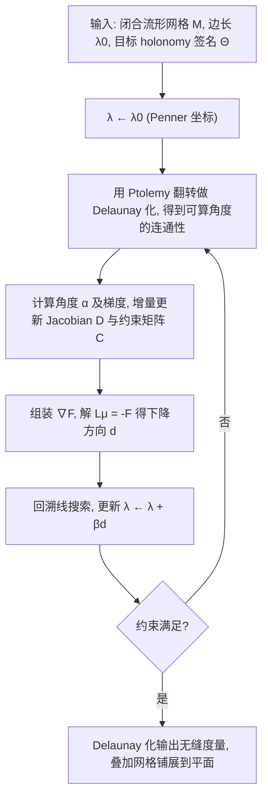

## 一句话总结

把无缝参数化问题重新表述为一组关于对数边长的角度约束方程，在 Penner 坐标（允许连通性通过内蕴翻转自由变化的度量表示）中用扩展牛顿法直接求解，从而以极少迭代稳健地构造出满足给定 holonomy 签名的无缝参数化。

## 研究背景

无缝参数化是构造四边形布局（quad layout）和纹理图集的关键起点：它要求参数化的 $u$、$v$ 方向线在切缝两侧平滑延续、切缝两侧的参数长度匹配。几何上可将其定义为带角度约束的网格度量——在几乎所有顶点角度和为 $2\pi$，而在少数锥点（cone）处角度和不同，锥点因拓扑原因对 $g\ne 1$ 的曲面不可避免。

无缝性还要求沿一组对偶环路的角度和为 $\pi/2$ 的整数倍。作者沿用 Campen 和 Zorin 的术语，把 $n_c+2g$ 个这类角度（$n_c$ 个锥点环路加 $2g$ 个同调基环路）称为 holonomy 签名。它决定了参数化的粗拓扑结构：锥点成为四边化后的奇异顶点，非可缩环路上的 holonomy 角决定四边形沿闭环如何拼接。因此对 holonomy 签名的完全控制至关重要。

此前 Shen 等人证明了在温和条件下任意 holonomy 签名都存在无缝参数化，并给出了带理论保证的算法，但该算法阶段繁多、需组合搜索合适环路，还要在中间步骤做极端细分，在标准浮点精度下容易失败。已有的内蕴方法（如离散共形映射）自由度不足，无法满足完整的无缝约束。作者希望给出一个概念简单、高效、能处理完整 holonomy 约束的算法。

## 方法

### 整体框架

方法把无缝度量定义为对数边长 $\lambda\in\mathbb{R}^{N_e}$ 满足如下约束方程组的解（因 Gauss-Bonnet 定理有一个顶点约束冗余，共 $N_v+2g-1$ 个方程）：

$$\sum_{T\ni i}\alpha_i^{T}(\lambda)=\frac{k_i^{v}\pi}{2},\quad i=1\ldots N_v-1,\qquad \sum_{m=1}^{n_j} d_m^{j}\alpha_m^{j}(\lambda)=\frac{k_j^{\ell}\pi}{2},\quad j=1\ldots 2g.$$

写成向量形式即 $F(\lambda)=C\alpha(\lambda)-\Theta=0$。这是一个非线性、欠定的方程组。朴素做法是用扩展牛顿法求解：每步用 $\nabla F=C\nabla_\lambda\alpha$ 构造 $L=\nabla F\nabla F^{T}$，解 $L\mu=-F$ 得到下降方向 $d=\nabla F^{T}\mu$，再做线搜索更新 $\lambda$。用初始边长 $\lambda_0$ 初始化，使每步近似最小化 $\lVert\lambda-\lambda_0\rVert$（等距度量）。但固定连通性下解未必存在，朴素算法不保证成功。

关键突破是在 Penner 坐标下优化。

### 关键设计

Penner 坐标为共享同一顶点集、但连通性可不同的所有度量提供了统一的坐标：给定初始连通性 $M_0$，任意对数边长赋值都定义一个度量，其规范表示由 Week 翻转算法（用 Ptolemy 公式更新长度的 Delaunay 翻转）得到。重要的是，Delaunay 判据用长度表达时对 Penner 坐标良定义、不要求满足三角不等式。翻转时相邻两三角形外边 $\ell_a,\ell_b,\ell_c,\ell_d$ 下的更新为

$$\ell'(e')=\frac{\ell(a)\ell(c)+\ell(b)\ell(d)}{\ell(e)}.$$

这样（对数）Penner 坐标在网格度量空间与 $\mathbb{R}^{N_e}$ 之间建立了一一对应，使优化可以在解已知存在的更大空间中进行。约束函数变为 $F(\lambda)=C\alpha(\mathrm{Del}(M_0,\lambda))-\Theta=0$。

算法需要额外处理两件事。其一是 Jacobian 更新 $\nabla_\lambda\alpha=\nabla_{\tilde\lambda}\alpha\cdot\nabla_\lambda\mathrm{Del}$，其中翻转边 $e$ 引入的转移映射导数由剪切量 $t=\ell_a\ell_c/(\ell_b\ell_d)$ 给出的稀疏矩阵按链式法则连乘得到。其二是约束更新：顶点角约束直接用 Delaunay 连通性上的角度；对偶环路则在每次翻转时找到与原环路同伦的新环路（在不穿越锥点的意义下可连续形变），保证 holonomy 不变，再重算约束矩阵。

由于扩展牛顿法不对应已知的凸能量，线搜索采用两个条件：约束向量范数不增 $\lVert F(\lambda+\beta d)\rVert\le\lVert F(\lambda)\rVert$，且方向不反转 $F(\lambda)\cdot F(\lambda+\beta d)\ge 0$。作者进一步分析指出该算法与共形映射、相似映射、度量优化三类凸问题密切相关：相比 Capouellez 和 Zorin 的度量优化，本方法去掉了共形投影内循环，因而能支持完整无缝约束，并且是只需一阶约束导数的二阶牛顿法（二次收敛）。此外还给出内蕴预处理（Delaunay 细分或向正三角形插值 $\lambda\leftarrow\beta\lambda_0$）以改善初始三角形质量。

## 实验结果

在 Myles 等人的 94 个带挑战性场的闭合网格上，方法无一例外地在 50 次迭代内同时满足顶点与环路 holonomy 约束，平均约 9 次迭代收敛，几何畸变低（用 Penner 坐标的 RMSRE 度量）。在基于 Thingi10k 构造的 16156 个网格数据集上（含 genus 高达 4307、548 个 genus 超过 20 的极端拓扑）达到 100% 成功率。仅内蕴预处理即可参数化原始 Thingi10k 中全部 27180 个非退化闭合网格分量。

| 对比项 | 表现 |
| --- | --- |
| Myles et al. 2014 数据集（94 闭合网格） | 全部成功，不需插入锥点或修改 holonomy |
| 修改版 Thingi10k（16156 网格） | 100% 成功，最高 genus 4307 |
| 平均迭代次数 | 约 9 次 |
| 与投影梯度法（Capouellez & Zorin 2023）对比 | 畸变相当，平均所需线性求解更少 |
| Shen et al. 2022（有理论保证） | 在最高 genus 模型上约 6% 失败，本方法全部成功 |

相比之下，MIQ 有 25% / IGM 有 17% 的案例找不到解，且常引入整数指标锥点、不保持 holonomy 签名；Shen 等人的方法因中间映射的极端畸变在高 genus 模型上失败。据作者所知，本方法是首个在无需插入锥点或修改锥点/holonomy 角的前提下，在整个数据集上成功的方法。

## 亮点与局限

亮点：把复杂的无缝参数化归结为一组对数边长上的角度约束方程，再用扩展牛顿法求解，概念极其简单；在 Penner 坐标中优化让连通性通过内蕴翻转自由变化，从而进入解已知存在的更大空间；只需一阶约束导数即可获得二阶收敛，摆脱了共形投影内循环与约束二阶导数（已知不连续）的困难；在超大规模、超高 genus 数据集上展现出突出的鲁棒性。

局限：算法缺乏形式化的正确性证明，作者仅给出经验证据与其与凸优化的联系；对极差的网格质量比较敏感（略高于共形映射）；度量最优性只是每步近似最小化 $\lVert\lambda-\lambda_0\rVert$，并未直接优化某个明确能量；度量设定下存在理论上无法满足的 holonomy 签名（如恰有两个 $3\pi/2$ 与 $5\pi/2$ 锥点的签名、无锥点却有非平凡环路 holonomy 的签名，均只出现在 genus 1 曲面）。

## 延伸思考

作者指出的方向都很自然：为算法建立坚实的理论基础、刻画其会失败的 holonomy 签名，是最重要的开放问题；向带边界曲面的扩展可沿用倍化（doubling）思路，但对尖锐特征（要求特征在参数域内笔直且轴对齐）的约束仍需更多工作；由于算法结构简单，它天然适合域分解与层次化扩展以推向更大规模。更广地看，"用统一的 Penner 坐标把连通性变化纳入连续优化"这一范式，或许还能迁移到其他需要在变连通性度量空间中求解的几何处理问题上。
