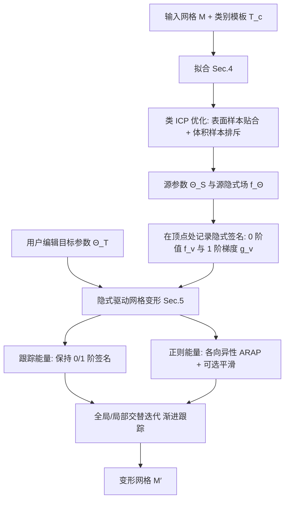

## 一句话总结

用参数化的隐式曲面模板作为语义把手来编辑三角网格：先把模板拟合到输入网格，再通过跟踪模板 0 等值面的方式把用户对模板参数的编辑传导为一套保持连通性、允许各向异性拉伸的网格变形。

## 研究背景

隐式建模在 3D 艺术创作中已被研究和使用数十年：艺术家定义一个体积场 $f_\Theta:\mathbb{R}^3\to\mathbb{R}$，其 0 等值面 $S:=f_\Theta^{-1}(\{0\})$ 给出想要的曲面。隐式表示有很多优势：对光滑的 $f_\Theta$ 可得到无限光滑、无限分辨率的曲面；内外部由 $f_\Theta^{-1}(\mathbb{R}^-)$ 与 $f_\Theta^{-1}(\mathbb{R}^+)$ 平凡定义；布尔运算（并、交、差）可直接用 $\min\lvert\max$ 算子实现，而这些操作在网格上却极为棘手。正因如此，metaball、卷积骨架、草图富化等隐式基元被广泛集成进主流建模软件与新兴建模工具。

然而，直接用隐式表示重建形状会丢失输入网格的连通性和细节。作者的目标是反过来：把原始、带细节的输入三角网格，用参数化隐式模板赋予"语义变形把手"，从而以一种全新方式编辑网格，并让同一套参数化隐式模板可复用到整类物体的变形上。

关键难点在于对模板几乎不做假设以保证通用性。作者只要求隐式场关于空间连续、关于参数 $\Theta$ 连续、在 0 等值面附近性质良好；不要求处处可微，也不要求是符号距离场（SDF）——因为像交、差这类常见操作本身就会破坏 SDF 性质（$\max$ 算子会在结合处产生梯度不连续），强行假设 SDF 会严重限制方法的可用性。

## 方法

### 整体框架

方法输入为某一物体类别 $c$ 的网格 $M$ 与一个由参数化隐式函数 $f_\Theta$ 表示的模板 $T_c$，分两个阶段操纵 $M$。第一阶段拟合：优化参数得到 $\Theta_S$，使模板 0 等值面 $S$ 与 $M$ 共位，并在 $M$ 的顶点处用局部隐式签名对网格进行编码。第二阶段变形：给定目标参数 $\Theta_T$（通常来自用户编辑），在把 $\Theta_S$ 推进到 $\Theta_T$ 的过程中跟踪这些隐式签名，同时最小化一个全局变形能量，得到变形后的网格。

### 关键设计

拟合能量借鉴迭代最近点（ICP）思想。在 $M$ 上均匀采表面样本 $\mathcal{P}_S$、在远处随机采体积样本 $\mathcal{P}_V$，优化：

$$E^{\sigma}_{\text{fit}}:=\sum_{p\in\mathcal{P}_S}\lvert f_\Theta(p)\rvert^2+\alpha\sum_{p\in\mathcal{P}_V}w_\sigma(p)\,\lvert f_\Theta(p)-d(p)\rvert^2,$$

其中 $d(p)$ 为 $p$ 到 $M$ 的近似符号距离，置信权重 $w_\sigma(p):=\exp\!\big(-d(p)^2/\sigma^2\big)$ 随距离迅速衰减。体积样本项的作用主要是"排斥"0 等值面、在模板初始离目标很远、表面项梯度为零或方向错误时提供非零梯度。由于 $f_\Theta$ 并不遵循 SDF，作者只弱惩罚对 $d(p)$ 的偏离，并采用由粗到细策略：$\sigma$ 从包围盒对角线（近乎均匀排斥）逐步降到其 3%（几乎无排斥），用 L-BFGS-B 求解。

变形阶段把病态的变形问题写成能量最小化：$E_{\text{def}}(M')=E_{\text{tracking}}(M')+E_{\text{reg}}(M')$。跟踪能量把网格"绑"到隐式场上，要求每个顶点在变形后保持两类隐式签名——0 阶（场值）与 1 阶（梯度）：

$$E_{\text{tracking}}(M')=\sum_v \lvert f_{\Theta'}(v')-f_v\rvert^2+\lVert \nabla f_{\Theta'}(v')-J_v\!\cdot g_v\rVert^2,$$

其中 $f_v:=f_\Theta(v)$、$g_v:=\nabla f_\Theta(v)$，$J_v$ 是顶点局部映射。通过对目标场做泰勒展开并消去 Hessian，得到对顶点位移更新 $d_v$ 的线性跟踪约束：

$$\left(\frac{\nabla f_{\Theta'}(v^k)+J_v\!\cdot g_v}{2}\right)^{\!T}\!\cdot d_v=f_v-f_{\Theta'}(v^k),\quad\forall v.$$

其巧妙之处在于：最终只用到一阶导数，但因构造中隐含了二阶信息，误差项达到三阶；更新形式等价于把标准梯度 $\nabla f_{\Theta'}$ 与重对齐的源梯度签名 $J_v\!\cdot g_v$ 混合的修正梯度下降。实现上用有限差分近似空间梯度，从而不要求隐式场处处可微。

跟踪能量本身对顶点在等值面上的滑动不敏感（平坦区域尤甚），因此需要正则化。作者受 ARAP 启发但不把局部映射约束为旋转（因为要允许拉伸），而是强制法向方向的等距、在切平面内控制拉伸：

$$E_{\text{reg}}(M')=\sum_{v\in V}\sum_{(u,w)\in E(v)}c_{vuw}\lVert J_v\!\cdot(w-u)-(w'-u')\rVert^2+\alpha_s E_{\text{Smooth}}(\{J_v\}).$$

局部映射被限制为 $J_v^k=n_v^k\!\cdot n_v^{T}+P_{n_v^k}\!\cdot J_v\!\cdot P_{n_v}$（$P_n:=I-n n^T$），可由一个秩 1 项加一个秩 2 互补项闭式求解。可选的各向异性平滑项 $E_{\text{smooth}}$ 借助平凡联络（trivial connection）对齐相邻局部映射，并用基于形状分割中距离函数的几何感知权重 $w_{ij}$，在被尖锐特征分隔的一致区域内保持均匀变形。整个优化按 ARAP 式的全局/局部交替迭代进行；对较大编辑还可拆成若干子编辑 $\Theta_S=\Theta_0\to\Theta_1\to\cdots\to\Theta_T$ 做渐进跟踪，以满足对无穷小更新的假设。

## 实验结果

论文的评测以定性对比与用户感知研究为主（感知研究细节在补充材料，正文未给出具体数值），因此这里忠实汇总其对比设置与主要结论，不杜撰数字：

| 对比对象 | 类型 | 本文相较的主要结论 |
| --- | --- | --- |
| Wei et al. 2020 | 参数化模板编辑 | 更好保留几何细节、对模板更高保真；不依赖训练数据、无泛化限制 |
| Neural Cages（Yifan et al. 2020） | 网格重定向 | 对目标结构更高保真、按目标尺度保留源细节；不受分布外输入拖累 |
| Spaghetti（Hertz et al. 2022） | 神经隐式编辑 | 保结构、保连通性与细节；对方法在大编辑与分布外样本上易失真 |

消融方面：拟合时"仅表面样本（无排斥）"会因远处梯度为零而无法收敛到目标，"均匀排斥"因错误假设处处为 SDF 而略微偏离目标，加权排斥（本文）最稳健。变形时无正则化不足以约束，纯 ARAP 无法完成大幅拉伸，本文能量在允许各向异性拉伸的同时保留细节；几何感知平滑权重能让用户按需保持一致区域的均匀拉伸并更清晰地界定区域边界。应用上展示了沙发、桌子、花瓶、马克杯、汽车、飞机等类别的交互式语义编辑（含花瓶的挤压/膨胀等复杂操作），用简单长方体模板做扭转等编辑，把源网格重定向到含噪单视角扫描的语义结构，以及借由 SMPL 模板对着装人体网格做姿态与体型编辑。

## 亮点与局限

亮点：对隐式模板只要求连续性、无需可微或 SDF，兼容 demoscene/主流建模软件产出的模板乃至 SMPL 这类专用参数模型，通用性强；变形保持输入网格连通性与细节，是对易受泛化困扰的学习类方法的有益补充；跟踪隐式签名建立了模板空间与形状空间的语义联系，且专门设计的各向异性 ARAP 正则支持大幅拉伸；同一模板可复用到不同结构、不同拓扑的输入，天然支持一次多处编辑与形状重定向。

局限：作者展示了一个失败案例——难以把大幅编辑局部化到极小的区域；方法聚焦保连通性变形，尚未处理必要时的稀疏拉伸松弛奇点、重网格化，以及细节的合成/删除；模板需事先设计，参数编辑虽直观但仍依赖已有的参数化结构。

## 延伸思考

把"隐式模板 + 网格跟踪"与学习类方法互补，是这条路线最有价值的地方：学习方法擅长从数据中推断语义参数却常在分布外失灵，而本文的跟踪式变形不依赖训练分布、保连通与细节，两者结合有望取长补短——例如用网络快速给出初始模板参数，再用本文方法做保真的确定性变形。作者提出的引入稀疏拉伸松弛奇点、局部重网格化与细节合成/删除，是突破"局部小区域大编辑"失败案例的自然方向。此外，方法对 SMPL 的兼容提示了一个更一般的思路：任何能算出（近似）符号距离场的专用参数模型，都可以接入这套语义编辑与重定向框架，这为把领域专用先验以"可编辑把手"的形式注入通用网格编辑提供了统一入口。
