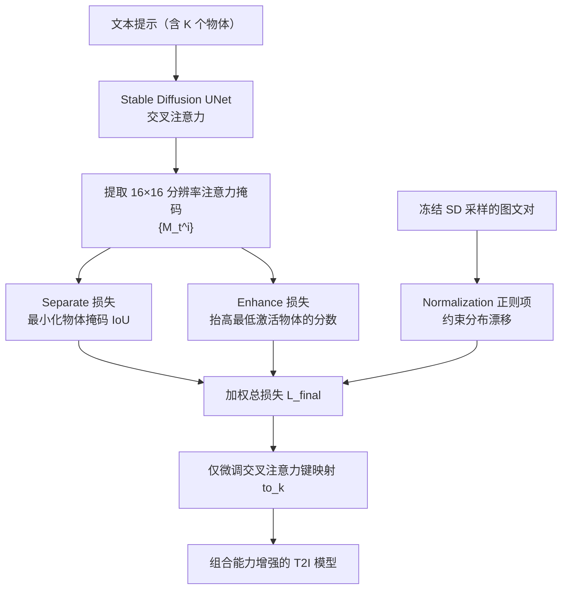

## 一句话总结

本文指出文本到图像扩散模型在多物体生成中「漏物体、物体粘连」的根源在于注意力激活过低与注意力掩码重叠，进而提出 Separate 与 Enhance 两个损失，仅微调交叉注意力的键映射函数，显著提升组合生成能力并能泛化到未见概念。

## 研究背景

即便是 Stable Diffusion 这类先进的文本到图像模型，在处理带不同属性（形状、大小、颜色）的多个物体时仍频繁出错，生成结果与文本提示不对齐。作者通过可视化交叉注意力掩码，定位到两个根本原因：

- 某些物体的注意力激活分数明显偏低，导致该物体被弱化甚至消失（例如「猫和老鼠」中老鼠激活低于猫，最终生成一只像猫的老鼠）。
- 不同物体对应的注意力掩码存在大面积重叠，多个概念坍缩为同一实体（例如「瓶子和碗」中瓶子的注意力落到碗的区域，瓶子没能生成）。

已有工作往往只处理其中一个方面：或放大注意力激活，或减少注意力重叠。作者主张两者需协同解决。此外，很多前人方法采用测试时自适应（TTA）的方式，冻结模型权重、只逐对概念优化隐变量，存在三个短板：没有真正提升模型的组合能力、推理更慢、无法扩展到大量概念且难以泛化到新概念。

## 方法

整体框架是一个组合微调方案：在 Stable Diffusion 的交叉注意力模块上引入 Separate 损失与 Enhance 损失，并配合一个正则项，只微调最关键的键映射参数，使方法轻量且可扩展。

关键设计：

- Separate 损失。在训练中随机采样时间步 $t$，取所有 $K$ 个物体的注意力掩码，最小化像素级重叠占比，抑制物体掩码相互绑定到同一区域：
$$L_{Sep} = \max\left(\frac{\prod_{i=1}^{K} M_t^i}{\sum_{i=1}^{K} M_t^i}\right)$$
其中分子为像素级乘积。

- Enhance 损失。先用高斯平滑核对掩码滤波得到 $\tilde{M}_t^i$，再放大激活分数最低那个概念的注意力，保证所有物体都有显著区域：
$$L_{En} = 1 - \min\left(\max(\tilde{M}_t^1), \cdots, \max(\tilde{M}_t^K)\right)$$

- 参数选择。作者先做试点实验微调整个 UNet，发现交叉注意力模块的参数对微调最敏感，其中键映射函数最敏感、值映射函数最不敏感。注意力计算为 $M = Q(z)K(e_t)$、$z_{out} = \mathrm{softmax}(M)V(e_t)$，其中查询 $Q$ 映射噪声隐变量与对齐问题关系不大，值 $V$ 承载了物体表征不宜改动，因此只微调键映射函数 $K$，得到轻量策略。

- 正则项与总损失。为避免大规模微调引起分布漂移，加入与原始去噪目标一致的正则项 $L_{norm}$，最终目标为
$$L_{final} = \lambda_n L_{norm} + \lambda_D L_{En} + \lambda_E L_{Sep}$$
两个目标存在协同：分离物体有助于抬高低激活项，而保证高激活也反过来更利于检测重叠。

## 实验结果

在 Chefer 等人提供的 276 个提示（动物-动物、动物-物体、物体-物体三类）上，与 Stable Diffusion 及多个基线比较。指标包括 FID（真实度）、Average Similarity Score（BLIP 文本相似度）与 Success Rate（检测器判定所有目标物体是否都生成）。

| 方法 | FID ↓ | Avg. Sim. Score ↑ | Success Rate ↑ |
| --- | --- | --- | --- |
| Stable Diffusion | 32.96 | 0.742 | 0.209 |
| + Attend-and-Excite | 45.65 | 0.793 | 0.383 |
| + A-Star（原文报告） | - | 0.83 | - |
| + SepEn（本文微调） | 36.85 | 0.809 | 0.410 |
| + SepEn（TTA 变体） | 41.74 | 0.834 | 0.441 |

本文微调模型在相似度与成功率上超过 TTA 类基线，且 FID 明显优于 Attend-and-Excite，说明在提升对齐的同时保住了画质。两个损失的消融显示：Enhance 损失更利于提升对齐（成功率 $0.374$），Separate 损失更利于保持真实度（FID $36.33$），两者平衡最佳。参数消融表明微调值映射会严重崩坏（FID 高达 $445.01$），微调查询映射几乎无增益，只调键映射为最优。大规模实验用 ImageNet-21K 的 220 个概念训练，在 seen-seen / seen-unseen / unseen-unseen 三种设定下成功率分别从 SD 的约 $0.21$ 提升到 $0.299 / 0.305 / 0.294$，展示了对未见概念的泛化能力。

## 亮点与局限

亮点：

- 系统分析了组合生成失败的两个根本原因（低激活、掩码重叠），并用 Separate + Enhance 两个目标协同解决，而非只治一面。
- 摒弃测试时自适应，直接微调模型，且仅微调交叉注意力的键映射函数，轻量、可扩展、能泛化到未见概念。
- 微调后在单物体生成上仍保持与原始 Stable Diffusion 相当的质量，并能扩展到两个以上概念。

局限：

- 大规模微调后难以区分多义词，例如把「mouse」的数字鼠标与动物老鼠、「orange」的水果与颜色混淆，作者认为更强的语言模型与更多样的训练可缓解。
- 整体成功率仍有较大提升空间，说明文本到图像对齐仍是普遍性难题。
- 方法围绕交叉注意力掩码构造损失，主要针对显式物体名词，对更复杂的属性绑定与空间关系未作专门处理。

## 延伸思考

本文的核心启发在于：与其在推理时逐对概念做昂贵的隐变量优化，不如把「组合能力」当作可训练属性，通过对少量关键参数（键映射）的微调把它固化进模型。这种「定位敏感参数 + 轻量微调」的思路对其他生成对齐问题（属性绑定、计数、空间关系）都值得借鉴。同时，作者把失败归因于文本编码器对多义词的表征不足，也提示组合生成的瓶颈可能不只在扩散主干，而在文本条件端——引入更强语言模型或更细粒度的文本-区域对齐监督，或许是进一步突破的方向。

