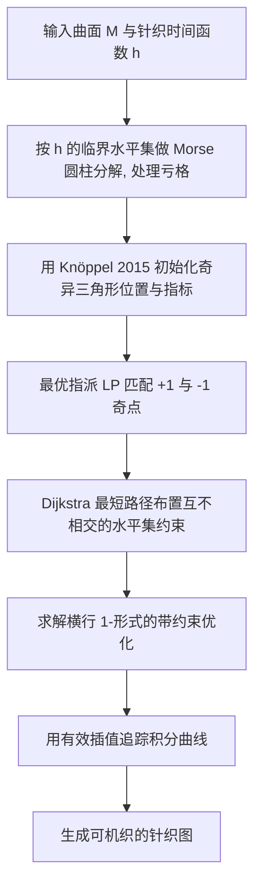

## 一句话总结

把机器针织规划中的条纹图案重新解读为向量场的奇异叶状结构（singular foliation），通过匹配奇点分隔线的线性水平集约束，从理论上保证所有候选横行（course row）都不产生螺旋（helix），并把这一框架自动化、扩展到带亏格的曲面。

## 研究背景

计算针织的核心任务之一是把输入曲面转化为可被针织机执行的针织图（knit graph）。这类图必须满足若干可织性属性，其中最难维持的是无螺旋条件：横行不能像螺纹一样绕着模型盘旋上升，否则无法在横机上编织。早期的 AutoKnit 用局部测地距离迭代生成，虽然无螺旋，但结果不够全局平滑，也几乎不给用户控制针脚不规则点（短行、加针 / 减针）的能力。

后续工作转向更全局的条纹生成框架：把曲面上均匀间隔的条纹追踪成横行与纵列。但基于 Knöppel 等人（2015）的条纹方法会引入任意螺旋。Mitra 等人（2023）直接在离散 1-形式空间里优化条纹，用线性约束逐条消除螺旋，但需要专门的「条纹放置约束」把条纹钉在特定的非螺旋水平集上，一旦平移条纹或改变条纹频率就可能重新引入螺旋。

作者指出，这些方法缺乏对条纹图案拓扑结构的整体理解。本文的出发点是：条纹其实是某个向量场的积分曲线族，而积分曲线加奇点恰好构成曲面的一个奇异叶状结构。只要对这个叶状结构的拓扑做精确控制，就能一次性、稳健地排除所有螺旋。

## 方法

整体框架：在 Mitra 等人（2023）的 1-形式条纹框架之上，把 spinning form 生成的条纹视为向量场 $$V = W^{\perp}$$ 的积分曲线，其中 $$W = \nabla\varphi$$ 为纹理插值函数的梯度。曲面被这些曲线（叶）与孤立奇点（向量场不动点）划分成「轨道复形」中一个个流动行为一致的胞腔。方法分三步：半自动生成奇异三角形的位置、指标与形式值；自动匹配正负奇点并布置对齐其生灭区间的水平集约束；最后用「有效插值」稳健地追踪积分曲线生成针织图。

关键设计：

- 奇异三角形内的流结构刻画：在非奇异三角形上，$$\varphi$$ 的水平集是线性的；在奇异三角形上则是重心坐标的二次曲线，此前没有显式刻画。作者按三条边 spinning form 值 $$\sigma_{ij}, \sigma_{jk}, \sigma_{ki}$$ 的符号组合（$$+\!+\!+$$、$$+\!+\!-$$、$$+\!-\!-$$）给出积分曲线的代数刻画，识别出重心处的源 / 汇与鞍点，以及分隔线（separatrix）的确切水平集表达式。这是首次对 spinning form 在奇异三角形内的水平集结构做显式代数刻画。优化在实践中几乎总产生 $$+\!+\!-$$ 情形。

- 全局叶状结构与无螺旋保证：由 spinning form 诱导的流属于「无非平凡回归轨道」这一良性类别，其全局拓扑由轨道复形描述——曲面被奇点与分隔线切分为拓扑上的开盘或环状胞腔，胞内流动如同平行流。作者证明命题：对由 $$\sigma_c, \sigma_w$$ 指定的横行与纵列两个横截叶状结构，在任一盘状胞腔 $$R$$ 中，只要 $$R$$ 的某条边界相对 $$\sigma_w$$ 无螺旋，则 $$R$$ 内所有积分曲线都无螺旋。因此只需用不螺旋的水平集约束匹配分隔线，即可保证整胞无螺旋，并可任意平移条纹、加倍频率而不新增螺旋。

- 生灭区间匹配（自动奇点配对）：假设奇点指标均为 $$\pm 1$$，需把 $$s$$ 个 $$+1$$ 与 $$s$$ 个 $$-1$$ 奇点配对。作者构造代价矩阵 $$\mathbf{C}$$，代价来自在按半边与 $$V$$ 对齐程度加权的图上做 Dijkstra 最短路，再解一个 LP 松弛得到置换矩阵：
$$\min_{\mathbf{T}\in[0,1]^{s\times s}} \langle \mathbf{C}, \mathbf{T}\rangle \quad \text{s.t.}\quad \mathbf{T}\mathbf{1}=\mathbf{1},\ \mathbf{1}^{T}\mathbf{T}=\mathbf{1}^{T}$$
该 LP 的二值最小值即一个合法配对。随后逐对求精确路径，走过的半边权重置为 $$+\infty$$ 以防交叉，从而满足「时间函数值相近、沿 $$V$$ 方向、互不相交」三条准则，自动化了此前的人工匹配。

- 带约束的形式优化：横行 1-形式 $$\sigma_c$$ 通过下式求解，只含 $$2g+n-1$$ 个整数变量，比此前 $$O(\lvert F\rvert)$$ 整数变量的混合整数问题快得多：
$$\min_{\sigma_c, \mathbf{k}_{hg}} \lVert W(\sigma_c-\omega_c)\rVert^{2}\quad \text{s.t.}\quad \sigma_c\big|_{\partial M}=0,\ d_1\sigma_c=P\mathbf{k},\ \mathbf{H}\sigma_c=P\mathbf{k}_{hg},\ \int_{\gamma^{ls}_j}\sigma_c=0$$
其中 $$P$$ 为条纹周期，$$\mathbf{H}$$ 收集同调生成元上的路径积分以保证亏格曲面上的可积性。

- 有效插值：直接用标准插值追踪时，过于靠近重心的横行曲线会与同一纵列多次相交而失败。作者用一个位于重心、含两个双曲扇区与一个抛物扇区的源 / 汇奇点替换其内部积分曲线结构，只在局部改动横行叶状结构，从而稳健追踪、生成针织图。

- 亏格处理：对多于两条边界或非零亏格的曲面，先沿时间函数 $$h$$ 的临界水平集（鞍点处 $$h$$ 值）把 $$M$$ 做 Morse 式圆柱分解，检查每个圆柱分量的奇异指标之和为零，并只在分量内部匹配奇点；亏格 $$g>0$$ 时用 tree-cotree 算法找 $$2g+n-1$$ 个同调生成元施加整数可积约束。

## 实验结果

论文以真实机织样件与几何保真度直方图为主验证，无参数真值下的定量对照有限。作者在多个模型（含袜子、圆柱、带亏格的「圆环」与「破洞裤」）上运行改进流程，全部在一台 2.3GHz i5、8GB 内存的笔记本上用 Gurobi 求解，运行时间均为交互级（不到一秒）。样件在 15 针距 Shima Seiki 横机上用 2/28NM 人造丝纱线编织。关键结论汇总如下。

| 方面 | 本文结果（忠实转述） |
| --- | --- |
| 无螺旋保证 | 匹配分隔线后可保证整胞积分曲线无螺旋，且平移 / 加倍频率不新增螺旋（袜子模型演示频率加倍仍得到合法针织图） |
| 求解规模 | 仅 $$2g+n-1$$ 个整数变量，运行时间 < 1 秒 |
| 几何保真 | 边长误差直方图与 Mitra 等人（2023）相近；相比 AutoKnit 峰值不如其集中于 0，但离群值明显更少，多数边长误差 < 10% |
| 拓扑控制 | 可自动处理非零亏格模型，并支持单奇点对诱导强制短行 |

在「单线级建模」的初步探索中，作者展示了本表示可表达 AutoKnit 针织图无法表达的结构，例如让短行绕圆柱多圈盘旋，并可通过一个取值为 $$\tilde{k}P$$ 的水平集约束精确指定螺旋圈数。

## 亮点与局限

亮点：把条纹图案统一到奇异叶状结构这一拓扑视角，给出可证明的无螺旋保证，而非逐条水平集地修补；首次对 spinning form 在奇异三角形内的水平集做显式代数刻画；用最优指派 LP 把此前的人工奇点匹配完全自动化；引入有效插值提升追踪稳健性；把框架扩展到带亏格曲面，并只需极少整数变量、达到交互级速度。

局限：奇异三角形位置的生成仍偶尔需要人工干预——当某圆柱分量奇异指标之和不为零、或匹配奇点的时间函数值相差过大导致条纹严重倾斜时，需手动在同一等值线附近补放奇点；作者未提供完全自动生成成对奇点的方法。真实针织物可拉伸、可塑，几何保真度本身也难以严格量化。

## 延伸思考

这项工作最有启发的一点，是把「制造约束」翻译成「向量场流的拓扑约束」：无螺旋这一工程条件被精确对应为轨道复形中胞腔边界分隔线的匹配，从而用连续数学工具获得离散可织性的确定性保证。这种「用微分几何 / 动力系统语言重述制造问题」的思路，或可迁移到其他基于场追踪的制造任务（如编织、3D 打印路径规划、四边形网格化）中，把零散的启发式约束替换成可证明的全局结构控制。作者也明确指出，若能发展出「免追踪」的流水线，直接从叶状结构生成机器指令，将允许匹配奇点在时间函数值上相差很大，进而大幅扩展可表达的针织结构空间——这是把该拓扑表示的表达力真正释放出来的关键方向。
