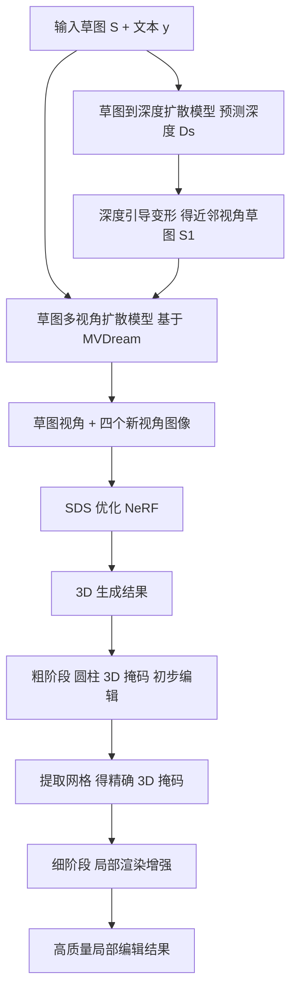

## 一句话总结

SketchDream 把手绘草图与文本提示同时引入文本到 3D 生成框架，用草图控制几何与结构、用文本控制材质与外观，通过深度引导的多视角扩散模型和两阶段由粗到细编辑策略，实现高质量的 3D 生成与自由视角下的局部编辑。

## 研究背景

现有文本到 3D 生成方法能产出漂亮的结果，但文本提示难以精确描述物体的形状、纹理图案与部件布局，因此缺乏细粒度的几何控制，也难以对局部细节做编辑。草图以其简洁与表现力，长期是直观 3D 建模的重要交互方式，但传统草图建模受网络容量与 2D 草图歧义所限，只能在预定义类别内生成缺乏纹理的网格模型，且草图只含几何信息，对外观控制探索不足。

把草图与文本同时用于 3D 生成，理论上能兼得几何与外观的可控性，但面临两大难题：其一是 2D 到 3D 的转换歧义，单视角草图缺乏多视角监督，直接在其它视角施加草图约束又会降低质量与忠实度；其二是多模态条件的融合。此外，对已有或已生成的 3D 模型做自由视角的局部编辑，还需要保证新生成部件与原始内容自然交互、未编辑区域良好保留。作者据此提出 SketchDream，第一个面向通用类别、支持从草图生成 NeRF 并支持自由视角草图局部编辑的文本驱动方法。

## 方法

整体框架：给定输入草图 $$S$$ 和文本提示 $$y$$，先由一个草图到深度的扩散模型预测深度图并对草图做深度引导变形，建立跨视角空间对应；再用基于 MVDream 的草图多视角扩散模型生成草图视角与四个新视角的图像；随后用分数蒸馏（SDS）优化 NeRF 得到 3D 内容。编辑时采用由粗到细两阶段：粗阶段用圆柱形 3D 掩码得到初步结果并据此提取精确 3D 掩码，细阶段用局部渲染增强生成高质量局部修改并保留未编辑区域。

关键设计：

- 深度引导变形（Depth-guided Warping）：与像素严格对齐的 2D 图像翻译不同，草图到新视角合成需要理解 3D 几何。作者用一个扩散模型从草图和文本生成深度图 $$D_s$$，再据源深度与相机参数把草图像素反投影到 3D 空间，仅变形到最近的新视角 $$c_1$$（远视角变形质量会显著退化），得到目标草图 $$S_1=Warp(S,D_s,c_s,c_1)$$，从而显式建立空间对应、缓解草图歧义。

- 3D 注意力控制模块：在 MVDream 骨干上加 ControlNet 施加草图控制。草图视角输入草图 $$S$$ 本身，最近视角输入变形草图 $$S_1$$，其余视角输入空白图 $$S_\emptyset$$。借助 MVDream 的 3D 注意力模块在各视角间共享自注意力的 $$Q$$、$$K$$、$$V$$，即便远视角输入为空，草图条件信息也能被共享传播，保证多视角一致性。多视角可控扩散损失为：
$$L_{MV\text{-}Ctrl}(\phi)=\mathbb{E}_{x,t,y,s,c,\epsilon}\left[\lVert \epsilon-\epsilon_{\phi}(x_t;t,y,c,s)\rVert_2^2\right]$$

- 草图 3D 生成：由于四视角图像稀疏且非严格 3D 一致，直接优化 NeRF 困难，故用 SDS 优化，渲染草图视角图像控制几何、四个随机视角图像优化 NeRF；采用带 $$x_0$$ 重建的 SDS 版本缓解色彩饱和。除 3D SDS 外还引入 2D 预训练模型的 Interval Score Matching 损失提升真实感，并在草图视角施加轮廓损失强化忠实度：
$$L_{sil}=\lVert M_s-C^{\alpha}_s\rVert_2^2$$
总目标为：
$$L_{total}(\theta)=\lambda_1 L^{3D}_{SDS}+\lambda_2 L^{2D}_{ISM}+\lambda_3 L_{sil}+\lambda_4 L_{orient}$$

- 由粗到细编辑：粗阶段用户在选定视角修改草图并绘制 2D 掩码，指定最小/最大深度构造圆柱形 3D 掩码来标注编辑区域，得到大体符合草图与文本的初步结果，并用图像损失 $$L_{rgb}=\lVert x\odot M_{2D}-x_{ori}\odot M_{2D}\rVert_2^2$$ 保留未编辑区域。细阶段把粗结果转成网格、精细标注编辑顶点得到精确 3D 掩码，并提出局部增强策略：构造精确掩码的包围球来确定局部相机视角，随机渲染全局或局部区域，聚焦网络注意力到目标部件，从而提升局部质量与草图忠实度。

## 实验结果

在草图生成上，由于无直接方法，作者构造基线：先用 2D ControlNet 由草图生成图像，再用图像到 3D 方法（Magic123、DreamCraft3D、ImageDream）生成 3D，并用 CLIP Score 与用户研究（1∼5 分）从文本忠实度、草图忠实度、几何质量、纹理质量等维度评测。SketchDream 在各项指标均最优。编辑上与 SKED 等在 15 个样例上对比同样领先。

草图生成对比（CLIP Mean 越高越好；人类偏好 TF/SF/GQ/TQ/Overall 为 1∼5 分均值）：

| 方法 | CLIP Mean↑ | 文本忠实↑ | 草图忠实↑ | 几何质量↑ | 纹理质量↑ | 总体↑ |
| --- | --- | --- | --- | --- | --- | --- |
| Magic123 | 27.61 | 3.18 | 3.19 | 2.78 | 2.86 | 2.76 |
| DreamCraft3D | 29.34 | 3.35 | 3.32 | 2.95 | 2.91 | 2.87 |
| ImageDream | 27.61 | 3.40 | 3.49 | 3.06 | 2.89 | 2.97 |
| Ours | 30.90 | 4.71 | 4.52 | 4.67 | 4.72 | 4.72 |

草图编辑对比（PU 为未编辑区域保留度，EQ 为编辑部件质量）：

| 方法 | CLIP Mean↑ | 文本忠实↑ | 草图忠实↑ | 未编辑保留↑ | 部件质量↑ | 总体↑ |
| --- | --- | --- | --- | --- | --- | --- |
| SKED | 32.69 | 2.46 | 2.50 | 3.02 | 2.24 | 2.33 |
| Ours | 34.16 | 4.86 | 4.86 | 4.84 | 4.82 | 4.84 |

消融显示：去掉深度变形会导致跨视角不一致（如机翼颜色不一、背视多出部件）；去掉 3D 注意力会在非草图视角产生奇怪部件；把草图变形到所有视角会因远视角变形质量差而扭曲几何；去掉 3D 损失则结果与草图无关，去掉轮廓损失局部细节错位，去掉 2D 损失细节模糊；编辑中去掉图像损失会整体改变并产生漂浮物，去掉局部增强会降低编辑区质量，仅用粗掩码会在新视角误改未编辑区域。生成单个样例在单张 A100 上约需 1.0∼1.3 小时。

## 亮点与局限

亮点：首个把草图与文本联合用于通用类别 3D 生成与编辑的方法，草图与文本形成互补——草图控几何、文本控外观；用深度引导变形显式建立跨视角空间对应，配合 3D 注意力 ControlNet 缓解 2D 到 3D 歧义并抑制多面 Janus 问题；由粗到细的编辑框架用圆柱掩码到精确掩码逐步定位编辑区域，配合局部增强实现自然交互且保留未编辑区域的高质量局部修改。

局限：整体基于 SDS 优化，生成单个样例仍需约 1 小时量级，交互实时性有限；深度预测存在误差，因此草图只能可靠变形到最近视角；细阶段编辑需要从 NeRF 转网格并手工细化标注顶点，流程带有一定人工成本；仍受基础多视角扩散模型能力与分辨率约束。

## 延伸思考

SketchDream 展示了「草图管几何、文本管外观」这一多模态互补范式在可控 3D 生成中的价值，其深度引导变形把单视角稀疏草图与多视角生成连接起来的思路，为解决 2D 到 3D 歧义提供了一个可复用的中间几何表示。由粗到细、从圆柱掩码到精确网格掩码再到局部渲染增强的编辑流程，也体现了「先定位再精修」在保留未编辑区域与控制部件交互上的有效性。后续若能把 SDS 优化替换为更快的前馈式或高斯泼溅表示、并用大模型自动完成掩码标注与提示增强，有望把这套草图驱动的可控生成与编辑真正推向交互式创作循环。
